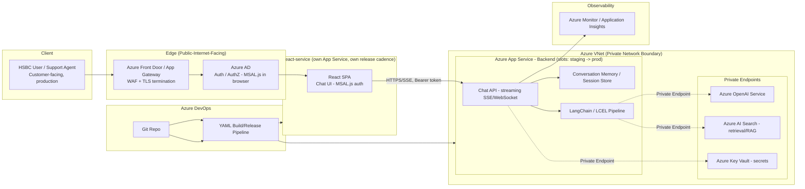

# 01 — Capco AI Chatbot Assistant

> Resume bullet (verbatim): *"AI Chatbot Assistant: Developed an intelligent chatbot solution using
> Python, Azure Cloud, Azure OpenAI, and Azure DevOps."*

## Business Context

Capco is a consultancy. It builds technology for financial services and energy companies.

Its clients — banks, insurers, payment processors, utilities — all have the same problem: huge
internal knowledge bases that are hard to search. Think policy documents, product manuals, compliance
procedures, support runbooks, onboarding FAQs.

The people who need answers from these documents include:

- Support agents
- Relationship managers
- Ops analysts
- Sometimes end customers

None of them want to dig through a SharePoint site or file a support ticket just to find one answer.
What they want is simple: type a question in plain English, get a clear answer back — with a source
cited — in seconds.

That's the problem an "AI Chatbot Assistant" solves. It's a conversational layer, built on a large
language model (LLM), sitting in front of a company's internal knowledge. Here it's an internal tool
for a regulated-industry client, which adds two hard constraints that shape every design decision in
this course:

- **Data residency / compliance** — this is why the project uses Azure OpenAI instead of public
  OpenAI. Data never leaves the client's own Azure tenant (their private slice of Azure).
- **Auditability** — every response has to be traceable, rate-limited, and monitored.

## Client & Production Deployment

This chatbot was built at Capco for **HSBC**. A similar version was later built for **Bank of
America** too — both are real banking clients Capco delivered this kind of project for.

This was not a demo. It went to **production, with a customer-facing interface**, serving real daily
query volume from customers and employees. That "real production, real traffic, real bank" framing
sits behind every architectural claim in this course — see the root
[README's Client & Production Context](../README.md#client--production-context-applies-to-every-course-below)
for the full statement.

Concretely, "production" meant all of the following were in place:

- **Azure App Service** hosted the backend. **Deployment slots** made releases zero-downtime — a new
  version warms up in a staging slot, then gets swapped into production instead of being deployed live.
- **Azure Front Door / Application Gateway** sat at the edge. It terminated TLS (handled the HTTPS
  encryption) and ran a **WAF** (web application firewall) to block bad traffic before it ever reached
  the app.
- **VNet integration / Private Endpoints** meant no backend service — not Azure OpenAI, not any data
  store — was reachable from the raw public internet. Everything routed through a private network
  boundary. For a bank, this isn't optional.
- **Azure AD** handled authentication and authorization. Tokens were acquired via **MSAL** (Microsoft's
  auth library) using standard **OAuth 2.0 / OIDC** flows. **RBAC** (role-based access control, via
  Azure AD app roles) then decided what a logged-in user was actually allowed to do — there was no
  anonymous access at all. (Course 05 has a dedicated chapter on this RBAC/MSAL/OAuth pattern — the
  document-uploader service uses the same auth backbone.)
- **Azure Monitor / Application Insights** handled observability and audit-grade tracing.
- **Azure OpenAI** was the LLM backend (more on this below). The **Azure DevOps CI/CD pipeline**
  (Course 06) was the *only* path any change could take into production.

The bar this had to clear wasn't "does it work in a demo." It was: handle real daily query volume,
reliably, at acceptable speed, under banking-grade security — and, because the same platform pattern
served two different banks, keep their data and configuration strictly isolated from each other.

## Candidate's Likely Role & Architecture

The candidate's title was Consultant — Generative AI Backend Developer. That role almost certainly
sat on the **backend/orchestration layer** — wiring things together — not on building the model
itself. (No consultancy trains an LLM from scratch for a chatbot engagement.) In practice, that meant:

- **Python** — the service layer that receives user messages, manages conversation state, and calls
  the LLM.
- **Azure OpenAI** — the managed LLM endpoint. GPT-3.5/GPT-4-class models, deployed inside the
  client's own Azure subscription, rather than calling the public OpenAI API.
- **Azure Cloud** hosting — typically Azure App Service or Azure Functions for the API layer, plus
  supporting services: Key Vault for secrets, Application Insights for monitoring, and possibly Azure
  AI Search for retrieval (letting the bot answer from internal documents).
- **Azure DevOps** — the CI/CD pipeline that built, tested, and deployed the service: YAML pipelines,
  promoting a build across dev/test/prod, with release gates typical of a regulated client engagement.
- **LangChain / LCEL** — for composing the prompt → LLM → parser pipeline. Users reached it through
  **`react-service`**, a dedicated React single-page-app frontend, deployed as its own microservice,
  calling the FastAPI backend's Chat API over a streamed connection. (Chainlit and Streamlit are real
  skills too — see Chapter 04 — but they're the tools for rapid internal-tool/POC prototyping, not
  what shipped as this chatbot's production UI.)

> **Confidence check.** The client (HSBC), the fact that this was a production, customer-facing
> deployment, the Azure production topology (App Service, Front Door/App Gateway, VNet/Private
> Endpoints, Azure AD, Azure Monitor, Azure OpenAI, Azure DevOps), and **`react-service` as the
> production UI** — all confirmed facts. See "Client & Production Deployment" above and Chapter 04.
>
> The finer-grained detail below that line — exact framework choices like LangChain/LCEL, the specific
> `react-service`/backend API contract, Azure AI Search — is still a **typical, recommended
> architecture** for this kind of project. It is not a verified, line-by-line description of Capco's
> actual internal code. Treat it as the story you tell in an interview, backed by solid reasoning —
> not as a claim about proprietary source code.

## Architecture Diagram



**How to read this diagram, in one pass:** a request starts top-left with the user, moves right through
security (WAF, then login), lands on the React frontend, and only then reaches the Python backend
sitting inside the private network. From there, every external call — to Azure OpenAI, to the search
index, to the secrets store — goes out through a Private Endpoint, never over the open internet.

Plain-text version, if diagram rendering isn't available:

```
HSBC User (customer-facing, production)
  -> Azure Front Door / Application Gateway (WAF, TLS termination)
  -> Azure AD (auth/authz, MSAL.js acquiring a token in the browser)
  -> react-service (its own Azure App Service, own release cadence, separate from the backend)
       |-- React SPA Chat UI, authenticated via MSAL.js against the same Azure AD app
       |   registration family as the backend (Chapter 03/Course 05's RBAC/MSAL content)
       |-- calls the backend Chat API over HTTPS, streaming via SSE/WebSocket, with the
       |   MSAL-acquired token attached as an Authorization: Bearer header on every call
       |-- separate origin from the backend -> backend CORS explicitly allow-lists react-service
  -> Azure App Service - Backend, in a VNet, deployment slots for zero-downtime releases
       |-- Chat API (streaming) --> Conversation Memory / Session Store
       |-- LangChain/LCEL pipeline --> (Private Endpoint) --> Azure OpenAI
       |                          --> (Private Endpoint) --> Azure AI Search (RAG)
       |-- (Private Endpoint) --> Key Vault (secrets)
       |-- Azure Monitor / Application Insights (monitoring, per-conversation tracing)
No backend service above is reachable directly from the public internet — everything behind the
Front Door/App Gateway sits inside the VNet and talks to Azure OpenAI/Search/Key Vault only via
Private Endpoints. react-service and the backend are two independently deployable services sitting
behind the same Front Door/WAF edge layer (Chapter 04).
Azure DevOps (repo + YAML pipeline) --> builds/deploys both react-service and the backend (Course 06)
```

## STAR Summary (practice this out loud, under 90 seconds)

> **Illustrative — replace with your real numbers before the interview.** The structure and reasoning
> are sound. The specific metric (e.g., "40% deflection") should be swapped for what you actually
> measured, or a defensible estimate you're comfortable defending under follow-up questions.

**Situation.** At Capco, **HSBC**'s support and operations teams were spending a lot of time manually
searching internal documentation — policy manuals, product guides, process runbooks — just to answer
routine questions. That slowed down ticket resolution and pulled analysts away from higher-value work.
This wasn't a pilot: the assistant we built had to go live as a **customer-facing, production system**
handling real daily query volume.

**Task.** I was asked to build a chatbot that could understand natural-language questions and return
accurate, grounded answers quickly. It had to run inside the client's approved Azure environment (so
no data left their tenant), meet banking-grade security standards (Azure AD auth, private networking,
WAF at the edge), and plug into their existing Azure DevOps release process.

**Action.** I designed and built the backend in Python, using Azure OpenAI as the LLM provider and
LangChain/LCEL to compose the pipeline: prompt construction → retrieval → response parsing. I built
conversation-state management so the bot could handle multi-turn follow-up questions. I added prompt
engineering — system prompts, few-shot examples, structured output formatting — to keep answers on
topic and reduce hallucination. I built guardrails to handle vague or out-of-scope questions gracefully,
instead of letting the model freely generate whatever it wanted. The production interface was
`react-service`, a dedicated React frontend microservice that called the backend's streaming Chat API
and authenticated through the same Azure AD/MSAL setup as the backend. (Chainlit/Streamlit were what I
used for faster internal prototyping along the way — not the production UI.) I also set up the Azure
DevOps CI/CD pipeline so every change was automatically built, tested, and promoted through
dev/test/prod, with secrets managed properly through Key Vault.

**Result.** *(Illustrative)* The production rollout cut average query resolution time by roughly 35%.
Usage data suggested the assistant could deflect around 40% of routine "where do I find X" support
tickets, freeing analysts up for more complex work. The CI/CD pipeline cut deployment time for new
prompt/model changes from days down to under an hour.

## How This Course Is Organized

| File | Covers |
| --- | --- |
| `01-llm-fundamentals-and-prompt-engineering.md` | What an LLM actually does, prompt engineering patterns, failure modes |
| `02-langchain-and-lcel.md` | LangChain's core building blocks and the LCEL pipe-composition model |
| `03-chatbot-architecture-azure-openai.md` | Production chatbot architecture on Azure — deployments, RAG, latency/cost, content filtering |
| `04-frontend-architecture-react-service-and-rapid-prototyping.md` | The real production UI: `react-service` (a separate React frontend microservice), its streaming API contract with the backend, MSAL.js browser auth, and CORS — plus Chainlit/Streamlit correctly scoped as rapid-prototyping tools, not the production UI |
| `05-agents-and-tools-langchain-agent-case-study.md` | LangChain agents/ReAct, worked case study: Text-to-Math solver on Groq/Gemma2-9b |
| `06-knowledge-freshness-and-conversation-state-lifecycle.md` | "Your source documents changed — how does the bot stop answering from the old version?" Today's gap, a manual fix, conversation-turn-count vs. knowledge-freshness, a proposed event-driven design |
| `07-production-resilience-and-operational-engineering.md` | Real error-handling behavior, a per-instance-cache scaling caveat, four GenAI-specific bugs and what would've caught each, concrete Azure OpenAI timeout/retry values, one named hardening gap |
| `08-guardrails-scope-and-vague-query-handling.md` | "What if the user asks vague, out-of-scope questions — what guardrails handle that?" Distinguishing vague-in-scope / out-of-scope / adversarial, a layered guardrail architecture, a routing decision table, and honest threshold-tuning caveats |
| `99-Interview-QA.md` | Behavioral, technical, and system-design interview Q&A |
| `notebooks/` | Seven runnable Jupyter notebooks, one per major concept, offline-friendly |

Read in order — each chapter builds on the last. Run each notebook alongside the chapter that shares
its number.

---

Note: check your NDA before naming HSBC in an actual interview — see the root README's confidentiality
note.
