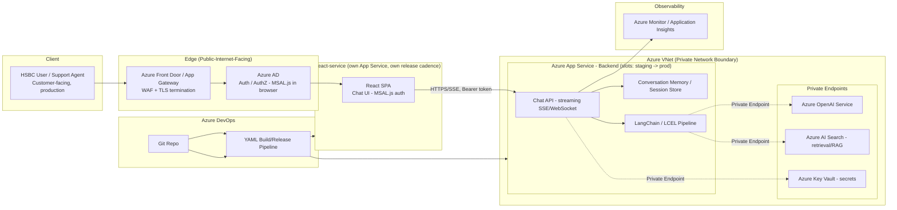

# 01 — Capco AI Chatbot Assistant

> Resume bullet (verbatim): *"AI Chatbot Assistant: Developed an intelligent chatbot solution using
> Python, Azure Cloud, Azure OpenAI, and Azure DevOps."*

## Business Context

Capco is a management and technology consultancy focused on financial services and the energy
industry. Its clients — banks, insurers, payment processors, utilities — run large internal
knowledge bases: policy documents, product manuals, compliance procedures, ticketing runbooks,
onboarding FAQs. The people who need answers from those documents (support agents, relationship
managers, ops analysts, sometimes end customers) don't want to search a SharePoint site or file a
ticket — they want to type a question in plain English and get a grounded, cited answer in
seconds.

That's the shape of problem an "AI Chatbot Assistant" project solves: a conversational layer, built
on a large language model, sitting in front of an organization's internal knowledge, deployed as an
internal tool for a regulated-industry client. Financial services and energy clients add two
constraints that shape every architectural decision in this course: **data residency / compliance**
(hence Azure OpenAI rather than public OpenAI — data stays inside the client's Azure tenant) and
**auditability** (every response needs to be traceable, rate-limited, and monitored).

## Client & Production Deployment

This chatbot was built at Capco for **HSBC**, and a comparable pattern was later stood up for
**Bank of America** — both are real banking clients Capco delivered this class of project for. This
was not a pilot or an internal-only demo: it went to **production with a customer-facing interface**,
serving real daily customer/employee query volume. That "real production, real traffic, real bank"
framing is the fact set behind every architectural claim in this course — see the root
[README&#39;s Client &amp; Production Context](../README.md#client--production-context-applies-to-every-course-below)
for the full statement. Concretely, production deployment meant:

- **Azure App Service** hosting the backend, with **deployment slots** used for zero-downtime
  releases (swap a warmed-up staging slot into production rather than redeploying live).
- **Azure Front Door / Application Gateway** at the edge, terminating TLS and providing **WAF**
  (web application firewall) protection before traffic ever reaches the application tier.
- **VNet integration / Private Endpoints** so no backend service (Azure OpenAI, data stores, etc.)
  is reachable from the raw public internet — everything routes through the private network boundary,
  a non-negotiable requirement for a bank.
- **Azure AD** for authentication/authorization — tokens acquired via **MSAL** (Microsoft
  Authentication Library) using standard **OAuth 2.0 / OIDC** flows, with **RBAC** (role-based access
  control, via Azure AD app roles) enforced on the backend to decide what an authenticated identity is
  actually allowed to do, replacing any notion of open/anonymous access. (Course 05's dedicated
  RBAC/MSAL/OAuth chapter covers this pattern in depth — the document-uploader service uses the same
  auth backbone.)
- **Azure Monitor / Application Insights** for observability and audit-grade tracing.
- **Azure OpenAI** as the LLM backend (as covered below), and the **Azure DevOps CI/CD pipeline**
  (Course 06) as the only path changes take into production.

The non-functional bar this had to clear wasn't "does it work in a demo" — it was handling real daily
customer/employee query volume **without hindrance**: reliably, at acceptable latency, under
banking-grade security constraints, and (since the same platform pattern served more than one bank
client) with strict tenant isolation so HSBC's data and configuration never leaked into Bank of
America's environment or vice versa.

## Candidate's Likely Role & Architecture

As a Consultant — Generative AI Backend Developer, the candidate's role was almost certainly on the
**backend/orchestration layer**, not the model itself (nobody at a consultancy trains an LLM from
scratch for a chatbot engagement). That means:

- **Python** service layer that receives user messages, manages conversation state, and orchestrates
  calls to the LLM.
- **Azure OpenAI** as the managed LLM endpoint (GPT-3.5/GPT-4-class models deployed inside the
  client's Azure subscription, rather than calling the public OpenAI API).
- **Azure Cloud** hosting — typically Azure App Service or Azure Functions for the API layer, with
  supporting services (Key Vault for secrets, Application Insights for monitoring, possibly Azure AI
  Search for retrieval if the chatbot needed to answer from internal documents).
- **Azure DevOps** for the CI/CD pipeline that built, tested, and deployed the service — YAML
  pipelines, artifact promotion across dev/test/prod, and release gates typical of a regulated
  client engagement.
- **LangChain / LCEL** (per the broader skills list) for composing the prompt → LLM → parser
  pipeline, exposed to users through **`react-service`** — a dedicated React single-page-app frontend,
  deployed as its own microservice, calling the FastAPI backend's Chat API over a streamed connection.
  (Chainlit/Streamlit remain genuine skills too — see Chapter 04 — but they're the tools reached for
  during rapid internal-tool/POC prototyping, not what shipped as this chatbot's production UI.)

> The client (HSBC), the production/customer-facing nature of the deployment, the Azure production
> topology (App Service, Front Door/App Gateway, VNet/Private Endpoints, Azure AD, Azure Monitor,
> Azure OpenAI, Azure DevOps), and the **`react-service` frontend microservice as the production UI**
> are confirmed facts — see "Client & Production Deployment" above and Chapter 04. The finer-grained
> implementation detail below it (exact framework choices like LangChain/LCEL, the specific
> `react-service`/backend API contract, Azure AI Search) is still a **typical/recommended architecture**
> for this class of project, not a verified line-by-line description of Capco's internal implementation.
> Treat that part as the story you tell in an interview, backed by the concepts in this course, not as a
> claim about proprietary code.

## Architecture Diagram



Plain-text version, if diagram rendering isn't available:

```
HSBC User (customer-facing, production)
  -> Azure Front Door / Application Gateway (WAF, TLS termination)
  -> Azure AD (auth/authz, MSAL.js acquiring a token in the browser)
  -> react-service (its own Azure App Service, own release cadence, separate from the backend)
       |-- React SPA Chat UI, authenticated via MSAL.js against the same Azure AD app
       |   registration family as the backend (Chapter 03/Course 05's RBAC/MSAL content)
       |-- calls the backend Chat API over HTTPS, streaming via SSE/WebSocket, with the
       |   MSAL-acquired token attached as an Authorization: Bearer header on every call
       |-- separate origin from the backend -> backend CORS explicitly allow-lists react-service
  -> Azure App Service - Backend, in a VNet, deployment slots for zero-downtime releases
       |-- Chat API (streaming) --> Conversation Memory / Session Store
       |-- LangChain/LCEL pipeline --> (Private Endpoint) --> Azure OpenAI
       |                          --> (Private Endpoint) --> Azure AI Search (RAG)
       |-- (Private Endpoint) --> Key Vault (secrets)
       |-- Azure Monitor / Application Insights (monitoring, per-conversation tracing)
No backend service above is reachable directly from the public internet — everything behind the
Front Door/App Gateway sits inside the VNet and talks to Azure OpenAI/Search/Key Vault only via
Private Endpoints. react-service and the backend are two independently deployable services sitting
behind the same Front Door/WAF edge layer (Chapter 04).
Azure DevOps (repo + YAML pipeline) --> builds/deploys both react-service and the backend (Course 06)
```

## STAR Summary (practice this out loud, under 90 seconds)

> **Illustrative — replace with your real numbers before the interview.** The structure and
> reasoning are sound; the specific metric (e.g. "40% deflection") should be swapped for what you
> actually measured or a defensible estimate you're comfortable defending under follow-up
> questions.

**Situation.** At Capco, **HSBC**'s support and operations teams were spending a significant amount of
time manually searching internal documentation — policy manuals, product guides, and process
runbooks — to answer routine questions, which slowed down ticket resolution and pulled analysts away
from higher-value work. This wasn't a pilot: the assistant we built needed to go live as a
**customer-facing, production system** handling real daily query volume.

**Task.** I was asked to build an intelligent chatbot assistant that could understand natural-language
questions and return accurate, grounded answers quickly, using the client's approved Azure cloud
environment (so no data left their tenant), secured to banking-grade standards (Azure AD auth, private
networking, WAF at the edge), and integrated into their existing Azure DevOps release process.

**Action.** I designed and built the backend in Python, using Azure OpenAI as the LLM provider and
LangChain/LCEL to compose the prompt-construction, retrieval, and response-parsing pipeline. I
implemented conversation state management so the bot could handle multi-turn follow-up questions,
added prompt engineering (system prompts, few-shot examples, structured output formatting) to keep
answers on-topic and reduce hallucination, and built guardrails to handle vague or out-of-scope
questions gracefully instead of letting the model free-generate. The production interface was
`react-service`, a dedicated React frontend microservice calling the backend's streaming Chat API and
authenticating through the same Azure AD/MSAL setup as the backend (Chainlit/Streamlit were the tools
I used for faster internal prototyping along the way, not the production UI). I set up the Azure
DevOps CI/CD pipeline so every change was automatically built, tested, and promoted through
dev/test/prod with proper secret management via Key Vault.

**Result.** *(Illustrative)* The production rollout reduced average query resolution time by roughly
35%, and usage data suggested the assistant could deflect around 40% of routine "where do I find X"
support tickets, freeing analysts to focus on more complex cases. The CI/CD pipeline cut deployment
time for new prompt/model changes from days to under an hour.

## How This Course Is Organized

| File                                                  | Covers                                                                                        |
| ----------------------------------------------------- | --------------------------------------------------------------------------------------------- |
| `01-llm-fundamentals-and-prompt-engineering.md`     | What an LLM actually does, prompt engineering patterns, failure modes                         |
| `02-langchain-and-lcel.md`                          | LangChain core abstractions and the LCEL pipe-composition model                               |
| `03-chatbot-architecture-azure-openai.md`           | Production chatbot architecture on Azure — deployments, RAG, latency/cost, content filtering |
| `04-frontend-architecture-react-service-and-rapid-prototyping.md` | The real production UI: `react-service` (a separate React frontend microservice), its streaming API contract with the backend, MSAL.js browser auth, and CORS — plus Chainlit/Streamlit correctly scoped as rapid-prototyping tools, not the production UI |
| `05-agents-and-tools-langchain-agent-case-study.md` | LangChain agents/ReAct, worked case study: Text-to-Math solver on Groq/Gemma2-9b              |
| `06-knowledge-freshness-and-conversation-state-lifecycle.md` | The "your source documents changed — how does the bot stop answering from the old version" question: today's gap, a manual fix, conversation-turn-count vs. knowledge-freshness, a proposed event-driven design |
| `07-production-resilience-and-operational-engineering.md` | Real error-handling behavior, a per-instance-cache scaling caveat, four GenAI-specific bugs and what would've caught each, concrete Azure OpenAI timeout/retry values, one named hardening gap |
| `08-guardrails-scope-and-vague-query-handling.md`   | The "what if the user asks vague, out-of-scope questions — what kind of guardrails?" question: distinguishing vague-in-scope/out-of-scope/adversarial, a layered guardrail architecture, a routing decision table, and honest threshold-tuning caveats |
| `99-Interview-QA.md`                                | Behavioral, technical, and system-design interview Q&A                                        |
| `notebooks/`                                        | Seven runnable Jupyter notebooks, one per major concept, offline-friendly                     |

Read in order — each chapter builds on the last, and the notebooks are meant to be run alongside the
chapter with the matching number.

---

Note: check your NDA before naming HSBC by name in an actual interview — see the root README's
confidentiality note.
