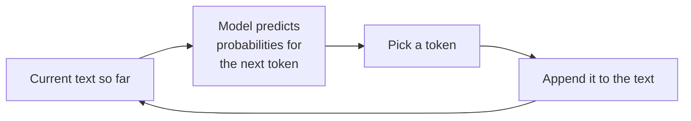
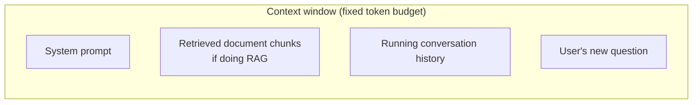
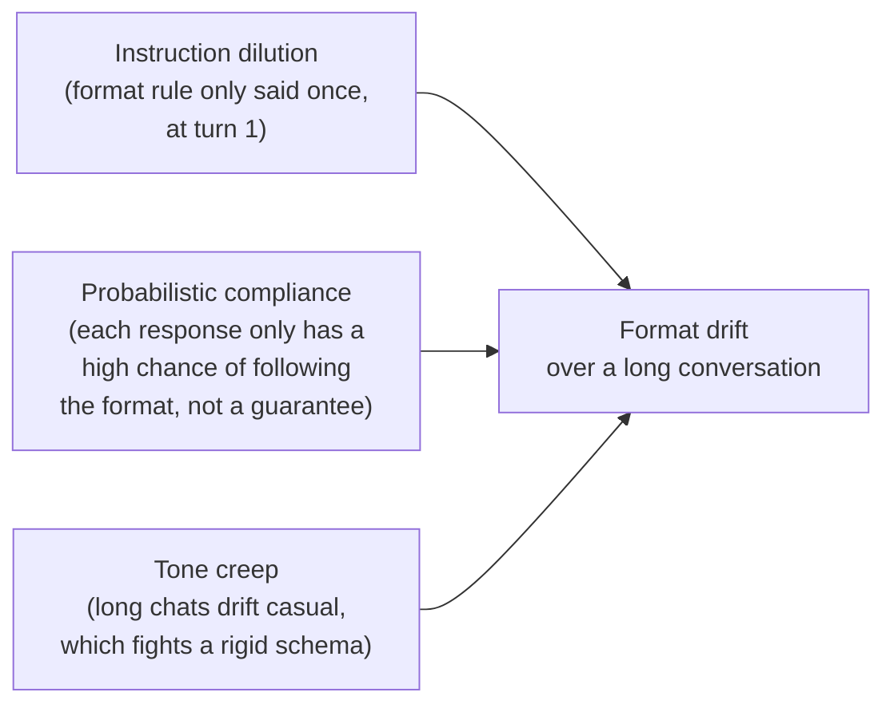

# 01 — LLM Fundamentals & Prompt Engineering

## Why this chapter matters

Before you can talk credibly about "building a chatbot with Azure OpenAI," you need to explain, in
plain language, what the model underneath is actually doing. That mechanism is *exactly* why prompt
engineering works — and why it fails in predictable ways. Interviewers probe here a lot, because it's
what separates "I called an API" from "I understand what I was orchestrating."

## What an LLM Actually Is

Strip away the hype: a large language model is a **next-token predictor**. Give it a sequence of
tokens (roughly, word-pieces), and it outputs a probability distribution over what token comes next.
Text generation is just this loop, repeated:



This loop is called **autoregressive** generation — each new token is generated based on everything
before it, *including* tokens the model itself just produced a moment ago.

Two things fall directly out of that loop, and both matter enormously for chatbot design:

1. **The model has no memory of its own.** Every "turn" of a conversation is really the app re-feeding
   the *entire* conversation history back in as input. If you want the bot to "remember" what the user
   said five messages ago, *you* — the developer — have to put that text back in the prompt yourself.
   This is exactly why conversation memory management (Chapter 3) is an engineering problem you own,
   not something the model quietly handles for you.
2. **Everything the model "knows" about the current task comes from the tokens in its context
   window.** There's no side channel, no database it can peek at on its own. If the client's policy
   document isn't in the prompt, the model can't answer questions about it accurately. It will either
   say so — or, worse, hallucinate a plausible-sounding but wrong answer, because "produce a plausible
   next token" is its only actual objective.

### Context Window

The **context window** is the max number of tokens (input + output combined, depending on the model)
the model can look at in a single call. Think of it as a fixed budget you have to spend across several
things in a chatbot:



Azure OpenAI's GPT-3.5-class deployments historically topped out around 4K–16K tokens; GPT-4-class
deployments commonly offer 32K, 128K, or larger windows. Blow the budget, and you either get a hard
error or you have to truncate something — which is why managing the context window is a first-class
design concern, not an afterthought. (See the from-scratch truncation demo in
`notebooks/03_simple_chatbot_with_memory.ipynb`.)

### Temperature and top_p

Temperature and top_p (also called nucleus sampling) control *how* the model samples from that
next-token probability distribution, instead of always grabbing the single most likely token
("greedy decoding").

- **Temperature** reshapes the distribution before sampling. Near 0, the model is almost
  deterministic — it keeps picking the highest-probability token. Good for factual Q&A, where you want
  the same question to get the same answer. Higher values (0.7–1.0+) flatten the distribution out,
  producing more varied, more "creative" output — useful for brainstorming, bad for a
  compliance-sensitive financial-services chatbot.
- **top_p** restricts sampling to the smallest set of tokens whose combined probability passes some
  threshold `p`. `top_p=0.9` means "only sample from the tokens that together make up the top 90% of
  probability mass" — it prunes away the long tail of unlikely, potentially nonsensical tokens.

For a client-facing chatbot answering questions from internal documentation, the practical choice is
usually **low temperature (0–0.3)**. You want the same question to get essentially the same, grounded
answer every time — not a creative rewrite of the facts.

## Prompt Engineering Patterns

Prompt engineering means shaping the *input* so the model's next-token process gets steered toward the
output you actually want. You can't change the model's weights, so the prompt is your entire lever.

### Zero-shot vs Few-shot

- **Zero-shot**: describe the task in the instructions and ask the model to just do it, no examples
  given. Fast to write. Works well for tasks the base model has already seen a lot of during training
  (general Q&A, summarization).
- **Few-shot**: include 1–5 example input/output pairs directly in the prompt before the real request.
  This is powerful when you need a specific output *format* or *style* the model wouldn't default to —
  e.g., "always answer in this exact JSON schema" or "always cite the source document like this." In
  the chatbot, few-shot examples were likely used to enforce a consistent answer format
  (`Answer: ... / Source: ...`) and a tone appropriate for a financial-services audience.

### Chain-of-Thought (CoT)

Asking the model to "think step by step" before giving a final answer measurably improves accuracy on
multi-step reasoning tasks. Why? Because it lets the model spend more tokens on intermediate reasoning
before committing to an answer. Remember: the model can only "think" by emitting tokens — it has no
hidden scratchpad. Every reasoning token it emits becomes part of the context the *final answer* is
conditioned on. So if the intermediate reasoning is right, the final answer is actually derived from
it, not just pattern-matched straight from the question. Skip the reasoning step, and the model has to
get a multi-step answer right "in one shot," with no chance to catch its own mistake mid-way.

**Example — zero-shot (no CoT) vs. CoT, on a policy-eligibility question** (the kind of multi-condition
check a financial-services chatbot answers constantly):

```
Zero-shot prompt:
"A customer has been with the bank 18 months, has an average balance of $3,200, and
missed one payment 8 months ago. Are they eligible for the Premium tier under our
current policy (requires: 12+ months tenure, $2,500+ average balance, no missed
payments in the last 6 months)?"

→ Model answer (no reasoning shown): "No, not eligible." — plausible, but did it actually
  check all three conditions, or pattern-match on "missed a payment" and stop there?
  You can't tell, and neither can a compliance reviewer.
```

```
CoT prompt (same question + "Think through each policy condition step by step before
answering."):

→ Model output:
  "1. Tenure: 18 months >= 12 months required. ✓ Met.
   2. Average balance: $3,200 >= $2,500 required. ✓ Met.
   3. Missed payments in last 6 months: the missed payment was 8 months ago, which is
      outside the 6-month lookback window. ✓ Met.
   All three conditions are satisfied. Eligible for Premium tier."
```

The CoT version isn't just more convincing — it's *auditable*. A reviewer (or the Chapter 2 model-risk
monitoring pipeline) can check *which* condition the model got wrong if the final answer turns out to
be incorrect, instead of only seeing a bare "yes/no" with no way to diagnose the failure.

**Example — the Text-to-Math agent (Chapter 5).** Given "If a train travels 60 miles in 45 minutes,
how far does it travel in 2 hours?", CoT reasoning looks like: "45 minutes = 0.75 hours, so speed = 60
/ 0.75 = 80 mph. In 2 hours: 80 × 2 = 160 miles." Each step is text the next step's tokens are
conditioned on — and it's exactly this reasoning trace that the agent's ReAct loop (Chapter 5) reads to
decide *when* to hand a sub-calculation off to the calculator tool, instead of trying to do arithmetic
purely by predicting tokens, which is where unaided LLMs are least reliable.

**Variants worth naming in an interview:**

- **Zero-shot CoT**: just append a trigger phrase like "Let's think step by step" to an otherwise
  ordinary prompt. No worked examples needed — cheapest to implement.
- **Few-shot CoT**: combine with the few-shot pattern above. The 1–5 examples in the prompt now include
  the reasoning trace, not just the final answer — this teaches the model the *shape* of reasoning you
  want. Useful when zero-shot CoT reasoning wanders somewhere that doesn't match how the client's
  domain actually reasons about eligibility, risk, or compliance.
- **Self-consistency**: sample the same CoT prompt several times at temperature > 0, then take the
  majority-vote answer across the independent reasoning paths. Trades latency and cost for materially
  higher accuracy on harder multi-step questions — worth mentioning as the "if accuracy matters more
  than speed" escalation.

**Production nuance — CoT reasoning and structured output don't naturally mix.** A user-facing chatbot
generally shouldn't show its raw reasoning trace: it's verbose, it may reference source-document
excerpts in a way that isn't appropriate to surface directly, and it doesn't fit the JSON schema from
the Structured Output section below. The common production pattern is a **two-step call**: first a
CoT-prompted call with free-text reasoning (never shown to the user), then either a second
structured-output call that extracts just the final answer into the schema, or a single call where the
schema has a private `reasoning` field that the frontend (`react-service`, Chapter 4) simply never
renders. Either way, the reasoning still happened — and still improved accuracy — it's just not part
of what reaches the user or gets logged as "the answer."

### System vs User Prompts

Azure OpenAI's chat-completion API takes a list of role-tagged messages: `system`, `user`,
`assistant`.

- The **system prompt** sets persistent behavior — persona, constraints, tone, safety rules. It's
  typically hidden from the end user.
- The **user prompt** is the actual question.

In a production chatbot, the system prompt is where you'd encode things like: *"You are an internal
assistant for [client]. Only answer using the provided context. If the answer isn't in the context, say
you don't know. Never give financial advice outside the provided policy documents."* This is your
first, cheapest line of defense against hallucination and scope creep — cheaper than fine-tuning, and
far cheaper than a bad answer reaching a compliance-sensitive audience.

### Structured Output Prompting

Chatbots that feed their output into other systems — logging, UI rendering, downstream automation —
need machine-parseable output, not free text. The patterns here:

- Explicitly instruct the model to respond in JSON matching a schema.
- Give few-shot examples of the exact format.
- On modern Azure OpenAI deployments, use native **function calling / structured output modes**,
  which constrain generation to valid JSON at the API level, instead of just hoping the model
  "behaves."

This matters whenever the chatbot UI needs to render something structured — a citation object, a
confidence flag — alongside the answer text.

## Common Failure Modes (and how they show up in a chatbot)

| Failure mode | What it looks like | Mitigation |
| --- | --- | --- |
| **Hallucination** | Confident, plausible, wrong answer — especially when the true answer isn't in context | Ground answers in retrieved context (RAG), tell the model explicitly to say "I don't know," lower the temperature |
| **Prompt injection** | User input contains text trying to override the system prompt ("ignore previous instructions...") | Treat retrieved/user content as data, not instructions; sanitize input; enforce an instruction hierarchy |
| **Context window overflow** | Long conversations silently lose early context, or the call errors out | Summarize/truncate history (Chapter 3), track token counts before calling the API |
| **Format drift** | Model stops following the requested output schema over a long conversation | Re-assert format instructions periodically, use structured-output/function-calling modes |
| **Stale or out-of-scope knowledge** | Model answers from pretraining knowledge instead of the client's actual current policy | RAG grounding + explicit system-prompt scoping |

### Format Drift, In Depth

The table row above is the one-line summary. This is the version to actually explain if an interviewer
follows up with "what does that mitigation look like in practice?"

**Why it happens.** A chatbot is often told once, in the system prompt, to always respond in a fixed
schema — say `{"answer": ..., "citations": [...], "confidence": ...}`, so `react-service` (Chapter 4)
can render a citation list and a confidence badge instead of raw prose. That instruction reliably holds
for the first several turns, then degrades: a field goes missing, the model lapses into prose, or the
JSON comes out malformed. Three things compound to cause this:



- **Instruction dilution.** The format instruction lives once, at turn 1. As the conversation grows —
  even with the truncation strategy from Chapter 3 — that instruction becomes a shrinking fraction of
  the total context. Its relative "weight" in the model's attention drops as unrelated conversation
  piles up around it.
- **Probabilistic compliance, not guaranteed compliance.** At any temperature above 0, following the
  format is a per-token *probability*, not a hard rule. The chance of a slip-up in any single response
  is low. But over 30 turns, the *cumulative* chance that at least one response slips approaches
  certainty — this is a compounding-probability problem, not a random one-off glitch.
- **Conversational tone creep.** As a long exchange gets more casual, the model tends to drift toward
  matching that tone — which pulls against a rigid JSON schema unless something actively fights it.

**Mitigation 1 — re-assert format instructions periodically.** Instead of relying on a system prompt
issued once at the start, re-inject a short format reminder into (or near) *every* call, not just the
first one. An LCEL prompt template (Chapter 2) can append
`"Respond only as JSON matching {schema}"` right before the final user turn, on every single
invocation, rather than baking it once into history:

```python
from langchain_core.prompts import ChatPromptTemplate

prompt = ChatPromptTemplate.from_messages([
    ("system", "You are an internal assistant for {client_name}. "
               "Only answer using the provided context."),
    ("placeholder", "{history}"),
    ("human", "{question}\n\n"
              "Respond only as JSON matching this schema: "
              '{{"answer": str, "citations": list[str], "confidence": float}}'),
])
```

This works better than a start-of-conversation-only instruction because of **recency**: instructions
near the *end* of the context are followed more reliably than ones buried several thousand tokens back.
The cost is a handful of extra tokens per call. The reliability win for downstream JSON parsing is
large.

**Mitigation 2 — structured-output / function-calling modes.** This is the stronger fix. It moves
enforcement from *prompting* (the model is politely asked, and can still statistically deviate) to
*decoding* (the API restricts which tokens can even be generated in the first place):

```python
from pydantic import BaseModel

class ChatAnswer(BaseModel):
    answer: str
    citations: list[str]
    confidence: float

structured_llm = llm.with_structured_output(ChatAnswer)  # LangChain, LCEL-compatible (Chapter 2)
result: ChatAnswer = structured_llm.invoke(prompt_value)
```

Under the hood, this maps to Azure OpenAI's native **function calling** (the model "calls" a
`return_answer(answer, citations, confidence)` tool instead of writing free text, and the API returns
structured arguments) or **JSON mode / structured outputs**
(`response_format={"type": "json_schema", ...}`). Both constrain generation via grammar-based decoding,
so the output is *guaranteed* to match the schema — this isn't "the model tried to produce valid JSON,"
it's "invalid tokens for that schema literally cannot be sampled."

**The nuance worth stating explicitly in an interview**: schema compliance is *not* the same as
semantic correctness. Structured-output mode guarantees the *shape* — fields present, correct types —
but says nothing about whether the *content* in those fields is actually right. A `confidence: 0.95`
field can still be confidently wrong. The strongest answer combines both mitigations: structured-output
mode as the primary, API-enforced defense against format drift specifically, plus periodic
re-assertion of content-level instructions (e.g., "citations must be null if nothing in context
supports the answer") that schema enforcement alone can't cover.

## Tying It Back

Every one of these concepts maps directly onto a decision the candidate had to make while building the
Capco chatbot: what temperature to run at for consistent, compliance-safe answers; how to write a
system prompt that keeps the bot scoped to the client's domain; how to format few-shot examples so
answers came back in a UI-renderable structure; and how to reason about why a hallucinated answer
happened when QA flagged one. This is the vocabulary to reach for when the interviewer asks "walk me
through how you controlled the quality of the bot's answers."
