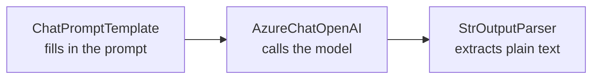
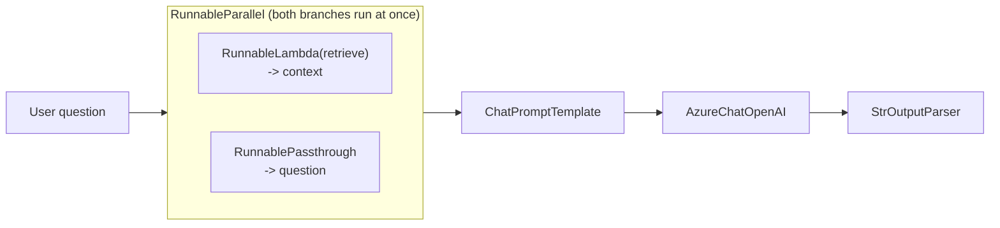

# 02 — LangChain Core Abstractions & LCEL

## Why this chapter matters

The resume lists LangChain, LCEL, and LangServe as core skills. "Orchestrating calls to Azure OpenAI"
is exactly what LangChain is for. Interviewers who've used LangChain often probe with "why LangChain
instead of just calling the OpenAI SDK directly?" — you need a real answer, not just "it's the popular
library." This chapter gives you that answer, plus enough LCEL fluency to write small pipelines live in
an interview if asked.

## Why Use a Framework At All

Calling `openai.ChatCompletion.create(...)` directly works fine for a single, simple call. A
production chatbot needs a lot more, all composed together and reusable across the codebase:

- Prompt templating with variable substitution
- Swappable model backends (Azure OpenAI in prod, a local/fake model in tests)
- Output parsing into structured objects
- Conversation memory
- Retrieval integration
- Streaming
- Batching
- Retries and observability

LangChain provides standard, ready-made abstractions for each of these, so you're not hand-rolling glue
code for all of them yourself. It also has first-class support for Azure OpenAI specifically
(`AzureChatOpenAI`), which matters because Azure OpenAI's client setup — endpoint, deployment name, API
version — differs from public OpenAI's.

## Core Abstractions

### PromptTemplate / ChatPromptTemplate

A `PromptTemplate` separates the *shape* of a prompt from the *data* filled into it. That separation
becomes critical once you have dozens of prompts across a codebase and need to version and test them
independently of the code that calls them.

```python
from langchain_core.prompts import ChatPromptTemplate

prompt = ChatPromptTemplate.from_messages([
    ("system", "You are an internal assistant for {client_name}. "
               "Only answer using the provided context. If you don't know, say so."),
    ("human", "Context:\n{context}\n\nQuestion: {question}"),
])

# .format_messages(...) or, more commonly, passed straight into an LCEL chain
messages = prompt.format_messages(
    client_name="Acme Bank",
    context="Refunds are processed within 5-7 business days.",
    question="How long do refunds take?",
)
```

This is where the system/user prompt design from Chapter 1 actually gets implemented in code, with
`{placeholders}` standing in for the retrieved context and the user's question.

### LLM / ChatModel Wrappers

LangChain wraps every provider behind one common interface (`invoke`, `stream`, `batch`), so swapping
providers is a one-line change:

```python
from langchain_openai import AzureChatOpenAI

llm = AzureChatOpenAI(
    azure_deployment="gpt-4o-chatbot-prod",   # the Azure OpenAI *deployment* name, not the model name
    api_version="2024-05-01-preview",
    temperature=0.2,
)
```

The key Azure-specific detail worth knowing cold: in Azure OpenAI you call a **deployment**, not a raw
model name. Your organization deploys a specific model version under a deployment name inside its
Azure OpenAI resource, and the client SDK targets that deployment name. This is a common interview
gotcha — "what's the difference between calling OpenAI directly vs. Azure OpenAI in code?"

### Output Parsers

Raw LLM output is just a string. Output parsers turn that string into a typed Python object your app
can actually use — this is critical for the "structured output prompting" pattern from Chapter 1.

```python
from langchain_core.output_parsers import StrOutputParser, JsonOutputParser
from pydantic import BaseModel

class Answer(BaseModel):
    answer: str
    source: str
    confidence: float

parser = JsonOutputParser(pydantic_object=Answer)
```

`StrOutputParser` is the simplest case — it just extracts the plain text of the model's response. Use
it when you don't need structure, e.g. a conversational reply the UI just renders as text.

### Memory

Memory objects manage the conversation history that gets re-injected into the prompt every turn
(recall from Chapter 1: the model has no memory of its own). Older LangChain versions had dedicated
`ConversationBufferMemory` / `ConversationSummaryMemory` classes. Current LangChain favors explicitly
managing a `ChatMessageHistory` and wiring it in with `RunnableWithMessageHistory` instead — this is
more transparent about exactly what's being sent to the model on each call, which matters a lot when
you're trying to control token cost and context-window usage. (See Chapter 3, and the from-scratch
memory implementation in `notebooks/03_simple_chatbot_with_memory.ipynb`.)

## LCEL — LangChain Expression Language

LCEL is the modern way to compose these pieces, using the `|` (pipe) operator — borrowed conceptually
from Unix pipes, where the output of one step becomes the input of the next.

```python
chain = prompt | llm | StrOutputParser()

response = chain.invoke({
    "client_name": "Acme Bank",
    "context": "Refunds are processed within 5-7 business days.",
    "question": "How long do refunds take?",
})
```



Every piece in that pipe — the prompt template, the chat model, the parser — implements the same
`Runnable` interface. That's the whole trick that makes `|` work: `Runnable` defines `invoke`, `batch`,
`stream`, and their async equivalents (`ainvoke`, `abatch`, `astream`). The `|` operator is just
shorthand for wiring two `Runnable`s together into a `RunnableSequence`, which feeds one's output
straight into the other's input.

### Why LCEL matters over "legacy" chains

Before LCEL, LangChain had purpose-built `Chain` classes (`LLMChain`, `SequentialChain`, etc.), each
with its own bespoke API. LCEL replaced all of that with one uniform interface everything implements.
That gets you the following, for free, with no extra code:

- **Streaming**: `chain.stream(...)` yields output incrementally, token by token, as soon as the
  underlying model produces it. This is essential for a chatbot UI — a response that starts appearing
  in 300ms *feels* far faster to a user than one that appears all at once after 4 seconds, even when
  the total generation time is identical.

  ```python
  for chunk in chain.stream({"client_name": "Acme Bank", "context": "...", "question": "..."}):
      print(chunk, end="", flush=True)
  ```
- **Batching**: `chain.batch([...])` runs multiple inputs efficiently, with automatic concurrency.
  Useful for offline evaluation runs or bulk-processing a queue of questions.
- **Async support**, for high-throughput backend services handling many concurrent users.
- **Composability**: since everything is a `Runnable`, you can nest chains inside chains, branch with
  `RunnableBranch`, run steps in parallel with `RunnableParallel` (e.g., retrieval and a
  query-classification step running at the same time), and attach retry/fallback behavior
  declaratively.
- **LangServe compatibility**: chains built with LCEL can be deployed directly as a REST API via
  LangServe, with minimal glue code, since LangServe expects `Runnable`-shaped objects. Directly
  relevant if the Capco chatbot's backend exposed its chain as an HTTP endpoint for the `react-service`
  frontend to call.

### A Slightly Fuller Chain

Putting it together the way a RAG-lite version of the Capco chatbot might look, without the actual
retrieval step (that's covered in Chapter 3):

```python
from langchain_core.prompts import ChatPromptTemplate
from langchain_core.output_parsers import StrOutputParser
from langchain_openai import AzureChatOpenAI

prompt = ChatPromptTemplate.from_messages([
    ("system", "You are an internal assistant for {client_name}. "
               "Only answer using the provided context. If you don't know, say so."),
    ("human", "Context:\n{context}\n\nQuestion: {question}"),
])
llm = AzureChatOpenAI(azure_deployment="gpt-4o-chatbot-prod", temperature=0.2)
chain = prompt | llm | StrOutputParser()

# streaming into a UI
for token in chain.stream({
    "client_name": "Acme Bank",
    "context": retrieved_context,   # from Azure AI Search, see Chapter 3
    "question": user_message,
}):
    yield token
```

### RunnableParallel, RunnablePassthrough, and RunnableLambda — the real composition primitives

The three-piece `prompt | llm | parser` pipe is the minimal case. The moment retrieval enters the
picture (Chapter 3), you need to run retrieval *and* forward the original question into the prompt
template at the same time. This is the canonical LCEL RAG pattern — and the one most likely to come up
as a "sketch it on the whiteboard" interview question:



```python
from langchain_core.runnables import RunnableParallel, RunnablePassthrough, RunnableLambda

def retrieve(question: str) -> str:
    # Azure AI Search call — see Chapter 3
    return search_client.search(question)

rag_chain = (
    RunnableParallel({
        "context": RunnableLambda(retrieve),   # runs the retrieval function
        "question": RunnablePassthrough(),     # forwards the input unchanged
    })
    | prompt
    | llm
    | StrOutputParser()
)

response = rag_chain.invoke("How long do refunds take?")
```

- **`RunnableParallel`** runs its branches at the same time and merges their outputs into one dict.
  Here, retrieval and "just pass the question through" happen concurrently instead of one after the
  other — which matters for latency, since retrieval means a network call to Azure AI Search.
- **`RunnablePassthrough`** forwards its input unchanged. It exists so the raw question is still
  available to the prompt template (`{question}`) after the parallel step, instead of being consumed
  and lost inside the retrieval branch.
- **`RunnableLambda`** wraps an ordinary Python function so it implements the `Runnable` interface and
  can sit inside a `|` pipe. This is how *any* function — a retrieval call, a pre-processing step, a
  guardrail check — gets streaming/batch/async support "for free," without writing a custom class.

### Declarative Retry and Fallbacks

The "attach retry/fallback behavior declaratively" bullet above, made concrete: every `Runnable`
supports `.with_retry()` and `.with_fallbacks()`, with no custom exception-handling code needed.

```python
resilient_llm = llm.with_retry(
    stop_after_attempt=3,
    wait_exponential_jitter=True,
).with_fallbacks([backup_llm])   # e.g. a different Azure OpenAI deployment/region

chain = prompt | resilient_llm | StrOutputParser()
```

This covers the common case — retry a transient failure a few times, then fail over to a backup
deployment — at the framework level. It's *not* a replacement for the circuit-breaker pattern in
Chapter 7. `.with_retry()` retries every call the same way, regardless of how many prior calls just
failed. A circuit breaker instead stops hammering a downstream service that's clearly down — that
distinction matters once you're reasoning about a sustained Azure OpenAI outage, rather than one
isolated blip. Know both, and be ready to say which layer each one belongs in.

### RunnableBranch — conditional routing

The guardrail routing from Chapter 8 (in-scope-clear → generate, in-scope-vague → clarify,
out-of-scope → scoped refusal) is naturally expressed as a `RunnableBranch`:

```python
from langchain_core.runnables import RunnableBranch

routed_chain = RunnableBranch(
    (lambda x: x["scope"] == "out_of_scope", refusal_chain),
    (lambda x: x["scope"] == "vague",        clarification_chain),
    rag_chain,   # default / fallthrough case: in-scope and clear
)
```

Each branch is itself a full `Runnable` (or a chain of them) — `refusal_chain` and
`clarification_chain` can be as simple as a static template, or as involved as their own
`prompt | llm | parser` pipe. This is the concrete code an interviewer is looking for when they ask "so
where does the classifier's decision actually plug into the LangChain code," right after hearing the
Chapter 8 guardrails answer.

### Debugging a Chain

Two practical answers for "how would you debug this in production when a chain misbehaves":

1. `chain.get_graph().print_ascii()` renders the composed `Runnable` graph, so you can see exactly
   what's wired to what before it ever runs.
2. Attaching callbacks (or LangSmith tracing, if it's available in the client's environment) captures
   each step's actual input/output at runtime.

The second one matters most once a chain has more than two or three steps, because "the LLM gave a
wrong answer" could mean several different things: the retrieval step returned nothing, the prompt
template filled in a variable wrong, or the LLM call itself was fine and the *parser* silently dropped
a field. Without step-by-step traces, you're guessing which.

## Tying It Back

When asked "how did you structure the chatbot's code," this is the answer: a `ChatPromptTemplate`
encoding the system/user prompt design, an `AzureChatOpenAI` wrapper pointed at the client's Azure
OpenAI deployment, an output parser matching whatever the UI needed to render — all composed with `|`
into an LCEL chain that streamed tokens back to the `react-service` frontend for a responsive UX. The
Text-to-Math agent in Chapter 5 builds on these exact same `Runnable` primitives, just with a
tool-calling loop wrapped around the chain instead of one straight-through pipe.
