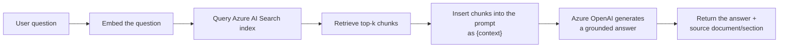
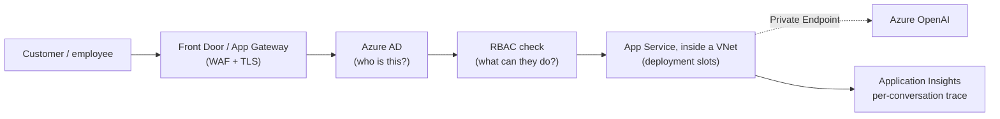

# 03 — Chatbot Architecture on Azure OpenAI

## Why this chapter matters

"Azure Cloud" and "Azure OpenAI" are both named explicitly in the resume bullet. This chapter turns
those two words into a defensible system design — the kind of thing you'd sketch on a whiteboard if
asked "walk me through how you'd architect this chatbot in production." This chatbot did, in fact, run
in production for **HSBC** with a customer-facing interface. (See `00-README.md`'s "Client & Production
Deployment" section, and the "Running This in Production for a Bank" section below, for the confirmed
production topology.)

The fine-grained implementation detail in the rest of this chapter — exact retrieval/session-store
choices, specific tradeoff numbers — should still be treated as **"a typical, recommended approach for
this class of project,"** not a verified, line-by-line description of Capco's actual internal system.

## Azure OpenAI Service: Deployments, Models, Rate Limits

Azure OpenAI Service gives an organization access to OpenAI's models (GPT-3.5, GPT-4, GPT-4o,
embedding models, etc.) hosted inside Azure — within the client's own subscription/tenant boundary.
That's the core reason a financial-services or energy client picks it over calling the public OpenAI
API directly: **data residency and compliance**. Requests, and the data inside them, stay within the
organization's Azure environment, covered by Azure's enterprise agreements, instead of leaving to a
third party's public API.

Three operational concepts worth knowing cold:

- **Deployments.** You don't call "gpt-4" directly. You create a *deployment* of a specific model
  version inside your Azure OpenAI resource, give it a deployment name, and your application code
  targets that name instead. This indirection lets you upgrade the underlying model version without
  touching application code, and lets you run several deployments side by side — say, a cheaper model
  for classification and a stronger model for final answer generation.
- **Rate limits (TPM/RPM).** Azure OpenAI enforces tokens-per-minute and requests-per-minute quotas per
  deployment. A chatbot with unpredictable, bursty traffic — say, a spike the moment a new policy
  document ships and everyone asks about it at once — needs to handle `429` throttling responses
  gracefully: exponential backoff with retry, and ideally a request queue, rather than showing the raw
  error to the user.
- **Content filtering.** Azure OpenAI runs a built-in content filter on both prompts and completions
  (categories like violence, hate, sexual content, self-harm), which can block or flag a response
  independently of your own application logic. For a financial-services chatbot this rarely fires in
  the normal flow, but it still matters for error handling: your backend needs to catch a
  content-filter rejection and respond with something more graceful than a raw API error. Worth
  mentioning if asked about production robustness.

## Conversation State / Session Management

As covered in Chapter 1, the model itself is stateless — every "memory" of the conversation is
something your backend re-sends on every call. In production, that means:

- A **session store**, keyed by user/conversation ID (Redis, Azure Cosmos DB, or even a simple Azure
  SQL table for a lower-traffic internal tool), holding the running message history.
- A **token-budget strategy** for what to include as that history grows. Send the full history until
  it approaches the model's context window, then switch to either a sliding window (keep only the last
  N turns) or a summarization strategy (periodically compress older turns into a short summary that
  replaces them). See the hands-on truncation example in
  `notebooks/03_simple_chatbot_with_memory.ipynb`.
- **Statelessness at the compute layer.** The App Service/Function instances handling requests should
  themselves hold no state — they pull conversation state from the session store on every request. This
  is exactly what lets you scale horizontally behind a load balancer without needing sticky sessions.
  (See also the system-design question on scaling to 10k concurrent users in `99-Interview-QA.md`.)

## Retrieval-Augmented Generation Basics (Azure AI Search)

A chatbot answering "how long do refunds take" correctly needs the actual policy text sitting in its
prompt. That's **RAG** — retrieval-augmented generation. On Azure, the natural retrieval component is
**Azure AI Search** (formerly Azure Cognitive Search), which supports:

- **Vector search.** Documents get chunked and embedded — turned into numeric vectors, via an Azure
  OpenAI embedding deployment like `text-embedding-ada-002` / `text-embedding-3-small` — into a vector
  index. A user's question gets embedded the same way, and the index returns the chunks that are
  semantically closest to it.
- **Hybrid search.** Combining vector similarity with traditional keyword (BM25) search typically beats
  either one alone: vector search catches semantic matches keyword search misses ("refund" vs. "money
  back"), and keyword search catches exact terms vector search can blur (policy numbers, product
  codes).
- **Semantic ranking.** An optional re-ranking layer that reorders the initial results by relevance,
  using a cross-encoder-style model.

That's the full RAG flow: embed the question, query the index, pull back the top-k chunks, drop them
into the prompt as `{context}` (as in the `ChatPromptTemplate` from Chapter 2), let Azure OpenAI
generate a grounded answer, and — ideally — return the source document/section alongside it so the
user can verify it themselves. This is also the primary defense against hallucination from Chapter 1:
the model is instructed to answer *from the provided context*, not from what it memorized during
training, and to say "I don't know" when the retrieved context doesn't cover the question.

> Note: a smaller-scope internal chatbot, early in a project, might not have full RAG yet — it could
> just be a scoped-instructions bot backed by a fixed FAQ, before scaling up to full retrieval. Frame
> your answer around what's plausible for the resume bullet's apparent scope, and be honest in an
> interview about which parts you're confident on versus inferring.

## Latency and Cost Tradeoffs

Every architectural choice here trades latency and cost against quality:

| Lever | Faster / Cheaper | Slower / More Expensive | Better Quality |
|---|---|---|---|
| Model choice | GPT-3.5-class deployment | — | GPT-4-class deployment |
| Retrieval depth | Fewer chunks (top-3) | More chunks (top-10+) | More context, but risk of window overflow and noise |
| Streaming | — | — | Streaming doesn't reduce total latency but drastically improves *perceived* latency (Chapter 2) |
| Caching | Cache embeddings / common Q&A pairs | Full RAG on every call | — |
| Prompt length | Short, tight system prompt | Long few-shot examples | Longer prompts often mean better-controlled output at the cost of more tokens billed |

A practical rule of thumb worth stating in an interview: measure **time-to-first-token** separately
from **total generation time**. Streaming makes the former the number users actually feel — and
optimizing retrieval latency (the AI Search call) often matters more to perceived responsiveness than
shaving tokens off the LLM call itself.

## Content Filtering & Safety

Beyond Azure OpenAI's built-in content filter, a chatbot for a regulated client typically adds:

- **Scope guarding**, via the system prompt (Chapter 1) — refuse to answer outside the intended
  domain: no general financial advice, no requests unrelated to the client's documented policies.
- **PII handling** — depending on the use case, redact or avoid echoing sensitive personal data back
  into logs (Application Insights) or into the LLM prompt unnecessarily.
- **Audit logging** — every question/answer pair logged with a timestamp, user ID, and (if RAG) the
  source documents used, for both compliance and later evaluation. (See Course 04, Model Risk
  Monitoring, for the evaluation/monitoring layer that would typically sit on top of a mature
  deployment like this.)

## Running This in Production for a Bank

Everything above is what makes the chatbot *answer well*. This section is what makes it *safe to run in
production, customer-facing, at a bank*. This project — built at Capco for **HSBC**, with a comparable
pattern later for Bank of America — actually shipped to production with real daily customer/employee
traffic, not just a pilot, so none of this is hypothetical. Five things change:

- **Private networking, not public endpoints.** In a pilot/POC, it's common for the App Service and its
  dependencies to sit on public endpoints, protected only by keys. In production for a bank, the App
  Service is deployed **inside a VNet**, and reaches Azure OpenAI, Azure AI Search, and Key Vault
  through **Private Endpoints** — meaning none of those services has a public IP reachable from the
  internet at all, only from inside the private network boundary. For a banking client, this is a hard
  requirement, not a nice-to-have.
- **WAF and DDoS protection at the edge.** Nothing hits the App Service directly. Traffic first passes
  through **Azure Front Door or Application Gateway**, which terminates TLS and applies a **Web
  Application Firewall** — blocking common attack patterns (SQL injection, XSS, known bad request
  signatures) and absorbing volumetric abuse before it ever reaches application compute. This is also
  where you'd rate-limit or geo-restrict traffic, if the client required it.
- **Azure AD-based auth instead of open access.** A pilot chatbot might be reachable by anyone with the
  URL. The production version authenticates every user through **Azure AD**, with the client/backend
  acquiring tokens via **MSAL** (Microsoft's OAuth 2.0/OIDC library) instead of hand-rolling token
  handling — so access maps to real bank identities (employees, or authenticated customers, depending
  on the surface). Authentication only answers "who is this?" — **RBAC** (role-based access control) on
  top of the validated token's claims answers "what are they allowed to do?" (e.g., a `ChatUser` role
  vs. a `ChatAdmin` role with access to conversation-review tooling). There's no anonymous path into a
  system that talks to Azure OpenAI on the bank's behalf. See Course 05's dedicated chapter for the full
  OAuth/MSAL/RBAC implementation pattern shared across these backend services.
- **Deployment slots for zero-downtime releases.** Azure App Service supports multiple **deployment
  slots** (e.g., `staging` and `production`), backed by the same App Service Plan. A new build deploys
  and warms up in the staging slot — including running smoke tests against it — and only then gets
  **slot-swapped** into production, which is close to instantaneous and skips the downtime window of a
  straight in-place redeploy. If something's wrong right after the swap, swapping back is just as fast.
  This is the deployment mechanic the Azure DevOps pipeline in Course 06 targets; Course 06 covers the
  pipeline stages in depth, and this chapter is just the "why slots" piece of that story.
- **Application Insights tracing per conversation, for audit/compliance.** Beyond generic uptime
  monitoring, every conversation gets end-to-end **Application Insights** tracing: request ID,
  authenticated user identity, retrieved document sources (if RAG), model/deployment version used,
  token counts, latency broken down per stage (retrieval vs. generation), and the content-filter
  outcome. For a bank, this isn't just for debugging — it's the audit trail that lets compliance
  reconstruct "who asked what, what the system answered, and what it was grounded in," for any given
  conversation, after the fact.

Taken together, these are the answer to "what's different about a demo chatbot versus one you'd
actually put in front of HSBC's customers." The RAG/prompt-engineering substance doesn't change — but
every request now flows through a WAF, an identity check, and a private network boundary, and every
conversation leaves an audit trail, before it ever reaches Azure OpenAI.

## Tying It Back

This is the chapter to lean on for "design me the chatbot" style system-design questions: Azure OpenAI
deployment(s) behind a stateless Python API layer, a session store for conversation memory, a retrieval
layer via Azure AI Search for grounding, streaming responses back to the UI, and content filtering plus
audit logging as the safety net appropriate for a financial-services/energy client. In production for a
bank, add the edge/identity/network layer above: Front Door/App Gateway (WAF) → Azure AD → App Service
in a VNet with Private Endpoints → Azure OpenAI, with Application Insights tracing every conversation.
Azure DevOps (Course 06 goes deeper on this) is what ships changes to any layer of this stack safely,
via deployment slots for zero-downtime releases.
