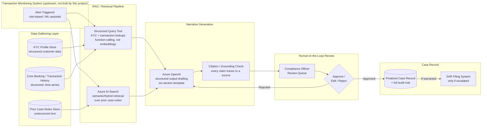

# 02 — AML Alert Investigation Copilot

> Resume bullet (verbatim): *"AML Alert Investigation Copilot: Architected a GenAI copilot for a global
> banking client that auto-drafts investigator-ready case narratives for AML/transaction-monitoring
> alerts — retrieving and synthesizing KYC profiles, transaction history, and prior case notes via a
> RAG pipeline (Azure OpenAI + Azure AI Search) — cutting analyst documentation time and accelerating
> alert-to-closure turnaround while keeping a compliance officer in the loop for sign-off."*

## The one fact that matters most in this whole course

Read this paragraph first. If an interviewer only has time for one question about this project, this is the answer.

**A compliance officer signs off on every narrative before it becomes part of the official case record. This system does not, and cannot by design, close an AML alert on its own.**

Everything else in this course exists to serve that one rule:
- The RAG (retrieval-augmented generation) architecture
- The structured-drafting prompt engineering
- The citation requirements
- The staleness checks

Why does that rule matter so much? Because a wrong AML (anti-money-laundering) call has real consequences on both sides:
- Miss something real, and you have a genuine financial-crime failure — a Suspicious Activity Report that never got filed.
- Flag something that isn't real, and you've sent a scarce, expensive human investigator down the wrong path.

So the interesting engineering question here was never "can an LLM write a convincing case narrative." It clearly can. The real question is: **how do you build a system that drafts extremely well, while making it structurally impossible for that draft to become a decision without an accountable human reading it first?**

Chapter 4 covers the review workflow in depth.

## Business Context

Banks run transaction-monitoring systems — rule-based, and increasingly ML-assisted — that watch account activity for patterns linked to money laundering. Examples:

- **Structuring**: breaking one large transaction into many smaller ones to stay under a reporting threshold.
- **Rapid movement of funds** through multiple accounts.
- **Activity that doesn't match** a customer's stated occupation or expected transaction profile.
- Dozens of other rule families.

When a pattern trips a rule, the system raises an **alert**.

Here's the well-known industry problem: these systems have a **very high false-positive rate** — often cited in the 90%+ range across the industry, though the real number varies a lot by bank, rule tuning, and customer segment. Every alert has to be reviewed by a human, whether it turns out to be real or not. That AML investigator has to:

1. Pull together the customer's KYC (Know Your Customer) profile.
2. Pull the transaction history that triggered the alert.
3. Pull any prior case notes on that customer.
4. Write a **case narrative** — a structured document that summarizes what happened, compares it to the customer's expected behavior, calls out red flags, and recommends an outcome.

That outcome is one of: close as false positive, escalate for deeper review, or — in the most serious cases — contribute to a **Suspicious Activity Report (SAR)** filed with the relevant financial-crime regulator (FinCEN in the U.S., the NCA in the UK, and equivalent bodies elsewhere).

Writing that narrative well is slow and repetitive work: pulling accurate data from multiple systems, synthesizing it into one coherent document, under a caseload that can run into dozens of alerts a day per investigator. That's exactly the kind of multi-source-synthesis task GenAI is good at.

But it's also a **high-stakes, regulated decision domain**, where full automation is a bad idea. A hallucinated fact in a narrative, or a subtly wrong comparison to "expected behavior," could push a real compliance officer toward the wrong call.

So there's a real tension here: strong GenAI fit on the drafting side, genuinely risky on the decision side. That tension is why this project is a **copilot** — not an autonomous decision-making system. Every chapter in this course comes back to that thread.

## Client & Production Framing

The resume bullet names the client generically as **"a global banking client"** — it doesn't name a specific bank. This course frames it plausibly as **HSBC**, for two reasons: it's consistent with Capco's established primary banking client throughout this curriculum (see the root [`README.md`](../README.md)'s "Client & Production Context" section), and it's consistent with this being a sibling system to Course 1's AI Chatbot Assistant — the two projects plausibly share the same Azure platform footprint at the same client.

**But be honest about this in an interview.** The resume bullet itself only commits to "a global banking client." Only say "HSBC" if you specifically recall that being accurate for this engagement (and you've checked your NDA per the root README's confidentiality note). Otherwise, "a global banking client" is both accurate to the bullet and safe to say regardless of what you recall.

This system went to **production with a customer-facing interface** — though here, "customer-facing" means investigator-facing and compliance-officer-facing. The daily users are internal AML analysts and compliance officers, not retail bank customers. But it's a real, live production tool serving real daily alert volume, not a proof-of-concept.

It ran on the same Azure production topology as every other Capco course in this curriculum:

- **Azure OpenAI**
- **Azure AI Search**
- **Azure App Service** (with deployment slots)
- **Azure Front Door / Application Gateway** (WAF + TLS termination) at the edge
- **VNet integration / Private Endpoints**, so no backend service is reachable from the public internet
- **Azure AD** for authentication (tokens via MSAL, RBAC enforced server-side — see Course 5's dedicated RBAC/MSAL chapter for the pattern this project plausibly reused)
- **Azure Monitor / Application Insights** for observability and audit-grade tracing

This is a sibling/adjacent system to Course 1's chatbot, not a replacement for it. The two plausibly share platform infrastructure — the same Azure OpenAI resource, the same VNet, the same observability stack — even though they serve very different users and very different risk profiles.

> As with every course in this curriculum apart from Course 5 (which was rebuilt from real source
> code), **this course has no source repository behind it.** Everything below is a plausible,
> technically detailed reconstruction built from the resume bullet, standard AML/transaction-monitoring
> industry practice, and the same Azure RAG patterns established in Course 1. Any quantified
> metric is explicitly marked **illustrative** — treat it as a defensible placeholder to replace with
> your own real numbers, not a verified fact.

## Architecture Diagram



Plain-text version, if diagram rendering isn't available:

```
Transaction Monitoring System (upstream, rule-based/ML-assisted) triggers an Alert
  -> Data-Gathering Layer
       |-- KYC Profile Store (structured customer data)
       |-- Core Banking / Transaction History (structured, time-series, often high volume)
       `-- Prior Case Notes Store (unstructured text -- investigator write-ups from past cases)
  -> RAG / Retrieval Pipeline
       |-- Structured Query Tool: precise, auditable function-calling lookups against KYC and
       |   transaction data -- NOT embedded into a vector index (Chapter 2 explains why)
       `-- Azure AI Search: semantic/hybrid retrieval over prior case notes -- the one source
           that genuinely benefits from fuzzy semantic search (Chapter 2)
  -> Narrative Generation (Azure OpenAI)
       |-- Structured-output drafting against the six-section case-narrative template (Chapter 3)
       `-- Citation/grounding check -- every factual claim must cite a KYC field, transaction ID,
           or prior case ID (Chapter 3)
  -> Human-in-the-Loop Review (Chapter 4)
       |-- Draft lands in a Compliance Officer's review queue with per-section confidence indicators
       |-- Officer reviews, edits, and Approves or Rejects (Rejected -> regenerate)
       `-- ONLY an Approved narrative becomes part of the official case record -- this step is a
           hard requirement, not optional, see the load-bearing statement at the top of this file
  -> Finalized Case Record (with full audit trail: what was AI-drafted, what was human-edited, by whom)
  -> (if the officer's recommendation warrants it) SAR Filing System
```

Two details worth internalizing from the diagram before reading the chapters:

1. **The structured query tool and Azure AI Search are two different retrieval mechanisms feeding the same prompt** — not one unified "RAG system." Chapter 2 is the whole argument for why.
2. **The human-in-the-loop queue is not a UI nicety bolted onto the end.** It's the control that makes the rest of the architecture defensible to a regulator (Chapter 4).

## STAR Summary (practice this out loud, under 90 seconds)

> **Illustrative — replace with your real numbers before the interview.** The structure and reasoning
> are sound; the specific metrics (documentation time reduction, alert-to-closure turnaround) should be
> swapped for what you actually measured or a defensible estimate you're comfortable defending under
> follow-up questions.

**Situation.** At Capco, a global banking client's (plausibly HSBC's — say so honestly if you're not certain) AML investigation team was spending a large share of each investigator's day manually assembling case narratives for transaction-monitoring alerts. That meant pulling KYC data from one system, transaction history from core banking, and prior case notes from a case-management tool, then writing up a structured narrative by hand for every alert — the overwhelming majority of which would turn out to be false positives. That manual documentation burden was the actual bottleneck on alert-to-closure turnaround, not the investigators' judgment.

**Task.** I was asked to architect a GenAI copilot that could auto-draft investigator-ready case narratives — synthesizing KYC profiles, transaction history, and prior case notes into a structured, citable document — while keeping a compliance officer firmly in the loop for sign-off. A wrong AML determination carries real regulatory and financial-crime consequences, which makes full automation inappropriate for this domain.

**Action.** I designed a RAG pipeline that deliberately used **two different retrieval mechanisms** for the three source types:
- A structured, auditable query/function-calling tool for KYC and transaction data — precise lookups, not fuzzy embedding search.
- Azure AI Search's semantic/hybrid retrieval for prior case notes, the one source that's genuinely unstructured text suited to that kind of search.

I used structured-output prompting against a six-section narrative template (Customer/KYC Overview, Alert Trigger Summary, Transaction Pattern Analysis, Historical/Prior-Case Context, Red Flags Identified, Recommendation), and required every factual claim in the draft to cite its source — a specific KYC field, transaction ID, or prior case ID. That citation requirement is the primary anti-hallucination defense.

I built the human-in-the-loop review workflow as a real state machine (DRAFTED → UNDER_REVIEW → APPROVED/REJECTED → FINALIZED, with a REGENERATE path on rejection), with a full audit trail of what was AI-drafted versus human-edited. I also designed a data-freshness check that flags a narrative for regeneration if the customer's underlying data changed after the draft was generated but before sign-off.

All of it ran on the client's existing Azure production topology — Azure OpenAI, Azure AI Search, Azure App Service, VNet/Private Endpoints, Azure AD — the same platform pattern as the AI Chatbot Assistant project (Course 1).

**Result.** *(Illustrative)* The copilot reduced average per-alert documentation time by roughly 50% and cut alert-to-closure turnaround by a comparable margin. Every finalized case record still carried an explicit compliance-officer approval and a complete audit trail of the data it was grounded in — the throughput gain came from drafting faster, not from reviewing less carefully.

## How This Course Is Organized

| File | Covers |
|---|---|
| `01-aml-transaction-monitoring-domain-fundamentals.md` | What triggers an alert, why false-positive rates are high, the six-section case-narrative structure, why this is a good-but-risky GenAI fit |
| `02-multi-source-rag-architecture-structured-vs-unstructured-retrieval.md` | The architecturally interesting part: why KYC and transaction data get a structured query tool instead of a vector index, why prior case notes are the one source that genuinely benefits from Azure AI Search semantic/hybrid retrieval, chunking strategy, and prompt assembly |
| `03-narrative-generation-and-structured-drafting.md` | Prompt engineering for a structured, investigator-ready document; structured-output/function-calling (cross-referencing Course 1 Chapter 1); the per-claim citation/grounding requirement as the primary anti-hallucination defense |
| `04-human-in-the-loop-compliance-sign-off.md` | The review/approval workflow in depth: why full automation is inappropriate here, the DRAFTED → UNDER_REVIEW → APPROVED/REJECTED → FINALIZED state machine, audit-trail requirements |
| `05-case-narrative-staleness-and-mid-review-data-changes.md` | What happens when new transactions arrive or a KYC profile changes while a narrative is drafted or sitting in review — today's gap, a proposed freshness check, and the audit-trail tie-in |
| `06-production-resilience-and-operational-engineering.md` | Realistic error-handling table, a batch-alert-burst concurrency caveat (cross-referencing Course 1 Chapter 7), domain-specific bug narratives, one named hardening gap |
| `07-data-compliance-and-regulatory-considerations.md` | Data residency, PII minimization in prompts, access control (cross-referencing Course 5's RBAC pattern), audit logging for regulatory examination, retention policy, vendor/model risk |
| `99-Interview-QA.md` | Behavioral, technical, system-design, and "what would you change" interview Q&A — leads with "why isn't this fully automated," featuring the staleness and data-compliance questions prominently |
| `notebooks/` | Five runnable Jupyter notebooks, one per major concept, fully offline |

Read in order — each chapter builds on the last, and the notebooks are meant to be run alongside the chapter with the matching number.

---

Note: check your NDA before naming HSBC (or any specific client) by name in an actual interview —
"a global banking client" is both accurate to the resume bullet and always safe to say. See the root
README's confidentiality note.
