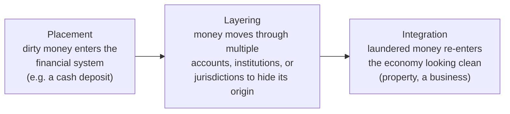
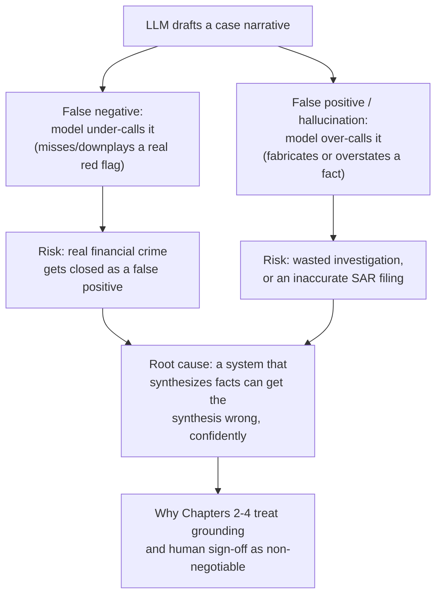

# 01 — AML Transaction Monitoring: Domain Fundamentals

## Why this chapter exists

Every architectural decision in this course traces back to this chapter's domain problem:

- Why retrieval is split two ways in Chapter 2.
- Why the narrative template has exactly six sections in Chapter 3.
- Why a human has to sign off in Chapter 4.

This chapter lays the foundation those decisions sit on: what actually trips an alert, why investigators drown in false positives, what a case narrative has to contain to be useful to the next reader (a compliance officer, and potentially a regulator), and why this is simultaneously a strong and a risky fit for generative AI.

## What Anti-Money-Laundering monitoring is actually watching for

Money laundering is the process of making illegally obtained funds look legitimate. It's typically described in three stages:

Banks are legally required — under regimes like the U.S. Bank Secrecy Act / USA PATRIOT Act, the UK's Proceeds of Crime Act and Money Laundering Regulations, and equivalent frameworks elsewhere — to monitor customer activity for signs of any of these three stages, and to report suspicious activity to the relevant financial-crime regulator.

**Transaction-monitoring systems** are the automated layer that does this watching. They run rules (and increasingly ML-scored anomaly models) against every transaction flowing through the bank, looking for patterns like:

- **Structuring ("smurfing")** — breaking a transaction that would otherwise trigger a reporting threshold (e.g., $10,000 in the U.S. under the Bank Secrecy Act) into several smaller transactions that individually stay under it.
- **Rapid movement of funds** — money arriving and leaving an account in an unusually short window, especially through several intermediary accounts, with no clear commercial rationale.
- **Activity inconsistent with the customer's stated profile** — a retail customer whose KYC profile says "salaried employee, expected monthly inflow $4,000" suddenly receiving wire transfers from multiple overseas jurisdictions.
- **Velocity and volume anomalies** — a sudden spike in transaction count or value relative to that customer's own historical baseline, or relative to peers in a similar segment.
- **Sanctioned or high-risk-jurisdiction counterparties** — a transaction touching a sanctioned entity, a politically-exposed-person (PEP) relationship, or a jurisdiction flagged as high-risk for financial crime.

When any rule fires, the system raises an **alert**, which lands in an investigator's queue.

## Why false-positive rates are so high

This is the single most-cited pain point in AML operations. It's worth being able to explain *why* it happens, not just cite the statistic.

Rule-based monitoring is deliberately tuned toward **high recall at the cost of precision**. In plain terms: a bank would much rather review ten false alarms than miss one real instance of money laundering. Why? Because the regulatory and reputational cost of a missed SAR (Suspicious Activity Report) is far higher than the operational cost of a wasted investigation.

That trade-off is a rational design choice, not a bug. But it has a predictable consequence: industry commentary widely cites transaction-monitoring false-positive rates in the **90%+ range**. (The precise figure varies enormously by bank, rule-tuning maturity, and customer segment — treat any specific number, including that one, as directional rather than a fact to cite verbatim.)

Every one of those alerts — true positive or not — still requires a human to open it, gather data, and document a conclusion. There's no way to know in advance which alerts are the real ones without doing the review.

A few things compound the base-rate problem on top of that:

- Rules are typically written per-typology — one rule for structuring, a different rule for rapid movement, a different rule for jurisdiction risk. So a single customer's activity can trip multiple rules at once.
- Rule thresholds are usually set conservatively during initial tuning, and loosened only cautiously over time. Loosen a threshold too aggressively and you risk missing a real typology.

The net effect: the false-positive burden tends to stay structurally high even as monitoring systems mature.

## What a case narrative needs to contain

The document an investigator produces for each alert isn't free-form. It's a structured artifact that has to survive scrutiny — from a supervisor, from a compliance officer, and potentially from a regulatory examiner months or years later.

This course (and the copilot's structured-output template in Chapter 3) organizes it into six sections. This is a realistic decomposition of what investigators actually write:

1. **Customer / KYC Overview** — who the customer is: stated occupation, expected account activity, account tenure, risk rating, any prior flags. This section anchors everything that follows — a red flag only means something relative to what "normal" looks like for *this* customer.
2. **Alert Trigger Summary** — which rule(s) fired, when, and the raw facts of what triggered it: the specific transaction(s), amount(s), dates, counterparties.
3. **Transaction Pattern Analysis** — the transaction history around the alert window, analyzed for pattern: frequency, volume, counterparties, geography, and how it compares to the customer's own historical baseline.
4. **Historical / Prior-Case Context** — has this customer been alerted before? What was concluded then? Recurring alerts on the same customer are themselves a signal, and prior case notes are often where an investigator finds the context that changes a conclusion.
5. **Red Flags Identified** — the specific, named indicators that make this alert concerning. Or, just as legitimately, the specific reasons it *isn't* concerning — a false-positive narrative still needs to explain why.
6. **Recommendation** — close as false positive, escalate for further review, or contribute to a SAR filing, with the reasoning that led there.

That structure matters for a reason beyond readability. A regulator examining the bank's AML program after the fact isn't just checking whether the *right* decision was made — they're checking whether the *process* that led to it was sound and documented. A narrative missing the "why" behind a conclusion is itself a finding, independent of whether the conclusion happened to be correct.

## Why this is a strong — and risky — GenAI fit

The synthesis task is genuinely well-suited to an LLM. Pulling structured facts from three different systems (KYC, transaction history, prior cases) and writing them up into a coherent, well-organized narrative in the client's expected format is exactly the kind of "read a lot, write a little, follow a template precisely" task language models are strong at. It's also exactly the kind of repetitive drafting work that burns investigator time without requiring much investigator *judgment* — the judgment is in deciding what the facts mean, not in typing them up.

That's the "strong fit" half. The "risky" half is just as real and deserves equal weight, not a token mention. Two distinct failure modes matter here, and they cut in opposite directions:

- **False negative risk (the model under-calls it).** A narrative that omits or downplays a genuine red flag — because retrieval missed a relevant prior case, or the model's synthesis smoothed over a pattern that should have stood out — could lead a compliance officer to close as a false positive something that was actually a real instance of financial crime. This is the single most serious failure mode in the whole system, because it has real-world consequences outside the bank.
- **False positive / hallucination risk (the model over-calls it, or invents facts).** A narrative that fabricates a transaction detail, misattributes a red flag, or overstates a pattern's severity could drive a wasted, misdirected investigation — or worse, an inaccurate SAR filing, which carries its own regulatory and reputational cost, and wastes the same scarce investigator time this project is supposed to be saving.

Both failure modes point at the same root cause: a system that synthesizes facts can get the synthesis wrong, confidently. That's exactly why the rest of this course treats grounding (Chapters 2–3) and human sign-off (Chapter 4) as non-negotiable, not as an afterthought bolted onto an otherwise-autonomous system. A generative model that drafts a narrative and hands it directly to a case-closure decision, with no verification step, is not a defensible design in this domain — regardless of how good the draft looks.

## Tying It Back

The resume bullet's phrase "auto-drafts investigator-ready case narratives" is doing real work: it's deliberately "drafts," not "decides."

Understanding *why* is the foundation the rest of this course builds on:
- High false-positive volume creates a real documentation bottleneck worth automating.
- The decision itself carries consequences on both sides — missed financial crime on one side, wasted investigations on the other — that make full automation inappropriate.

Chapter 2 covers how the three data sources actually get retrieved into a prompt. Chapter 4 covers the compliance-officer sign-off step this chapter's risk analysis makes non-negotiable.
