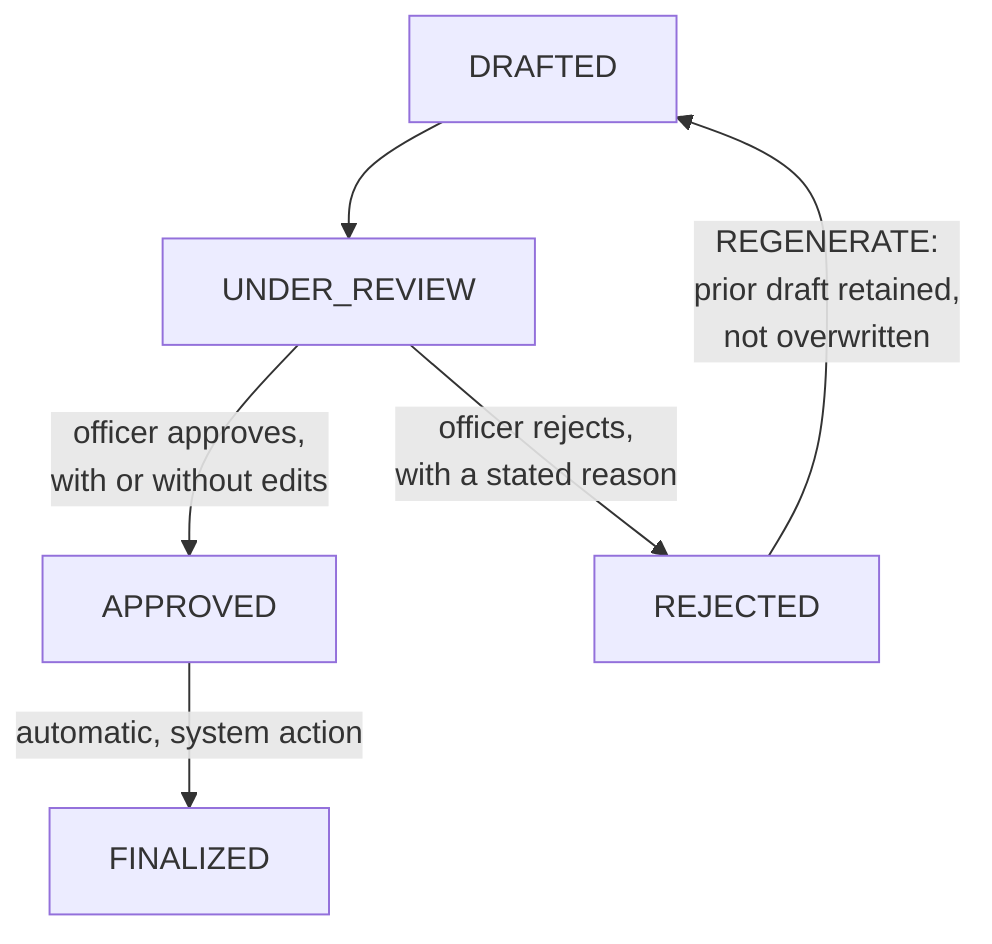

# 04 — Human-in-the-Loop Compliance Sign-Off

## Why this chapter exists

Every other chapter in this course exists to make the draft this chapter reviews as good and as verifiable as possible. This chapter is about the step that makes the whole system defensible:

**No narrative becomes part of the official case record, and no alert gets closed, escalated, or referred for a SAR, without a compliance officer explicitly signing off.**

This is the single most important design decision in the project, and it needs to be explainable in depth, not just asserted. This chapter is the worked answer to "why isn't this fully automated" — very likely the first follow-up question any interviewer asks once they understand what this system does.

## Why full automation is inappropriate here

It's worth separating two different arguments for keeping a human in the loop, because they're often conflated, and an interviewer will notice if you only have the weaker one ready.

**The weaker argument (still true, but not the real reason): "the model might be wrong."** Any generative system can produce an inaccurate output, and that alone is a reason for review. But this argument, on its own, applies to nearly *any* AI system. It doesn't explain why AML specifically demands a *mandatory, structural* human gate rather than, say, a periodic quality-audit sample — which is the review model plenty of lower-stakes AI systems use.

**The real argument: regulatory accountability requires a human be the accountable decision-maker for this class of determination, not just a reviewer of one.** AML regulation (the Bank Secrecy Act and its equivalents elsewhere) places a legal obligation on the financial institution — and, functionally, on identifiable individuals within its compliance function — to exercise judgment about suspicious activity and to be accountable for that judgment under examination.

A regulator does not accept "an AI system determined this was a false positive" as a substitute for a documented human determination, because the regulatory framework was built around the premise that a human, not a piece of software, is answerable for the call.

This isn't a technology-maturity argument that goes away as models get better. It's a governance-and-accountability argument that would still hold even with a hypothetically perfect model — for the same reason a hypothetically perfect calculator still doesn't get to sign a tax return.

This is the same shape of argument Course 11 (GenAI Regulatory Platform) makes for patient-safety human review in a clinical-content context: the domain's accountability structure, not the model's error rate, is what makes the human step mandatory.

Put together as a single interview-ready answer:

> "The honest answer is that this isn't really a 'the model isn't good enough yet' problem — it's a
> regulatory accountability problem. AML determinations carry a legal obligation for a human at the
> institution to be answerable for the judgment call, and that doesn't change even if the model's
> narratives are excellent. So the system is architected so a narrative literally cannot become part of
> the official case record, and an alert literally cannot close, escalate, or feed a SAR, without an
> explicit compliance-officer approval recorded against it. The model's job is to make that officer's
> review faster and better-informed — dense with the right facts, each one cited — not to replace their
> judgment."

## The review workflow, in depth

A narrative arrives in a compliance officer's queue with:

- The full six-section draft, per Chapter 3's schema.
- Per-section confidence indicators (Chapter 3), so the officer's attention is naturally drawn to the weakest-grounded sections first rather than reading uniformly.
- Every citation resolvable and visible inline — a click-through from a cited transaction ID or prior case ID to the actual source record, so verification doesn't require the officer to re-derive the data themselves.
- Any flags from the automated citation-verification check (Chapter 3) or the data-freshness check (Chapter 5), surfaced prominently rather than buried.

The officer can then take one of four actions:

1. **Approve as-is** — the draft is accurate and complete; it becomes the final case record verbatim.
2. **Edit, then approve** — the officer corrects a claim, adds context the model missed, or adjusts the recommendation, and approves the edited version. This is expected to be the common path for anything but the most straightforward alerts — the copilot's value is in the *drafting speed*, not in replacing the officer's judgment on the substance.
3. **Reject and regenerate** — the draft has a material problem (a broken citation, a missed red flag, thin retrieval) severe enough that editing isn't the right fix. The officer sends it back with a reason, which becomes an input to a fresh generation attempt.
4. **Reject outright** — for the rare case where the alert itself needs a different handling path entirely (e.g., it should never have reached the copilot in the first place).

## The state machine



Plain-text version, if diagram rendering isn't available:

```
   DRAFTED
      |
      v
 UNDER_REVIEW  <-------------------+
      |                            |
      +---> APPROVED --> FINALIZED |
      |                            |
      +---> REJECTED --------------+
                 |
                 v
           (REGENERATE path -- new DRAFTED narrative,
            prior draft retained, not overwritten)
```

| State | Meaning | Who can transition it |
|---|---|---|
| `DRAFTED` | Narrative generated, citation-verification and freshness checks run automatically | System (on generation) |
| `UNDER_REVIEW` | In a compliance officer's queue, actively being reviewed | System (on assignment/open) |
| `APPROVED` | Officer has signed off, with or without edits | Compliance officer only |
| `REJECTED` | Officer has declined the draft with a stated reason | Compliance officer only |
| `FINALIZED` | The approved narrative is now the official case record; immutable from this point | System (automatic on `APPROVED`) |
| *(REGENERATE)* | Not a state itself — a `REJECTED` narrative triggers a fresh `DRAFTED` attempt, with the prior rejected draft **retained**, not deleted, and linked to the new attempt | System, triggered by rejection |

Two design choices in this state machine are worth defending explicitly if probed:

- **`APPROVED` and `FINALIZED` are separate states, not one.** This looks redundant at first glance — why not just go straight from `UNDER_REVIEW` to `FINALIZED` on approval? The separation exists because `APPROVED` is the human action (an officer clicking approve) and `FINALIZED` is the system action (writing the immutable case record and, if applicable, notifying downstream systems like a SAR filing queue). Keeping them distinct means an approval and its downstream consequences can be logged as two separate, independently-timestamped audit events — useful if a system-side failure ever needs to be distinguished from a human decision in an audit trail.
- **Rejected drafts are retained, never deleted.** A prior rejected draft, and the officer's stated reason for rejecting it, is itself part of the auditable history of how a case was handled. Deleting it would erase evidence of a real decision point (an officer judged this draft insufficient, and why) — exactly the kind of gap a regulatory examination would flag.

## Audit-trail requirements

This is the concrete mechanism that makes "a compliance officer is accountable" more than a slogan: the system has to be able to show, for any finalized narrative, an unambiguous answer to **"what was AI-drafted, what was human-edited, and by whom."** Practically, that means:

- **A diff, not just a final version.** The system stores the original AI-generated draft (per section) and the final approved version separately, so any human edit is reconstructable as a diff against the model's output — not just "here's the final text," but "here's exactly what the model said, and here's exactly what the officer changed."
- **Every state transition is a timestamped, attributed event** — who moved the narrative from `UNDER_REVIEW` to `APPROVED`, when, and (for a rejection) why, stored as an append-only log rather than mutable fields on the narrative record itself, so the audit trail can't be silently altered after the fact.
- **The data snapshot the narrative was grounded in is recorded alongside it** — which exact KYC values, which transaction-history window, which retrieved case-note chunks fed the generation call that produced this draft. This is the direct forward tie to Chapter 5: if a regulator (or an internal QA reviewer) later asks "was this narrative accurate as of the moment it was approved," the system needs to be able to answer precisely what data it was grounded in at generation time, not just what the customer's data looks like *now*.
- **The model/prompt version is recorded too** — which system-prompt version and which Azure OpenAI deployment produced this specific draft, the same audit granularity Course 1's Application Insights tracing captures for chatbot responses (Course 1, Chapter 3), applied here to a compliance artifact where "which exact configuration produced this text" is a materially more consequential question to be able to answer.

## Tying It Back

If there's one paragraph from this whole course worth memorizing verbatim for an interview, it's this chapter's "real argument" section: full automation is inappropriate not because the model is unreliable today, but because AML determinations carry a legal accountability requirement that a human, not a model, has to satisfy — a governance fact, not a technology-maturity fact.

The state machine and audit trail are how that principle gets enforced in code rather than left as a policy statement nobody checks: a narrative structurally cannot become a decision without a recorded, attributed, timestamped human approval, and the system can always show exactly what the model drafted versus what the human changed.

Chapter 5 extends this audit-trail thinking one step further — recording not just what was approved, but what data snapshot it was approved *against*.
