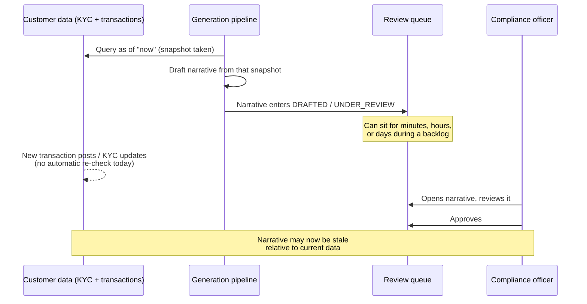
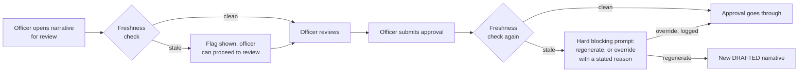

# 05 — Case Narrative Staleness and Mid-Review Data Changes

## Why this chapter exists

Every course in this curriculum has a version of this chapter. Course 1 asks "what happens when the source documents behind a chatbot's answers get updated." Course 4 asks it about a monitoring baseline. Course 5 (the real, source-grounded one) asks it about a revised document upload.

Here, the natural analog is sharper than most, because the stakes are higher: **what happens when new transactions arrive for a customer while their alert's narrative is being drafted, or while it's sitting in a compliance officer's review queue? Or when the customer's KYC profile gets updated mid-review?**

A narrative is a synthesis of a data snapshot taken at generation time — and nothing about that snapshot automatically knows whether it's still accurate by the time a human actually acts on it.

**Everything in this chapter is an illustrative, plausible reconstruction**, in the same spirit as the rest of this course — there's no source repository behind this project. Treat it as a technically confident, defensible system-design answer, the kind of thing worth sketching on a whiteboard if asked, not a claim about a verified implementation.

## Part 1 — What a realistic implementation does today: a snapshot, frozen at generation time

When the narrative-generation pipeline (Chapters 2–3) runs, it queries the KYC store and the transaction-history system, and retrieves prior case notes, all **as of that exact moment**. Those results get baked into the generated `CaseNarrative` — the text is written, the citations point to specific field values and transaction IDs, and from that point forward, the narrative is a frozen artifact describing a snapshot in time.

A realistic implementation does **not** automatically re-check that snapshot against current data at any later point. Two gaps compound here:

- **Between generation and the start of review**, the narrative can sit in a queue for some period — minutes if the team is fully staffed and caught up, but plausibly hours or, during a backlog, days if the officer's queue is deep. Nothing about the `DRAFTED` → `UNDER_REVIEW` transition (Chapter 4) triggers a re-check of whether the customer's transaction history or KYC profile has changed since generation.
- **During active review itself**, the same gap exists at a smaller scale — an officer reading a narrative for several minutes (or returning to it after being pulled away, a realistic interruption in a busy queue) has no signal if a new transaction posted, or a KYC update landed, in the interim.



The practical consequence: **a compliance officer can approve a narrative that accurately describes data as of generation time, but is already stale relative to the customer's *current* state by the time the approval happens.**

For most alerts, on most days, this is a low-probability, low-consequence gap — a customer's KYC profile rarely changes in the hours between drafting and review. But it is not always low-consequence: a customer under active investigation is, almost by definition, someone whose account activity might be actively evolving. New transactions arriving *during* the exact window a narrative about their prior activity is under review is a plausible, not a contrived, scenario — and it's precisely the scenario where missing a newly-arrived, more-serious pattern matters most.

## Part 2 — Two concerns that are easy to conflate, kept explicitly separate

This is the distinction worth drawing precisely and unprompted, the same way Course 1's Chapter 6 draws the line between conversation-turn-count and knowledge-freshness. Here, the two concepts that sound adjacent but are genuinely orthogonal:

| | **Internal coherence and quality** | **Currency as of sign-off** |
|---|---|---|
| The question it answers | Is this narrative well-written, internally consistent, and correctly grounded in the data it was generated from? | Does this narrative still reflect the customer's *current* data, as of the moment a compliance officer actually approves it? |
| What checks it | The citation-verification check (Chapter 3) — does every cited fact resolve against the data the narrative was generated from | A freshness/staleness check (this chapter) — does the data the narrative was generated from still match the customer's current data |
| Can pass while the other fails? | Yes, entirely independently — a narrative can be perfectly grounded in its own snapshot (every citation resolves, no hallucination) while that snapshot itself is now three hours out of date | Yes — a narrative could theoretically still be "current" (nothing changed) while containing an ungrounded claim unrelated to any subsequent data change |
| The failure mode if conflated | Treating "citation verification passed" as proof the narrative is safe to approve — it proves the narrative was accurate *then*, not that it's accurate *now* | Treating "no new transactions" as proof the narrative is well-grounded — currency says nothing about whether the original synthesis was correct |

The concrete, testable way to state this if pressed:

> "Citation verification and freshness checking answer two completely different questions, and a narrative can pass one while failing the other. A narrative generated an hour ago with a flawless citation trail can still be dangerously stale if the customer received three large wire transfers in that hour that aren't reflected anywhere in the draft. Conversely, a narrative could be current — nothing about the customer's data has changed since generation — and still contain a claim that doesn't actually trace back to real data. Fixing one doesn't fix the other, and a review process that only checks one of them has a real gap."

## Part 3 — A proposed design: a freshness check at sign-off

The proposed fix mirrors the shape of the other courses' proposed fixes: not a redesign of the whole pipeline, a targeted check inserted at exactly the point where staleness becomes consequential — the moment of approval, not generation.

**1. Record a data-snapshot fingerprint at generation time, not just the data itself.**

```python
# Illustrative -- attached to every generated CaseNarrative
class DataSnapshot(BaseModel):
    customer_id: str
    kyc_profile_version_hash: str       # hash of the KYC fields as retrieved
    transaction_history_max_txn_id: str  # the most recent transaction ID
                                          # included in the generation context
    transaction_history_as_of: datetime
    generated_at: datetime
```

`kyc_profile_version_hash` and `transaction_history_max_txn_id` are the two cheap, precise signals that let a later check answer "has anything changed" without re-running the entire retrieval pipeline: a content hash for KYC (any field change produces a different hash), and a high-water-mark transaction ID for transaction history (any transaction posted after that ID is, by definition, new information the narrative never saw).

**2. Run a lightweight comparison at the moment an officer opens the narrative for review, and again immediately before they submit an approval.** Not continuously — that would be wasted work for a narrative sitting untouched in a queue — but at exactly the two moments staleness actually matters:

```python
# Illustrative -- run at "open for review" and again at "submit approval"
def check_freshness(narrative: CaseNarrative, snapshot: DataSnapshot) -> FreshnessResult:
    current_kyc_hash = hash_kyc_profile(get_kyc_profile(snapshot.customer_id))
    current_max_txn_id = get_latest_transaction_id(snapshot.customer_id)

    kyc_changed = current_kyc_hash != snapshot.kyc_profile_version_hash
    new_transactions = current_max_txn_id != snapshot.transaction_history_max_txn_id

    if kyc_changed or new_transactions:
        return FreshnessResult(
            stale=True,
            reason="Customer data has changed since this draft was generated "
                   "-- regenerate before approving.",
            kyc_changed=kyc_changed,
            new_transactions_since_generation=new_transactions,
        )
    return FreshnessResult(stale=False)
```

**3. Surface the result as a hard interstitial, not a quiet badge.** If the check at submission time comes back stale, the officer sees an explicit, blocking prompt — "customer data has changed since this draft was generated; regenerate before approving" — rather than a small icon easy to miss under time pressure at the end of a long queue. The officer retains the ability to override and approve anyway with a stated reason (there are legitimate cases — a trivial KYC field update unrelated to the alert's substance, say — where regeneration would be pure overhead), but the override itself becomes an explicit, logged decision rather than a silent gap nobody noticed.



This design deliberately mirrors Course 1's Chapter 6 recommendation to surface an `indexed_as_of` timestamp on citations rather than silently trusting retrieval — the same underlying instinct: **a system that's honest about what might be stale is more trustworthy than one that silently might be wrong**, applied here at the sign-off gate specifically, since that's the one moment where staleness converts from a latent data-quality issue into an actual compliance decision made on outdated information.

## Part 4 — The audit-trail tie-in

This closes the loop back to Chapter 4's audit-trail requirement, and it's worth stating the connection explicitly rather than leaving it implicit: the system needs to record, for every finalized narrative, **which data snapshot it was actually grounded in and approved against** — not just "approved by officer X at time Y," but "approved by officer X at time Y, against KYC snapshot hash `abc123` and transaction data as of `TXN-88213`, with the freshness check showing [clean / stale-but-overridden with stated reason]."

That's the difference between an audit trail that can answer "was this decision made on current information" precisely, versus one that can only answer "was this decision made" — and for a regulatory examination, the first question is very plausibly the one that actually gets asked.

## Tying It Back

The honest first sentence of the interview answer here:

> "Today, a narrative reflects a snapshot of the customer's data as of generation time, and nothing automatically re-checks whether that snapshot is still current by the time a compliance officer actually signs off — which matters because review can take hours or sit in a backlog for days, and a customer under active investigation is exactly the kind of customer whose data might keep changing during that window."

The fix — a lightweight fingerprint-and-compare check run at open-for-review and again at submit-approval, surfaced as a hard, overridable prompt rather than a silent badge — is deliberately proportionate: it doesn't re-run the whole pipeline continuously, it checks at exactly the two moments staleness becomes consequential, and it feeds directly into the audit trail Chapter 4 already requires, so "was this approved against current data" becomes a question the system can always answer precisely.
