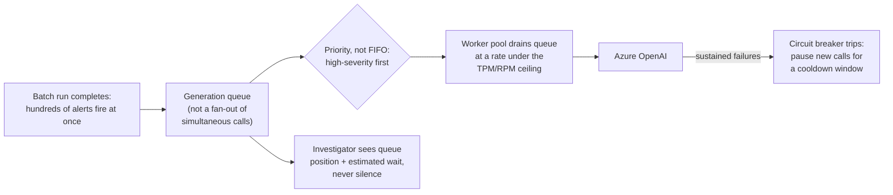

# 06 — Production Resilience and Operational Engineering

## Why this chapter exists

Chapters 2–5 cover what makes this copilot draft well and stay honest. This chapter is the layer underneath: realistic error-handling behavior (which failures should block narrative generation entirely versus degrade gracefully), a concurrency caveat specific to how alerts actually arrive (in bursts, not a smooth trickle), concrete domain-specific bug narratives, and one hardening gap named candidly.

**The same honesty constraint as every illustrative chapter in this course applies here**: this is a plausible, technically detailed reconstruction of what a production-grade AML copilot's operational engineering looks like, not a verified incident log. Treat it as a confident, defensible answer to "tell me about production issues you'd expect," not a claim about specific verified events.

## A realistic error-handling table

The central design question this table answers: which failures are load-bearing enough to justify blocking narrative generation entirely, versus which should degrade the narrative gracefully with an explicit gap noted?

| Failure | What happens | Why |
|---|---|---|
| KYC profile lookup fails or times out | **Blocks generation entirely** — no narrative is produced; the alert is flagged for manual handling | Customer identity and expected-activity profile is load-bearing for every other section — a narrative built without it isn't a degraded narrative, it's a narrative about the wrong (or no) baseline, which is worse than no narrative at all |
| Transaction-history query returns an error | **Blocks generation entirely** | The alert trigger itself is transaction data — a narrative generated without it would have to describe the pattern that triggered the alert without the pattern, which defeats the point |
| Prior-case-notes retrieval (Azure AI Search) fails or times out | **Does not block** — narrative generates with the Historical/Prior-Case Context section explicitly marked "no prior case data available due to a retrieval error" and a low confidence score for that section | Prior case context is valuable but not load-bearing the way KYC/transaction data is — most alerts, especially for first-time-flagged customers, would legitimately have an empty section here anyway, so a retrieval outage degrades to a state the system already has to handle correctly |
| Azure AI Search returns zero relevant chunks (not an error — a real empty result) | Not an error at all — treated identically to "this customer has no meaningfully similar prior cases," a valid and common outcome | Distinguishing "the search failed" from "the search succeeded and found nothing relevant" matters — conflating them either over-alarms on a normal empty result or, worse, silently swallows a real outage as if it were a normal empty result |
| Citation-verification check (Chapter 3) finds an unresolved citation | **Does not block**, but the narrative is routed to review with the specific unresolved claim flagged prominently, never silently dropped or silently approved | A hallucinated citation is a serious finding for a compliance document, but the right response is transparency to the reviewer, not silently hiding the affected claim (which would just move the problem) or blocking generation outright (which would deny the officer a mostly-good draft over one bad claim) |
| Freshness check (Chapter 5) finds stale data | **Does not block** generation or review, but blocks a *clean* approval — surfaced as a hard interstitial at submission time per Chapter 5 | Staleness is a review-time concern, not a generation-time one; blocking generation over it would be premature since the data may still be current by the time review actually happens |
| Azure OpenAI returns `429` (rate-limited) | Retried with exponential backoff; if retries exhaust, the alert stays queued for generation rather than surfacing a broken narrative | Same reasoning as Course 1's Chapter 7 — `429` is expected, transient load, not a real failure |
| Azure OpenAI content filter blocks a generation call | Logged with full detail for review; the alert is flagged for a human to draft manually, since a filtered generation on a compliance document shouldn't silently retry with altered wording that might change substance | Content-filter events on this kind of document are rare but worth treating conservatively — auto-retrying with prompt modifications risks changing the narrative's substance in a way that isn't transparent |
| A burst of alerts overwhelms generation throughput | Queued with backpressure (see below), not dropped or silently delayed with no visibility | Investigators need to know a narrative is pending, not missing |

Two patterns worth naming explicitly, mirroring the shape of the equivalent table in Course 1 Chapter 7 but with this project's own asymmetry:

- **The blocking/non-blocking line is drawn on "is this data load-bearing to the narrative's substance," not on "is this source structured or unstructured."** KYC and transaction data (both structured, Chapter 2) block on failure; prior case notes (unstructured) degrade gracefully — the distinction tracks what the data *means* to the narrative's correctness, not which retrieval mechanism produced it.
- **Every degrade-gracefully path leaves an explicit, visible gap marker, never a silent omission.** An officer reading a narrative with a degraded section needs to know that section is thin because of a system failure, not because there was genuinely nothing to say — conflating those two would erode trust in every "nothing found" result going forward, including the many legitimate ones.

## Concurrency and scaling: a burst of alerts from a monitoring-system batch run

Transaction-monitoring systems commonly run their rule evaluation on a **batch cadence** — nightly, or several times a day — rather than continuously. That means alerts don't arrive as a smooth trickle; they arrive in **bursts**, potentially hundreds at once right after a batch run completes.

This is a materially different load shape than Course 1's chatbot faces (individual users arriving somewhat independently over the course of a day), and it's worth being explicit about why it needs its own answer rather than assuming "the same scaling story as the chatbot" transfers directly.

The core tension: generating hundreds of narratives simultaneously means hundreds of near-simultaneous Azure OpenAI calls, which will hit the same **TPM/RPM quota ceiling** Course 1's Chapter 7 covers in depth for a single-conversation chatbot. That chapter's backoff/circuit-breaker content — exponential backoff with jitter, a narrow allowlist of retryable status codes, respecting `Retry-After` over a computed guess — applies directly here and isn't re-explained in this chapter.

What's specific to *this* project's load shape is the response above the retry layer:

- **A generation queue, not a fan-out of hundreds of simultaneous calls.** Newly-triggered alerts are enqueued rather than immediately dispatched to Azure OpenAI, and a worker pool pulls from that queue at a rate tuned to stay under the deployment's TPM/RPM ceiling with headroom — converting "handle a burst" from a race against a rate limit into a controlled drain of a queue, which is both more predictable and easier to reason about under load.
- **Priority within the queue, not strict FIFO.** Alerts the upstream monitoring system already scores as high-severity — a structuring pattern at a high dollar threshold, say, versus a routine velocity-anomaly flag — are processed ahead of routine, low-severity alerts, so a burst doesn't create an even, undifferentiated backlog where a genuinely urgent case waits behind hundreds of routine ones.
- **Investigators see queue position and estimated wait, not silence.** An alert whose narrative generation is queued behind a burst shows up in the investigator's view as "narrative pending, estimated in ~12 minutes" rather than simply not appearing — the same "don't leave the user guessing" instinct behind the error-handling table's insistence on visible gap markers, applied to backpressure instead of degraded data.
- **A circuit breaker (Course 1, Chapter 7's pattern) protects against a sustained Azure OpenAI outage during a burst specifically.** If a burst of hundreds of alerts coincides with an Azure OpenAI degradation, retrying every one of them individually with exponential backoff would itself contribute to sustained load against a struggling dependency. A circuit breaker that trips after a threshold of consecutive failures and stops issuing new calls for a cooldown window — rather than letting hundreds of queued workers each independently retry into the same outage — is materially more important here than in a single-conversation chatbot, precisely because the burst multiplies the blast radius of getting the retry behavior wrong.

## Domain-specific bugs found and fixed

Illustrative, plausible bug narratives — the kind of concrete, specific failure worth being able to describe candidly, not a claim about a verified incident log.

**1. A prompt bug that let the model cite a transaction ID that didn't actually exist in the retrieved data.**

An early version of the citation instruction told the model to "cite the relevant transaction ID for each claim in this section" without explicitly constraining it to IDs present in the supplied context — a subtle gap, since the instruction reads as obviously scoped to the provided data to a human, but doesn't functionally constrain the model's output at all.

On a small fraction of narratives involving unusually large transaction histories (where the model had to reason across many transactions to summarize a pattern), it occasionally cited a transaction ID that was a plausible-looking extrapolation — right format, right customer, wrong actual ID — rather than one that was genuinely in the retrieved set.

This is precisely the failure the citation-verification check (Chapter 3) exists to catch, and it's exactly how this bug was actually caught: the verification step started flagging a low but non-zero rate of unresolved citations, which traced back to the prompt's implicit (rather than explicit) scoping.

*What would have caught it earlier:* the citation-verification check should have been built and run against a held-out evaluation set *before* launch, not added reactively after the pattern showed up in a citation-verification pass on live narratives. This is one case where the fix (the verification check) already existed as a Chapter 3 control, but wasn't exercised early enough in the development lifecycle to catch the bug before it reached production traffic.

**2. A structured-query bug that silently truncated transaction history to too short a lookback window.**

The `get_transaction_history` tool (Chapter 2) defaulted its `start_date` parameter to "90 days before the alert" when the calling code omitted an explicit window — a reasonable default for most alert types, but wrong for alert types (specifically, longer-horizon structuring patterns) where the relevant pattern only becomes visible across a 6-to-12-month window.

Because the tool call succeeded normally and returned a well-formed (just incomplete) result, nothing errored. Narratives for that alert type were quietly missing the longer-term context that would have made a slow-accumulating structuring pattern visible, producing narratives that read as "no concerning pattern" when a longer window would have shown one.

*What would have caught it earlier:* an alert-type-to-lookback-window mapping should have been an explicit, reviewed configuration decision made per alert typology during design, not a single global default silently reused across every typology. The fix, once found, was making the lookback window a required, alert-type-specific parameter with no default, so a caller has to make an explicit choice rather than inheriting one that happened to be right for the common case and wrong for a specific, higher-stakes one.

**3. A PII-redaction bug in logging that briefly wrote unmasked account numbers to Application Insights.**

The narrative-generation pipeline's structured logging (intended to log the *shape* of a generation request — customer ID, alert ID, timing, token counts — for observability, per Chapter 7's audit-trail needs) included a debug-level log statement, added during a troubleshooting session and not removed before merge, that serialized the full `get_transaction_history` response — including full account numbers and counterparty details — directly into the log payload.

Because Application Insights retains logs for an extended window and access to it is broader than access to the production transaction database itself, this briefly created a wider-than-intended blast radius for sensitive account data, entirely through a logging path rather than the application's actual data-access controls.

*What would have caught it earlier:* a log-scrubbing/PII-linting check in CI that flags any log statement serializing a response object from a function on an explicit "sensitive" allowlist (anything touching KYC or transaction data) rather than relying on code review alone to catch every debug statement before merge — the same class of control Chapter 7 argues for as a standing practice, not a one-time cleanup.

The common thread, worth stating as the takeaway: **all three are "the code runs without error, so it looks fine" bugs** — nothing threw an exception, nothing tripped an error-rate alert, and two of the three were only caught by a control (citation verification, a PII-scrubbing check) that existed specifically because this domain's stakes justified building it, rather than by generic error monitoring. That's the strongest argument for why the compliance-specific controls in Chapters 3, 4, and 7 aren't over-engineering — they're the actual detection mechanism for exactly this class of bug.

## A hardening gap, named candidly: no automated staleness sweep across the review backlog

Chapter 5's freshness check runs at two specific moments — when an officer opens a narrative for review, and again at submission. The gap worth naming candidly: there is **no background sweep that proactively checks the entire backlog of `UNDER_REVIEW` narratives for staleness**. A narrative sitting untouched in the queue for several days (during a genuine backlog, a realistic scenario, not an edge case) could go stale without anyone finding out until an officer happens to open it.

The two point-in-time checks are the right *minimum* design (checking continuously for every queued narrative would be wasted work most of the time), but they leave a real gap: a narrative that's gone stale isn't surfaced to anyone until a human happens to look at it, which could be days after the staleness first occurred.

The fix is proportionate, not a redesign: a low-frequency background job (hourly, not continuous) that re-runs the freshness check against every `UNDER_REVIEW` narrative and, for any newly-stale one, surfaces it in the officer's queue view with a "data has changed since this was drafted" badge — turning a purely reactive check into one with a proactive backstop, at a cadence cheap enough not to meaningfully compete with the generation pipeline's own Azure OpenAI usage.

## Tying It Back

Production-grade for an AML narrative copilot means something stricter than for a general-purpose chatbot:

- The error-handling table's asymmetry (block on load-bearing structured data, degrade gracefully on prior-case context) reflects what's actually load-bearing to a compliance document's correctness, not just what's technically hard to retrieve.
- The burst-handling design leans on Course 1's backoff/circuit-breaker pattern but adds a queue and priority layer specific to how alerts actually arrive.
- Two of the three domain-specific bugs above were only caught by compliance-specific controls this domain justified building — which is the strongest evidence that those controls (Chapters 3, 4, 7) earn their complexity rather than being process for its own sake.
