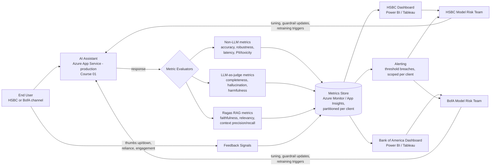

# 02 — Capco: Model Risk Monitoring for AI Assistant

## Resume bullet this course is built from

> "Model Risk Monitoring Model to evaluate AI Assistant: Integrated Model Monitoring platform to
> assess AI Assistant performance and moderation. Evaluated responses using LLM and non-LLM metrics
> including accuracy, completeness, hallucination, robustness, efficiency, latency, harmfulness,
> bad-actor. Incorporated user feedback, reliance, and engagement for moderation insights."

This course is the companion to [`01-Capco-AI-Chatbot-Assistant`](../01-Capco-AI-Chatbot-Assistant/00-README.md).
That course covers *building* an AI Assistant. This one covers *watching* it once it's live — the
discipline of Model Risk Management (MRM) applied to a generative AI system, and the evaluation
harness a Consultant-II would plausibly design and build around it.

## Why financial-services firms need "model risk management"

Capco is a management and technology consultancy that works almost exclusively with banks, insurers,
and other regulated financial institutions. In that world, deploying a model — any model, not just an
LLM — is not just an engineering decision, it's a *governance* event.

Since the 2011 U.S. Federal Reserve / OCC joint guidance known as **SR 11-7** ("Supervisory Guidance
on Model Risk Management"), banks operating in or with exposure to U.S. regulators have been expected
to treat models as a distinct risk category, on par with credit risk or operational risk. The core
idea of SR 11-7 — echoed by equivalent frameworks elsewhere (UK PRA SS1/23, EU frameworks under
emerging AI regulation) — is simple to state and hard to execute:

- Every model can be wrong, and a wrong model making decisions at scale can cause real financial and
  reputational harm.
- Therefore every model needs **independent validation** before and during production use, **ongoing
  monitoring** of its behavior, and **documented evidence** that someone is watching for drift,
  bias, and failure modes.
- "Model" is defined broadly enough that most banks now treat generative AI systems — chatbots,
  copilots, summarizers — as in-scope models requiring the same rigor as a credit scoring model.

This is the regulatory backdrop that makes a bullet like "Model Risk Monitoring Model to evaluate AI
Assistant" make sense as a real, fundable project inside a bank-facing engagement: it is very unlikely
a bank would let an LLM-based assistant go live for real users without *some* evaluation and monitoring
layer that a risk/compliance function can point to. Someone has to build that layer. That is the
plausible scope of this project. With named clients like **HSBC** and **Bank of America** — both
subject to SR 11-7 and/or its UK PRA (SS1/23) equivalent — this isn't a hypothetical regulatory
backdrop; it's exactly the kind of ongoing governance evidence a vendor like Capco is expected to
produce before, and continuously after, a customer-facing chatbot goes live for real account holders.

## Client & Production Deployment

This platform was built at Capco to monitor the **AI Chatbot Assistant from Course 01** for two named
banking clients, **HSBC** and **Bank of America**. That assistant was not a proof-of-concept — it was
**customer-facing and running in production**, handling real daily traffic on **Azure App Service**
(fronted by Azure Front Door/Application Gateway WAF, VNet-integrated with Private Endpoints, secured
with Azure AD, and backed by Azure OpenAI). **Azure Monitor / Application Insights** was the natural
home for the underlying telemetry this project's evaluation harness and metrics store were built on
top of.

Because one platform served two competing banking clients, **per-client metric isolation was a hard
requirement, not a nice-to-have**: HSBC's conversation data, scores, and dashboards must never be
visible in Bank of America's environment, and vice versa. A bank's model-risk officer should only
ever be able to see their own institution's data — anything else is itself a reportable incident,
not a UX bug. This directly reinforces the SR 11-7 framing above: banking regulators expect strict
per-entity governance, and a monitoring vendor that let two clients' data mix would fail that
expectation immediately, independent of how good the metrics themselves were. Chapter 05 covers the
dashboard-level mechanics (row-level security vs. separate workspaces) used to enforce this.

## The candidate's likely role

Building on the AI Assistant from Course 01, the natural next engagement is: *"Now prove it's safe
and good enough to keep running, and give the bank a way to keep proving that over time."* That
breaks down into work a backend GenAI developer would actually own:

- Designing a set of **evaluation metrics** that map to what a risk committee cares about: is the
  assistant *accurate*, *complete*, prone to *hallucination*, *robust* to rephrased or adversarial
  input, fast enough (*latency*/*efficiency*), and safe from *harmful* or *bad-actor* misuse.
- Wiring an **evaluation harness** that scores assistant responses on those metrics — a mix of
  cheap non-LLM checks (regex/keyword/statistical) and more expensive LLM-as-judge checks, run either
  synchronously on a sample of live traffic or as a batch/offline regression suite.
  See the [Model Monitoring integration pattern in Azure ML](https://learn.microsoft.com/en-us/azure/machine-learning/concept-model-monitoring)
  for the kind of platform this likely plugged into or resembled.
- Feeding those scores, plus **user feedback** (thumbs up/down), **reliance** (did the user act on the
  answer, or immediately reject/retry), and **engagement** (session length, repeat usage) into a
  **dashboard** that a moderation or risk team can actually use — a Power BI or Tableau layer sitting
  on top of the metrics store.
- Using **explainability** tooling (SHAP, LIME, Shapash) to make individual scoring decisions
  auditable — not just "the model said this response was 62% likely to hallucinate," but *why*.

Framed this way, the project is not "build a chatbot" (that's Course 01) — it's "build the control
tower that lets a bank trust the chatbot." That distinction is worth making explicit in interviews.

## Monitoring pipeline (conceptual)



Plain-text version, if diagram rendering isn't available:

```
End User (HSBC or BofA channel) -> AI Assistant (Azure App Service, production, Course 01) -> [response] -> Metric Evaluators
                                             |-- Non-LLM metrics (accuracy, robustness, latency, harmfulness rules)
                                             |-- LLM-as-judge metrics (completeness, hallucination, harmfulness)
                                             `-- Ragas RAG metrics (faithfulness, relevancy, context precision/recall)
Metric Evaluators -> Metrics Store (Azure Monitor / App Insights, partitioned per client: HSBC vs. BofA)
Metrics Store -> HSBC Dashboard (Power BI / Tableau)        -> HSBC Model Risk Team
Metrics Store -> BofA Dashboard (Power BI / Tableau)        -> BofA Model Risk Team
Metrics Store -> Alerting (threshold breaches, scoped per client) -> HSBC / BofA Model Risk Team (respectively)
End User -> feedback (thumbs up/down, reliance, engagement) -> Metrics Store
HSBC / BofA Model Risk Team -> tuning / guardrail updates / retraining triggers -> AI Assistant  (feedback loop closes, per client)
```

The key change from a single-tenant version of this diagram: the metrics store, dashboards, and
alerting are **partitioned per client from the point of ingestion onward** — there is no shared
"all clients" view anywhere in this pipeline. See Chapter 05 for how that partitioning is enforced
at the dashboard layer.

The important shape to internalize: this is a **closed loop**, not a one-way pipeline. Monitoring
that doesn't feed back into changes to the assistant (prompt tuning, retrieval fixes, guardrail
updates) is just a report nobody acts on — and in an SR 11-7 context, "monitoring with no action
loop" is itself a documented finding an auditor will flag.

## How this course is organized

| File | Covers |
|---|---|
| `01-llm-evaluation-fundamentals.md` | Why evaluating generative text is hard; the metric taxonomy; LLM-as-judge vs non-LLM metrics |
| `02-ragas-and-rag-metrics.md` | Ragas framework: faithfulness, answer relevancy, context precision/recall |
| `03-explainable-ai-shap-lime-shapash.md` | SHAP, LIME, Shapash — explainability for audit and accuracy/completeness checks |
| `04-robustness-adversarial-and-safety-testing.md` | Perturbation testing, prompt injection / bad-actor testing, harmfulness classification, reliance/engagement signals |
| `05-building-a-monitoring-dashboard.md` | Turning per-response metrics into a Power BI/Tableau dashboard with alerting and feedback loops |
| `99-Interview-QA.md` | Interview questions + model answers |
| `notebooks/` | Runnable from-scratch implementations of the ideas above |

## STAR summary

> **Situation** — Capco's clients, **HSBC** and **Bank of America**, had already deployed a generative
> AI Assistant (see Course 01) that was **customer-facing and live in production** on Azure App
> Service, handling real daily traffic. Because both clients are regulated financial institutions,
> their model risk / compliance functions required documented, ongoing evidence that the assistant's
> outputs were accurate, safe, and monitored in line with SR 11-7-style model risk frameworks — the
> assistant could not simply run unobserved in production, and metrics for the two banks could never
> be mixed.
>
> **Task** — As the GenAI backend developer, integrate the AI Assistant with a Model Monitoring
> platform and design the evaluation logic: define and implement metrics covering accuracy,
> completeness, hallucination, robustness, efficiency, latency, harmfulness, and bad-actor/adversarial
> resistance, and combine them with user feedback, reliance, and engagement signals to produce
> moderation insights the risk team could act on.
>
> **Action** — Built an evaluation harness that scored live and/or sampled assistant responses using
> both LLM-as-judge techniques (for semantic properties like completeness and hallucination) and
> cheaper non-LLM/statistical checks (for latency, efficiency, rule-based harm detection). Used a
> Ragas-style decomposition for RAG-specific quality signals (faithfulness, relevancy, context
> precision/recall), applied explainability tooling (SHAP/LIME/Shapash) so scoring decisions were
> auditable rather than opaque, and piped everything into a **per-client-partitioned** metrics store
> (built on Azure Monitor/Application Insights) feeding separate Power BI/Tableau dashboards with
> threshold-based alerting for HSBC and Bank of America, closing the loop with real user feedback
> (thumbs up/down, reliance, engagement).
>
> **Result (illustrative — replace with your real numbers)** — The monitoring layer surfaced an
> estimated **~85% of hallucinated or unsupported responses** before they reached end users
> unflagged, and cut the average time for the risk/moderation team to detect a metric-threshold
> breach from a manual weekly review down to **near real-time alerting**, giving the client the
> auditable evidence trail their model risk framework required. *(Replace the 85% figure, the
> baseline detection cadence, and any other numbers here with your actual measured results before
> using this in an interview — reviewers will probe for specifics.)*

## A note on accuracy of claims in this course

Capco's internal architecture for this project is not public, and this course does not claim to know
it. Wherever this course describes "how it was likely built," treat that as an informed, defensible
guess based on (a) the resume bullet's exact wording, (b) standard MRM/LLM-eval practice in regulated
industries, and (c) the tools listed on the candidate's skill list (Ragas, Shapash, LIME, Power BI,
Tableau, Azure ML). In an interview, be honest that some details are reconstructed rather than
verbatim recalled — interviewers respect "here's the architecture I'd defend" more than a suspiciously
too-perfect memory of a project from over a year ago.

Before naming HSBC or Bank of America out loud to an interviewer, check what your actual NDA/engagement
letter allows — see the confidentiality note in the root [`README.md`](../README.md) for the safe
"top-3 global bank" style phrasing to fall back on if needed.
