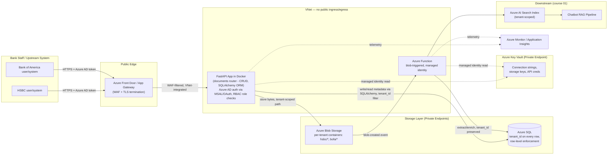

# 03 — Capco Document Uploader Service

> Resume bullet (verbatim): *"Document Uploader Service: Built and Implemented an end to end document
> uploader-ingest Azure App service with CRUD functionality."*

## Business Context

Course 01 in this curriculum covers the **AI Chatbot Assistant** — a Retrieval-Augmented Generation
(RAG) system that answers questions from an organization's internal knowledge base. RAG systems are
only as good as the documents behind them, and those documents don't appear in a vector index by
magic. Something has to accept a file from a human (or another system), validate it, store it
durably, record metadata about it (who uploaded it, when, what type, what status), and hand it off to
whatever pipeline chunks, embeds, and indexes it for retrieval.

That "something" is a **document uploader / ingest service** — exactly the shape of project this
resume bullet describes. It's the unglamorous, load-bearing plumbing that sits upstream of every
GenAI knowledge-base feature: no reliable ingestion path, no reliable RAG answers. Built at Capco for
banking clients **HSBC** and **Bank of America**, this service also had to satisfy constraints that
don't show up in a toy CRUD demo — auditability of who uploaded what, soft-deletion instead of
destructive deletes (compliance often requires a retention trail), secrets that never touch source
control, and a deployment model the bank's cloud governance team would approve.

## Client & Production Deployment

This service was built at Capco for two banking clients — **HSBC** and **Bank of America** — and,
like the AI Chatbot Assistant it feeds (course 01), it ran in **production, customer/client-facing**,
not as a pilot or a demo. In practice that meant bank staff and upstream systems uploaded real
documents against this service every business day, and "it works in a demo" wasn't the bar — the bar
was ingesting that daily document volume without hindrance, with the audit trail, soft-delete
behavior, and secrets hygiene a bank's cloud governance team would actually sign off on.

Because the same underlying codebase served two competing banking clients, **strict multi-tenant data
isolation** was a hard design constraint, not an afterthought: a document uploaded for HSBC must never
be readable, listable, or even queryable from a Bank of America session, and vice versa. That
isolation had to hold at every layer — blob storage, SQL rows, and API-level access control — not just
in the UI. Chapter 05 covers how that plays out in the SQL schema; the updated architecture diagram
below shows how it plays out in the network and storage topology.

## Candidate's Likely Role & Architecture

As the backend developer on this project, the candidate's responsibility was almost certainly the
**ingestion API and its supporting infrastructure** — not the downstream AI/RAG logic (that's course
01's territory), but the service that makes documents available to it in the first place:

- **REST API design** for uploading, listing, retrieving, updating, and deleting documents (the
  "CRUD functionality" called out explicitly in the bullet).
- **FastAPI** as the web framework — an ASGI framework with native async support, Pydantic-based
  request/response validation, automatic OpenAPI docs, and a dependency-injection system, a strong fit
  for a focused microservice whose endpoints spend most of their time waiting on I/O (blob storage,
  SQL, Key Vault, Graph API calls).
- **SQLAlchemy** as the ORM for the SQL data layer — declarative models, `Session`/`sessionmaker`,
  and Alembic-driven migrations, chosen over raw SQL cursor calls for maintainability and a reduced
  injection surface (see chapter 02 and chapter 05).
- **RBAC (Role-Based Access Control) enforced via MSAL and OAuth 2.0** against Azure AD/Entra ID —
  interactive callers authenticate via the Authorization Code flow with PKCE, service-to-service
  callers via the Client Credentials flow, and every endpoint validates the resulting Azure AD-issued
  JWT and checks its `roles` claim (Azure AD App Roles) before allowing the operation (see chapter 06).
- **Docker** to package the FastAPI app so it runs identically in dev, test, and prod, and so it can be
  deployed as a container to Azure.
- **Azure App Service** (Web App for Containers) as the hosting platform for the always-on REST API,
  likely paired with **Azure Functions** for event-driven follow-up work — e.g., a blob-triggered
  function that kicks off document processing the moment a file lands in storage, without the API
  itself blocking on that work.
- **Azure Key Vault** to hold connection strings, storage keys, and any downstream API credentials,
  accessed via managed identity rather than hard-coded secrets.
- **SQL** as the metadata store — one row per document, tracking filename, owner, upload timestamp,
  processing status, and soft-delete flags — separate from the actual file bytes, which live in blob
  storage.
- **Azure ML** and **Azure Cognitive Services** plausibly enter downstream of ingestion — e.g., Azure
  Cognitive Services' Document Intelligence (formerly Form Recognizer) for OCR/structure extraction
  on uploaded PDFs, or Azure ML for any custom enrichment model, before the content is handed to the
  chatbot's retrieval index.
- **Microsoft Graph API** plausibly used for org-directory lookups — resolving an uploader's identity,
  department, or permissions against Azure AD/Entra ID, so the service can enforce who's allowed to
  upload or view which documents.

> Everything above is a **typical/recommended architecture** for this class of project — it is not a
> verified description of Capco's internal implementation. Treat it as the story you tell in an
> interview, backed by the concepts in this course, not as a claim about proprietary systems.

## How This Service Feeds Course 01's Chatbot

Conceptually, this service is the **front door** to the knowledge base the AI Chatbot Assistant
(course 01) retrieves from:

```
Document Uploader Service (this course)  --->  Azure AI Search index  --->  Chatbot RAG pipeline (course 01)
   (accept, validate, store, track)             (chunk, embed, index)         (retrieve, ground, answer)
```

A user or system uploads a policy PDF through this service's `POST /documents` endpoint. Once stored
and marked "ready," a downstream indexing job (out of scope for this course, but referenced in the
architecture diagram below) picks it up, extracts text, chunks it, embeds it, and writes it into the
search index the chatbot queries. If this service is slow, unreliable, or loses metadata, the chatbot
answers from a stale or incomplete knowledge base — which is why treating this as "just a CRUD app" is
a mistake; it's the reliability foundation for everything built on top of it.

## Architecture Diagram

Production topology, as deployed for HSBC and Bank of America — note there is no path from the public
internet directly to the App Service, SQL, or Key Vault; everything downstream of Front Door sits
inside a VNet and talks to its dependencies over Private Endpoints, and every tenant-scoped box below
carries `tenant_id` (or a per-tenant container/schema) as a hard boundary, not a convention:



Plain-text version, if diagram rendering isn't available:

```
HSBC user/system  --\                                        Azure Front Door / App Gateway (WAF, TLS)
Bank of America   --> HTTPS -----------------------------------------------> |
  user/system     --/                                                         v
                                                  VNet-integrated FastAPI App (Docker, Azure App Service)
                                                        |-- CRUD: POST/GET/PUT/DELETE /documents
                                                        |      (Azure AD auth via MSAL/OAuth 2.0,
                                                        |       RBAC role check via FastAPI dependency)
                                                        |-- writes file bytes, tenant-scoped path
                                                        |      --> Azure Blob Storage (private endpoint;
                                                        |          per-tenant containers: hsbc/*, bofa/*)
                                                        |-- writes/reads metadata via SQLAlchemy ORM,
                                                        |      tenant_id filter
                                                        |      --> Azure SQL (private endpoint; tenant_id on
                                                        |          every row, enforced at query layer)
                                                        |-- reads secrets (managed identity)
                                                               --> Azure Key Vault (private endpoint)
Azure Blob Storage --(blob-created event)--> Azure Function (managed identity, VNet-integrated)
                                                --> enrich/extract, tenant_id preserved --> Azure SQL
                                                --> Azure AI Search Index (tenant-scoped) --> Chatbot (course 01)

No component above (App Service, Function, SQL, Key Vault) is reachable directly from the public
internet — only Front Door/App Gateway faces outside, everything else sits inside the VNet behind
Private Endpoints. Azure Monitor / Application Insights collects telemetry from the App Service and
Function throughout.
```

**Multi-tenant isolation, explicitly:** HSBC and Bank of America share the same service codebase and
the same Azure resources, but never the same data path. Blob storage uses per-tenant containers (or a
`tenant_id/`-prefixed path with container-level access policies, if stricter physical separation is
required), SQL enforces `tenant_id` on every row and every query at the repository layer (chapter 05),
and the authenticated caller's tenant is resolved from their Azure AD identity — never taken as a
client-supplied value — so a compromised or misconfigured request can't cross tenants by simply
changing a parameter.

## STAR Summary (practice this out loud, under 90 seconds)

> **Illustrative — replace with your real numbers before the interview.** The structure and
> reasoning are sound; the specific metric (e.g. "70% reduction in manual onboarding time") should be
> swapped for what you actually measured or a defensible estimate you're comfortable defending under
> follow-up questions.

**Situation.** Before this service existed, documents destined for the client's internal knowledge
base — the same knowledge base the AI Chatbot Assistant (course 01) retrieves answers from — were
being collected and organized manually: emailed attachments, shared-drive folders, no consistent
metadata, no audit trail of who uploaded what or when, and no reliable signal for downstream systems
about which documents were ready to be indexed.

**Task.** I was asked to design and build an end-to-end document uploader/ingest service with full
CRUD functionality — a REST API that could accept file uploads, store them reliably, track their
metadata and status, and make them discoverable to downstream processing, all deployed on the
client's approved Azure environment.

**Action.** I designed a REST API around a `documents` resource (multipart upload on `POST`, filtered
listing with pagination on `GET`, metadata updates on `PUT`/`PATCH`, soft-delete on `DELETE`), built
it with **FastAPI**, using its dependency-injection system for database sessions and auth/RBAC checks,
Pydantic models for request/response validation, and automatic OpenAPI docs for downstream client
integration. The data layer used **SQLAlchemy** as the ORM — declarative models, `Session`-scoped
transactions, and Alembic migrations — instead of raw SQL cursor calls, for maintainability and a
reduced injection surface. Every endpoint sat behind **RBAC enforced via MSAL and OAuth 2.0**: callers
authenticated against Azure AD (interactive users via Authorization Code + PKCE, service-to-service
callers via Client Credentials), and a FastAPI dependency validated the resulting JWT and checked its
Azure AD App Role claims before allowing the operation. I containerized the app with Docker using a
multi-stage build to keep the production image small, and deployed it to Azure App Service as a Web
App for Containers, with a separate Azure Function handling blob-triggered post-upload processing so
the upload request itself never blocked on slow downstream work. I moved every secret — SQL
connection string, storage account key — into Azure Key Vault, accessed via managed identity, and
designed the SQL schema for document metadata with proper indexes, audit columns (created_by,
created_at, updated_at), and a soft-delete flag so nothing was destructively removed.

**Result.** *(Illustrative)* The service cut manual document-onboarding time by roughly 70% and gave
the team a reliable, auditable pipeline feeding the chatbot's knowledge base — reducing the "why isn't
my document showing up in the assistant's answers" support burden to near zero, since every upload now
had a trackable status instead of disappearing into a shared folder.

## How This Course Is Organized

| File | Covers |
|---|---|
| `01-rest-api-design-and-crud-fundamentals.md` | REST principles, CRUD-to-HTTP mapping, pagination, versioning, upload-specific API design (multipart, async processing, idempotency keys) |
| `02-building-the-service-with-fastapi.md` | FastAPI fundamentals (path operations, Pydantic validation, dependency injection, async, OpenAPI docs), SQLAlchemy ORM fundamentals (declarative models, `Session`, relationships), a worked `Document` model + CRUD router |
| `03-containerizing-with-docker.md` | Docker fundamentals, layers/caching, multi-stage builds, a sample FastAPI/uvicorn Dockerfile, container registry/deployment basics |
| `04-azure-app-service-and-functions-deployment.md` | Azure App Service (slots, scaling, containers) vs Azure Functions (event-driven), and when to choose which |
| `05-secrets-management-with-key-vault-and-sql-integration.md` | Azure Key Vault (managed identity, rotation), SQL schema design for metadata (indexes, soft-delete, audit columns) expressed via SQLAlchemy ORM, Microsoft Graph API for org/permission lookups |
| `06-authentication-rbac-with-msal-and-oauth.md` | OAuth 2.0 (Authorization Code + PKCE, Client Credentials), OpenID Connect, MSAL token acquisition, JWT validation against Azure AD's JWKS, RBAC via Azure AD App Roles and a FastAPI `require_role` dependency |
| `99-Interview-QA.md` | Behavioral, technical, and system-design interview Q&A |
| `notebooks/` | Three runnable Jupyter notebooks: a FastAPI CRUD + RBAC demo, a SQLAlchemy data-layer demo, and a Docker/Azure deployment walkthrough |

Read in order — each chapter builds on the last, and the notebooks are meant to be run alongside the
chapter with the matching topic (notebook 1 with chapter 2, notebook 2 with chapter 5, notebook 3 with
chapters 3–4).

Before naming HSBC or Bank of America to an interviewer, check the confidentiality note in the root
[`README.md`](../README.md) — most engagements are covered by client-confidentiality clauses, and
"a top-3 global bank" is often the safer phrasing.
