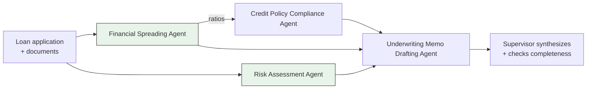
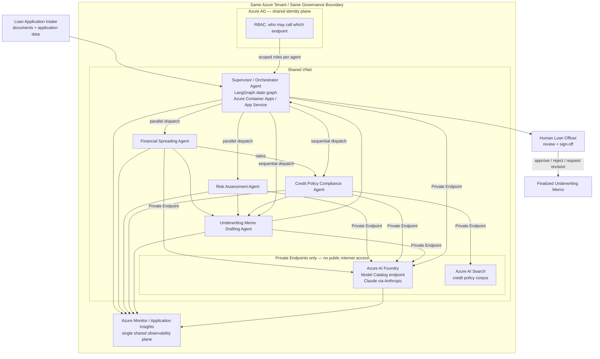

# 03 — Multi-Agent Credit Underwriting Assistant (Claude Research Project)

> Candidate's description (verbatim, lightly edited for clarity): *"A research-based project utilizing
> a Claude model rather than the enterprise model. Keep the project up to the same standard as before,
> discuss all the points as before, and prod deployment, data compliance, etc. as well. Use the same
> Azure environment."*
>
> This course started as a research-only evaluation of Claude against the enterprise Azure OpenAI
> baseline. Since then, at the candidate's request, it has been raised to a full **industry-level,
> production** engagement — a real Capco client deliverable, at the same tier as courses 1 and 2. It's
> now built around a task shape neither of those courses covers: **agentic AI, where multiple cooperating
> agents work together**, instead of a single model answering in one call. Everything the original
> research framing got right — about governance, vendor risk, and version discipline — is still true and
> still covered below. What changed is the system itself, and what it's for.

## A correction to make early, and confidently — still needed, still real

In an earlier pass, the candidate's own description of this project called it an evaluation of an
**"open source Claude model."** That's worth catching and fixing before anything else in this course —
the same way course 5 catches and fixes a misremembered client/system name right at the start. Better to
correct it once, cleanly, than to repeat the error across nine files and then again in an interview.

**Anthropic's Claude models are proprietary and closed-weight.** In plain terms: you cannot download
Claude's model weights and run them on your own hardware. That's genuinely possible with an open-weight
model, such as Meta's LLaMA — course 11 covers a real open-weight LLaMA 3 deployment, worth reading side
by side with this course for the contrast. Chapter 8 of this course goes further, contrasting Claude's
undisclosed architecture against the genuinely published architectures covered in courses 11, 13, and 14.

Claude is available only through **hosted API access** — either directly from Anthropic, or through a
cloud marketplace, including **Azure AI Foundry's model catalog**. There is no version of "self-host
Claude in our own datacenter," at any tier. That's exactly as true for a production multi-agent system as
it was for the original research pilot.

The accurate way to describe this project — and the sentence worth having ready, verbatim, in an
interview — is:

> *"A production multi-agent credit underwriting system that calls Claude — accessed via Azure AI
> Foundry's model catalog, within the same Azure tenant as our enterprise Azure OpenAI deployment, not
> an open-source model — as the reasoning backbone for a five-agent orchestration layer, chosen
> specifically because the task shape (multi-step, multi-agent coordination) plays to Claude's
> publicly-announced agentic strengths."*

That correction also explains most of the Azure product landscape this course depends on. There's a real
technical difference between two Azure products:

- **Azure OpenAI Service** — serves OpenAI models only, full stop. That's not a configuration option
  someone forgot to enable; it's an architectural fact about the product.
- **Azure AI Foundry** (formerly Azure AI Studio) — its **Model Catalog** is a broader, multi-vendor
  catalog. It includes Claude (via Anthropic), Meta's Llama family, Mistral, and others.

So "the same Azure environment" is achieved through Azure AI Foundry, not through Azure OpenAI Service —
because Azure OpenAI Service architecturally cannot be the thing that serves Claude. Chapter 1 goes deep
on this distinction.

## What kind of project this is now

Courses 1, 2, and 4–11 in this curriculum are **client-delivery** engagements: systems built for a
paying client, under that client's compliance requirements, that went live serving real users. This
course is now that too — a production Capco deliverable for the same banking-client context as this
curriculum's other Capco courses (HSBC/Bank of America; see the root [`README.md`](../README.md)'s
Client & Production Context section for the full framing and the confidentiality note on naming real
clients in an interview).

What makes this course structurally different from courses 1 and 2 isn't its production status anymore —
it's the **task shape**.

- Course 1 is a single-turn conversational RAG chatbot: one user question, one retrieval pass, one model
  call, one answer.
- Course 2 is single-shot structured document generation: one case, one retrieval pass across three
  source types, one model call that drafts a structured, cited narrative.
- This course is neither. **Commercial loan underwriting doesn't decompose into one retrieval pass and
  one generation call.** It genuinely needs several distinct kinds of analysis: spreading a borrower's
  financials into ratios, checking those ratios and the borrower's profile against a written credit
  policy, scoring external risk factors, and synthesizing all of it into a defensible written
  recommendation. Those four jobs benefit from being handled by separate, specialized agents rather than
  one enormous prompt asking a single model to do everything in one call.

That's the premise this course tests. It's also why the backbone model choice matters differently here
than it did for a chatbot or a document generator — see Chapter 8 and "Why Claude, specifically, for
this system," below.

## The system: Multi-Agent Credit Underwriting Assistant

A five-agent system — four specialist agents plus a supervisor/orchestrator — that speeds up commercial
loan underwriting by dividing the work the way a real underwriting team would, rather than asking one
model to hold the entire task in its head at once.

A human loan officer remains the final decision-maker on every case. The system produces a **draft
recommendation**, never an autonomous underwriting decision.

| # | Agent | Role |
|---|---|---|
| 1 | **Financial Spreading Agent** | Extracts and normalizes financial statement data (income statement, balance sheet) from submitted loan documents into structured ratios, using tool calls to a document-parsing/extraction function — conceptually the same structured-tool pattern as course 2's `get_kyc_profile`-style tools (course 2, Chapter 2); not re-explained here. |
| 2 | **Credit Policy Compliance Agent** | RAG over the bank's credit policy corpus via Azure AI Search — the same retrieval pattern courses 1 and 2 already use — checking the applicant against policy thresholds and covenant requirements. |
| 3 | **Risk Assessment Agent** | Synthesizes external risk signals (industry risk category, macro factors) with the financial ratios produced by the Financial Spreading Agent into a risk score. |
| 4 | **Underwriting Memo Drafting Agent** | Synthesizes the other three agents' outputs into a structured, per-claim-cited underwriting memo — directly reuses course 2's structured-output + citation-grounding pattern (Pydantic schema, per-claim citations; course 2, Chapter 3) rather than reinventing it. |
| 5 | **Supervisor/Orchestrator Agent** | Coordinates agents 1–4: decides routing and sequencing, runs independent steps in parallel, decides when enough information has been gathered, and escalates ambiguous or incomplete cases back to a human loan officer rather than guessing. |
| — | **Human loan officer sign-off** | Not an agent — the mandatory human-in-the-loop gate, the same pattern established across this curriculum (course 2's compliance officer, course 11's regulatory reviewer). The Supervisor Agent's output is a draft recommendation; a human loan officer must approve it before it becomes an underwriting decision. |

Two of the four specialist agents don't need anything from each other, so they can run at the same time:
the **Financial Spreading Agent** and the **Risk Assessment Agent** can both start as soon as the loan
application and supporting documents are available.

The other two are sequentially dependent:

- The **Credit Policy Compliance Agent** needs the Financial Spreading Agent's ratios before it can check
  them against policy thresholds.
- The **Underwriting Memo Drafting Agent** needs all three other agents' outputs before it can draft
  anything.

The Supervisor Agent is what actually knows and enforces this dependency graph. See
`notebooks/05_multi_agent_supervisor_routing_demo.ipynb` for a runnable demonstration of exactly this
parallel/sequential split.


*Financial Spreading and Risk Assessment (shaded) have no dependency on each other and run in parallel.
Compliance and Memo Drafting must wait for their inputs and run sequentially.*

## Why multiple agents instead of one well-prompted model

Here's the honest, defensible reason — the one to give if an interviewer pushes on "couldn't you just
write one really good prompt?"

A single model call asked to spread financials, check policy, assess risk, *and* draft a cited memo — all
in one pass — has to hold all four jobs in its attention at the same time, with a single, undifferentiated
context window mixing four different kinds of source material. That's exactly the shape of task where
task-specific specialization pays off. A Financial Spreading Agent's system prompt and tool access can be
tuned purely for extraction accuracy, without competing for attention against a completely different task
like policy-threshold checking.

Splitting the work into agents also buys real architectural benefits, covered in depth in Chapter 7:

- **Independent agents can fail independently.** A Risk Assessment Agent outage doesn't have to take down
  the whole pipeline.
- **Independent agents can run in parallel** where their outputs don't depend on each other.
- **A supervisor with an explicit escalation path can recognize "I don't have enough to proceed"** and
  route to a human — rather than a single model silently doing its best across four jobs it was never
  given room to think through separately.

## Why Claude, specifically, for this system

This is the connective tissue between Chapter 8 and this project, and it's worth making the argument
explicitly rather than just asserting it.

Chapter 8 is deliberately honest that Claude's *internal architecture* is undisclosed — that's not
something this course can use as a reason to prefer Claude. What Chapter 8 *does* establish, because both
are genuinely, publicly announced by Anthropic, are two real, documented capability investments:

- **Extended thinking** — careful, allocatable inference-time reasoning.
- **Computer use** — agentic, tool-driven interaction with software.

These sit on top of the tool-use/function-calling support both major vendors already provide.
**Multi-agent orchestration is precisely the task shape where those specific, documented strengths are
most relevant.** A Supervisor Agent deciding whether enough information has been gathered, or a Financial
Spreading Agent reasoning through an ambiguous line item before calling a tool — both are exactly the
kind of careful, multi-step, tool-mediated reasoning those announced capabilities target.

Contrast this with courses 1 and 2: a single-turn chatbot (course 1) and a single-shot structured
generator (course 2) are tasks where GPT-4/Azure OpenAI was the enterprise-standard, uncontroversial
default. No particular agentic capability was being tested by choosing one vendor over another in either
case.

This course's original premise — "let's evaluate Claude as an alternative to our enterprise GPT
deployment" — is now sharper than a generic vendor bake-off. It's **"let's evaluate Claude specifically
for the task shape — multi-agent orchestration — where its publicly-known strengths are most
relevant."** That's a defensible engineering argument, not a preference.

## Architecture: same governance, new backend, new task shape

Here's the single design principle worth internalizing before the diagram: **production doesn't mean a
lower security bar just because the backend is new.**

The Claude backend for this system lives inside the exact same Azure tenant, the exact same VNet, and is
gated by the exact same Azure AD/RBAC model as the production Azure OpenAI deployments already serving
course 1 and course 2. What's new is the model backend and the orchestration layer sitting in front of
it — not the network boundary, not the identity plane, not the observability plane, and critically, not
the human-sign-off requirement that governs every other GenAI system in this curriculum's banking
courses.



Plain-text version, if diagram rendering isn't available:

```
Loan application intake (documents + application data)
  --> Supervisor / Orchestrator Agent (LangGraph state graph, hosted on Azure Container Apps
      or App Service, same Azure tenant/VNet/Azure AD/Azure Monitor as courses 1 and 2)

Supervisor dispatches:
  - IN PARALLEL (no data dependency between them):
      -> Financial Spreading Agent   --[Private Endpoint]--> Azure AI Foundry (Claude)
      -> Risk Assessment Agent       --[Private Endpoint]--> Azure AI Foundry (Claude)
  - SEQUENTIALLY, once dependencies are satisfied:
      -> Credit Policy Compliance Agent (needs Financial Spreading Agent's ratios)
                                      --[Private Endpoint]--> Azure AI Foundry (Claude)
                                      --[Private Endpoint]--> Azure AI Search (credit policy corpus)
      -> Underwriting Memo Drafting Agent (needs all three other agents' outputs)
                                      --[Private Endpoint]--> Azure AI Foundry (Claude)

Underwriting Memo Drafting Agent --> Supervisor (synthesizes, checks completeness)
Supervisor --> Human Loan Officer (review + sign-off; DRAFT recommendation only)
Human Loan Officer --approve/reject/revise--> Finalized Underwriting Memo

Every agent, and the Supervisor itself, reports into the SAME Azure Monitor / Application Insights
instance the rest of this curriculum already uses — one observability plane, five agents, one
model backend, all inside the same Private-Endpoint-gated, Azure-AD-governed VNet as the production
Azure OpenAI deployments serving course 1 and course 2.
```

Here's the point encoded in that diagram, stated directly: standing up a five-agent orchestration layer
did **not** mean standing up a separate, lighter-weight environment "because it's agentic and new." It
meant adding one Azure AI Foundry endpoint and one orchestrator application (the LangGraph state graph,
described in depth in Chapter 4 alongside course 8's LangGraph fundamentals chapter) inside infrastructure
that already existed. Chapter 4 covers this production deployment — how the orchestrator was actually
hosted, and how the rollout to real loan applications was staged — in depth.

## STAR Summary (illustrative — practice out loud, under 90 seconds)

> **Illustrative, clearly labeled as such.** No specific underwriting deployment was given beyond "a
> multi-agent project using Claude" — this STAR is a defensible answer skeleton built around the system
> described above, not a claim of verbatim recall. Swap in real detail if your actual project differed.

**Situation.** Capco's banking GenAI practice had already shipped two production systems on Azure
OpenAI's GPT models: a conversational RAG chatbot (course 1) and a single-shot structured document
generator for AML alert investigation (course 2). Commercial loan underwriting was the next candidate
workflow for GenAI acceleration, but it didn't fit either existing pattern — it required several
distinct kinds of analysis (financial spreading, policy compliance, risk scoring) converging into one
defensible recommendation, a task shape better served by multiple cooperating agents than by a single
model call.

**Task.** I was asked to design and deliver a production Multi-Agent Credit Underwriting Assistant,
using Claude as the reasoning backbone for the agent orchestration layer specifically because its
publicly-announced strengths in extended reasoning, tool use, and agentic task execution were most
relevant to this task shape — not as a generic "try a different vendor" exercise — and to do so inside
the same Azure governance boundary, with the same human-loan-officer sign-off discipline, already
established across this curriculum's banking work.

**Action.** I corrected the same recurring miscommunication that Claude is an "open-source model" —
it's closed-weight, API-only — and designed a five-agent system: a Financial Spreading Agent and a Risk
Assessment Agent that run in parallel with no data dependency on each other; a Credit Policy Compliance
Agent and an Underwriting Memo Drafting Agent that run sequentially because each depends on an earlier
agent's output; and a Supervisor/Orchestrator Agent, built as a LangGraph state graph (building on
course 8's LangGraph fundamentals, applied here to this specific roster), that routes work, decides
when enough information has been gathered, and escalates ambiguous or incomplete cases to a human loan
officer rather than guessing. I deployed the orchestrator on Azure — Container Apps, alongside the
existing App Service deployments — behind the same Private Endpoints, Azure AD/RBAC, and Azure Monitor
setup as courses 1 and 2, with each specialist agent calling Claude via Azure AI Foundry, and the
Compliance Agent additionally retrieving from the bank's credit policy corpus via Azure AI Search. I
kept the human-in-the-loop requirement absolute: the Supervisor's output is always a draft
recommendation, never an autonomous decision, and a loan officer must approve, reject, or request
revision before anything becomes a real underwriting decision. I also built the multi-agent-specific
resilience this course's original version didn't need — failure isolation between agents, and a hard
step-count ceiling after a routing bug caused the Supervisor to re-invoke the Compliance Agent
repeatedly without making progress (Chapter 7 has the full incident writeup).

**Result.** *(Illustrative)* The system materially reduced average time-to-draft-recommendation on
commercial loan applications versus the fully manual underwriting process, with loan officers approving
the majority of drafted memos with only minor edits — while every recommendation still passed through
mandatory human sign-off, and the multi-agent-specific cost/latency overhead (roughly five agent calls
instead of one) stayed within a range the practice considered acceptable given the parallelization and
failure-isolation work.

## How This Course Is Organized

| File | Covers |
|---|---|
| `01-claude-vs-gpt-model-landscape-and-azure-ai-foundry.md` | Azure OpenAI Service vs. Azure AI Foundry Model Catalog in depth; Messages API vs. Chat Completions API shape; Claude's model tiers conceptually; why "open source" is the wrong term, contrasted with course 11's real open-weight LLaMA deployment |
| `02-agentic-evaluation-and-multi-agent-task-completion.md` | Evaluating Claude specifically for agentic/tool-use reliability and multi-step task completion — did the Supervisor route correctly, did each agent call its tools correctly, did the final memo incorporate all four agents' outputs — building on course 4's Ragas-style methodology, now applied to agent-task-completion metrics |
| `03-long-context-synthesis-and-when-context-window-matters.md` | Context-window mechanics for a multi-agent system: financial data, retrieved policy text, and risk factors from three upstream agents all have to fit in the Memo Drafting Agent's context, and shared state passed between agents needs the same context-budget discipline as a single long document |
| `04-production-deployment-of-the-multi-agent-system-in-the-same-azure-environment.md` | Production deployment of the multi-agent orchestrator: the LangGraph app hosted on Azure, calling Claude via Azure AI Foundry, behind the same VNet/Private Endpoint/Azure AD boundary as the rest of the Capco banking courses; how the rollout to real loan applications was staged |
| `05-data-compliance-and-vendor-risk-considerations.md` | Anthropic as a third-party vendor, vendor risk assessment as a real gate, why the system's earliest phase ran on synthetic/de-identified data, data processing agreements and no-training-on-customer-data guarantees, data residency |
| `06-model-version-pinning-and-production-reliability.md` | What happens when a vendor silently ships a new model version behind an unpinned endpoint in a *production* system — the same staleness/versioning discipline as before, now framed around production reproducibility rather than research validity |
| `07-production-resilience-and-operational-engineering.md` | Multi-agent-specific resilience: agent failure isolation, runaway-agent/infinite-loop protection, the cost/latency implications of a five-agent call chain, and a bug found and fixed in the Supervisor's routing logic |
| `08-claude-architecture-vs-gpt4-architecture.md` | What's actually known vs. undisclosed about Claude's and GPT-4's architecture; Constitutional AI vs. RLHF; context-window emphasis; extended thinking vs. OpenAI's separate reasoning-model line; computer use, and why it's directly relevant to choosing Claude for this multi-agent system; how to answer "what's the architectural difference" without overclaiming |
| `99-Interview-QA.md` | Behavioral, technical, system-design, and "what would you change" Q&A — leads with the multi-agent underwriting STAR, keeps the open-source correction, data-compliance, and version-pinning questions, adds multi-agent-specific questions |
| `notebooks/` | Six runnable Jupyter notebooks, fully offline, mock clients throughout — four covering evaluation/context/rollout/versioning, two new ones covering the Supervisor's parallel/sequential routing and runaway-agent protection |

Read in order — each chapter builds on the last, and the notebooks are meant to be run alongside the
chapter with the matching concept.

## A note on how to talk about this project honestly

Everything in this course, past two specific points, is a plausible, technically detailed, clearly
labeled illustrative reconstruction — exactly like every other course in this curriculum that isn't
backed by real recovered source (see course 5's note on that exception). Those two points are:

1. The Azure OpenAI-vs-Azure-AI-Foundry technical distinction, and
2. The "Claude is not open source" correction.

Both of those are real, confirmed facts, stated plainly rather than hedged. Everything past them —
specific numbers, the exact agent roster behavior, the precise rollout outcome — should be treated as a
defensible story to tell, not a verified transcript. Say so if an interviewer presses for detail you
don't actually have. "Here's the architecture and process I'd defend" is a stronger answer than a
suspiciously too-perfect memory of a multi-agent system's internal numbers.

---

Note: this course describes a Capco banking-client production deployment, in the same HSBC/Bank of
America client context as courses 1 and 2 (see the root [`README.md`](../README.md)'s Client &
Production Context section). Before naming that client by name to an interviewer, check what your
actual NDA/engagement letter allows — the root README's confidentiality note applies here exactly as it
does to every other Capco course in this curriculum.
