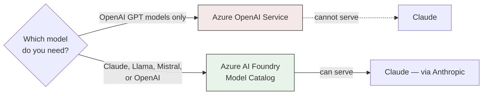

# 01 — Claude vs. GPT: Model Landscape and Azure AI Foundry

> **Confidence check.** This chapter's core distinction — Azure OpenAI Service vs. Azure AI Foundry, and
> "Claude is not open source" — is a confirmed, real fact, stated plainly rather than hedged. It's one of
> only two things in this whole course that carries that status (the other is the open-source correction
> in `00-README.md`). Everything in the later chapters is a labeled, illustrative reconstruction built on
> top of this real foundation — see `00-README.md`'s closing note for the full framing.

## The distinction this whole course rests on

Two Azure products get confused constantly — even by experienced engineers — because their names sound
similar and both involve "calling an LLM from Azure." Getting this exactly right is the single most
important thing to take from this chapter.

| | **Azure OpenAI Service** | **Azure AI Foundry (formerly Azure AI Studio) — Model Catalog** |
|---|---|---|
| **What models it serves** | OpenAI models only — GPT-4-class, GPT-3.5-class, embeddings, DALL-E. Full stop. | A broad, multi-vendor catalog: OpenAI models, **Claude (via Anthropic)**, Meta's Llama family, Mistral, Cohere, and others, alongside first-party Azure models |
| **Why the restriction exists** | It's a dedicated product built specifically around Microsoft's partnership with OpenAI — the product's entire reason to exist is "OpenAI models, but inside Azure's compliance boundary" | It's Azure's general-purpose model marketplace and MLOps platform — model-agnostic by design, with per-vendor deployment options (managed compute, serverless/pay-as-you-go, or a partner-hosted endpoint) |
| **Can it serve Claude?** | **No — architecturally, not as a configuration option.** There's no setting, SKU, or support ticket that gets Claude running under Azure OpenAI Service. It's not the product's job. | **Yes.** Anthropic is one of the model providers listed in the Foundry Model Catalog. |
| **API shape** | OpenAI's Chat Completions-style request/response envelope | Depends on the model's native API — a Claude deployment through Foundry is reached with Anthropic's own Messages API shape, not OpenAI's |

The one-sentence version, worth having ready verbatim:

> **Azure OpenAI Service is a single-vendor product. Azure AI Foundry's Model Catalog is a multi-vendor
> marketplace that happens to include OpenAI alongside everyone else, including Anthropic.**

If a request needs to reach Claude "in the same Azure environment" as an existing Azure OpenAI
deployment, Azure AI Foundry is the only correct target. It is not a hidden Azure OpenAI feature you
haven't found yet, and it is not a reason to go outside Azure at all.



This is also why the architecture diagram in this course's `00-README.md` shows two separate
Private-Endpoint-gated resources living side by side in the same VNet:

- Azure OpenAI Service — unchanged, still serving course 1/2 production traffic.
- A new Azure AI Foundry endpoint — the Claude backend that every agent in the multi-agent underwriting
  system calls.

They are genuinely two different Azure resource types, each with its own deployment lifecycle, even
though both sit inside the same tenant, same governance boundary, and same Azure Monitor instance. No
single resource serves both.

## API shape: Messages API vs. Chat Completions API

Beyond "which vendor," the two APIs are shaped differently enough that swapping a backend is a real code
change, not a config flag. A minimal example of each, side by side, makes the difference concrete.

**Azure OpenAI — Chat Completions-shaped request:**

```python
import openai

client = openai.AzureOpenAI(
    azure_endpoint="https://<resource>.openai.azure.com/",
    api_key=AZURE_OPENAI_KEY,
    api_version="2024-06-01",
)

response = client.chat.completions.create(
    model="gpt-4o-deployment",  # the Azure *deployment name*, not a bare model ID
    messages=[
        {"role": "system", "content": "You are a case-narrative drafting assistant."},
        {"role": "user", "content": "Summarize this customer's prior case notes."},
    ],
    max_tokens=1024,
    temperature=0.2,
)

text = response.choices[0].message.content
```

**Claude via Azure AI Foundry — Messages API-shaped request:**

```python
from anthropic import AnthropicFoundry

client = AnthropicFoundry(
    api_key=FOUNDRY_API_KEY,
    resource="<foundry-resource-name>",
)

response = client.messages.create(
    model="claude-sonnet-5",
    system="You are a case-narrative drafting assistant.",
    messages=[
        {"role": "user", "content": "Summarize this customer's prior case notes."},
    ],
    max_tokens=1024,
)

text = next(block.text for block in response.content if block.type == "text")
```

A few concrete differences are worth naming explicitly, because each one is a real place where a naive
"just swap the model name" migration breaks:

- **System-message handling.** Chat Completions treats `system` as just another entry in the `messages`
  array, with `role: "system"`. The Messages API pulls `system` out into its own top-level parameter,
  separate from `messages` — which itself only accepts `user`/`assistant` turns (plus, on some newer
  Claude models, a narrowly-scoped `system`-role message injected mid-conversation for operator
  instructions — still not the same mechanism as OpenAI's system message). Code that builds a `messages`
  list generically across both providers has to branch on this.
- **Response envelope.** Chat Completions returns `response.choices[0].message.content` as a plain
  string. The Messages API returns `response.content` as a **list of typed content blocks** (`text`,
  `tool_use`, `thinking`, and others) — you filter for the block type you want, rather than reading one
  fixed string field. This is a real, structural difference, not a cosmetic one: a Claude response can
  legitimately contain multiple blocks in one turn (for example, a reasoning block followed by a text
  block), and code written assuming "the response is always exactly one string" breaks silently the
  first time that shape shows up.
- **Token accounting.** Both APIs report token usage, but the two vendors tokenize text differently —
  the same input string produces a different token count on GPT than on Claude. This isn't a detail to
  skip past: Chapter 7 walks through a real category of bug where a comparison harness applied one
  vendor's token-counting logic to both models' outputs, silently invalidating a cost comparison. Always
  use each vendor's own token-counting endpoint (`client.messages.count_tokens` for Claude), rather than
  a shared or estimated count.
- **Auth.** Azure OpenAI Service authenticates with an Azure-issued API key or Azure AD token against
  the Azure resource. A Claude deployment through Azure AI Foundry authenticates against the Foundry
  resource, using Foundry-issued credentials — still inside Azure's identity plane, still reachable via
  Azure AD-gated access as covered in Chapter 4, but a distinct credential from the Azure OpenAI key.

None of this is exotic engineering. An orchestration layer that needs to call Claude from five different
agents (and, potentially, Azure OpenAI as a fallback or comparison baseline) just needs a small adapter
layer. That adapter normalizes the two APIs' request/response shapes into one internal representation
before any agent's own logic ever sees it.

The point worth internalizing: "the same Azure environment" describes the *network and governance*
layer, not the *API contract*. Those are two independent facts, and conflating them is exactly the kind
of gap that turns into a production bug the first time someone assumes a drop-in replacement.

## Claude's model family, conceptually

Anthropic ships Claude in tiers — similar in spirit to how OpenAI ships GPT-4o alongside GPT-4o-mini:

- A fast, cost-efficient tier for high-volume or latency-sensitive work.
- A frontier, most-capable tier for the hardest reasoning and synthesis tasks.
- One or more balanced tiers in between, trading some capability for meaningfully lower cost and latency.

Anthropic's naming for these tiers at any given point in time (Haiku for the fast tier, Sonnet for the
balanced tier, Opus for the frontier tier, as of this writing) is worth knowing conceptually. But
**don't over-anchor an interview answer to a specific version number** — model lineups get revised on a
cadence faster than most interview-prep material gets updated. The durable, defensible point is the
*shape* of the tradeoff (cost/latency vs. capability), not which exact version was current when this
course was written.

For a multi-agent system, that tiering shape is directly usable:

- A Supervisor Agent making routing and completeness judgments, and an Underwriting Memo Drafting Agent
  synthesizing four other agents' outputs into a cited recommendation, are exactly the kind of
  careful-reasoning work the balanced-or-above tier is built for.
- A narrower, more mechanical step — the Financial Spreading Agent's structured extraction, for
  instance — is a plausible candidate for the faster, cheaper tier, if per-agent evaluation later
  justifies splitting the roster across tiers.

Nothing about the multi-agent architecture requires every agent to run on the same tier. That's a real
cost lever worth naming, even though this course's illustrative system runs a single tier throughout for
simplicity.

## Why "open source" is the wrong term — the real axis is self-hostable vs. API-only

"Open source" (or "open weight," the more precise term for a model specifically) means you can download
the trained parameters and run them on infrastructure you control — inspect them, quantize them,
fine-tune them directly, serve them with your own stack.

**Claude is never available that way, at any tier, from any channel** — not directly from Anthropic, not
through Azure AI Foundry, not through any other marketplace. Every access path to Claude is a hosted API
call: you send a request over the network to infrastructure Anthropic (or a marketplace reselling
Anthropic's hosted service) operates, and you get a response back. You never receive the weights.

Course 11 covers a genuinely open-weight model — Meta's LLaMA 3 — deployed for a real pharma platform.
The contrast is worth reading side by side with this course, because it shows what "open weight" actually
buys an engineering team that "API-only" categorically cannot. Course 11's platform ran a fine-tuned
LLaMA 3 checkpoint on a **Sagemaker real-time endpoint the platform's own team controlled**, with full
access to the model's parameters for LoRA fine-tuning and quantization decisions made against the
platform's own GPU budget.

None of that is available for Claude, under any circumstance. You can prompt it, and — depending on the
offering — you can fine-tune it through a provider-hosted API surface on the provider's terms. But you
cannot take Claude's weights and run them yourself.

That is the real axis: **self-hostable vs. API-only**, not some loose, informally-used "open" vs.
"closed" distinction. A model being expensive, being widely used, or being available through multiple
cloud marketplaces (as Claude is, through both Azure AI Foundry and other channels) says nothing about
whether it's open-weight. Those are independent facts — and conflating them is exactly the mistake this
chapter opened by correcting.

## Tying it back

The practical takeaway for this project: reaching Claude from inside the existing Azure environment
required three things.

1. Standing up a new Azure AI Foundry resource — a genuinely different Azure product from Azure OpenAI
   Service, not a hidden setting inside it.
2. Writing an adapter layer to reconcile the Messages API's request/response shape against the existing
   Chat Completions-based code from courses 1 and 2.
3. Being precise, especially with a compliance-minded audience, that "available through Azure" and "open
   source" are two completely unrelated properties of a model.

Getting this distinction right early is also what unlocks the more interesting question this course
actually spends most of its time on: whether a five-agent orchestration layer built on Claude actually
improves underwriting turnaround and quality over what a single-model system could do (Chapters 2 and 7),
and why Claude specifically is a defensible backbone choice for that agentic task shape (Chapter 8) —
without either question getting derailed by a factual correction partway through the conversation.
