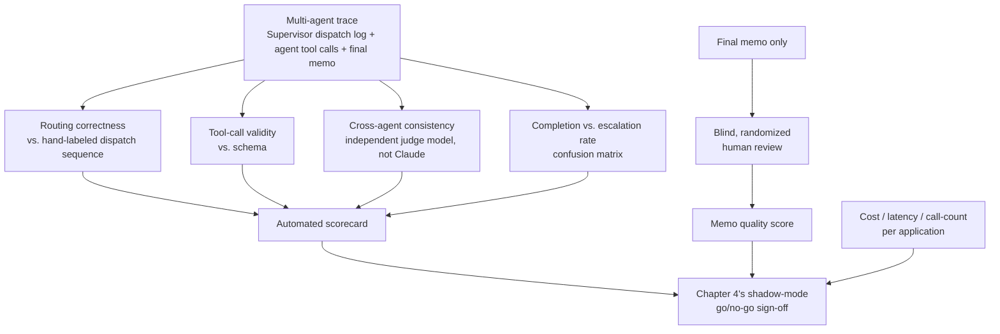

# 02 — Evaluating Claude for Agentic Reliability and Multi-Agent Task Completion

## Why "the agents seemed to work" isn't an evaluation result

Here's the single biggest failure mode for a project like this: producing an outcome that can't survive
a skeptical follow-up question.

"We ran the five-agent pipeline on a few loan applications and the memos looked reasonable" is an
anecdote, not a finding. It says nothing about:

- Whether the Supervisor actually routed correctly on the cases that needed it.
- Whether each specialist agent called its tools with valid inputs.
- Whether the final memo actually incorporated all three upstream agents' outputs, rather than silently
  dropping one.

A defensible evaluation for this system has to measure the thing that's actually new and risky about
it — **not narrative quality in isolation, the way course 2's single-shot generator needs, but whether
the orchestration itself (the routing, the tool calls, the handoffs between agents) behaved correctly.**
That's a different measurement problem from "is this a good sentence," and it's what this chapter is
actually about.

## What changed from a single-model comparison to an agentic-reliability evaluation

The original version of this course framed evaluation as a side-by-side comparison of two vendors'
output quality on one synthesis task. That's a reasonable design for a single model call, and it's still
the right shape for evaluating, say, the Underwriting Memo Drafting Agent's prose quality in isolation.

But a multi-agent system introduces failure modes a single-model comparison never has to catch, because
there's no orchestration layer in a single call to get wrong. Here are three concrete, agentic-specific
questions this evaluation has to answer that a narrative-quality comparison alone would miss:

1. **Did the Supervisor route correctly?** Given a loan application, did it correctly identify that the
   Financial Spreading Agent and Risk Assessment Agent could run in parallel, and that the Compliance
   Agent and Memo Drafting Agent had to wait for their dependencies? Did it correctly recognize the
   handful of cases in the evaluation set deliberately built to be ambiguous or incomplete, and escalate
   those to a human loan officer rather than guessing?
2. **Did each specialist agent call its tools correctly?** Did the Financial Spreading Agent's
   document-extraction tool calls use valid, well-formed inputs against the source documents it was
   given? Did the Compliance Agent's Azure AI Search queries actually retrieve the relevant policy
   sections, rather than an unrelated part of the corpus?
3. **Did the final memo actually incorporate all three upstream agents' outputs?** A memo that reads
   fluently but silently drops the Risk Assessment Agent's score, or contradicts a ratio the Financial
   Spreading Agent computed, is a coordination failure a narrative-fluency check alone would never
   catch. The prose can be excellent, and the coordination can still be broken.

## Automated evaluation: apply course 4's methodology, retargeted at agent-task-completion metrics

Course 4 ([04-Capco-Model-Risk-Monitoring](../04-Capco-Model-Risk-Monitoring/00-README.md)) built the
underlying metric taxonomy this project still needs. That's the Ragas-style pattern: decompose an output
into checkable claims, and score each one against a ground truth or a retrieved source, rather than
grading a whole answer holistically. That course's Chapter 2 covers Ragas in depth; this chapter doesn't
re-derive it.

What's genuinely new here is *what the claims being checked actually are*. It's not "is this sentence
faithful to the retrieved context" — it's a set of **agent-task-completion metrics** that treat the
multi-agent trace itself as the object being scored, not just the final text:

| Metric | What it checks | How it's computed |
|---|---|---|
| **Routing correctness** | Did the Supervisor dispatch the right agents, in the right order, for this case? Did it escalate the cases in the evaluation set deliberately built to require human escalation? | Compare the Supervisor's actual dispatch sequence against a hand-labeled expected sequence per evaluation case (analogous to a ground-truth label in a classification eval) |
| **Tool-call validity** | Did each agent's tool calls parse as well-formed, in-schema requests, and did they return non-error results? | Log every tool call each agent makes and its result; score the fraction that were well-formed and succeeded, per agent |
| **Cross-agent consistency** | Does the final memo's numbers and claims match what the upstream agents actually produced — no silently dropped risk score, no contradicted ratio? | For each upstream agent's output, check whether the corresponding fact appears, consistently, in the final memo — the same claim-decomposition-and-check pattern Ragas uses for faithfulness, applied across agent boundaries instead of within one context window |
| **Completion vs. escalation rate** | Of the cases that should complete end-to-end and the cases that should escalate to a human, how many did the system correctly classify? | A confusion matrix over the hand-labeled evaluation set: correctly completed, correctly escalated, incorrectly completed (should have escalated), incorrectly escalated (should have completed) |

There's one methodological trap worth naming explicitly, carried over unchanged from this project's
original framing: **don't let the judge model be the same model producing the outputs it's judging.** If
the model scoring cross-agent consistency is itself Claude — the same model every agent in the system
runs on — the evaluation is structurally biased toward whatever Claude's own notion of "consistent"
happens to be. Use a third, independent judge model, or a human-reviewed subset as ground truth for the
automated scorer's own calibration, exactly as course 4 Chapter 4 recommends.

## What still needs a blind human review — and what doesn't

Not every dimension in the table above needs a human reviewer. Routing correctness and tool-call
validity are checkable mechanically, against a ground-truth dispatch sequence and a schema, with no
subjective judgment involved.

What still needs the blind, human-reviewed evaluation design this project has always used is the
**final memo's quality as a document a loan officer would actually sign off on** — readability, whether
the Recommendation section actually follows from the evidence the memo cites, whether a reviewer would
feel comfortable approving it with only minor edits. That's the same design as before, retargeted at the
memo instead of the AML narrative:

- **Anonymize before showing anything to a reviewer.** Every memo a loan officer reviewer sees is
  labeled "System A" or "System B," never "the multi-agent Claude system" or "the single-call baseline,"
  with the mapping randomized per case and held outside the reviewer's view until scoring is complete.
- **Randomize presentation order per case**, not just the label.
- **Score against a fixed rubric** tied to the memo's own structure: does the Financial Summary section
  accurately reflect the computed ratios, does the Compliance section correctly cite the specific policy
  threshold it's checking against, does the Recommendation follow from the evidence presented — plus an
  overall "would you sign this off with minimal editing" score.
- **Use enough reviewers and enough cases** to say something statistically meaningful, not a handful of
  spot-checks from one loan officer.
- **Unblind only after scoring is complete**, and report the result honestly.

## Operational dimensions: cost, latency, and the multi-agent multiplier

Output quality and coordination correctness are necessary but not sufficient. A five-agent system that
scores well on every dimension above, but takes five times as long and costs five times as much as the
single-call baseline, might still be the wrong tradeoff — depending on the caseload this system needs to
support. Three operational dimensions belong in the same comparison, not a separate afterthought:

- **Cost-per-application**, computed using each vendor's actual token-counting endpoint. Chapter 1's
  note on why a shared or estimated token count silently invalidates a comparison still applies here —
  measure it separately per agent, not once for the whole pipeline, since each agent's context is
  differently sized. Report the aggregate cost across all five agent calls for a single loan application,
  not a per-token number — that's the real-world unit a practice lead actually budgets against.
- **Latency**, specifically end-to-end time from loan application intake to a completed draft memo. This
  is where the parallel/sequential split from `00-README.md` matters directly: a naive sequential
  pipeline running all four specialist agents one after another pays the full latency cost of five agent
  calls in series. Correctly parallelizing the Financial Spreading Agent and Risk Assessment Agent (they
  don't depend on each other) recovers real wall-clock time without cutting any corners on coordination
  correctness. `notebooks/05_multi_agent_supervisor_routing_demo.ipynb` demonstrates this parallel/
  sequential split concretely and measures the wall-clock difference.
- **Call-count multiplier versus the single-call baseline.** Chapter 7 covers this in operational depth,
  but it belongs in the evaluation table too: a five-agent system means potentially five or more LLM
  calls per loan application, where course 2's single-shot generator needed one. That multiplier is a
  real, budget-relevant number worth reporting alongside the quality and coordination metrics — not
  something to discover only once the system is in production.

## Tying it back

Put together, the deliverable from this methodology isn't "the multi-agent system seemed to work." It's:

- A comparison table with agent-task-completion metrics (routing correctness, tool-call validity,
  cross-agent consistency, completion-vs-escalation accuracy — course 4's Ragas-style decomposition,
  applied to an orchestration trace instead of a single context window).
- A blinded, human-reviewed memo quality score.
- Cost/latency/call-count numbers, measured per application, not per token.

That's the evidence base Chapter 4's staged rollout decision, and Chapter 5's compliance sign-off,
actually get built on. It's also the answer worth giving if an interviewer asks "how do you know the
multi-agent system was actually reliable, and not just producing plausible-looking memos that happened
to pass a skim."
