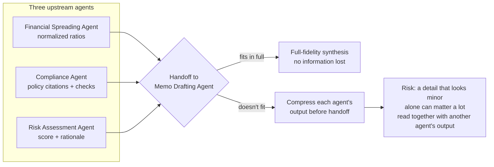

# 03 — Long-Context Synthesis and Shared State: When the Context Window Matters in a Multi-Agent System

## What "context window" concretely means

A model's context window is the maximum number of tokens it can process in a single request. That
includes the system prompt, the conversation history, any retrieved documents inserted into the prompt,
and the model's own output.

It is not a soft guideline — it's a hard ceiling enforced by the API. Exceed it, and the request either
fails outright or (depending on the vendor and integration) gets silently truncated before the model ever
sees the part that didn't fit.

Either failure mode is bad. In a multi-agent system it's worse than in a single-model system, because a
truncated context here doesn't just mean one lossy summary — it can mean an agent silently synthesizing
a recommendation from an incomplete view of what the *other agents* actually found.

## The multi-agent version of this problem: shared state, not just one long document

Course 2's original framing of this chapter was about one long document — a customer's multi-year
prior-case-note history — not fitting in a single model's context window. This system has a related but
structurally different version of the same problem.

The **Underwriting Memo Drafting Agent** doesn't read one long document. It has to synthesize **shared
state produced by three separate upstream agents**:

- The Financial Spreading Agent's normalized ratios.
- The Credit Policy Compliance Agent's retrieved policy citations and threshold checks.
- The Risk Assessment Agent's score and rationale.

All three have to come together into one coherent, cited memo. For a large commercial borrower with
several years of financial statements, a credit policy corpus with many applicable covenant sections, and
a detailed risk narrative, that combined shared state can itself be large enough to force the same kind
of hard choice a single long document forces on a smaller-context-window model: fit everything, or start
dropping and summarizing something.

This is worth being precise about, because it's a genuinely different failure surface from the
single-document case: information can go missing here not because a document was too long to fit, but
because the **handoff between agents** dropped or over-compressed something before the Memo Drafting
Agent ever saw it. If the Compliance Agent hands off a terse one-line summary of its findings instead of
the actual policy citations it retrieved, the Memo Drafting Agent has no way to recover the
citation-level detail a defensible, auditable memo needs. It's the same information-loss shape as
chunk-and-summarize in the original single-document framing — it just happens at an agent-to-agent
boundary instead of inside one retrieval pipeline.



## The workaround a small context budget forces: summarize before handoff

When the combined shared state from all three upstream agents doesn't comfortably fit in the Memo
Drafting Agent's context, the standard response looks structurally identical to the chunk-and-summarize
pattern from a single-document system: each upstream agent's full output gets compressed into a shorter
summary before being passed to the Memo Drafting Agent, rather than passing the full structured output
through.

This works, and it's a reasonable engineering response to a real constraint. But it has the same
name-able cost as before: **information that looks unimportant when one agent's output is summarized in
isolation can turn out to matter once it's read alongside another agent's full output.**

A concrete example in this domain: the Risk Assessment Agent's rationale might mention a specific
industry risk factor only in passing, and the Compliance Agent's citations might reference a covenant
that's specifically stricter for that same industry. Read together in full, that's a meaningful reason to
flag the application for additional scrutiny. Read as two independently-produced one-line summaries, the
connection is invisible — because no component of the pipeline ever held both outputs in full at once.

This is exactly the kind of quality gap that's hard to catch per-agent (each individual agent's summary
can look accurate in isolation), but it shows up clearly in the cross-agent-consistency metric from
Chapter 2, scored against the *final memo* — which is why that chapter's evaluation methodology scores
the end-to-end synthesized output, rather than each agent's output independently.

## What a genuinely larger context window buys a multi-agent system specifically

Suppose the Memo Drafting Agent's context window is large enough to hold all three upstream agents' full,
uncompressed outputs — structured ratios, full policy citations, complete risk rationale — at once,
without summarizing any of them down before the handoff. Two things change.

1. **The handoff-compression failure mode described above simply can't occur at the point of synthesis**,
   because there's no lossy summarization step between an upstream agent's real output and what the Memo
   Drafting Agent actually sees.
2. **The agent doing the final synthesis can draw connections across the *full* set of upstream findings
   in one pass** — noticing, for instance, that a risk factor mentioned by one agent interacts with a
   covenant cited by another — rather than being handed three independently-compressed summaries that
   already collapsed the possibility of noticing that connection before drafting starts.

That's the mechanical reason a larger context window is a real, useful lever specifically for the Memo
Drafting Agent's role: cross-agent synthesis, over full-fidelity inputs rather than pre-compressed
handoffs, is exactly the shape of problem where reading everything at once has a real chance of producing
a meaningfully better, more defensible recommendation.

## What a larger context window does not fix — the nuance still worth naming explicitly

**A large context window is necessary but not sufficient for good cross-agent synthesis.** Being able to
*fit* all three upstream agents' full outputs in the prompt is a different capability from being able to
*actually attend to and synthesize across* every part of that combined input once it's there.

A model can have an enormous nominal context window and still exhibit **positional degradation**:
reliably strong recall and reasoning over content near the beginning and end of a long prompt, with
measurably weaker recall over content buried in the middle (informally, "lost in the middle" in the
research literature).

```mermaid
flowchart LR
    subgraph CTX["Assembled context, in order"]
        direction LR
        A[Financial Spreading Agent<br/>output — near the start]
        B[Compliance Agent<br/>output — in the middle]
        C[Risk Assessment Agent<br/>output — near the end]
    end
    A -->|strong recall| OUT[Final memo]
    C -->|strong recall| OUT
    B -.->|weaker recall risk —<br/>"lost in the middle"| OUT
```

In this system's specific shape, that risk shows up as: whichever upstream agent's output happens to land
in the *middle* of the assembled context — say, the Compliance Agent's citations, sandwiched between the
Financial Spreading Agent's ratios and the Risk Assessment Agent's score — could be under-weighted in the
final memo relative to the agents whose output landed first or last, for reasons that have nothing to do
with which agent's findings actually matter most for this application. If that degradation is present,
simply having room for all three agents' full outputs doesn't guarantee the Memo Drafting Agent actually
used all three well.

That's precisely why Chapter 2's evaluation methodology doesn't stop at "does the combined shared state
fit." The cross-agent-consistency metric exists specifically to measure whether the final memo actually
incorporated *every* upstream agent's findings, not just the ones that happened to land favorably in the
context ordering.

A defensible conclusion distinguishes two separate questions:

- "Did the Memo Drafting Agent have room to see everything" — a context-window-size fact, checkable
  directly.
- "Did it actually use everything it was given" — an empirical question, answered only by the evaluation
  in Chapter 2.

Reporting the first as if it answers the second is the specific mistake this section exists to head off.

It's also worth naming an additional, practical mitigation specific to a multi-agent system: ordering the
assembled context deliberately (for instance, placing whichever upstream agent's output tends to carry
the most decision-relevant detail for a given case type nearer the beginning or end, rather than leaving
it to whatever order the Supervisor happened to collect responses in) is a real, cheap lever worth testing
empirically, rather than leaving to chance.

## Tying it back

The context-window question in this system is no longer "does one long retrieved document fit." It's
"does the combined shared state produced by three upstream agents fit in the Memo Drafting Agent's
context without a lossy compression step at the handoff, and does the agent actually attend well to all
of it once it's there."

Framing it that way keeps this course honest about what's actually being tested: a specific mechanism
(avoiding lossy inter-agent summarization) at a specific point in the pipeline (the final synthesis
step), not a vague claim that a bigger context window makes multi-agent coordination better in general.

If asked in an interview "doesn't a bigger context window just solve multi-agent handoffs
automatically," the answer this chapter earns you is: no — it removes one specific, real failure mode
(lossy compression before handoff), and whether that removal actually shows up as a measurably better,
more consistent final memo is an empirical question the cross-agent-consistency metric in Chapter 2 has
to actually measure, not something you get to assume from the context-window spec sheet alone.
