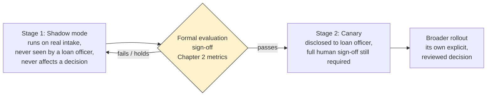
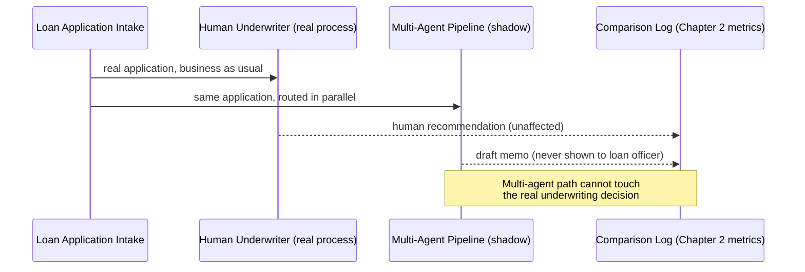

# 04 — Production Deployment of the Multi-Agent Orchestrator in the Same Azure Environment

## The question this chapter answers

The candidate's own framing asked for "prod deployment... use the same Azure environment" — and that's
worth taking seriously as a real requirement, not just a phrase to gesture at.

A five-agent system that never gets closer to production than a notebook doesn't actually answer the
question a GenAI practice lead cares about: *how does a brand-new orchestration layer, calling a model
backend the bank has never run a real underwriting workflow on before, actually get in front of a real
loan officer — and how do we get there without ever putting an unvetted, five-agent pipeline between an
applicant and a real credit decision?*

This chapter is the answer: a concrete, staged deployment pattern that puts the LangGraph-based
Supervisor and its four specialist agents inside the same security boundary as this curriculum's other
production systems, while keeping the human-sign-off guarantee from courses 1 and 2 fully intact.

## Same security boundary, not a lighter one

The architecture diagram in `00-README.md` makes the core claim visually; this section makes it
operationally precise.

The Supervisor/Orchestrator Agent — a LangGraph state graph, hosted on **Azure Container Apps** alongside
this curriculum's existing App Service deployments — and every specialist agent it dispatches to, is
deployed with:

- **The same Private Endpoint pattern.** The Azure AI Foundry resource serving Claude to every agent is
  reachable only from inside the VNet, never over the public internet — identical to how the existing
  Azure OpenAI resource is reached today, and identical to how the Azure AI Search resource backing the
  Credit Policy Compliance Agent is reached. There is no "it's agentic, it's new" exception carved into
  the network boundary.
- **The same Azure AD identity plane, with per-agent scoped roles.** Production traffic authenticates
  through the same Azure AD tenant this curriculum's other banking systems already use. Each agent in the
  orchestration graph authenticates under its own scoped RBAC role — the Financial Spreading Agent's
  identity doesn't need, and doesn't have, permission to write to the credit policy index the Compliance
  Agent queries, and neither agent's identity has any path to bypass the Supervisor and reach a loan
  officer's review queue directly. This is the mechanism that keeps each agent's blast radius small, even
  though all five components share one Azure tenant.
- **The same Azure Monitor / Application Insights instance.** Every call any agent makes — to Claude via
  Azure AI Foundry, to Azure AI Search, to the document-extraction tool — is traced the same way, into the
  same observability plane, as every call the production Azure OpenAI deployments make. A security or
  compliance reviewer auditing this Azure environment sees one observability system with five agents and
  two model backends reporting into it, not a separate, harder-to-reconcile logging setup for "the
  agentic system."

Why this matters beyond "it's good practice": a multi-agent pipeline that skips this rigor because it's
"just a new orchestration pattern" creates a governance gap that's much harder to close retroactively
than to build correctly from the start. It's the exact kind of gap a bank's model-risk governance
function is specifically set up to catch, before a system like this ever touches a real credit decision.

## The rollout, staged

### Stage 1: shadow mode

**Shadow mode is how this production system was actually rolled out — the multi-agent pipeline runs
against real loan application intake before its output ever reaches a real loan officer.** The mechanics,
concretely:

1. Real loan applications continue to flow through the existing underwriting process exactly as they do
   today — a human underwriter assembles financial statements, checks policy, assesses risk, and drafts
   a recommendation, business as usual, completely unaffected by anything described here.
2. In parallel, the same application's documents are also routed to the multi-agent Supervisor, which
   dispatches the Financial Spreading Agent and Risk Assessment Agent in parallel, then the Compliance
   Agent and Memo Drafting Agent sequentially once their dependencies are satisfied — the full pipeline
   described in `00-README.md`, running end to end on real intake.
3. The system's draft memo is logged, alongside the human underwriter's independently-produced
   recommendation for the same application, into the comparison infrastructure Chapter 2 describes — the
   same agent-task-completion metrics and blind quality review feeding into a formal go/no-go decision.
4. **The system's draft memo is never shown to the real loan officer working the case, and never
   influences a real underwriting decision, in shadow mode.** This is the hard boundary that makes shadow
   mode safe to run against live intake at all: the multi-agent path is a read-only observer riding
   alongside the real underwriting process, with zero ability to affect what a real underwriter or loan
   officer actually sees or decides. Chapter 7's fault-injection design (and
   `notebooks/03_shadow_mode_traffic_sampling_demo.ipynb`) demonstrates this isolation guarantee
   concretely — an exception, a runaway agent loop, or a timeout on the multi-agent path must never touch
   the primary underwriting process, by construction, not by convention.

Shadow mode is where the bulk of the agent-task-completion and memo-quality evaluation data from
Chapter 2 actually gets collected, against real (or, before compliance sign-off on real applicant data —
see Chapter 5 — synthetic) loan applications. It's deliberately the lowest-risk stage of the whole
rollout: nothing about a real credit decision depends on the multi-agent system being correct, available,
or even running at all.

### The gate between shadow mode and anything closer to a real decision: formal evaluation sign-off

Shadow mode doesn't graduate to the next stage automatically or on a timer. It graduates only after the
evaluation from Chapter 2 — routing correctness, tool-call validity, cross-agent consistency,
completion-vs-escalation accuracy, blind memo-quality review, and cost/latency numbers — has been
formally reviewed and signed off by the people who own that decision: the GenAI practice lead and the
same model-risk governance function course 4 built the monitoring layer for.

That sign-off is a real gate, not a formality. A result that shows the Supervisor mis-routes on a
meaningful fraction of edge cases, or that the system fails to escalate applications it should have
flagged for human judgment, is a completely legitimate reason to hold the system in shadow mode
indefinitely, or send it back for rework — rather than pushing forward because the project has momentum.

### Stage 2: canary, with the system's output disclosed to the loan officer

Only after that sign-off does a second, narrower stage begin — and even then, it doesn't touch the review
mechanics courses 1 and 2 established at all.

A small percentage of real loan applications have their draft recommendation produced by the multi-agent
system instead of a human underwriter working from scratch, and that draft **does** land in a real loan
officer's review queue — but with one deliberate, non-negotiable difference from how shadow mode worked:
**the loan officer is explicitly told the draft was produced by the AI system, and which agents
contributed to it.** A loan officer signing off on a real credit decision has a right to know an AI
system — one still early in its production rollout — produced the draft in front of them, the same way
they'd want to know if a new, still-ramping junior analyst had drafted it.

## The one sentence that matters most in this chapter

**The multi-agent system never skips human sign-off — it just adds one more piece of information (which
agents produced this draft, and what each one found) to what the reviewing loan officer sees when they
exercise that sign-off.**

Nothing about introducing a five-agent orchestration layer changes who has authority to approve an
underwriting recommendation, or the fact that only an approved recommendation becomes a real credit
decision. The canary stage adds a `produced_by: multi_agent_system` field, plus each agent's individual
findings, to what's shown in the review UI and captured in the audit trail — it does not add, remove, or
shortcut a single step of the approval workflow itself.

If an interviewer asks "how do you keep the review process safe while rolling out a brand-new agentic
system," the honest, complete answer is: the review process doesn't change at all; only more information
is disclosed to the person already responsible for exercising judgment on it.

## Tying it back

Put together, this is a three-property deployment pattern worth being able to state crisply:

1. **Same governance boundary** as every other production system in this curriculum.
2. **Isolated from any real decision** until formally signed off (shadow mode).
3. **Disclosed rather than hidden** once it is allowed anywhere near a real decision (canary).

That progression — shadow, then disclosed canary, then (once the canary itself earns enough confidence)
broader rollout, never a silent swap into full production — is the concrete answer to "how do you roll
out a new multi-agent AI system without ever putting an unvetted five-agent pipeline between a loan
applicant and a real credit decision," which is very likely the single most important question this
course needs to survive in an interview.
