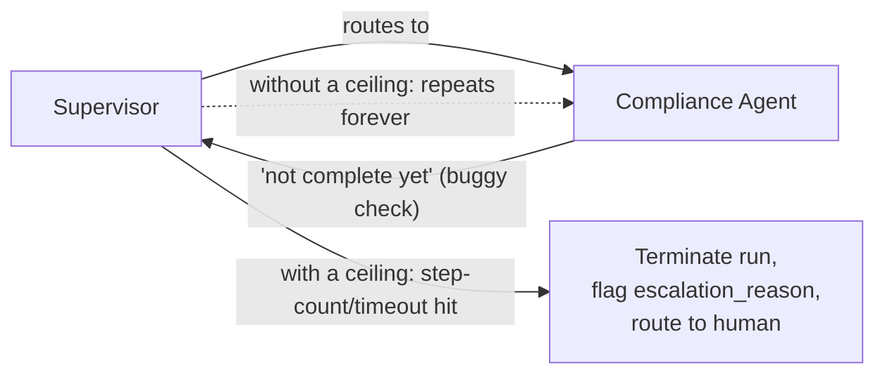

# 07 — Production Resilience and Operational Engineering

## Why a multi-agent system needs resilience thinking a single-model-call system doesn't

Courses 1 and 2 each have their own production-resilience chapter, and both are fundamentally about one
model call: what happens when that call times out, returns malformed output, or the retrieval step
feeding it fails. This system has all of those same concerns, five times over — one for the Supervisor
and one for each of the four specialist agents — plus three genuinely new failure classes that only
exist once you have multiple agents coordinating with each other:

1. **One agent's failure has to be contained** so it doesn't take down the whole pipeline.
2. **An agent-to-agent (or agent-to-self) loop needs a hard ceiling**, or it can run indefinitely.
3. **The cost/latency profile of five coordinated calls** is a fundamentally different budgeting
   problem than one call.

This chapter covers all three, in that order, before getting to specific bugs found and fixed.

## Failure isolation: one agent failing must not crash the orchestration

The design constraint, stated plainly: if the Risk Assessment Agent's call to Claude times out, or
returns something the Supervisor can't parse, or the industry-risk data source it depends on is
unavailable, the correct outcome is **a partial memo, explicitly flagged as incomplete, routed to a
human loan officer with a note about exactly what's missing** — never a silent crash of the whole
pipeline, and never a memo that quietly proceeds as if the Risk Assessment Agent's section simply
wasn't needed.

Course 2's single-model system doesn't have this problem in the same shape, because there's only one
call to fail. This system has four independent points of failure feeding into one synthesis step, and
the Supervisor is the component responsible for making sure a failure at any one of them degrades
gracefully rather than catastrophically.

| Failure | What the Supervisor does | What the loan officer sees |
|---|---|---|
| Financial Spreading Agent times out or errors | Retries once with backoff; if still failing, marks that section `status: unavailable` and continues dispatching the agents that don't depend on it | A memo with a `Financial Summary: unavailable — retry failed` banner, explicitly flagged as incomplete, never silently blank |
| Risk Assessment Agent times out or errors | Same retry-then-degrade pattern; since it runs in parallel with the Financial Spreading Agent and has no downstream dependents besides the Memo Drafting Agent, its failure doesn't block the Compliance Agent, which only depends on the Financial Spreading Agent's output | A memo missing the Risk Assessment section, flagged, with the rest of the memo (financials, compliance) still complete if those agents succeeded |
| Compliance Agent's Azure AI Search query fails or times out | Retries once; if still failing, the Memo Drafting Agent is told explicitly that policy-compliance data is unavailable rather than being handed an empty or stale result set silently | A memo that explicitly states compliance checks could not be completed — never a memo that omits the compliance section without saying so |
| Memo Drafting Agent itself fails after the other three succeed | This is the highest-value partial state to protect — retried with backoff; if it still fails, the Supervisor packages the three specialist agents' raw outputs (ratios, compliance findings, risk score) into a structured, unformatted handoff rather than losing the completed upstream work | A "manual drafting required" case with all three completed analyses attached, not a blank case that forces the loan officer to start from zero |
| Supervisor itself throws (a bug in routing logic, not a downstream agent failure) | This is the one failure mode that must fail **toward escalation, not toward silent completion** — if the orchestration logic itself is in a state it doesn't know how to handle, the correct behavior is to stop and flag the case for human handling, never to guess a plausible-looking next step | A case explicitly marked `orchestration_error`, routed to a human underwriter to handle manually, distinct from a normal `incomplete` case so the two failure classes don't get conflated in monitoring |

The asymmetry across every row is deliberate, worth stating explicitly if asked: **every specialist
agent's failure degrades gracefully into "a smaller, explicitly-flagged partial result," and the
Supervisor's own failure degrades into "stop and ask a human," never into "produce a confident-looking
memo built on a silent gap."** The row that needs the most active engineering attention is the last
one, because a Supervisor bug is exactly the kind of failure that can otherwise masquerade as normal
completion — precisely what the routing bug in this chapter's bug writeup below did, before it was
caught.

## Runaway-agent protection: a hard step-count and timeout ceiling

A supervisor pattern that routes work based on the state of the graph — as this one does, using
LangGraph (Course 8's LangGraph fundamentals chapter, applied here to this specific roster) — has a
structural risk a single model call never has: **nothing inherently stops the Supervisor from routing
back to an agent it already called, if its own logic for deciding "is this step done" has a bug or
encounters a case it wasn't designed for.**

A single model call terminates because the API request completes. A graph of agent-to-agent handoffs
terminates only if the orchestration logic correctly recognizes a terminal state — and if it doesn't,
the failure mode isn't a clean error, it's an agent (or the Supervisor itself) being invoked over and
over, each invocation burning a real LLM call, with no natural stopping point.

The fix, and it needs to be a hard ceiling built in from the start rather than a defensive afterthought:
**every run of the orchestration graph carries an explicit step-count limit and a wall-clock timeout,
enforced by the Supervisor's own control logic, independent of whatever the graph's routing logic
decides.** If either limit is hit, the run terminates immediately, the case is flagged
`escalation_reason: step_limit_exceeded` (distinct from a normal completion or a normal escalation, so
it's separately monitorable), and it's routed to a human loan officer with whatever partial state had
accumulated — never allowed to keep running indefinitely on the theory that "it'll probably terminate
naturally soon."

`notebooks/06_runaway_agent_protection_demo.ipynb` implements exactly this: a mocked agent loop that
can route back to itself indefinitely without a guard, shown first failing that way, then fixed with a
step-count ceiling that terminates cleanly and flags the case for human review.

## Cost and latency: a five-agent call chain is not a 1x system

This needs to be named as plainly as Chapter 2 names it in the evaluation table, because it's easy to
lose track of once a system is running smoothly in production: **a five-agent pipeline means, in the
straightforward case, five separate LLM calls per loan application, where Course 2's single-shot
generator needed one.** That's not a rounding-error cost difference — on any caseload large enough to
matter, it's a real, budget-relevant multiplier a rollout proposal needs to be upfront about, the same
way Chapter 7 of the original research framing of this course was upfront about shadow mode roughly
doubling spend on sampled traffic.

Two concrete levers keep that multiplier from being worse than it needs to be, both already reflected
in this system's design:

- **Parallelize what doesn't have a data dependency.** The Financial Spreading Agent and Risk
  Assessment Agent don't depend on each other's output, so dispatching them concurrently instead of
  sequentially doesn't reduce the *number* of calls, but it materially reduces *wall-clock latency* —
  the system pays for five calls' worth of tokens either way, but doesn't have to pay for five calls'
  worth of time in series. `notebooks/05_multi_agent_supervisor_routing_demo.ipynb` demonstrates and
  measures this split directly.
- **Fail fast on cases that don't need the full pipeline.** If the Supervisor can determine early —
  from the loan application's own metadata, before dispatching any specialist agent — that a case is
  obviously going to require human escalation regardless of what the agents would find (missing
  required documentation, for instance), the correct behavior is to escalate immediately, rather than
  running all four specialist agents to completion first and discovering the same thing at the end.
  This is a real cost lever, not just a latency one: every specialist-agent call avoided on a case that
  was always going to be escalated is a call the system never needed to pay for.

Even with both levers applied, the honest number to have ready in an interview is that this system's
per-application LLM cost is a genuine multiple of Course 2's single-shot baseline — the tradeoff being
made is that multiple, more accurate agents on a genuinely multi-part task can plausibly justify that
multiple, which is exactly the empirical question Chapter 2's evaluation methodology has to actually
answer rather than assume.

## Bugs found and fixed

### 1. The routing bug that caused the Supervisor to loop on the Compliance Agent

**What happened.** An early version of the Supervisor's routing logic decided whether the Credit Policy
Compliance Agent's output was "complete enough to proceed" by checking whether its response included a
non-empty `policy_citations` field. For a narrow category of loan applications — ones where the
borrower's industry genuinely had no additional covenant requirements beyond the bank's baseline policy
— the Compliance Agent correctly returned an **empty** `policy_citations` list, because there was,
correctly, nothing industry-specific to cite.

The routing logic treated an empty list the same way it treated a malformed or missing response: "not
complete yet, re-invoke the agent." The Compliance Agent, re-invoked with the same input, correctly
produced the same empty-but-valid result again — and the Supervisor, seeing the same "incomplete"
signal, re-invoked it again. Without a step-count ceiling in place yet, this repeated for a long,
unbounded stretch of real time on affected cases, each iteration burning a real Claude call for no
forward progress at all, before the run was manually killed.

**What would have caught it earlier.** Exactly the runaway-agent protection this chapter argues needs
to exist from day one, not added reactively: a hard step-count ceiling on the orchestration graph would
have terminated the loop at a small, bounded number of iterations and flagged the case for human
review, turning an unbounded cost incident into a cheap, immediately visible one. That protection
**should have been there from the start** — it wasn't a defense against a bug nobody anticipated, it
was a basic safety property of any supervisor-pattern orchestration graph that got skipped in the
interest of getting the happy path working first.

Beyond the ceiling itself, the actual routing bug was fixed by correcting the completion check:
distinguishing "empty because there's genuinely nothing to cite" from "malformed or missing," using an
explicit status field the Compliance Agent sets itself, rather than inferring completeness from whether
a list happened to be non-empty.

### 2. The token-counting bug that made the cost comparison unfair

**What happened.** An early version of the cost-per-application comparison from Chapter 2 computed
token counts for every agent's inputs and outputs using a single shared tokenization utility — one that
had originally been written for the Azure OpenAI integration and used OpenAI's own tokenizer under the
hood. When every agent was moved onto Claude, the same utility was reused across all five agents' calls
without anyone checking whether it was measuring the right thing.

It wasn't: OpenAI's and Anthropic's tokenizers segment the same text differently, so applying OpenAI's
tokenizer to Claude's text produced a token count that didn't match what Anthropic actually billed for
each agent's requests. The resulting per-application cost comparison systematically misrepresented the
multi-agent system's actual cost — in the specific run where this was caught, understating it, because
the shared tokenizer happened to produce a lower count on the sampled text than Claude's own tokenizer
would have, compounded across five agents' worth of calls instead of one.

**What would have caught it earlier.** A cross-check built into the harness itself: for every agent
call, compare the locally-computed token count against the token/usage figures each vendor's own API
response actually returns, and alert if the two diverge beyond a small tolerance. That check would have
flagged the mismatch on the very first agent's first Claude request, rather than after enough volume
across all five agents had accumulated for someone to notice the aggregate cost numbers looked
implausibly favorable.

### 3. The comparison-harness prompt-formatting bug, now across five agents instead of one

**What happened.** The adapter layer described in Chapter 1 — responsible for reconciling the Chat
Completions and Messages API shapes into one internal representation before any agent's prompt ever
went out — had a bug in its system-prompt handling: for Azure OpenAI, system instructions were inserted
as the first message in the `messages` array (correct for that API); for Claude, the same code path was
supposed to route those instructions into the dedicated top-level `system` parameter (Chapter 1), but
an early version of the adapter instead concatenated them into the first *user* message alongside the
agent's actual task input.

This happened because the adapter had been written and tested against the Underwriting Memo Drafting
Agent first, and the other three agents' Claude branches hadn't been separately verified before the
first end-to-end evaluation run. Every agent was technically shown the same *content*, but placed with
different structural weight than it was designed to receive — and because the bug lived in shared
adapter code, it silently affected all five agents' calls at once, not just one.

**What would have caught it earlier.** A golden-request test in the adapter layer's own test suite, run
against every agent's request shape individually: for a fixed input per agent, assert the exact request
payload sent to Claude's API matches an expected, hand-verified shape — including where the system
instruction actually lands — rather than only testing that the adapter runs without throwing. Because
the bug lived in code shared across all five agents, the fix and the test both had to be applied once,
centrally, but the verification had to check every agent's actual payload shape individually to be sure
the fix actually reached all of them, not just the one agent someone happened to spot-check.

## One hardening gap, named honestly

The comparison harness's fault-injection test suite covers timeouts, 5xx errors, and malformed
responses on every agent's calls thoroughly — but does not yet cover a **partial-response** failure
mode specific to streaming: an agent's call that begins streaming a response and then drops mid-stream,
after some tokens have already been received and logged but before the response completed.

Today, that scenario is handled by the same generic timeout/error path, which is safe (it still fails
toward "flag this agent's section as unavailable," never toward "silently proceed on partial data") but
not fully correct — a partial response gets logged and excluded the same way a zero-token failure does,
when in principle it could be flagged distinctly. For an agent like the Financial Spreading Agent, a
partial extraction result might still be worth surfacing to a human reviewer even though it can't be
trusted enough for the Supervisor to treat it as complete.

This is a real, acknowledged gap rather than a claimed non-issue: the safe failure mode is in place, the
more precise, per-agent handling of that specific case is not yet built, and it's an honest answer to
"what would you still improve here" if asked.
