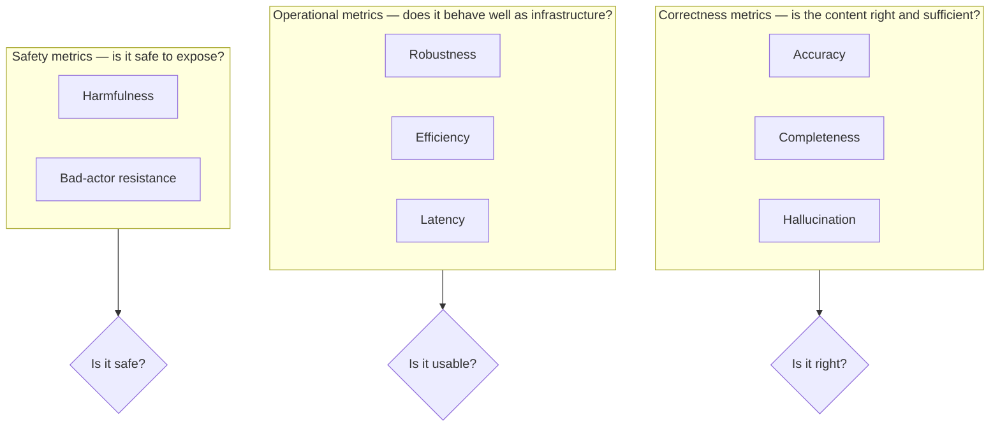
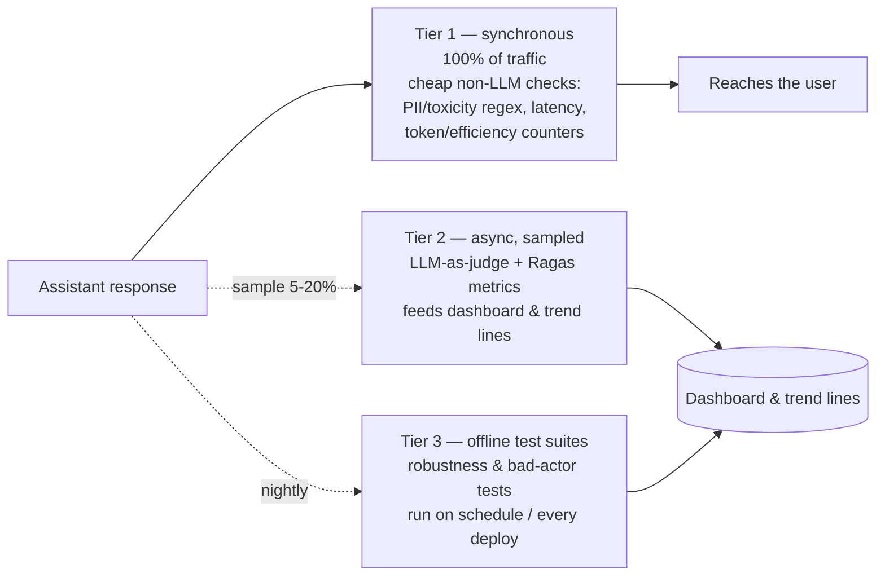

# 01 — LLM Evaluation Fundamentals

## Why this chapter matters for this project

The resume bullet for this project lists eight evaluation dimensions in one breath: "accuracy,
completeness, hallucination, robustness, efficiency, latency, harmfulness, bad-actor."

Before you can talk about any of those intelligently in an interview, you need a mental model for one
question: *why is evaluating a generative model a fundamentally different problem from evaluating a
classifier?* And why can't a bank's model risk team just ask "what's the accuracy?" the way they might
for a fraud-detection model?

This wasn't an academic exercise. The assistant being evaluated here was live in production, answering
real HSBC and Bank of America customers. That's exactly the setting where "what's the accuracy?" stops
being a good enough question.

## Why evaluating generative outputs is hard

Traditional ML evaluation assumes a **single, checkable ground truth**. A fraud classifier predicts
`fraud` or `not fraud`. You compare that against a labeled outcome and compute precision/recall — done.

A generative assistant answering "What's our policy on X?" doesn't have one correct string. It has a
huge space of acceptable phrasings, levels of detail, and framings. Several of these might be equally
"correct." Many others are subtly wrong in ways that are hard to catch mechanically.

This creates three compounding problems:

1. **No single reference answer.** Older text-comparison metrics like BLEU and ROUGE (built for machine
   translation and summarization) work by checking word overlap against one "correct" answer. That
   approach penalizes a perfectly good paraphrase, and it can reward a response that reuses the right
   words while getting the meaning completely wrong. These metrics are cheap and still useful as *one
   signal among many* — but they cannot carry the whole evaluation on their own.
2. **Failure modes are semantic, not syntactic.** A hallucinated fact (something the model made up), a
   subtly incomplete answer, or a response that technically answers the question but skips a
   compliance-required caveat — all of these *read* fluently. A spell-checker won't catch any of them.
   You need something that actually understands meaning.
3. **"Good" is multi-dimensional and depends on the audience.** A response can be accurate but too slow
   (latency), accurate but harmful in tone, or accurate but exploitable (a bad actor could use the same
   phrasing to extract information it shouldn't). A single "quality score" hides which of these is
   failing — and that's exactly the information a risk team needs.

This is why the resume bullet doesn't say "measured accuracy." It lists eight separate metrics. Each one
isolates a different failure mode, so it can be tracked, alerted on, and fixed independently.

## The metric taxonomy

Group the eight metrics from the bullet into three families. Each family answers a different question.

**Correctness metrics** — is the content of the response right and sufficient?
- **Accuracy** — are the factual claims in the response actually true? (Checked against source docs, a
  knowledge base, or ground truth where one exists.)
- **Completeness** — does the response cover everything the question or task required? Or does it stop
  short — answering part of a multi-part question, or leaving out a required disclaimer?
- **Hallucination** — does the response assert something that is *not supported* by the provided
  context or retrieved documents? This is related to accuracy, but distinct from it: a response can be
  factually true in the real world and still be a hallucination relative to the system's own retrieved
  context. That's the failure mode that matters most for RAG-based assistants (RAG = Retrieval-Augmented
  Generation — see Chapter 02 for how Ragas breaks this down).

**Operational metrics** — does the system behave well as a piece of infrastructure?
- **Robustness** — does response quality hold up under paraphrased, noisy, or edge-case input?
  (Chapter 04 covers perturbation testing in depth.)
- **Efficiency** — cost per response: tokens consumed, compute used, retries triggered.
- **Latency** — wall-clock time to respond. Usually tracked as p50/p95/p99 (the 50th/95th/99th
  percentile response time), not just the average — because a bank cares about the worst case a user
  experiences, not the typical case.

**Safety metrics** — can the system be misused, or does it cause harm even when used as intended?
- **Harmfulness** — does the response contain toxic, biased, discriminatory, or otherwise inappropriate
  content? Does it leak PII (personally identifiable information)?
- **Bad-actor resistance** — does the system resist deliberate manipulation: prompt injection, jailbreak
  attempts, attempts to extract system prompts or training data? (Chapter 04.)

Notice the shape: correctness metrics answer "is it right," operational metrics answer "is it usable,"
and safety metrics answer "is it safe to expose." A model risk committee typically wants a one-line
answer in each of these three buckets — not eight separate numbers with no organizing logic. Structuring
your explanation this way, instead of reciting eight disconnected terms, reads as more senior in an
interview.

## LLM-as-judge vs. non-LLM metrics

The bullet explicitly says "LLM and non-LLM metrics." That's worth unpacking, because it's a real
architectural decision, not just a detail.

**Non-LLM (rule-based / statistical) metrics** are cheap, deterministic, and fast:
- Regex/keyword matching (PII patterns, banned phrases, required disclaimer text present or absent).
- Statistical text metrics (BLEU/ROUGE/BERTScore-style overlap against a reference).
- Classical NLP classifiers (a small fine-tuned toxicity or PII-detection model).
- Straightforward measurements: token count, latency, retrieval hit rate.

Strengths:
- Near-zero marginal cost.
- Fully deterministic — the same input always gives the same output. That's useful for regression
  testing, and for audit trails, since a regulator can be shown exactly why a score was assigned.
- No risk of the *evaluator itself* hallucinating a justification.

Weaknesses:
- Blind to meaning. A keyword filter doesn't know that "the patient should NOT take this medication" and
  "the patient should take this medication" differ by one word — with opposite clinical implications.

**LLM-as-judge metrics** use a second LLM call (sometimes the same model, sometimes a stronger or
cheaper specialized one) to *score* the primary assistant's response. For example: "Given this question,
context, and answer, rate completeness from 1-5 and explain why." This is how most of the semantic
metrics (completeness, hallucination, harmfulness nuance) get evaluated at scale, without paying humans
to read every response.

Strengths:
- Captures semantic failure modes non-LLM metrics can't.
- Can produce a natural-language rationale alongside the score, which is valuable for audit
  documentation.
- Scales far better than human review.

Weaknesses:
- Costs real money and adds latency — it's a second model call per evaluated response, or per sampled
  response.
- The judge model can itself be wrong, biased toward verbose or confident-sounding answers, or
  inconsistent across runs unless you fix the prompt, temperature, and rubric carefully.
- There's a recursive problem: you now need to validate the judge. Risk teams sometimes push back on
  this — "who evaluates the evaluator?"

## The practical tradeoff a monitoring system has to make

In production, you rarely run every metric on every response — cost and latency don't allow it. A
realistic design (and the one a Consultant-II would plausibly have proposed here) splits work into
tiers:

- Run **cheap non-LLM checks synchronously on 100% of traffic** — PII/toxicity regex, latency,
  token/efficiency counters, basic guardrail triggers. These gate what reaches the user in real time.
- Run **LLM-as-judge and Ragas-style metrics asynchronously on a sample** — e.g., 5-20% of traffic, or
  100% for a nightly regression suite against a fixed test set. These feed the dashboard and trend lines
  rather than blocking any single response.
- Treat **robustness and bad-actor testing as offline test suites**, run on a schedule or on every
  deploy — not per live response. You're testing the system's behavior under adversarial inputs you
  construct yourself, not scoring organic traffic.

This tiered design is the answer to the interview question "wouldn't running an LLM judge on every
response double your latency and cost?" You don't — you sample, and you separate real-time gating
checks from asynchronous quality/trend checks.

See `notebooks/01_ragas_style_metrics_from_scratch.ipynb` and
`notebooks/02_hallucination_detection_demo.ipynb` for hands-on, from-scratch implementations of the
non-LLM approximations described here, and Chapter 02 for how Ragas formalizes the RAG-specific subset
of these metrics.
