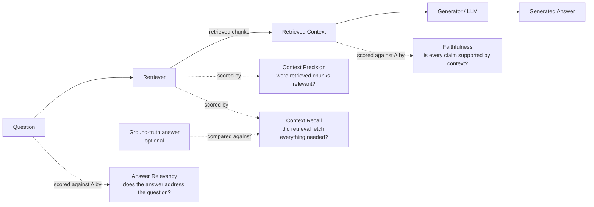

# 02 — Ragas and RAG-Specific Metrics

## Why this chapter matters for this project

The AI Assistant from Course 01 is retrieval-augmented. That means it answers questions using documents
fetched from a knowledge base, rather than relying only on what it "remembers" from training. This is
the standard design for a bank-facing assistant, because it lets the bank control and audit the source
material.

Once you know that, "hallucination" and "completeness" stop being vague qualities you eyeball. They
decompose into concrete, measurable signals.

**Ragas** (Retrieval-Augmented Generation Assessment) is the most widely used open-source framework for
exactly this decomposition. It's on the candidate's resume skill list for a reason: it's the natural
toolkit for turning "evaluate hallucination" from a research question into an engineering metric with a
number attached.

## What Ragas actually measures

Ragas frames a RAG interaction as four objects:

- The **question**.
- The **retrieved context** — the chunks pulled from the knowledge base.
- The **generated answer**.
- A **ground-truth answer**, for some metrics, if one is available.

Its core metrics each isolate one link in that chain, from the question all the way to the final answer:



### Faithfulness

**Question it answers:** Is every claim in the generated answer actually supported by the retrieved
context?

**How it works (conceptually):** The answer is broken down into individual claims/statements. Each
claim is checked against the retrieved context — typically using an LLM judge that asks "is this claim
inferable from this context: yes/no." The faithfulness score is the fraction of claims that are
supported.

```
faithfulness = (# claims in answer supported by context) / (total # claims in answer)
```

**Why it matters here:** This is the direct, measurable definition of "hallucination" from the resume
bullet. A hallucination, in the RAG sense, isn't necessarily "false in the real world" — it's a claim
the *system* asserted that its own retrieved evidence doesn't back up. That distinction matters a lot
for an audit trail: you can show a regulator exactly which claim in a flagged response had no supporting
passage, rather than making a vague claim about "the model being wrong."

### Answer Relevancy

**Question it answers:** Does the answer actually address the question asked, without padding,
tangents, or evasion?

**How it works (conceptually):** Ragas generates several synthetic questions that the *given answer*
would be a good answer to (using an LLM), then embeds those synthetic questions and the original
question and measures the average cosine similarity between them. A high score means the answer is
tightly on-topic for the question that was actually asked. A low score often catches answers that are
technically true but evasive, generic, or answering a different (easier) question than the one posed.

**Why it matters here:** This is one lens on "completeness." An answer can be 100% faithful to context
(no hallucination) while still dodging the actual question — and answer relevancy is what catches that.

### Context Precision

**Question it answers:** Of the chunks the retriever pulled back, how many were actually useful or
relevant to answering the question?

```
context_precision ~ (relevant chunks ranked highly among retrieved chunks)
```

**Why it matters here:** This is a retrieval-quality metric, not a generation-quality metric. It tells
you whether the *retriever* is doing its job — which matters, because a generation model fed noisy or
irrelevant context is far more likely to hallucinate or produce an incomplete answer. If faithfulness
scores dip, context precision tells you whether to fix the retriever or the prompt/generation step.

### Context Recall

**Question it answers:** Did the retriever pull back *everything* needed to fully answer the question,
or did it miss relevant information that exists elsewhere in the knowledge base?

**How it works (conceptually):** This one requires a reference/ground-truth answer to compare against.
It checks whether the claims in the ground truth are all traceable back to the retrieved context. Low
context recall directly predicts low completeness: if the retriever didn't fetch the passage that
contains a required disclaimer, or a second part of a multi-part answer, the generator physically cannot
include it — no matter how good the generation model is.

## How these four decompose "hallucination" and "completeness"

This is the key conceptual link back to the resume bullet, worth stating explicitly in an interview:

| Resume metric | Ragas metric(s) that operationalize it |
|---|---|
| Hallucination | **Faithfulness** (claims not supported by context) |
| Completeness | **Answer Relevancy** (on-topic, not evasive) + **Context Recall** (did retrieval fetch everything needed) |
| Accuracy (indirectly) | **Context Precision** (garbage-in-garbage-out: bad retrieval predicts bad answers) |

Framed this way, "we evaluated hallucination and completeness" stops being a vague claim. It becomes:
"we ran four decomposed, independently interpretable metrics that let us tell whether a quality problem
originated in retrieval or generation." That's a materially stronger answer to a technical interviewer's
follow-up question.

## Using Ragas metrics as monitoring signals, not just offline eval

Ragas was originally built for offline evaluation. You run it against a fixed test set of (question,
context, answer, ground_truth) tuples when you change a prompt or swap a model, and compare scores
across versions like a regression suite.

Turning it into a *monitoring* signal — which is what "Model Monitoring platform" implies — requires a
few adaptations:

1. **Sampling live traffic.** You can't always compute a ground-truth-requiring metric (context recall)
   on live traffic, since there's no ground truth for a real user's novel question. So in production you
   typically run the ground-truth-free metrics (faithfulness, answer relevancy, context precision)
   continuously on a sample of live responses, and reserve context recall for the offline regression
   suite run against a curated test set.
2. **Cost control.** Each Ragas metric involves one or more LLM calls under the hood — to decompose
   claims, generate synthetic questions, or judge support. At scale this is real spend, which is why
   Chapter 01 argues for a tiered sampling strategy.
3. **Trend tracking over time, not just pass/fail.** A single low faithfulness score on one response is
   noise. A *declining trend* in average faithfulness over a week, or a spike in low-scoring responses
   after a knowledge-base update, is signal. Chapter 05 covers turning these scores into dashboard trend
   lines and alert thresholds.
4. **Aggregating to a segment level.** Slicing faithfulness/relevancy scores by topic, intent category,
   or user group often surfaces something aggregate numbers hide: that a system is faithful overall but
   unreliable on one narrow topic. That's exactly the kind of finding a model risk report needs to be
   useful.

## What Ragas doesn't cover — and why the rest of the metric list exists

It's worth being explicit in an interview: Ragas covers the RAG-quality slice of the metric list
(hallucination, completeness, and — loosely — accuracy). It says nothing about robustness, latency,
efficiency, harmfulness, or bad-actor resistance.

That's exactly why the resume bullet lists Ragas-adjacent concerns alongside a separate set of safety
and operational metrics. A mature evaluation harness composes Ragas (or a from-scratch equivalent, see
`notebooks/01_ragas_style_metrics_from_scratch.ipynb`) with the safety/operational tooling covered in
Chapters 03-04. It's not either/or — it's both.

## A note on honesty about tooling

Whether the actual Capco project used the `ragas` Python package directly, an internal reimplementation
of the same ideas, or a comparable framework is not something this course can verify. "Ragas" appears on
the candidate's resume skill list, which is strong evidence the *concepts and metric names* were used in
this project. But present it in an interview as "the framework/approach I used was Ragas, or an
equivalent faithfulness/relevancy/context-precision-recall decomposition" — rather than reciting internal
implementation details you cannot back up if pressed.
