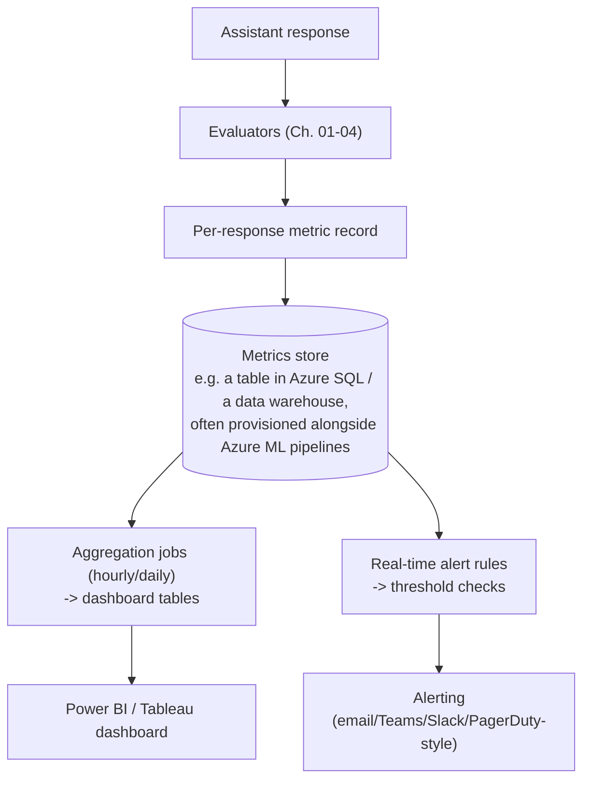
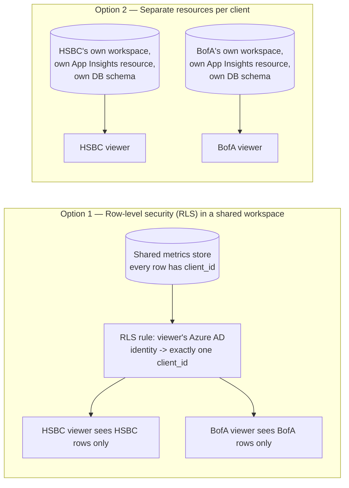

# 05 — Building a Monitoring Dashboard

## Why this chapter matters for this project

Metrics that live only in log files or a Python notebook are invisible to the people who actually own
model risk — compliance officers, moderation teams, engineering leads doing a weekly review.

The resume bullet's "Model Monitoring platform," and the candidate's Power BI/Tableau skills, point to
the same conclusion: the evaluation harness from Chapters 01-04 has to end in an **operational
dashboard**, not just a metrics computation.

This chapter covers the practical design of that last mile: turning per-response scores into something
a risk committee checks every week (or gets alerted on in real time), and closing the feedback loop.

Because this platform served two named banking clients — **HSBC** and **Bank of America** — "the
dashboard" is really two dashboards. The harder design problem, covered below, is guaranteeing they
never leak into each other.

## From per-response scores to a metrics store

Every chapter so far produces a **per-response record** — one row per assistant interaction, with fields
like:

```
response_id, timestamp, user_id (hashed), question, answer, retrieved_context_ids,
faithfulness, answer_relevancy, context_precision, context_recall,
robustness_score, latency_ms, token_count, harmfulness_score, bad_actor_flag,
user_feedback (thumbs up/down/null), was_retried, session_id
```

This is the atomic unit everything downstream is built on. A typical (and reasonable) architecture:



Azure ML's model monitoring capabilities (or an equivalent MLOps platform) are a natural place for this
metrics store to live in an Azure-centric shop. They already provide scheduled evaluation jobs, data
drift detection, and integration points for custom metrics — which lines up with "Azure ML" on the
candidate's skill list and "Integrated Model Monitoring platform" in the resume bullet.

## Designing the dashboard itself

A dashboard built from these records generally needs at least three views, because a single view mixing
per-response detail with trend lines is hard to act on:

**1. Executive/trend view** — the view a risk committee checks weekly. Time-series charts of each
metric's rolling average (faithfulness, hallucination rate, latency p95, harmfulness rate) over the last
N weeks, with a clear visual marker for deployments/prompt changes so a metric shift can be correlated
with a cause. This is the view that answers "is the assistant getting better or worse over time, and did
our last change help or hurt."

**2. Segment/breakdown view** — the same metrics sliced by topic/intent category, user group, or
knowledge-base source. This is what turns "faithfulness is 91% overall" into "faithfulness is 97% on
account-balance questions but 68% on tax-related questions" — an actionable finding, versus an aggregate
number that hides where the actual problem is.

**3. Case-review / drill-down view** — a filterable table of individual flagged responses (low
faithfulness, harmfulness flag, bad-actor flag, thumbs-down) that a moderation reviewer can click into to
see the full question/context/answer and — per Chapter 03 — the explanation for why a classifier flagged
it. This is the operational, day-to-day view.

```
Power BI report structure (illustrative):
  Page 1: Executive Trend        -- line charts, weekly rollups, deployment markers
  Page 2: Segment Breakdown      -- matrix/heatmap by topic x metric
  Page 3: Flagged Case Review    -- filterable table + drill-through to case detail
  Page 4: Feedback & Engagement  -- thumbs up/down rate, retry rate, session trends
```

Tableau and Power BI are largely interchangeable for this purpose. The meaningful design decisions
(rollup granularity, alert thresholds, drill-down structure) matter more than the specific BI tool. Both
connect naturally to a scheduled data-refresh from the metrics store described above.

## Multi-client dashboard design: keeping HSBC and Bank of America strictly separate

This platform served two named banking clients, **HSBC** and **Bank of America**, monitoring the same AI
Assistant architecture deployed separately for each. That changes the dashboard design problem. It's no
longer "build one good dashboard" — it's "build a dashboard architecture that makes it structurally
impossible for one bank's model-risk team to see the other's data." That's a constraint that has to be
designed in from the data model up, not bolted on as a filter at the end.

**Two mechanisms, not mutually exclusive:**



1. **Row-level security (RLS) in a shared workspace.** Every record in the metrics store carries a
   mandatory `client_id` field, enforced at ingestion — the evaluation harness rejects or fails loudly on
   any record missing it, and never defaults it silently. The Power BI/Tableau semantic model then
   applies an RLS rule that maps each authenticated viewer's Azure AD identity to exactly one
   `client_id`, and every visual, table, and drill-through in the report is filtered through that rule
   before rendering. This is cheaper to build and maintain — one report definition, one refresh schedule
   — and keeps a single source of truth for cross-cutting engineering questions like "did the last prompt
   change affect faithfulness across both deployments."
2. **Separate workspaces / separate resources per client.** Instead of (or in addition to) RLS, give each
   bank its own Power BI workspace (or Tableau site), its own Azure Monitor / Application Insights
   resource or Log Analytics workspace, and — if the metrics store is a database — its own schema or
   database instance rather than a shared table distinguished only by a column. This costs more to
   maintain — two of everything: refresh schedules, alert rules, access reviews — but it removes the RLS
   rule as a single point of failure. There is no query path, misconfigured or otherwise, that can return
   both banks' rows at once, because the data never lives in the same store.

**The practical answer in a banking context leans toward option 2 at the resource boundary, with RLS as
defense-in-depth inside each client's own workspace** — for example, separating internal Capco
engineering views from the bank's own risk-team view within HSBC's workspace.

The reasoning: RLS is a *logical* control. It depends on every report, every dataset, and every future
dashboard someone builds correctly applying the filter, forever — including after a schema change or a
new report author joining the project. A resource-level split is a *structural* control. Even a
completely misconfigured RLS rule, or a report built by someone who forgot to apply one, cannot leak data
it was never granted access to in the first place. Regulated financial-services clients generally prefer
paying the operational cost of structural isolation over trusting a logical filter to never have a bug.

**Why this is a serious incident, not a UX bug.** If a filter error let HSBC's model-risk officer see
even aggregate Bank of America metrics — not conversation content, just numbers — that is a
confidentiality breach between two competing banking clients of the same vendor. It's the kind of event
that triggers a client-side incident review, is reportable up the chain internally, and can plausibly end
the engagement. It sits in the same severity class as a data breach, not the same class as "the chart
colors were wrong." That asymmetry — a dashboard bug for most SaaS products is an annoyance, the same bug
here is a trust-ending event with a named regulated client — is worth stating explicitly in an interview
when asked how this differed from "normal" dashboard work.

## Alerting thresholds

A dashboard nobody checks proactively is only useful in a post-hoc review. The complement is
**threshold-based alerting** — automated checks that fire when a metric crosses a line, rather than
waiting for a human to notice a chart trending down.

Practical threshold design considerations, worth raising in an interview because naive thresholding is a
common junior mistake:

- **Static thresholds are a starting point, not the end state.** "Alert if faithfulness < 0.85" is easy
  to implement, but it doesn't account for a metric having natural day-to-day noise on low sample counts.
  A better approach uses a rolling baseline — e.g., alert if the 24-hour average deviates more than 2
  standard deviations from the trailing 30-day average — so alerts fire on genuine regressions, not
  noise.
- **Volume-aware thresholds.** A 20% harmfulness-flag rate on 5 samples overnight is not the same signal
  as 20% on 5,000 samples during business hours. Alert logic should account for sample size, or it will
  either spam on low-traffic periods or stay silent when it shouldn't.
- **Tiered severity.** Not every threshold breach needs to page someone at 2 a.m. A reasonable design:
  - *Critical* (page immediately): bad-actor flag rate spike, harmfulness flag on a live response that
    reached a user unfiltered, latency p99 breach that indicates an outage.
  - *Warning* (daily digest): faithfulness/completeness trending down over several days, robustness score
    dropping on a specific topic segment.
  - *Informational* (weekly report only): engagement/reliance shifts, minor efficiency drift.
- **Alert on the drill-down path, not just the number.** An alert that says "faithfulness dropped" is
  less useful than one that links directly to the segment breakdown and the specific flagged cases
  driving the drop — otherwise every alert starts with 20 minutes of investigation just to find where to
  look.

## Closing the feedback loop

The loop from the diagram in `00-README.md` isn't complete until dashboard/alert findings actually
change the assistant. In practice this means the moderation/risk team's review of the dashboard feeds
into concrete follow-up actions that a GenAI backend developer would own:

- A segment with low faithfulness leads to investigating whether it's a retrieval problem (fix the
  knowledge base or retrieval config) or a generation problem (adjust the prompt or add a stricter
  grounding instruction). Chapter 02's context-precision/recall split tells you which.
- A recurring bad-actor pattern gets added to the adversarial regression suite (Chapter 04), so it's
  caught automatically on every future deploy, not just noticed once.
- A high retry/low-reliance topic is worth investigating manually, even if faithfulness scores look
  fine, since it's evidence from real usage that the automated metrics may be missing something.
- Sustained thumbs-down on a topic makes that topic a candidate for a human-in-the-loop review step, or a
  narrower guardrail, until root-caused.

This closing step — dashboard finding to concrete engineering or guardrail change — is what separates "we
built a monitoring dashboard" from "we built a monitoring dashboard that measurably improved the
assistant." It's the detail most likely to impress a technical interviewer, since it shows the loop isn't
just observability theater.
