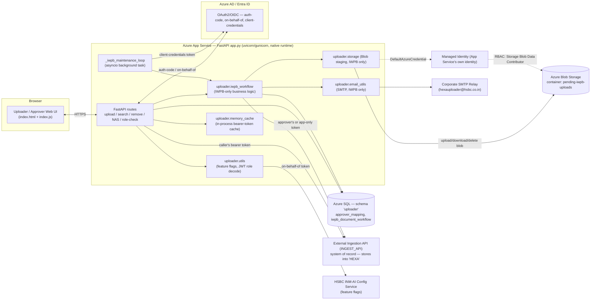

# 03 — Capco Document Uploader Service

> Resume bullet (verbatim): *"Document Uploader Service: Built and Implemented an end to end document
> uploader-ingest Azure App service with CRUD functionality."*

> **Correction before you study this course further.** In conversation, the four business lines this
> service handles were misremembered as including "Credit Ops." **There is no "Credit Ops" anywhere in
> the real codebase.** The four real business lines/departments are **IWPB, FEMA, TPMB, and GTRM** —
> plus a generic bucket (RESEARCH/WCS/GPS/WCL/OTHER/GENERAL) for departments with no dedicated workflow.
> Double-check yourself before repeating "Credit Ops" in an interview. Say IWPB, FEMA, TPMB, GTRM.

## This course was rebuilt from the real source code

Every other course in this curriculum starts from a resume bullet and reconstructs a realistic,
defensible architecture around it. **This one is different.** It was rebuilt directly against the
real, proprietary `upload-service` codebase: `app.py` (about 1,240 lines), `src/uploader/iwpb_workflow.py`,
`utils.py`, `storage.py`, `tables/`, plus three source documents — `FULL_ARCHITECTURE.md`,
`REQUIREMENTS.md`, and `DEPLOYMENT_REQUIREMENTS.md`.

So the facts stated plainly in this course — department names, RBAC logic, the approver workflow, the
background maintenance loop, the real bugs found and fixed — are **confirmed by reading the actual
code**. They are not illustrative reconstructions like in most other courses. Where a chapter proposes
something that isn't actually implemented (a Key Vault migration, a Docker packaging option, a real
versioning feature), it says so explicitly. That's the one place hedging language belongs in this
course.

This rebuild exists because of a real interview question the candidate was actually asked about this
project: **"for revised versions of the same document, how are you handling those?"** Chapter 05
(`05-document-lifecycle-versioning-and-revisions.md`) and Q1 in `99-Interview-QA.md` build the honest,
confident answer to that question. Read those first if you have an interview coming up and don't have
time to read the whole course.

## What this service actually is

It's a **single FastAPI microservice** (`app.py`). It lets HSBC staff upload documents against a
**business line / use case**, and it tracks their ingestion into an external, opaque system of record
the codebase calls **"HEXA."**

The service is not itself a document store. Files are either:
- relayed directly to an external **Ingestion API** (`INGEST_API`), or
- for IWPB only, staged temporarily in Azure Blob Storage until a human approver signs off.

There is **no fleet of per-department microservices**. Every department's behavior lives in this one
process. What differs between departments is just:

1. `use_case` string branching (`if use_case.upper() == "IWPB": ...`)
2. a feature-flag-gated role model that decides which departments a signed-in user even sees

Chapter 03 covers why that single-service design is a defensible choice, not a shortcut.

## Client and production context

This service was built at **Capco for HSBC** — confirmed by the real source. The SMTP "from" address is
`hexauploader@hsbc.co.in`, role names are `stitt.ingester*`, and the external feature-flag service is
literally named the "HSBC INM-AI Config Service."

Other courses in this curriculum frame Capco's banking engagements as a two-bank (HSBC/Bank of America)
scenario. **This specific service does not fit that pattern** — there's no Bank of America involvement
and no two-bank multi-tenancy here. Its real multi-tenancy axis is **department/business-line** (IWPB
vs. FEMA vs. TPMB vs. GTRM vs. everything else) inside a single HSBC deployment, not client/tenant
isolation between two banks. If "Bank of America" comes up in an interview about *this* project,
that's a sign the question has drifted into a different engagement. Don't force a two-bank framing
onto this service.

## The real department table

| Business line                           | Selected via (real role)                                                                                                                                               | Data flow                                                                                                     | Approval step?                   | Email?                                         |
| --------------------------------------- | ---------------------------------------------------------------------------------------------------------------------------------------------------------------------- | ------------------------------------------------------------------------------------------------------------- | -------------------------------- | ---------------------------------------------- |
| **IWPB**                          | `stitt.ingester` (default use case shown on login)                                                                                                                   | Staged in Blob Storage → DB row → approver notified by SMTP → ingested into HEXA **only on approval** | **Yes** — Approve/Decline | Yes (new-upload, daily reminder, auto-removal) |
| **FEMA**                          | `stitt.ingester.pilot`, gated by `FEATURE_LOGICAL_SEPERATION`                                                                                                      | Direct to `INGEST_API`, no approval                                                                          | No                               | No                                             |
| **TPMB**                          | `stitt.ingester.tpmb`, gated by `FEATURE_THIRD_PARTY_BOT` — requires **all three** of `stitt.ingester` + `.pilot` + `.tpmb` to appear in the dropdown | Direct to `INGEST_API`                                                                                       | No                               | No                                             |
| **GTRM**                          | `stitt.ingester.gtrm`, gated by `FEATURE_GREEN_TIME` — requires **all four** roles                                                                          | Direct to `INGEST_API`                                                                                       | No                               | No                                             |
| RESEARCH, WCS, GPS, WCL, OTHER, GENERAL | Generic Business Line field                                                                                                                                            | Direct to `INGEST_API` — the original "usual flow"                                                          | No                               | No                                             |

Every department other than IWPB shares **one code path** in `upload_files()` — the
`use_case.upper() == "IWPB"` branch is the only fork. Non-IWPB uploads never collect or send an expiry
date, never trigger an email, and are never approval-gated.

```mermaid
flowchart LR
    U["Upload arrives\nfor a business line"] --> D{use_case == "IWPB"?}
    D -->|Yes| S["Stage file in Blob Storage\nwrite DB row\nnotify approver by SMTP"]
    S --> A{Approver decision}
    A -->|Approve| I1["Ingest into HEXA"]
    A -->|Decline / auto-remove / expire| P["Never ingested\npurged"]
    D -->|No — FEMA, TPMB, GTRM, generic| I2["Ingest into HEXA\ndirectly, no approval, no email"]
```

## Candidate's real role and architecture

The confirmed, source-grounded stack:

- **FastAPI**, one process, mixing `async def` and `def` path operations, handling every department.
- **SQLAlchemy** (typed `DeclarativeBase`, schema `"uploader"`) for two real tables: `ApproverMapping`
  and `IWPBDocumentWorkflow`. There's no Alembic — the schema is auto-created at startup via
  `Base.metadata.create_all(checkfirst=True)`. Chapter 02 covers why that's a real, discussable gap.
- **RBAC** driven by Azure AD app roles read from an **unverified** decoded JWT
  (`x-ms-token-aad-id-token`, "Easy Auth" headers) plus feature flags fetched from an external HSBC
  config service. This is not a textbook "MSAL handles auth" story — chapter 04 unpacks the real,
  layered picture: manual OAuth code exchange for sign-in, MSAL used only for on-behalf-of and
  client-credentials calls.
- **A separate, relationship-based authorization pattern for IWPB approvers.** A user is an approver if
  their email matches `approver1_email_id`/`approver2_email_id` in an `ACTIVE` `ApproverMapping` row —
  independent of the AAD-role RBAC above (chapter 04).
- **Azure Blob Storage** (container `pending-iwpb-uploads`) for IWPB staging, via Managed
  Identity/`DefaultAzureCredential` or a connection string. This was chosen specifically so any
  scaled-out instance can serve any staged file — unlike local disk, an earlier, rejected
  implementation.
- **Azure SQL**, accessed through an internal HSBC library (`oaal.io.database.DBSession`) that wraps
  SQLAlchemy and `pyodbc`, with `pyodbc.pooling = False` and `pool_recycle=1500` set explicitly at
  startup.
- **A per-process `asyncio` background loop** (`_iwpb_maintenance_loop`, hourly by default) that
  handles reminders, 3-day auto-removal, and expiry-based purge. Chapter 06 covers its real
  not-a-singleton caveat.
- **Native Azure App Service deployment — no Docker.** `uvicorn`/`gunicorn` runs `app.py` directly.
  Config comes from App Service Application Settings (environment variables); `.env` is explicitly
  local-dev-only (chapter 08). Any Docker content in this course is labeled as a proposal, not reality.
- **No document versioning.** Every upload, in every department, gets a brand-new `documentID` from
  `INGEST_API`. This is the direct subject of chapter 05.

## Architecture diagram

This matches `FULL_ARCHITECTURE.md` §2 (the authoritative source document): no Docker, no per-tenant
split, one FastAPI process handling every department.



**No Front Door/App Gateway/WAF, no VNet/Private Endpoint claims, no per-tenant containers appear
here.** Those were part of an earlier, unverified version of this course, and they aren't confirmed by
the real architecture docs for this service. If a banking-grade network topology like that exists in
front of this App Service, it isn't documented in the source this course is grounded in — so it isn't
asserted here as fact.

## STAR summary (practice this out loud, under 90 seconds)

**Situation.** HSBC's document-ingestion pipeline needed a way for staff across several business lines
— IWPB, FEMA, TPMB, GTRM, and a handful of generic departments — to upload documents into HEXA (the
bank's document system of record). IWPB specifically needed a human approval step before anything
sensitive got ingested, because IWPB documents needed sign-off, an audit trail, and an expiry-driven
retention policy that no other department needed.

**Task.** I built and extended a single FastAPI service that does two things: it handles the generic
upload-and-relay-to-INGEST_API flow every department needs, and it layers a full approver workflow on
top for IWPB only — staging, SMTP notification, daily reminders, 3-day auto-removal, and expiry-based
purge — without disturbing the existing, working behavior for every other department.

**Action.** I kept the generic departments' code path untouched: a thin, synchronous proxy in front of
`INGEST_API`'s `batch-initialize`/`ingest` endpoints. I built the IWPB-only logic as a separate module
(`iwpb_workflow.py`) with its own SQLAlchemy table (`IWPBDocumentWorkflow`). Uploaded bytes are staged
in Azure Blob Storage, not local disk, so any scaled-out App Service instance can serve any staged
file. Mapped approvers get notified by SMTP, and the actual `INGEST_API` calls are deferred until an
approver clicks Approve. I implemented approver identification as a **separate, relationship-based**
authorization pattern — an email match against an `ApproverMapping` table — distinct from the
AAD-role-based RBAC that decides which business lines appear in a user's dropdown in the first place. I
wrote a per-process `asyncio` background task, started from the FastAPI `lifespan`, to run the
reminder/auto-removal/purge sweep hourly, with each of its three responsibilities wrapped in its own
`try`/`except` so one failing (an SMTP outage, say) never blocks the others. Along the way I found and
fixed several real production bugs: a typo'd top-level import that would crash the whole app on
redeploy, an undefined-variable `NameError` silently breaking search for every non-IWPB department, and
two email-template key-mismatch bugs that left approver notification emails showing a blank title and
a wrong reminder count.

**Result.** IWPB documents now have a real, auditable approval and retention lifecycle — staged, then
approved/declined/auto-removed, then purged on expiry — with zero disruption to the five other
departments' existing upload flow. And the bugs found along the way were fixed before they caused a
production incident, not after.

## How this course is organized

| File                                                              | Covers                                                                                                                                                                                                                                  |
| ----------------------------------------------------------------- | --------------------------------------------------------------------------------------------------------------------------------------------------------------------------------------------------------------------------------------- |
| `01-rest-api-design-and-crud-fundamentals.md`                   | REST/CRUD fundamentals, grounded with a note on how this service is really more "use-case-oriented proxy" than classic per-resource CRUD                                                                                                |
| `02-building-the-service-with-fastapi.md`                       | FastAPI/SQLAlchemy fundamentals, the real `ApproverMapping`/`IWPBDocumentWorkflow` models, `create_all(checkfirst=True)` and the no-Alembic gap                                                                                    |
| `03-multi-department-architecture-and-business-line-routing.md` | The real department inventory, single-shared-process design vs. one-microservice-per-department, feature-flag-gated visibility, honest scope boundary around downstream Azure AI Search                                                 |
| `04-authentication-rbac-with-msal-and-oauth.md`                 | The real, layered auth picture: manual OAuth code exchange, MSAL for OBO + client-credentials only, unverified-JWT trust boundary, AAD-role RBAC, IWPB's separate relationship-based approver pattern                                   |
| `05-document-lifecycle-versioning-and-revisions.md`             | **Directly answers the real interview question** — what happens today (no versioning), the manual "supersede" workaround, why IWPB's status machine isn't versioning, a proposed real design, the downstream search-index tie-in |
| `06-production-resilience-and-operational-engineering.md`       | Real error-handling table, background-loop and `memory_cache` scaling caveats, the four real bugs found and fixed, timeout/pooling settings, the hardcoded session secret, `/docs`-disabled-in-PROD and warm-up gating               |
| `07-secrets-configuration-and-key-vault.md`                     | Honest: config lives in App Service Application Settings today, not Key Vault; Key Vault framed as a hardening proposal; Managed Identity (confirmed real) for Blob access                                                              |
| `08-deployment-azure-app-service.md`                            | The real deployment (no Docker — native App Service Python runtime), containerizing as a clearly-labeled alternative, `/health`, warm-up gating                                                                                       |
| `99-Interview-QA.md`                                            | The actual asked question, answered first; department/RBAC questions; background-loop and cache scaling; manual-OAuth-vs-MSAL nuance; real bug stories; the honest Azure AI Search boundary                                             |
| `notebooks/`                                                    | Five runnable notebooks: FastAPI CRUD demo, SQL data-layer demo, deployment walkthrough (App Service-first), a role-to-business-line RBAC demo matching the real algorithm, and a document-revision-workaround demo                     |

Read in order. Chapter 05 is the one to read first if you have an interview scheduled before you can
read the rest of the course.

Before naming HSBC to an interviewer, check the confidentiality note in the root
[`README.md`](../README.md) — most engagements are covered by client-confidentiality clauses, and
"a top-3 global bank" is often the safer phrasing.
