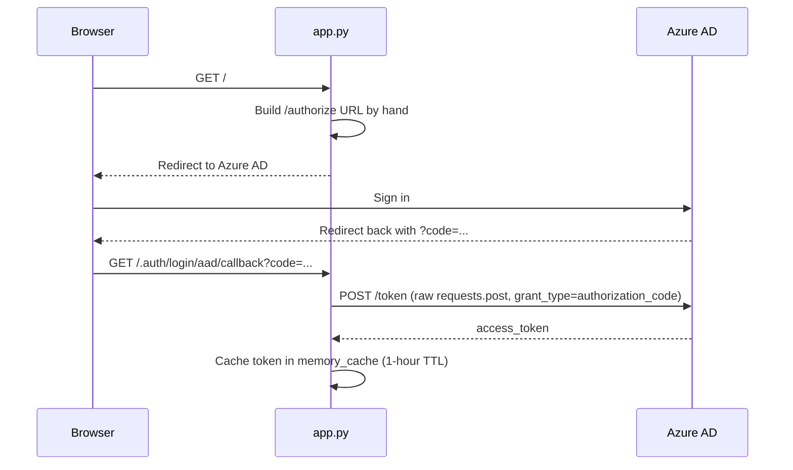

# 04 — Authentication, RBAC, and the Real MSAL/OAuth Split

## Where this chapter sits, and why it's more nuanced than "MSAL handles auth"

Most write-ups of an Azure AD-backed service say something like "the app uses MSAL for OAuth 2.0
authentication." The real code doesn't do that. The actual picture is more interesting — and more
quotable in an interview — than the textbook version. There are **three separate mechanisms** at work,
each doing a different job:

1. **User sign-in** is a **hand-rolled OAuth 2.0 authorization-code exchange**, using raw
   `requests.post` calls — not MSAL's own authorization-code helper.
2. **MSAL** (`msal.ConfidentialClientApplication`) is used for exactly two other things:
   **on-behalf-of** token acquisition (calling the feature-flag Config Service) and
   **client-credentials** token acquisition (the IWPB background purge job).
3. **Role/identity claims** come from **request headers**, not from validating the access token this
   service itself receives. The token is decoded, explicitly **not signature-verified**, relying on a
   trust boundary that sits upstream of this application.

Getting this layered picture right — instead of collapsing it into "MSAL does OAuth" — is exactly the
kind of precision that separates "I read about this" from "I built this."

## 1. User sign-in: manual authorization-code exchange, not MSAL

`app.py`'s `/` handler and its `/.auth/login/aad/callback` handler both do the same thing:



Build the Azure AD `/authorize` URL, redirect the browser to it. Once Azure AD redirects back with a
`?code=...`, exchange that code for a token with a **raw `requests.post`** call to Azure AD's token
endpoint:

```python
# app.py, read_root() — building the redirect (only reached once memory_cache says the token is missing/expired)
auth_url = (
    f"https://login.microsoftonline.com/{os.environ['AZURE_TENANT_ID']}/oauth2/v2.0/authorize?"
    f"&client_id={os.environ['IDENTITY_CLIENT_ID']}"
    f"&response_type=code"
    f"&redirect_uri={os.environ['IDENTITY_REDIRECT_URI']}"
    f"&response_mode=query"
    f"&scope={os.environ['IDENTITY_SCOPE']}"
    f"&state=12345"
)
return fastapi.responses.RedirectResponse(auth_url)

# ... once Azure AD redirects back with ?code=..., in the same handler:
token_url = f"https://login.microsoftonline.com/{os.environ['AZURE_TENANT_ID']}/oauth2/v2.0/token"

response = requests.post(
    token_url,
    data={
        "client_id": os.environ["IDENTITY_CLIENT_ID"],
        "client_secret": os.environ["MICROSOFT_PROVIDER_AUTHENTICATION_SECRET"],
        "scope": os.environ["IDENTITY_SCOPE"],
        "grant_type": "authorization_code",
        "redirect_uri": f"{os.environ['IDENTITY_REDIRECT_URI']}",
        "code": request.query_params["code"],
    },
)
response.raise_for_status()
access_token = "Bearer " + response.json()["access_token"]
memory_cache.store_data(request.session.get("access_token_id"), access_token)
```

There's no `msal.PublicClientApplication`, no `acquire_token_by_authorization_code(...)`, anywhere in
this path. It's a manual construction of the `/authorize` URL, followed by a manual, unabstracted POST
to `/token` with `grant_type=authorization_code`. `msal` is imported and used elsewhere in this same
file (see below), so this isn't a case of MSAL being unavailable — the sign-in flow specifically was
written by hand. (`state=12345` is a fixed, non-random value — worth noting candidly as a real CSRF
hardening gap in this flow if it comes up in a security-focused conversation. A production-grade
implementation would generate and validate a random, per-request `state`.)

Also worth noting: **`app.py` has no separate `/.auth/logout` or token-refresh handling.** The token
obtained here is cached in `memory_cache` with a flat 1-hour TTL (chapter 06). Once it expires, the
same `if memory_cache.is_data_expired(...)` check in `read_root()` simply redirects the user back
through this same exchange again. There's no silent refresh-token usage — every re-authentication is a
full interactive round trip.

## 2. MSAL's actual two jobs in this service

`app.state.ccapp` — a single `msal.ConfidentialClientApplication`, built once in `lifespan()` — is used
for exactly two purposes, neither of which is the interactive sign-in above.

**On-behalf-of (OBO), for the feature-flag Config Service** (`utils.get_feature_flags`):

```python
token = ccapp.acquire_token_on_behalf_of(
    user_assertion=user_assertion,          # the signed-in user's own access token
    scopes=[os.environ["IDENTITY_SCOPE"], "email"],
)
```

This exchanges the signed-in user's own access token for a new token scoped to the external "HSBC
INM-AI Config Service," still representing that user — used purely to fetch this app's feature flags
(`FEATURE_LOGICAL_SEPERATION`, `FEATURE_THIRD_PARTY_BOT`, `FEATURE_GREEN_TIME`, etc.) for
`app_id="HEXA"`. If this call fails with a `401`, it propagates straight to the user at initial page
load (`FULL_ARCHITECTURE.md` §13).

**Client-credentials, for the IWPB background purge job** (`iwpb_workflow._acquire_service_headers`):

```python
scope = os.environ.get("INGEST_API_SCOPE")
token_result = ccapp.acquire_token_for_client(scopes=[scope])
```

The hourly maintenance loop (chapter 06) runs with no logged-in user in the loop at all. So when it
needs to call `INGEST_API` to purge an expired, already-approved document, it gets an **app-only**
token representing the service itself, not any human. If `INGEST_API_SCOPE` isn't configured or the
token acquisition fails, the purge is skipped for that cycle and clearly logged — it does not crash the
sweep or block the other two responsibilities (reminders, auto-removal) in the same loop.

## 3. Role claims: an unverified JWT, and a trust boundary above this app

Every place this service needs the caller's AAD roles (`/role-check`, ultimately
`/upload-files/{use_case}`, etc., via the UI's gated dropdown) goes through `utils.get_user_role`:

```python
decoded_token = jwt.decode(
    request.headers["x-ms-token-aad-id-token"],
    options={"verify_signature": False},
)
user_roles = decoded_token["roles"]
```

Two things worth being precise about here:

- **This is not a resource-server-validates-a-bearer-token pattern.** The service never checks a
  signature, an `aud`, an `iss`, or an `exp` on this token. `verify_signature: False` is explicit in
  the code, and the token is read from an **incoming request header**
  (`x-ms-token-aad-id-token`), not extracted from an `Authorization: Bearer <token>` header the way a
  resource server normally validates a caller's credentials.
- **This relies on a trust boundary the app itself doesn't enforce.** `x-ms-token-aad-id-token` and
  `x-ms-client-principal-name` (used separately for approver identification — see below) are the kind
  of headers Azure App Service's built-in authentication ("Easy Auth"), or a reverse proxy in front of
  this app, would inject after having already validated the user — the app's own code comments
  describe them exactly this way.

  If something upstream of this FastAPI process is responsible for validating the ID token's signature
  and stripping/re-setting these headers before forwarding a request, trusting them unverified here is
  reasonable. If nothing upstream is guaranteed to strip a client-supplied `x-ms-token-aad-id-token`
  header before it reaches this app, an unverified `jwt.decode` here means a caller could in principle
  hand this endpoint an arbitrary unsigned token claiming any roles.

  **This is the most honest, most technically precise thing to say about this system's auth model in
  an interview**: the app itself does not independently verify the token it reads roles from — it
  depends entirely on whatever sits in front of it (App Service platform auth / a gateway) to have
  already done that verification and to guarantee the header can't be spoofed by an external caller.

## 4. RBAC: the AAD role → business-line mapping, exactly as coded

Covered in full with the feature-flag gating logic in chapter 03; the short version for this chapter's
purposes: `role_to_business_line` maps `stitt.ingester → IWPB`, `stitt.ingester.pilot → FEMA`,
`stitt.ingester.tpmb → TPMB`, `stitt.ingester.gtrm → GTRM`. `FEATURE_THIRD_PARTY_BOT` /
`FEATURE_GREEN_TIME` each add an "all preceding roles required" gate on top, for TPMB/GTRM
respectively. This is standard **role-based** access control: a caller's entitlement is determined
entirely by which AAD app roles were assigned to them, resolved from claims, with no reference to any
specific document or resource.

## 5. IWPB approver authorization: a separate, relationship-based pattern

This is the nuance most worth highlighting, because it's a genuinely different authorization *pattern*
from the role-based RBAC above — and conflating them is the kind of mistake an attentive interviewer
will probe for.

A user is treated as an approver for a business line **not** because of any AAD role, but because
their identity — resolved from a *different* header, `x-ms-client-principal-name`
(`iwpb_workflow.get_current_user_email`) — appears as `approver1_email_id` or `approver2_email_id` in
an **`ACTIVE`** row of the `approver_mapping` SQL table for that specific business line:

```python
def get_approver_business_lines(user_email: Optional[str]) -> List[str]:
    """Business lines for which `user_email` is a mapped, active approver."""
    with db_session() as session:
        statement = sqla.select(ApproverMapping).where(
            sqla.and_(
                sqla.func.upper(ApproverMapping.status) == "ACTIVE",
                sqla.or_(
                    sqla.func.upper(ApproverMapping.approver1_email_id) == user_email.upper(),
                    sqla.func.upper(ApproverMapping.approver2_email_id) == user_email.upper(),
                ),
            )
        )
        mappings = session.execute(statement).scalars().all()
    return list(dict.fromkeys(m.business_line for m in mappings if m.business_line))
```

`_ensure_authorized_approver` (called from both `approve_document` and `decline_document`) uses
exactly this function, and raises a `403 WorkflowError` if the caller's business line isn't in the
result.

**Why this is a distinct pattern, worth naming as such in an interview:**

| | RBAC (business-line visibility) | Approver authorization |
|---|---|---|
| What it answers | "Can this user see/upload to department X at all?" | "Can this specific user approve/decline documents for department X?" |
| Source of truth | AAD app role assignment (`roles` claim) | A row in a SQL table (`ApproverMapping`), maintained by whoever calls `/save-approver-details` |
| Granted by | An Azure AD administrator, via Enterprise Applications | Anyone with access to `/save-approver-details` — no distinct "admin" role gates this either |
| Identity source | `x-ms-token-aad-id-token` (decoded JWT `roles` claim) | `x-ms-client-principal-name` (a different header entirely) |
| Changes how | Requires an AAD role (re)assignment | A row update in `approver_mapping` — no AAD change needed |

This is a **data-driven / relationship-based** authorization pattern, not role-based — approver status
is a fact stored in application data (who is mapped to which business line), checked at read time,
rather than a claim baked into the caller's token.

It's a genuinely useful distinction to volunteer in an interview: *"we used two different
authorization mechanisms for two different questions — role-based RBAC decides what a user can *see*,
and a database-driven mapping decides what a specific user can *approve* — because forcing the
approver relationship into an AAD role would have meant an AAD administrator becoming a bottleneck for
every business-line-level approver reassignment, instead of letting the mapping be self-service through
the existing `/save-approver-details` endpoint."*

## `notebooks/04_role_to_business_line_rbac_demo.ipynb`

Implements `role_to_business_line`, the `FEATURE_THIRD_PARTY_BOT`/`FEATURE_GREEN_TIME`
all-roles-required gating, and `/role-check`'s full return logic as plain Python — exercised against
several synthetic role-sets and feature-flag combinations, matching the real algorithm in `app.py` line
for line, not a simplified stand-in. Run it alongside this chapter to see the exact branching (including
the "feature flag off → only the direct one-role-per-line mapping applies, no TPMB/GTRM upgrade" case)
play out over concrete inputs.

## Tying It Back

The layered picture — hand-rolled OAuth code exchange for sign-in, MSAL scoped narrowly to OBO and
client-credentials, unverified JWT claims trusted from an upstream boundary, AAD-role RBAC for
department visibility, and a completely separate, data-driven pattern for IWPB approver authorization —
is a stronger, more specific answer to "how does auth work in this service" than "OAuth 2.0 via MSAL."

It also sets up chapter 05 correctly: none of this authentication/authorization machinery has anything
to do with document versioning. Approver authorization decides *who* can approve a document, not
*which version* of a document is current — worth being able to draw that boundary cleanly if an
interviewer probes at the seam between the two.
