# 04 — Capco CI/CD Pipeline Implementation

> Resume bullet (verbatim): *"Implemented CI/CD pipelines: Used Azure devops to automate deployment
> and streamline development for developed services and platforms."*

## Business Context

Capco is a management and technology consultancy. On any given engagement, a GenAI backend
developer is rarely building for a single, stable production environment the way an in-house
product team might. Instead, the reality looks like this:

- **Multiple client environments at once.** Each client typically has its own isolated Azure
  subscription (sometimes its own tenant), its own approval process, and its own compliance
  requirements. What ships to Client A's dev environment cannot silently leak into Client B's.
- **Fast, frequent iteration on LLM-backed services.** The chatbot assistant in course
  [01-Capco-AI-Chatbot-Assistant](../01-Capco-AI-Chatbot-Assistant/00-README.md) and the document
  ingestion service referenced in course 05 (Document Uploader-Ingest Service) both change
  constantly during a consulting engagement — prompt tweaks, retrieval config changes, new API
  routes, model version bumps. Every one of those changes needs to reach a real environment
  quickly so the client can see progress, without a developer manually zipping up code and
  clicking through the Azure Portal.
- **Repeatability over heroics.** A consultancy can't afford deployments that only work because
  one engineer remembers the seven manual steps. When that engineer rotates onto the next
  engagement (which happens often in consulting), the next person needs a pipeline they can read,
  not a person they can ask.

This is exactly the gap CI/CD closes. "Implemented CI/CD pipelines... to automate deployment and
streamline development" is a compact way of saying: *turned a manual, error-prone, tribal-knowledge
release process into a repeatable, auditable, self-service one*, using Azure DevOps as the
orchestration layer, Docker to package the services consistently, Terraform to provision the Azure
infrastructure those services run on, and GitHub/Azure Repos for source control and pull-request
gating.

This course teaches CI/CD and infrastructure-as-code from first principles, then maps every concept
back to the plausible, typical way a Consultant-II on a GenAI engagement would have automated
deployment of the chatbot backend (course 01) and the document-uploader service (course 05).

> The exact pipeline stage names, YAML, and Terraform snippets below are a **typical/recommended
> implementation** for this class of engagement, written to be defensible and detailed in an
> interview — not a verbatim copy of Capco's proprietary pipeline files. What is *not* illustrative,
> per the root README's "Client & Production Context," is *what* these pipelines deployed: real,
> customer-facing production systems for **HSBC** and **Bank of America**, on **Azure App Service**,
> via **Azure DevOps**. Treat the mechanics as the story you tell in an interview, grounded in real
> DevOps practice; treat the client/production context as fact.

## Client & Production Deployment

These CI/CD pipelines were not a training exercise — they deployed the production, customer-facing
systems built across this Capco engagement to real banking clients:

- The **AI chatbot assistant** (course 01), the **model-risk-monitoring platform** (course 04), and
  the **document-uploader/ingest service** (course 05) all shipped through these pipelines to
  **Azure App Service**, orchestrated by **Azure DevOps**.
- Two named banking clients — **HSBC** and **Bank of America** — were served from what was
  substantially the same platform/codebase pattern. Because banking data-isolation requirements mean
  one bank's traffic, secrets, and data must never be reachable from the other's environment, the
  pipeline could not simply deploy one shared multi-tenant instance. Instead it deployed **isolated
  per-client environments**: separate Azure App Service instances (and, depending on the engagement's
  isolation requirements, separate resource groups or subscriptions) per bank, each backed by its own
  Azure DevOps **service connection** and **variable group** holding that bank's credentials and
  config — so a single pipeline *definition* could safely produce two (or more) completely isolated
  deployments.
- The production topology this pipeline deployed and validated on every release includes **Azure
  Front Door / Application Gateway (WAF)** at the edge, **VNet integration / Private Endpoints** so
  the app tier is never reachable over the public internet directly, **Azure AD** for authentication,
  and **Azure Monitor** for observability — all of it serving real daily customer and employee
  traffic, which is why smoke tests, approval gates, and rollback (chapter 04) aren't academic
  exercises here: a bad deploy is a real incident at a bank, not a demo hiccup.

## Candidate's Likely Role

As the backend developer for the chatbot and document-uploader services, the candidate was almost
certainly not a dedicated "DevOps engineer" — they were a developer who owned enough of the release
process for their own services to be productive without waiting on a separate platform team. That
typically means:

- Writing and maintaining the **Azure DevOps YAML pipeline** for the service(s) they built (build →
  test → containerize → deploy), rather than designing a company-wide DevOps platform from scratch.
- Writing or adapting **Terraform** for the specific Azure resources the service needed (App
  Service / Function App, Key Vault, maybe a database), likely building on shared modules or
  conventions already established for the client engagement.
- Using **GitHub or Azure Repos** with pull-request-gated branches so changes to the chatbot and
  uploader services went through review before merging to the branch that triggers deployment.
- Validating deployments with basic **smoke tests** (does `/health` return 200? does the chatbot
  respond?) before calling a release "done."

## Pipeline Diagram

```mermaid
flowchart LR
    DEV[Developer] -->|git push / PR merge| REPO[Git Repo\nGitHub / Azure Repos]
    REPO -->|CI trigger| BUILD[Build & Lint Stage]
    BUILD --> TEST[Unit / Integration Tests]
    TEST --> SCAN[Security & Dependency Scan]
    SCAN --> IMG[Container Build\nDocker image -> Registry]
    IMG --> PLAN[Terraform Plan]
    PLAN --> GATE{Approval Gate}
    GATE -->|approved| CLIENTSEL{Per-client stage matrix\nparameters.client}
    CLIENTSEL -->|client: HSBC\nHSBC service connection + variable group| APPLY_HSBC[Terraform Apply\nHSBC App Service / resource group]
    CLIENTSEL -->|client: BofA\nBofA service connection + variable group| APPLY_BOFA[Terraform Apply\nBofA App Service / resource group]
    APPLY_HSBC --> DEPLOY_HSBC[Deploy to HSBC's\nApp Service slot]
    APPLY_BOFA --> DEPLOY_BOFA[Deploy to Bank of America's\nApp Service slot]
    DEPLOY_HSBC --> SMOKE_HSBC[Smoke Test\nHSBC env]
    DEPLOY_BOFA --> SMOKE_BOFA[Smoke Test\nBofA env]
    SMOKE_HSBC -->|fail| ROLLBACK_HSBC[Rollback / Slot Swap Back\nHSBC only]
    SMOKE_BOFA -->|fail| ROLLBACK_BOFA[Rollback / Slot Swap Back\nBofA only]
```



Plain-text version, if diagram rendering isn't available:

```
git push / PR merge
   -> Build & Lint stage
   -> Unit/Integration Tests
   -> Security & Dependency Scan
   -> Container Build (Docker image -> Azure Container Registry)
   -> Terraform Plan
   -> [Approval Gate]
   -> Per-client stage matrix (same pipeline definition, parameters.client resolves the rest):
        -> client=HSBC:  HSBC service connection + HSBC variable group
                          -> Terraform Apply (HSBC App Service / resource group)
                          -> Deploy to HSBC's App Service slot -> Smoke Test (HSBC env)
                          -> (on failure) Rollback / Slot Swap Back, HSBC only
        -> client=BofA:  Bank of America service connection + Bank of America variable group
                          -> Terraform Apply (BofA App Service / resource group)
                          -> Deploy to Bank of America's App Service slot -> Smoke Test (BofA env)
                          -> (on failure) Rollback / Slot Swap Back, BofA only
```

This is the same shape whether the artifact being deployed is the chatbot API from course 01, the
model-risk-monitoring platform from course 04, or the FastAPI document-uploader service from course 05
— the pipeline doesn't care what the container runs, which is exactly the point of building it once
and reusing it. What *does* change per run is which client's isolated environment it targets: the
HSBC and Bank of America branches above are two invocations of the **same** pipeline template,
parameterized by client, deploying into two Azure App Service instances that never share a service
connection, variable group, or Terraform state file with each other — that isolation, not a shared
multi-tenant deployment, is the banking-grade requirement driving the fork. See chapter 02 for the
worked YAML implementing this pattern.

## STAR Summary (practice this out loud, under 90 seconds)

> **Illustrative — replace with your real numbers before the interview.** The structure and
> reasoning are sound; the specific metrics should be swapped for what you actually measured or a
> defensible estimate you're comfortable defending under follow-up questions.

**Situation.** At Capco, the GenAI chatbot assistant and the document-uploader/ingestion service I
was building — production systems serving HSBC and Bank of America customers and employees — were
being deployed manually — someone would build the Docker image locally, push it, and update Azure
App Service settings by hand. This was slow, inconsistent between environments, and risky: a missed
step could take a client-facing production environment down with no easy way to tell what had
changed.

**Task.** I was asked to automate the build-and-release process for these services so that changes
could move from a developer's pull request to a running environment reliably, without manual
intervention, and in a way that matched the client's dev/staging/prod environment structure.

**Action.** I built Azure DevOps YAML pipelines that triggered on pull-request merges to the main
branch: a build stage that installed dependencies and ran linting/unit tests, a container-build stage
that produced a versioned Docker image and pushed it to Azure Container Registry, and a deploy stage
that used Terraform to provision and update the underlying Azure App Service / Function App and Key
Vault resources before deploying the new image to a staging slot. I added a smoke-test step that hit
the service's health endpoint after each deploy, and gated promotion to production behind a manual
approval in Azure DevOps. Because the same platform pattern served two separate banking clients, I
set up isolated variable groups and service connections per client (HSBC and Bank of America each had
their own) so the same pipeline template could deploy to either bank's environment safely, with each
client's secrets pulled from that client's own Key Vault rather than stored in the pipeline or shared
across clients.

**Result.** *(Illustrative)* Deployment time for a routine change dropped from roughly half a day of
manual work to under 15 minutes of pipeline execution, and the rate of failed or rolled-back
deployments dropped by an estimated 60% once tests, scans, and smoke tests were gating every release
instead of relying on manual verification.

## How This Course Is Organized

| File | Covers |
|---|---|
| `01-cicd-fundamentals.md` | CI vs. CD vs. continuous deployment, pipeline stage purposes, trunk-based dev vs. GitFlow, why pipelines matter for LLM services specifically |
| `02-azure-devops-pipelines-yaml.md` | Azure DevOps YAML syntax (stages/jobs/steps/templates), variable groups, service connections, triggers, a worked pipeline for a containerized FastAPI app |
| `03-infrastructure-as-code-with-terraform.md` | Terraform fundamentals (providers, resources, state, plan/apply, modules), a worked `.tf` example for App Service + Key Vault |
| `04-release-strategies-and-environments.md` | Blue-green, canary, rolling, deployment slots, environment promotion, approval gates, rollback |
| `05-github-vs-azure-repos-branching.md` | Branching strategies, PR gates/required reviewers, GitHub Actions vs. Azure DevOps Pipelines |
| `06-multi-service-version-pinning-and-environment-drift.md` | The honest answer to "if you roll back one of three independently-versioned services, how do you keep the environment from ending up in an inconsistent combination of versions" — today's gap, a manual compatibility-matrix workaround, a proposed release-manifest design, and the forward tie to course 04's monitoring platform |
| `07-production-resilience-and-operational-engineering.md` | Pipeline-stage-by-stage failure/rollback table, concurrency traps (state-lock contention, an un-versioned shared manifest write), four concrete CI/CD bug narratives, real timeout/retry values, and one candidly-named policy-as-code hardening gap |
| `99-Interview-QA.md` | Behavioral, technical, system-design, and "what would you change" interview Q&A |
| `notebooks/` | Five runnable Jupyter notebooks that simulate/validate pipeline concepts offline |

Read in order — each chapter builds on the last, and the notebooks are meant to be run alongside the
chapter with the matching topic (pipeline YAML, Terraform plan output, post-deploy smoke tests, the
version-compatibility-matrix validator, and the Terraform plan-diff safety gate).

Before naming HSBC or Bank of America out loud to an interviewer, check what your actual NDA/engagement
letter allows — see the confidentiality note in the root [README.md](../README.md).
