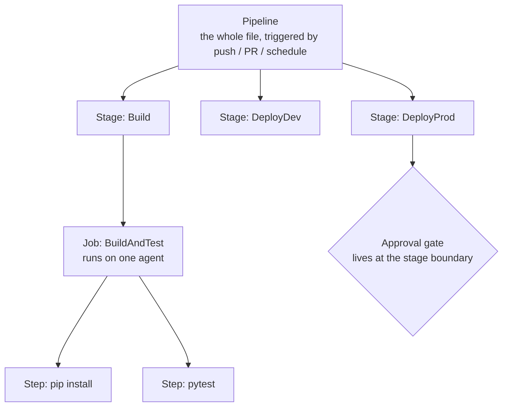
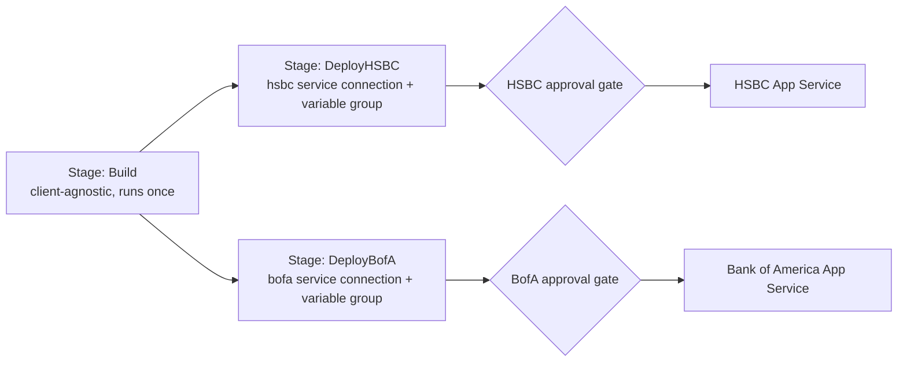

# 02 — Azure DevOps Pipelines YAML

## Why this chapter matters

"Used Azure DevOps to automate deployment" is the resume bullet's exact phrasing. Azure DevOps
Pipelines is almost certainly the concrete tool the candidate used day-to-day.

This chapter covers the YAML pipeline model in enough depth to write one from scratch in an
interview whiteboard/live-code setting. Then it walks through a realistic pipeline for deploying a
containerized FastAPI app — the shape of both the chatbot backend (course 01) and the
document-uploader service (course 05, built with FastAPI, SQLAlchemy as the ORM, and RBAC via
MSAL/OAuth 2.0 against Azure AD) — to Azure App Service.

## The YAML Object Model: Stages, Jobs, Steps

Azure Pipelines YAML has a strict nesting hierarchy. Understanding *why* it's nested this way — not
just the syntax — is what separates "I copy-pasted a pipeline" from "I understand what I'm
configuring."



- **Pipeline** — the whole file. It's the top-level unit, triggered by an event (a push, a PR, a
  schedule).
- **Stage** — a major phase of the pipeline (for example `Build`, `DeployDev`, `DeployProd`). Stages
  run sequentially by default, but they can run in parallel, and each stage can depend on and
  consume the outputs of a previous stage. Stages are the natural boundary for **approval gates** —
  you gate entry into a stage, not entry into a job or step.
- **Job** — a unit of work that runs on a single agent (a VM or container that executes your steps).
  A stage can have multiple jobs, and jobs within a stage run in parallel by default unless you
  declare dependencies between them. Jobs are the boundary for **agent pool selection** — for
  example, a Linux container-build job vs. a Windows-specific job.
- **Step** — the smallest unit: a single script invocation, or a pre-built **task** (published by
  Microsoft or the community, like `Docker@2` or `AzureWebApp@1`). Steps within a job run
  sequentially on the same agent and share filesystem state.

```yaml
# Minimal skeleton showing the nesting
stages:
  - stage: Build
    jobs:
      - job: BuildAndTest
        pool:
          vmImage: 'ubuntu-latest'
        steps:
          - script: pip install -r requirements.txt
            displayName: 'Install dependencies'
          - script: pytest --junitxml=test-results.xml
            displayName: 'Run unit tests'
```

The mental model worth stating out loud in an interview: **stage = phase + gate boundary, job =
machine + parallelism boundary, step = command.** Getting this hierarchy right is what lets you
reason about where to put an approval gate (stage), where to put a parallel matrix build (job), and
where to put a shell command (step).

## Templates: DRY-ing Up Multi-Service Pipelines

On a consulting engagement, the same pipeline shape — build → test → containerize → deploy — repeats
across every service and every client environment. Azure Pipelines supports **templates**: reusable
YAML fragments, parameterized like functions, built specifically to avoid copy-pasting that shape.

```yaml
# templates/deploy-webapp.yml
parameters:
  - name: environmentName
    type: string
  - name: azureSubscription
    type: string
  - name: webAppName
    type: string

steps:
  - task: AzureWebApp@1
    inputs:
      azureSubscription: ${{ parameters.azureSubscription }}
      appName: ${{ parameters.webAppName }}
      containers: '$(imageRepository):$(Build.BuildId)'
```

```yaml
# azure-pipelines.yml — reuses the template per environment
stages:
  - stage: DeployDev
    jobs:
      - deployment: DeployDevJob
        environment: 'dev'
        strategy:
          runOnce:
            deploy:
              steps:
                - template: templates/deploy-webapp.yml
                  parameters:
                    environmentName: dev
                    azureSubscription: 'client-dev-service-connection'
                    webAppName: 'chatbot-dev-app'
```

This is the mechanism that lets one pipeline definition deploy the chatbot service to Client A's dev
subscription and Client B's dev subscription without duplicating logic. Only the parameters change.

## Variable Groups and Service Connections

Two Azure DevOps constructs exist specifically to keep secrets and environment-specific config *out*
of the YAML file — and that matters a lot once you're managing multiple client subscriptions.

- **Variable groups** are named sets of key-value pairs (optionally backed by Azure Key Vault),
  defined once in the Azure DevOps Library and referenced by name from any pipeline. A pipeline
  deploying to a client's environment references that client's variable group (`clientA-dev-vars`)
  instead of hardcoding connection strings or app names inline.
- **Service connections** are the authenticated bridge between Azure DevOps and an external system —
  most commonly an Azure subscription (via a service principal or workload identity), but also a
  container registry or GitHub. An admin scopes and permissions a service connection once. After
  that, pipelines reference it by name and never see the underlying credential.

```yaml
variables:
  - group: chatbot-dev-secrets   # pulls KEY_VAULT_URI, DB_CONNECTION_STRING, etc.

steps:
  - task: AzureCLI@2
    inputs:
      azureSubscription: 'client-dev-service-connection'   # service connection, not a raw credential
      scriptType: bash
      scriptLocation: inlineScript
      inlineScript: |
        az webapp config appsettings set --name $(webAppName) \
          --settings KEY_VAULT_URI=$(KEY_VAULT_URI)
```

For a multi-client consulting setup, this pairing — one variable group and one service connection
per client environment, referenced by parameterized templates — is the practical answer to "how do
you keep Client A's secrets from ever touching Client B's pipeline run."

## Triggers: CI, PR, and Scheduled

- **CI triggers** fire a pipeline run when commits land on specified branches, typically `main`
  after a PR merge. This is what drives the "every merge builds and deploys to dev" behavior.
  ```yaml
  trigger:
    branches:
      include: [main]
    paths:
      exclude: [docs/*]
  ```
- **PR triggers** fire a *validation* run — build + test, no deploy — when a pull request is opened
  or updated, without touching any real environment. This is the mechanism behind "tests must pass
  before this PR can merge."
  ```yaml
  pr:
    branches:
      include: [main]
  ```
- **Scheduled triggers** fire on a cron-like schedule, independent of code changes. These are useful
  for nightly full regression suites, dependency-vulnerability re-scans, or periodic infrastructure
  drift checks — for example, running `terraform plan` nightly to confirm the real environment still
  matches the Terraform state.
  ```yaml
  schedules:
    - cron: '0 2 * * *'
      displayName: 'Nightly full test + drift check'
      branches:
        include: [main]
      always: true
  ```

## Worked Example: Containerized FastAPI App to Azure App Service

Putting it together — a pipeline shaped like the one that deployed the document-uploader service
(course 05: FastAPI, SQLAlchemy ORM, RBAC via MSAL/OAuth 2.0, Docker, Azure App Service):

```yaml
trigger:
  branches:
    include: [main]

pr:
  branches:
    include: [main]

variables:
  - group: uploader-svc-vars
  - name: imageRepository
    value: 'document-uploader'
  - name: dockerRegistryServiceConnection
    value: 'client-acr-connection'

stages:
  - stage: Build
    jobs:
      - job: BuildTestScan
        pool:
          vmImage: 'ubuntu-latest'
        steps:
          - script: pip install -r requirements.txt && flake8 app/
            displayName: 'Install deps + lint'
          - script: pytest --junitxml=test-results.xml
            displayName: 'Unit + integration tests'
          - task: PublishTestResults@2
            inputs:
              testResultsFiles: 'test-results.xml'
          - task: Docker@2
            displayName: 'Build and push image'
            inputs:
              containerRegistry: $(dockerRegistryServiceConnection)
              repository: $(imageRepository)
              command: buildAndPush
              tags: |
                $(Build.BuildId)
                latest

  - stage: DeployDev
    dependsOn: Build
    jobs:
      - deployment: DeployToDev
        environment: 'uploader-dev'
        pool:
          vmImage: 'ubuntu-latest'
        strategy:
          runOnce:
            deploy:
              steps:
                - task: AzureWebApp@1
                  inputs:
                    azureSubscription: 'client-dev-service-connection'
                    appName: 'document-uploader-dev'
                    containers: '$(imageRepository):$(Build.BuildId)'
                - script: python scripts/smoke_test.py --url https://document-uploader-dev.azurewebsites.net
                  displayName: 'Post-deploy smoke test'

  - stage: DeployProd
    dependsOn: DeployDev
    condition: succeeded()
    jobs:
      - deployment: DeployToProd
        environment: 'uploader-prod'   # environment has a configured approval check in Azure DevOps
        pool:
          vmImage: 'ubuntu-latest'
        strategy:
          runOnce:
            deploy:
              steps:
                - task: AzureWebApp@1
                  inputs:
                    azureSubscription: 'client-prod-service-connection'
                    appName: 'document-uploader-prod'
                    containers: '$(imageRepository):$(Build.BuildId)'
```

Two framework-specific details are worth calling out explicitly, since they're the only parts of
this pipeline that actually differ from a generic Python web service:

- `requirements.txt` (installed in the `Install deps + lint` step) pulls in `fastapi`,
  `uvicorn[standard]`, `sqlalchemy`, and `msal`, rather than `flask` — those are the real
  dependencies of the document-uploader service (course 05).
- The image built by the `Docker@2` step runs the app via `uvicorn` inside the container (see course
  05's Dockerfile `CMD` for the exact invocation), not `gunicorn`+Flask.

The `Post-deploy smoke test` step hits the service's FastAPI `/health` endpoint —
`scripts/smoke_test.py` appends `/health` to the `--url` value (see notebook 03) — exactly the same
way it would for any other framework. That's the point made below about the pipeline being
framework-agnostic.

Note the `environment: 'uploader-prod'` line in the last stage. In Azure DevOps, an **Environment**
resource can have manual-approval checks configured on it directly, so a deployment job targeting it
automatically pauses for sign-off without any extra pipeline logic. That's the concrete mechanism
behind "approval gate before production," covered further in chapter 04.

This same pattern — lint/test → containerize → deploy-to-dev-with-smoke-test → gated deploy-to-prod
— is the one worth describing when an interviewer asks you to sketch a pipeline live. It's
tool-neutral in structure, even though the syntax above is Azure DevOps-specific.

## Extending the Worked Example: One Pipeline, Two Isolated Banking Clients

The worked example above deploys a single service to a single client's dev/prod environments. In
practice, the chatbot, model-risk-monitoring, and document-uploader services in this course all
deployed to **two separate banking clients — HSBC and Bank of America** — from the same codebase and
the same pipeline definition.

Duplicating the whole `azure-pipelines.yml` per client would mean two places to keep in sync every
time the pipeline itself changed — exactly the maintenance problem templates (above) exist to solve.
The fix is a **client-parameterized deployment template** plus a **stage matrix**, so the pipeline
definition stays single while the *deployment* fans out per client.



First, the per-client deploy logic becomes a parameterized template — the same idea as
`templates/deploy-webapp.yml` above, but explicitly keyed on client:

```yaml
# templates/deploy-to-client.yml
parameters:
  - name: client            # 'hsbc' or 'bofa'
    type: string
  - name: serviceConnection
    type: string
  - name: variableGroup
    type: string
  - name: webAppName
    type: string
  - name: environmentName   # Azure DevOps Environment resource, e.g. 'uploader-hsbc-prod'
    type: string

jobs:
  - deployment: DeployTo_${{ parameters.client }}
    environment: ${{ parameters.environmentName }}
    pool:
      vmImage: 'ubuntu-latest'
    variables:
      - group: ${{ parameters.variableGroup }}
    strategy:
      runOnce:
        deploy:
          steps:
            - task: AzureWebApp@1
              inputs:
                azureSubscription: ${{ parameters.serviceConnection }}
                appName: ${{ parameters.webAppName }}
                containers: '$(imageRepository):$(Build.BuildId)'
            - script: python scripts/smoke_test.py --url https://$(webAppName).azurewebsites.net
              displayName: 'Post-deploy smoke test — ${{ parameters.client }}'
```

Then the top-level pipeline drives a **stage matrix**: one deploy stage per client, each instantiated
from the same template with that client's own `serviceConnection`, `variableGroup`, and
`environmentName` — the values that actually enforce isolation:

```yaml
# azure-pipelines.yml — per-client stage matrix, added after the Build stage
stages:
  - stage: Build
    jobs: [ ... ]   # same Build stage as the worked example above — client-agnostic, runs once

  - stage: DeployHSBC
    dependsOn: Build
    jobs:
      - template: templates/deploy-to-client.yml
        parameters:
          client: 'hsbc'
          serviceConnection: 'hsbc-prod-service-connection'
          variableGroup: 'hsbc-prod-secrets'
          webAppName: 'document-uploader-hsbc-prod'
          environmentName: 'uploader-hsbc-prod'   # has its own approval check, HSBC approvers only

  - stage: DeployBofA
    dependsOn: Build
    jobs:
      - template: templates/deploy-to-client.yml
        parameters:
          client: 'bofa'
          serviceConnection: 'bofa-prod-service-connection'
          variableGroup: 'bofa-prod-secrets'
          webAppName: 'document-uploader-bofa-prod'
          environmentName: 'uploader-bofa-prod'   # has its own approval check, Bank of America approvers only
```

Three things make this actually isolated, not just organized:

1. **`DeployHSBC` and `DeployBofA` both depend only on `Build`**, not on each other. They run as
   independent stages, so a failure or rollback in one client's deployment has zero effect on the
   other's, and there's no shared "combined deploy" step where a bug could cross-wire the two.
2. **The service connection and variable group are the actual isolation boundary.** The YAML
   parameter is just a label. What stops the HSBC stage from ever touching Bank of America's Azure
   subscription is that `hsbc-prod-service-connection` is scoped — via RBAC on the underlying
   service principal — to only HSBC's subscription/resource group, and `hsbc-prod-secrets` only
   ever contained HSBC's Key Vault URI and connection strings. Swapping the parameter values swaps
   the entire target environment. There's no code path where a client's data or credentials could
   leak into the other's pipeline run.
3. **Each client's `environment:` resource carries its own approval gate.** HSBC's production
   sign-off and Bank of America's production sign-off are two separate, independently-configured
   Azure DevOps checks. One client's approver list has no visibility into or control over the
   other's deployment.

The pattern generalizes cleanly. Adding a third banking client later means adding one more stage —
or, if the client roster grows further, converting the stage list into a proper `matrix` strategy
driven by a client list stored in a variable/parameters file. The template and the Build stage never
change.
