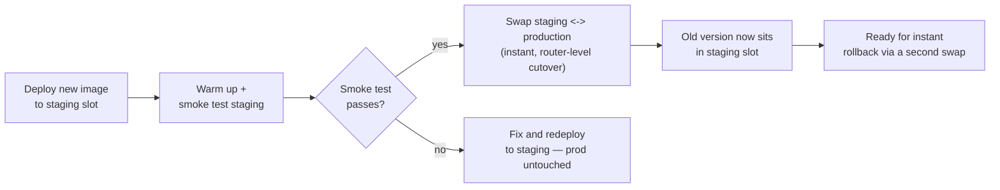
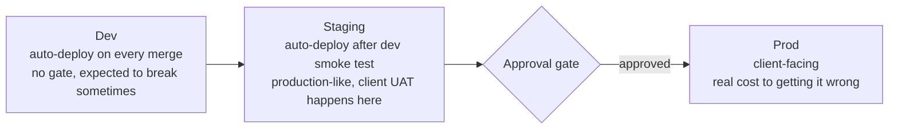

# 04 — Release Strategies and Environments

## Why this chapter matters

Getting a container built and a pipeline green is only half the job. *How* the new version actually
reaches users — and what happens if it's broken — is a separate set of decisions with real
tradeoffs.

Interviewers probe this heavily ("blue-green vs. canary — when would you pick one?") because it's
where "I ran a pipeline" and "I understand deployment risk" diverge. This chapter covers the standard
release strategies, how environments get promoted, where approval gates belong, and how rollback
actually works — all grounded in deploying the chatbot (course 01) and document-uploader (course 05)
services to Azure App Service.

## Deployment Strategies

**Rolling deployment** replaces instances of the old version with the new version incrementally —
two servers at a time out of ten, say — so the service never goes fully down. But for a window, both
old and new versions are serving traffic at the same time. This is the default behavior for most
managed compute (App Service scale-out instances, Kubernetes rolling updates). It's simple and
resource-efficient, but that "both versions live at once" window means your API/schema needs to stay
backward-compatible for the duration of the rollout.

**Blue-green deployment** runs two complete, identical environments — "blue" (currently live) and
"green" (the new version) — side by side, fully deployed and warmed up. Traffic cuts over from blue
to green all at once, typically via a router/load-balancer swap, or, in Azure App Service's case, a
**slot swap**. The old "blue" environment keeps running, untouched, for a period after cutover —
which makes rollback nearly instant: just swap back. The cost is running two full environments
during the transition, and the fact that the cutover is all-or-nothing, with no gradual traffic
ramp.

**Canary deployment** routes a small percentage of real traffic (5%, then 25%, then 100%) to the new
version, while the rest keeps hitting the old version. It watches error rates, latency, and business
metrics at each step before increasing the new version's share. This catches problems that only show
up under a slice of real production traffic — a rare input pattern, an edge-case client — while
limiting the blast radius of a bad release to a small fraction of users. It's the most operationally
complex of the three: it needs traffic-splitting infrastructure and real-time monitoring to decide
whether to proceed or roll back at each step.

**Azure App Service deployment slots** are the concrete mechanism that makes blue-green — and a
simplified canary — practical without extra infrastructure. An App Service can have a `staging` slot
that's a fully separate, warmed-up instance of the app with its own URL. A **slot swap** operation
atomically exchanges the `staging` and `production` slot's routing, with a warm-up request against
the new slot before the swap completes, so there's no cold-start penalty for the first real users.

For the chatbot and document-uploader services in this curriculum, slot-based blue-green is the
practical default: it's built into App Service (no extra infrastructure needed), it gives an
instant, low-drama rollback path (swap back), and it doesn't require the traffic-splitting tooling
canary needs. Canary becomes the better choice specifically when a change is higher-risk and you
want to limit exposure gradually — for example, swapping the chatbot's underlying model deployment
or retrieval configuration, where you'd rather see how 10% of real conversations go before
committing all traffic to it.

## Why Slots Specifically Matter Here: This Is a Bank's Production System

It's worth being explicit about *why* deployment-slot blue-green isn't just a nice-to-have for these
services. The chatbot, the model-risk-monitoring platform, and the document-uploader all run in
**production, on Azure App Service, serving real HSBC and Bank of America customers and employees
during business hours**. That changes the cost-benefit calculation on zero-downtime deploys
considerably, compared to an internal tool or a pre-launch product:

- **A bad deploy during business hours is a real incident, not an inconvenience.** If the chatbot
  API goes down mid-afternoon because a new container failed to start, that's a bank employee or
  customer hitting an error on a live system — not a Slack message to a small internal user base who
  can wait twenty minutes. At a bank, that kind of outage gets escalated, logged, and potentially
  reported, depending on the client's incident-severity policy.
- **Deploy windows can't just be "whenever CI finishes."** A rolling deployment's brief
  old-version/new-version overlap, or a hard-cutover deploy with a few seconds of downtime, is
  tolerable for a low-traffic internal service. It's a much harder sell for a system a bank's
  customers are actively using at 2pm on a Tuesday. Slot-based blue-green sidesteps this entirely —
  the new version is fully deployed and warmed up in the `staging` slot *before* any real traffic
  sees it, and the swap itself is a router-level operation on the order of seconds, not a redeploy.
- **Rollback speed is the difference between a near-miss and a documented incident.** Because the
  previous version is still sitting, warm, in the slot that was just swapped out, "this deploy broke
  something" becomes a single swap-back command — typically faster than the time it takes to even
  finish triaging *why* it broke. For a system serving real bank customers, being able to say "we
  reverted in under a minute" versus "we redeployed the previous image, which took ten minutes to
  pull and start" is a meaningful difference in customer impact. It's the kind of detail worth citing
  directly if an interviewer asks why you specifically chose slots over a plain redeploy-based
  rollback.
- **Isolation compounds with this.** Because HSBC and Bank of America each have their own App
  Service instance (chapter 02), a bad deploy — and its slot-swap rollback — is also contained to
  *one bank's* environment. A broken release pushed to HSBC's slot has no way to affect Bank of
  America's production traffic, since there's no shared App Service, slot, or deployment between
  them.

The net effect: for an internal or pre-production tool, the operational overhead of slots (running a
second warmed instance during every deploy) might not be worth it. For a customer-facing banking
production system, it's close to mandatory — it's the mechanism that turns "we deploy during
business hours" from a risky proposition into a routine one.

## When to Pick Which

| Strategy | Best when | Cost/complexity |
|---|---|---|
| Rolling | Low-risk, routine changes; stateless service; backward-compatible API | Low — usually the platform default |
| Blue-green (slots) | Need instant, reliable rollback; can tolerate running 2x environment briefly | Low-medium on App Service (slots are built in) |
| Canary | High-risk change (model swap, major prompt/logic change); want to limit blast radius; have real-time metrics to watch | High — needs traffic splitting + monitoring discipline |

A clean interview answer to "blue-green vs. canary, when would you pick one": *blue-green when I
want a clean, instant, all-or-nothing rollback and the change is well-tested but I want a safety
net; canary when the change itself is uncertain enough that I want to observe real production
behavior on a subset of traffic before fully committing — e.g., I'd canary a change to the chatbot's
system prompt or retrieval logic, but I'd be comfortable blue-green swapping a routine dependency
bump.*

## Environment Promotion: Dev -> Staging -> Prod

The standard promotion chain exists to apply increasing scrutiny as risk increases.

- **Dev** — deployed automatically on every merge to main, no gate. Fast feedback for the team;
  expected to be occasionally broken. Uses lower-cost SKUs and may use synthetic/sample data.
- **Staging** — deployed automatically after dev's smoke test passes, but represents a
  production-like environment (same SKU tier where feasible, same Terraform module, realistic data
  volumes), so it's a meaningful signal, not just a second dev. This is where a client's UAT (user
  acceptance testing) typically happens on a consulting engagement.
- **Prod** — deployed only after an explicit approval (see below), and only after staging has been
  verified. The client-facing environment; changes here are the ones with real cost to getting
  wrong.

The same build artifact — the exact Docker image, identified by its immutable tag — should flow
through all three environments unchanged. You promote the *artifact*; you don't rebuild it per
environment. Rebuilding per environment reintroduces the "works in staging, different bits in prod"
risk that immutable, versioned artifacts (chapter 01) exist to eliminate.

## Approval Gates

An approval gate is a deliberate pause point where a human — or an automated policy check — must
sign off before the pipeline proceeds, most commonly before the prod stage. In Azure DevOps this is
configured as a **Check** on an **Environment** resource (referenced in chapter 02's worked example
as `environment: 'uploader-prod'`). The deployment job targeting that environment automatically
pauses and notifies the configured approvers, and only proceeds once approved — or is cancelled on
rejection/timeout.

Gates don't have to be purely manual. Common automated gate conditions include:

- All smoke tests green
- No open critical vulnerabilities from the security scan
- For infrastructure changes: a reviewed and approved `terraform plan` output with no unexpected
  destroys

The combination of "automated gates for objective checks + manual gate for business judgment" is the
realistic setup for a client-facing prod deployment, and it's worth naming explicitly as *both* —
not just "someone clicks approve."

## Rollback Strategies

Rollback needs to be planned before a release goes out, not improvised during an incident. Here are
the practical options, roughly in order of speed:

1. **Slot swap back** (fastest, seconds) — if deployed via blue-green slots, swap production back to
   the previous slot. Works for a bad application-code deploy where the infrastructure itself didn't
   change.
2. **Redeploy previous artifact tag** (fast, minutes) — since artifacts are immutable and versioned
   (chapter 01), redeploying the last known-good image tag via the same pipeline is a routine,
   low-risk operation, not a special "rollback pipeline."
3. **Terraform revert** (slower, needs care) — if the *infrastructure* changed (a new resource, a
   changed SKU) and that change caused the problem, rolling back means reverting the `.tf` change in
   Git and running `plan`/`apply` again. This gets the same review rigor as the original change,
   since a rushed infra rollback can itself cause an outage — for example, destroying a resource
   that now has dependent data.
4. **Feature flag disable** (fastest when available) — if the risky change was gated behind a
   feature flag rather than a full deploy, flipping the flag off is instant and doesn't require a
   redeploy at all. This is the strongest argument for using flags on genuinely risky changes — for
   example, a new retrieval strategy for the chatbot — rather than relying on deploy/rollback alone.

The single most important design decision that makes all of these possible is treating both
application artifacts and infrastructure as versioned, declarative, and stored in Git. Rollback is
only "redeploy a known-good version" if a known-good version was preserved and identifiable in the
first place.
