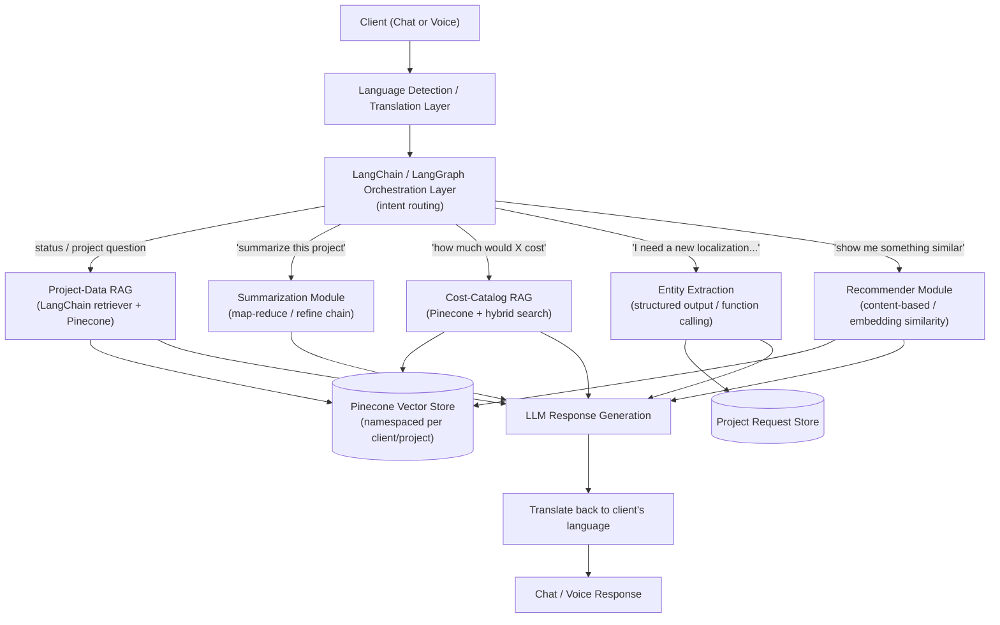
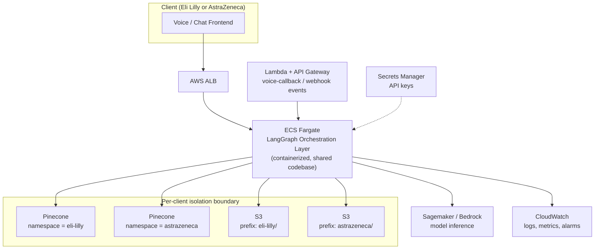

# 06 — Indegene GenAI Virtual Liaison Platform

> Resume bullet (verbatim): *"Generative AI-powered Virtual Liaison platform. Developed this
> chat/Voice-enabled platform where clients can interact in their preferred language about anything
> concerned with Project Creation, Modification, or Localization. The GPT-powered system involved
> facilities like RAG-enabled Project-based data retrieval using langchain & pinecone, concise
> project tracking & summarization, RAG-enabled Cost catalog generation system, Entity-extraction-based
> Project demand capture & multiple Recommender Systems."*

## If you have an interview coming up: read Chapter 8 first

This course is the strongest direct analog in the whole curriculum to course 3's "how do you handle
revised versions of a document" chapter — same underlying failure mode, one layer down the stack.
Course 3 asks whether the document store knows which upload is current; **Chapter 8
(`08-vector-index-staleness-and-document-revision-handling.md`)** asks the same question about
Pinecone: when a project's status, a cost-catalog entry, or a document changes at the source, how do
you keep the RAG pipeline from retrieving and confidently answering from the old, stale vector? Q1 in
`99-Interview-QA.md` is the compressed, interview-ready version of that same answer. Chapter 9
(`09-production-resilience-and-operational-engineering.md`) is this course's counterpart to course 3's
production-resilience chapter — the real-shaped error-handling table, scaling caveats, bug stories, and
timeout values for a RAG/LangGraph platform.

## Business Context

Indegene is a digital-first life sciences commercialization company — it runs the operational
machinery (content production, regulatory submissions, medical affairs, commercial campaigns) that
lets pharma and biotech clients get products to market and keep them compliant once they're there.
A huge share of that work happens through **projects**: a client requests a piece of localized
promotional content, a regulatory document package, a training deck, or a campaign asset, and an
Indegene delivery team creates, revises, and localizes it against a cost catalog and a set of
process rules.

Historically, a client "liaison" — a person — fielded requests like *"what's the status of the Japan
localization for Project X"*, *"how much would a French + German localization of this asset cost"*,
or *"I need a new promotional deck for this molecule, similar to what we did last quarter"*. Those
questions are repetitive, span structured data (cost catalogs, project metadata) and unstructured
data (project notes, prior deliverables), and clients increasingly want to ask them in their own
language, by voice or by chat, at any hour. That's the problem the **Virtual Liaison platform**
solves: an internal, GPT-powered assistant that stands in for the human liaison for the
long tail of routine project questions, freeing the human liaison for judgment calls and
relationship work.

## Client & Production Deployment

This platform ran in **production, customer-facing** at Indegene for two real pharma clients, **Eli
Lilly** and **AstraZeneca** — a live chat/voice interface that real client-side project teams used
daily to check project status, get cost estimates, and log new requests, not an internal demo or
proof-of-concept. Because it's a real-time conversational surface (chat and, notably, voice), latency
budgets mattered here more than in almost any other project on the resume: a RAG-retrieval-plus-
generation round trip that's tolerable in an async ticketing system reads as a broken, unresponsive
assistant on a live voice call.

The orchestration layer (Chapter 7's LangGraph graph) ran as containerized services on **AWS ECS
(Fargate)** behind an **ALB**, calling out to **Pinecone** (namespaced per client — see Chapter 2) for
retrieval and to **Sagemaker** or **Bedrock**-hosted models for inference where self-hosted, with
**Lambda + API Gateway** handling lightweight webhook/event endpoints such as voice-callback handling,
**S3** (per-client prefixes) feeding the RAG pipelines with source documents, **CloudWatch** for
end-to-end observability, and **Secrets Manager** for API keys and credentials.

Because Eli Lilly and AstraZeneca are competing pharma companies served by the **same** orchestration
platform, this is the most multi-tenant-sensitive project in the curriculum: their project data, cost
catalogs, and conversation history must be strictly isolated — separate Pinecone namespaces per
client, separate S3 prefixes, IAM scoping, and per-client conversation memory that never crosses over
— even though one shared codebase and one shared set of ECS services handle both clients' traffic.
Chapter 2 covers the Pinecone-namespace side of this in depth; Chapter 7 covers why ECS Fargate
(rather than pure Lambda) is the right home for this kind of stateful, latency-sensitive orchestration.

## Candidate's Likely Role & Architecture

As the Data Scientist building this platform, the candidate's role spanned the full GenAI
orchestration layer — not training a foundation model, but composing one (GPT-class, via an LLM
API) with retrieval, memory, and task-specific sub-systems into a single conversational product.
Reading the resume bullet closely, this project is really **five features wearing one chat/voice
UI**:

1. **RAG-enabled project data retrieval** (LangChain + Pinecone) — answer "what's the status of
   Project X" by retrieving the right project's data, not by hoping the LLM already knows it.
2. **Concise project tracking & summarization** — turn a long history of project notes, revisions,
   and status updates into a short, current summary on demand.
3. **RAG-enabled cost catalog generation** — answer localization/production cost questions by
   retrieving from a structured cost catalog rather than letting the model guess prices.
4. **Entity-extraction-based project demand capture** — when a client describes a *new* need in free
   text ("I need this localized into Japanese and Korean by end of quarter"), extract it into a
   structured project-request record (asset type, languages, deadline, region) instead of relying on
   a rigid form.
5. **Multiple recommender systems** — suggest similar past projects, relevant cost-catalog items, or
   likely-next-steps based on what's being discussed.

All five sit behind one chat/voice front end with multilingual input, which means an early routing
decision — "is this request status/RAG, cost/RAG, summarization, new-demand-capture, or a
recommendation ask?" — has to happen before any of the five sub-systems fire. That routing problem is
exactly what Chapter 7 (LangGraph) formalizes.

> The production deployment facts above (Eli Lilly, AstraZeneca, AWS ECS Fargate, Pinecone,
> per-client isolation) are real, per the root `README.md`'s "Client & Production Context" section.
> The **internal wiring below** — exact node names, function signatures, which sub-system fires on
> which phrase — is still a **typical/recommended architecture**: a teaching model built from the
> resume bullet to be a defensible, technically sound story, not a verified line-by-line description
> of Indegene's proprietary implementation. Use it as the story you tell in an interview, backed by
> the concepts in this course, not as a claim about internal systems you don't have authorization to
> describe in detail.

## Architecture Diagram

### Logical / Feature Architecture

The diagram below shows how a single client message gets routed to the right sub-system — this is the
"what" (Chapters 1–7 each build one box). The **Production Deployment Architecture** further down
shows the "where it runs" (the AWS topology from the section above).



Plain-text version, if diagram rendering isn't available:

```
Client (chat/voice, any language)
  -> Language Detection / Translation
  -> LangChain / LangGraph orchestration layer (routes the query by intent)
       -> Project-data RAG (LangChain retriever -> Pinecone, namespaced per client/project)
       -> Summarization module (map-reduce / refine over project history)
       -> Cost-catalog RAG (Pinecone + hybrid sparse/dense search over SKUs)
       -> Entity extraction (structured output -> new project-request record)
       -> Recommender module (content-based / embedding similarity over past projects, catalog items)
  -> LLM response generation (grounded in whichever sub-system fired)
  -> Translate back to client's preferred language
  -> Chat / Voice response
```

### Production Deployment Architecture (AWS)

This is the "where it runs" view — the AWS topology behind the logical diagram above, deployed for
both Eli Lilly and AstraZeneca on one shared platform with per-client isolation enforced at the
Pinecone-namespace and IAM layer.



Key production points worth being able to explain, not just diagram:

- **ALB -> ECS Fargate** runs the LangGraph orchestration layer as a long-running containerized
  service rather than a chain of Lambda invocations, because a multi-turn voice/chat session needs
  persistent, low-latency state across turns (Chapter 7 goes deep on why Fargate fits this better
  than pure serverless here).
- **Pinecone namespace per client** (`eli-lilly` vs. `astrazeneca`) is the hard isolation boundary —
  the same ECS service serves both clients, but the namespace used for any given request is derived
  server-side from the authenticated session, never from client input (Chapter 2).
- **S3 prefixes per client** and **IAM scoping** extend that same isolation to document storage: the
  RAG pipeline's source documents for Eli Lilly are never in a location AstraZeneca's IAM role can
  read, and vice versa.
- **Lambda + API Gateway** sit alongside ECS for lightweight, event-driven endpoints — the canonical
  example here is a voice-callback webhook, which doesn't need the always-on orchestration service and
  is a better fit for a short-lived, event-triggered Lambda invocation.
- **CloudWatch** aggregates logs/metrics across ECS, Lambda, and the model-inference tier, which is
  what makes per-client latency and error-rate monitoring possible in production rather than only in
  a notebook.

## How This Course Is Organized

| File | Covers |
|---|---|
| `01-rag-architecture-deep-dive.md` | RAG fundamentals: chunking, embeddings, retrieval, re-ranking, generation — why RAG over parametric-only LLM knowledge |
| `02-vector-databases-and-pinecone.md` | Vector DB fundamentals (ANN, HNSW, metadata filters, namespaces) with Pinecone as the worked example, multi-tenancy for client/project isolation |
| `03-hybrid-search-rag.md` | HybridSearch RAG — sparse (BM25) + dense fusion, reciprocal rank fusion, why it matters for project codenames and SKUs |
| `04-summarization-techniques.md` | Extractive vs. abstractive summarization, map-reduce / refine chains for project tracking |
| `05-entity-extraction-and-ner.md` | Rule-based, spaCy, and LLM structured-output entity extraction for project-demand capture |
| `06-recommender-systems-fundamentals.md` | Content-based, collaborative filtering, and embedding-similarity recommenders for projects/cost items |
| `07-langgraph-and-langserve-for-multiagent-apps.md` | LangGraph for stateful multi-node orchestration across the five sub-systems; LangServe for deployment as a REST API |
| `08-vector-index-staleness-and-document-revision-handling.md` | **The vector-index-layer analog of course 3's document-versioning question** — what keeps Pinecone in sync with source data today (an upsert-on-change trigger plus a periodic re-index backstop), the honest gap (no delete-on-source-removal path), why "the similarity score is valid" and "the content is still current" are two different questions, a proposed `document_version`/`supersedes_id`/`is_current` metadata design, and the forward-looking tie to Chapter 4's summarization feature |
| `09-production-resilience-and-operational-engineering.md` | Real-shaped error-handling table for the RAG pipeline (graceful degradation vs. hard failure), the in-process embedding-cache scaling caveat on ECS Fargate, four RAG/LangGraph-specific bug narratives, concrete timeout/retry/pooling values, and a candidly-named credential-rotation hardening gap |
| `99-Interview-QA.md` | 20+ behavioral, technical deep-dive, system-design, and client/production-deployment interview Q&A — **Q1 is the vector-staleness gotcha question**, ahead of the general behavioral warm-up |
| `notebooks/` | Eight runnable, offline notebooks — one RAG-from-scratch, one Pinecone-shaped demo, one hybrid search, one summarization, one NER, one recommender, one version-aware upsert/retire demo, and one namespace-isolation resilience test |

Read in order: `01` through `07` build on each other (RAG → vector DB → hybrid search → summarization
→ extraction → recommenders → the LangGraph layer that ties all five together); `08` and `09` extend
the course with the same production-hardening depth course 3 has (vector-index staleness/versioning,
then operational resilience), and each chapter's matching notebook is meant to be run alongside it.

## STAR Summary (practice this out loud, under 90 seconds)

> **Illustrative — replace with your real numbers before the interview.** The structure and reasoning
> are sound; the specific metrics below (turnaround time, ticket deflection) should be swapped for
> what you actually measured, or a defensible estimate you're comfortable defending under follow-up
> questions.

**Situation.** At Indegene, client liaisons were spending a large share of their time answering
repetitive project questions — status checks, localization cost estimates, and new-request intake —
across clients who preferred to communicate in different languages, which slowed down project
scoping and pulled liaisons away from higher-value relationship work.

**Task.** I was asked to build a GenAI-powered "Virtual Liaison" that clients could chat or talk to
directly, in their preferred language, to get grounded answers about project status, localization
costs, and to log new project requests — without waiting on a human liaison for routine asks.

**Action.** I designed a RAG pipeline using LangChain and Pinecone to ground project-status answers
in each client's actual project data, kept per-client/per-project data isolated using Pinecone
namespaces and metadata filters. I added a summarization chain so clients could ask for a concise,
current summary of a project's history instead of reading raw logs. For cost questions, I built a
second RAG pipeline over a structured cost catalog, combining keyword and embedding search (hybrid
search) so exact SKU and codename matches weren't missed by pure semantic search. For new project
requests expressed in free text, I used LLM-based structured extraction to capture asset type,
languages, region, and deadline into a structured record automatically, and layered in
recommenders that suggested similar past projects and relevant catalog items to speed up scoping.
The whole system sat behind a chat/voice front end with a language-detection and translation layer
so clients could interact in their own language throughout.

**Result.** *(Illustrative)* The assistant cut average project-scoping turnaround from roughly 3 days
to under 1 day for routine requests, and deflected an estimated 30-40% of repetitive status/cost
questions away from human liaisons, letting them focus on complex, judgment-heavy client
conversations.

> **Confidentiality note**: as covered in the root `README.md`'s "Client & Production Context"
> section, check what your actual NDA/engagement letter allows before naming Eli Lilly or
> AstraZeneca by name in a real interview — "a top-10 pharma company" (or "two competing top-10
> pharma companies") is a safe fallback phrasing.
