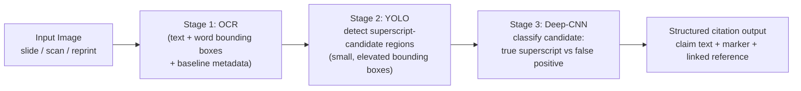
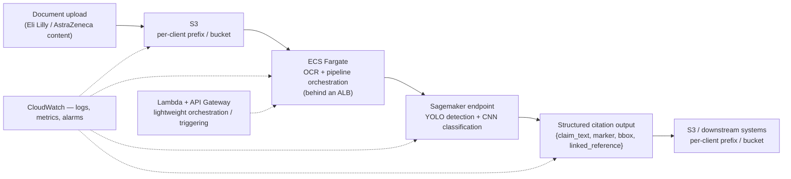

# 05 — Indegene Superscript/Subscript Detection

> Resume bullet (verbatim): *"Superscript/Subscript Detection on text-embedded images. Developed a
> sequential architecture to detect & finally identify superscript characters. The system involved
> an OCR, a YOLO object detection model to detect the presence of a superscript character & finally
> a Deep-CNNs based classification model. Increased citation tracking accuracy from 5% to 85%."*

## Business Context

Indegene is a digital-first life sciences commercialization company. Its clients are pharmaceutical
and biotech companies. Its bread-and-butter output is the huge volume of scientific and marketing
content those clients produce:

- Slide decks for medical conferences
- Promotional leave-behinds for sales reps
- Journal-article reprints
- Regulatory submission documents

Almost all of that content is drenched in **citations** — footnote-style reference markers that
point back to the clinical trial, published study, or approved label language that backs up a
claim.

In pharma, this isn't a nice-to-have. Regulatory bodies (FDA, EMA) and internal Medical/Legal/
Regulatory (MLR) review teams require every claim made in promotional or scientific material to be
traceable to a citation. That citation almost always appears as a small superscript numeral or
symbol sitting just after the claim text, e.g. "reduced symptom onset by 40%¹".

Here's the problem: these documents exist as **images** far more often than as clean, structured
text. Slide decks get exported to PDF-as-image or flattened into JPEGs for distribution. Scanned
journal reprints are literally photographs of paper.

So a pipeline that wants to automatically track citations — "which claim on which slide is backed
by which reference in the bibliography" — has to do two things:

1. Extract text from a raster image.
2. Correctly tell "this `1` is a citation marker" apart from "this `1` is just the digit 1 that
   happens to be part of the sentence, a bullet number, a page number, a chemical subscript (H₂O),
   or a units exponent (mg/dL²)."

A naive OCR pass has no concept of "superscript" — it just reads characters left to right. That's
the gap this project fills.

## Why Naive OCR Fails Here (and why the baseline was ~5%)

Off-the-shelf OCR engines are trained and tuned to transcribe *reading-order body text*. Superscript
characters break almost every assumption that makes OCR reliable:

- **They're small.** Superscript characters are typically 50–70% smaller than the surrounding font.
  Text-line detection often merges them into the preceding word, or drops them entirely as noise.
- **They sit above the baseline.** Line-segmentation heuristics assume every glyph on a "line"
  shares a baseline. Superscripts break that assumption.
- **They look like ordinary characters.** A superscript `2`, in isolation, is visually
  indistinguishable from a regular digit `2`, a subscript `2`, or a footnote/endnote glyph. The
  *only* signal that marks it as a citation is its size and position relative to the neighboring
  text — and plain OCR output (a flat string of characters) simply doesn't preserve that.

> *(Illustrative reasoning, not a verified Indegene internal metric)*: Imagine the initial approach
> was "run OCR, then use a regex/rule to guess which digits are citations" — for example, "a lone
> digit immediately after a word with no space." That heuristic fires on page numbers, list
> numbering, units, and general numeric text far more often than it correctly fires on true citation
> superscripts. That's exactly the kind of naive baseline that would land around single-digit
> percent accuracy on real-world pharma slide decks. It's a plausible, defensible story for why the
> **"5%"** starting point in the resume bullet is genuinely that low. It's not that OCR was broken —
> it's that "is this superscript a citation" is a visual/positional classification problem, not a
> text problem, and the naive baseline was trying to solve it with text-only logic.

## The Sequential Pipeline

The fix, per the resume bullet, is a **three-stage sequential architecture**. Each stage narrows
down the search space and hands a smaller, better-defined problem to the next stage, rather than
asking one model to do everything end to end.

Each stage exists for a specific reason:

1. **OCR** turns pixels into text plus geometry. Every detected word/character comes with a
   bounding box and, for good OCR engines, baseline/font-size metadata. Without this, there's no
   text to attach a citation to at all.
2. **YOLO** treats "is there a small, elevated glyph near this text" as an *object detection*
   problem over the image. That's a much better fit than text heuristics for something that's
   fundamentally defined by visual size and position, not character identity.
3. **The CNN classifier** exists because YOLO alone over-triggers: anything small and slightly
   raised — list numbers, exponents, stray noise, tightly-kerned punctuation — looks like a
   candidate. A lightweight classifier makes the final true/false call on each candidate region,
   trading a cheap second pass for a large reduction in false positives.

Chapters 01–04 of this course walk through each stage in that order, then Chapter 05 covers how the
stages compose into one pipeline. Chapter 06 covers the OpenCV preprocessing that typically sits in
front of Stage 1 to make the OCR stage itself more reliable on real-world scanned/rendered pharma
documents.

## Client & Production Deployment

This pipeline wasn't a research prototype. It ran in **production, customer-facing**, at Indegene
for two real pharma clients — **Eli Lilly** and **AstraZeneca** — processing their actual scientific
and marketing content (slide decks, leave-behinds, journal reprints) at real daily document volume.

That production context is exactly why the **5% → 85%** accuracy jump mattered as much as it did.
This wasn't a benchmark number chased for its own sake — it was a compliance requirement. A
mislabeled or missed citation in pharma marketing content is a **regulatory risk**. MLR
(Medical/Legal/Regulatory) review exists precisely to catch unsubstantiated or mis-linked claims
before material goes out the door. A citation-tracking system that's only 5% accurate would create
more manual review burden than it removes. An 85%-accurate one is trustworthy enough to actually sit
in that workflow.

The pipeline was deployed on AWS as containerized production services:

- **S3** holds both the input documents and the structured citation output.
- **ECS (Fargate)**, behind an **ALB**, runs the OCR and pipeline-orchestration services — the
  containerized "glue" that sequences Stage 1 (OCR) and hands candidate images off to the model
  tier.
- **Sagemaker** hosts the YOLO detector and CNN classifier as endpoints for inference (real-time or
  batch, depending on document volume/urgency — see Chapter 04).
- **Lambda + API Gateway** handle lightweight orchestration/triggering where a full ECS service is
  more than the job needs — for example, kicking off processing when a new document lands in S3.
- **CloudWatch** provides observability end to end. Logs and metrics from the ECS services, the
  Sagemaker endpoints, and the Lambda triggers all feed into the same monitoring surface. That's what
  makes the per-stage-vs-end-to-end evaluation strategy from Chapter 04 something you can actually do
  in production, not just in an offline notebook.
- **Secrets Manager** holds the credentials the pipeline needs (client-specific storage/API
  credentials, model endpoint auth, etc.) rather than anything being baked into container images.
- **Per-client isolation**: even though the same underlying pipeline code and model serve both
  clients, Eli Lilly's and AstraZeneca's documents and outputs are kept in **separate S3
  prefixes/buckets with IAM policies scoped per client**. One client's content is never addressable
  from the other's credentials — a non-negotiable requirement given these are competing pharma
  companies whose unpublished marketing/scientific content is itself confidential.

## Broader Skills Woven Into This Course

Per the candidate's skills list, this course also covers where a few other tools fit into this
specific project — not as generic tool tutorials, but tied to the decisions this pipeline required:

- **OpenCV** (Chapter 06, preprocessing)
- **Transformers / GPT-4 Vision** (Chapter 99, as the "how would you rebuild this today" modern
  alternative)
- **AWS Sagemaker** (training/hosting the YOLO and CNN models)
- **AWS Textract** (as a managed alternative/complement to a self-hosted OCR engine)

## STAR Summary (practice this out loud, under 90 seconds)

**Situation.** At Indegene, pharma marketing and scientific documents — slide decks, leave-behinds,
journal reprints — embed citation markers as small superscript numerals directly in the body text
of raster images. Automated citation tracking (mapping every claim to its supporting reference) is a
regulatory and MLR-review requirement, but a naive OCR-plus-regex approach to spot these markers was
only about **5% accurate**, because superscript-ness is a visual/positional property that flat OCR
text doesn't capture.

**Task.** I was asked to build a system that could reliably detect and identify superscript
characters embedded in these text-heavy images, accurate enough to drive automated citation
tracking at production scale.

**Action.** I designed a sequential three-stage architecture instead of one end-to-end model. An OCR
stage extracted text along with word/character bounding boxes and positional metadata. A YOLO object
detection model, trained on annotated examples of superscript regions, scanned the image for
small, vertically-elevated candidate regions near text. A Deep-CNN classifier then took each
candidate crop and made the final true-superscript-vs-false-positive call, filtering out the list
numbers, exponents, and OCR noise that the detector alone would over-trigger on. I combined the
OCR text, the confirmed superscript markers, and their positions into a structured citation output
that downstream systems could use to link claims to references.

**Result.** This sequential pipeline **increased citation tracking accuracy from 5% to 85%** —
turning a heuristic that was barely better than random into a system reliable enough to support
automated regulatory/MLR citation-tracking workflows on real pharma content.

## How This Course Is Organized

| File | Covers |
|---|---|
| `01-ocr-fundamentals.md` | Text detection vs. recognition, classical vs. deep-learning OCR, superscript-specific failure modes, bounding-box/baseline metadata |
| `02-object-detection-with-yolo.md` | YOLO grid/anchor/IOU/NMS fundamentals, why YOLO suits small superscript regions, annotation considerations |
| `03-cnn-classification-architectures.md` | CNN fundamentals, why a second-stage classifier reduces false positives, transfer learning |
| `04-building-the-sequential-pipeline.md` | Architecting multi-stage pipelines, error propagation, whole-pipeline vs. per-stage evaluation, defining "accuracy" here |
| `05-opencv-image-preprocessing.md` | Binarization, deskew, contour detection, ROI cropping, and how preprocessing quality feeds OCR/detection accuracy |
| `06-document-reprocessing-and-citation-deduplication.md` | The honest answer to "what if a corrected re-scan of a document comes back through the pipeline" — today's non-idempotent reprocessing, the manual workaround, the "new document" vs. "corrected re-scan" distinction, and a proposed content-hash dedup + `source_document_version` design |
| `07-production-resilience-and-operational-engineering.md` | Per-stage error handling (halt vs. degrade gracefully), a batch-worker concurrency/idempotency caveat, four CV-pipeline-specific bug stories, concrete threshold/timeout/batch-size values, and one candidly-named hardening gap |
| `99-Interview-QA.md` | Behavioral, technical, system-design, and "rebuild it today" interview Q&A |
| `notebooks/` | Six runnable, offline, synthetic-data notebooks — one per major concept, plus the reprocessing-dedup and model-version-tagging notebooks for Chapters 06–07 |

Read in order — each chapter builds on the last, and the notebooks are meant to be run alongside the
chapter with the matching number. As with the rest of this course, Chapters 06 and 07 are a
plausible, technically detailed reconstruction, not a claim about verified internal Indegene
implementation details — see each chapter's opening note for the honesty framing.

> **Confidentiality note**: as covered in the root `README.md`'s "Client & Production Context"
> section, check what your actual NDA/engagement letter allows before naming Eli Lilly or
> AstraZeneca by name in a real interview — "a top-10 pharma company" is a safe fallback phrasing.
