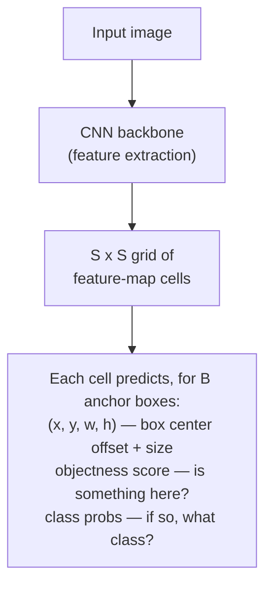
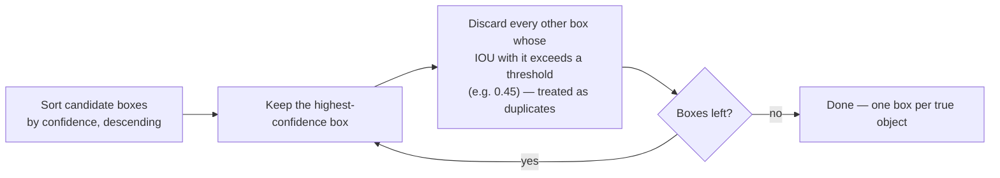

# 02 — Object Detection with YOLO

## Why this chapter matters

Stage 2 of the pipeline reframes "find superscript characters" as an **object detection** problem
rather than a text or classification problem. You're locating *where* in the image a
superscript-like region exists, not yet deciding *whether* it truly is one — that's Stage 3's job.

YOLO ("You Only Look Once") is the natural family of model for this. Interviewers who probe on
object detection are usually checking whether you understand *why* a single-shot detector was
chosen over alternatives, not just that you can name the architecture.

## Grid-Based Single-Shot Detection

Older two-stage detectors (e.g., Faster R-CNN) first propose candidate regions, then classify each
one — two separate networks, run one after the other. This is accurate but slow.

YOLO's core idea is different: do detection in a **single forward pass**. Divide the input image
into an `S x S` grid, and have each grid cell directly predict a fixed number of bounding boxes,
plus a class probability and an "objectness" confidence score for each box — all from one CNN
backbone.



Each grid cell is "responsible" for detecting objects whose center falls inside that cell. Because
everything — localization and classification — comes out of one network in one pass, YOLO is
dramatically faster than two-stage detectors. Historically that came at some cost in accuracy on
small or overlapping objects, a trade-off later YOLO versions have steadily closed.

## Anchor Boxes

A single grid cell predicting one raw box per object works poorly when multiple objects of very
different shapes could be centered in the same cell.

**Anchor boxes** solve this. Instead of predicting a box from scratch, each cell predicts *offsets
relative to a small set of predefined box shapes* (the anchors). These shapes are chosen in advance —
often via k-means clustering on the training set's ground-truth box dimensions — to represent the
range of aspect ratios/sizes actually present in the data.

For this project, that clustering step matters a lot. Superscript characters are a very narrow,
consistent shape — small, roughly square-to-slightly-tall crops. So the anchor set used here is
deliberately tuned toward small, compact boxes, unlike a general-purpose detector's anchors that
need to span everything from a tiny icon to a full-width object.

Newer YOLO versions (YOLOv8+) move toward **anchor-free** prediction — predicting box centers/sizes
directly. This simplifies the head and removes the anchor-tuning step, and it's worth knowing about
when discussing "what would you use today" (Chapter 99 covers this trade-off directly).

## IOU (Intersection over Union)

IOU is the standard metric for "how good is this predicted box compared to the ground-truth box":

```
IOU = area(predicted_box ∩ ground_truth_box) / area(predicted_box ∪ ground_truth_box)
```

IOU ranges from 0 (no overlap) to 1 (perfect overlap). It's used in two distinct places in a YOLO
pipeline:

1. **During training** — to decide which anchor/prediction is responsible for a given ground-truth
   object. The anchor with the highest IOU to that object gets assigned to predict it.
2. **During inference/evaluation** — both inside non-max suppression (below), and as the threshold
   for deciding whether a prediction "counts" as a correct detection of a given ground-truth box
   (e.g., "mAP@0.5" means a prediction only counts as correct if its IOU with the ground truth is
   ≥ 0.5).

## Non-Max Suppression (NMS)

Because every grid cell near an object tends to fire with at least some confidence, a raw YOLO
forward pass typically produces many overlapping boxes around the same true object. NMS cleans this
up:



The from-scratch numpy implementation of both IOU and NMS is in
`notebooks/02_yolo_object_detection_demo.ipynb`. Being able to derive this logic on a whiteboard
(not just call `torchvision.ops.nms`) is a very common interview ask for anyone claiming YOLO
experience.

## Why YOLO Is a Good Fit for Superscript Detection Specifically

Two properties of this sub-problem push toward YOLO (or a similar single-shot detector) rather than
a two-stage or purely classification-based approach:

- **Speed.** This detector needs to run on every candidate text region of every page, across a
  potentially large document corpus — pharma slide decks, journal reprints, at the real daily
  volume this pipeline processed in production for Eli Lilly and AstraZeneca. A two-stage
  detector's extra region-proposal pass adds latency and cost that compounds fast at that scale — a
  concern this course returns to directly in the system-design interview question in Chapter 99.
  Single-shot detection keeps per-image inference cheap enough to run in a batch pipeline over large
  document sets.
- **Small-object handling considerations.** Vanilla YOLO (especially early versions) is historically
  *weaker* on small objects than two-stage detectors, precisely because coarse grid cells can lose
  fine spatial resolution for tiny objects — and a superscript character is about as small an object
  as this gets. In practice, this weakness is mitigated three ways:
  1. YOLO doesn't run over the whole page at once — it runs over cropped, zoomed line/word regions
     located by OCR (Chapter 01), so the "small object" is relatively larger within its own crop.
  2. Using a version of YOLO with a feature-pyramid-style multi-scale detection head (YOLOv3
     onward) means smaller objects get resolved from higher-resolution early feature maps rather
     than only the coarsest grid.
  3. Stage 3's CNN classifier (Chapter 03) absorbs the false positives that an imperfect
     small-object detector inevitably produces, rather than expecting YOLO alone to be precise.

  This is a good example of a pipeline design compensating for a known model limitation with
  architecture, rather than trying to solve it with one model alone.

## Training-Data Considerations: Annotating Superscript Characters

Training this detector requires a labeled dataset of bounding boxes around true superscript/
subscript characters in real document images — a materially different (and more tedious) annotation
task than typical object detection datasets:

- **Box tightness matters more than usual.** Because the objects are tiny to begin with, a loosely
  drawn annotation box changes the effective IOU dramatically more than the same pixel error would
  on a large object. Annotators need tight, consistent boxes.
- **Class imbalance is severe by construction.** True superscripts are a tiny fraction of all
  characters on a typical page — most of a document image is regular body text, whitespace, and
  layout elements. The annotated dataset needs enough negative/hard-negative examples (regular
  small punctuation, page numbers, exponents that are *not* citations, subscripts that should be
  labeled as a separate class if the system needs to distinguish superscript from subscript) so the
  detector doesn't just learn to fire on "anything small."
- **Source diversity.** Because the documents span slide-deck exports, scanned reprints, and PDFs
  rendered to images, the training set needs examples across fonts, DPIs/resolutions, and
  scan-quality levels — or the detector will silently underperform on whichever source type is
  underrepresented in training. This is a very plausible failure mode to bring up if asked about
  generalization.
- **Tooling.** In an AWS-centric stack (as this candidate's broader skill set suggests, with AWS
  Sagemaker used elsewhere in this course), a natural choice is **Sagemaker Ground Truth** or a
  similar bounding-box labeling tool, with a labeling workforce guided by a clear annotation spec —
  a reasonable "recommended approach" worth naming, even without claiming it as a verified fact of
  Indegene's internal tooling.

## Tying It Back

The résumé bullet's phrase "a YOLO object detection model to detect the presence of a superscript
character" maps directly onto this chapter: a single-shot, grid-based detector, tuned via anchor
boxes toward small compact shapes, evaluated and cleaned up with IOU/NMS, trained on carefully
annotated (and necessarily imbalanced) superscript examples. It was chosen specifically because it's
fast enough to run at document-corpus scale, while the known small-object weakness is compensated
for by cropping to text regions first (Stage 1) and filtering false positives after (Stage 3) — not
by asking YOLO to be perfect on its own.
