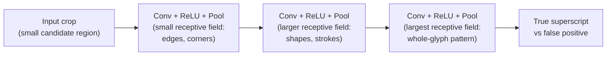
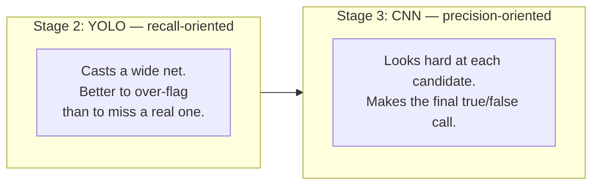

# 03 — CNN Classification Architectures

## Why this chapter matters

The résumé bullet explicitly calls out a *third* stage — "a Deep-CNNs based classification model" —
sitting after YOLO, not instead of it. Interviewers will often ask some version of "why two models
instead of one" here. The honest, technically grounded answer is entirely about what CNNs are good
at that object detectors are comparatively weak at: precise, focused classification of a single
cropped region.

This chapter covers the CNN fundamentals needed to answer that well, then covers why a second stage
earns its cost.

## CNN Fundamentals: Convolution, Pooling, Receptive Fields

A convolutional neural network's core building block is the **convolution operation**. A small
learnable filter (kernel) — say 3x3 — slides across the input image, computing a dot product at
each position, producing a feature map. Each filter learns to respond to a specific local pattern
(an edge, a corner, a curve, later on more abstract shapes).

Critically, the *same* filter is applied at every spatial position. That gives CNNs two properties
that make them dramatically more parameter-efficient than a fully-connected network on image data:

- **Local connectivity** — each output value depends only on a small local neighborhood of the
  input, matching the intuition that nearby pixels are the ones that jointly define a visual
  pattern.
- **Translation invariance/equivariance** — a filter that detects "a small horizontal stroke" fires
  on that pattern wherever it appears in the image, without needing separate weights for every
  possible position.

**Pooling** (typically max-pooling) downsamples feature maps — e.g., a 2x2 max-pool takes the
largest value in each 2x2 block, halving both spatial dimensions. This does two things: it reduces
computation for deeper layers, and it builds in a small amount of local spatial invariance (a
feature slightly shifted still tends to survive max-pooling).

Stacking convolution + pooling layers grows the **receptive field** — the region of the *original
input image* that a given neuron's activation is actually influenced by. Early layers have small
receptive fields and respond to fine local texture/edges; deeper layers have large receptive fields
and respond to more holistic, whole-object patterns.



This matters directly for this project's Stage 3 classifier. The crop it receives is already small
(a candidate superscript region plus a bit of surrounding context), so the network doesn't need many
layers or a huge receptive field to "see" the whole relevant pattern. That's exactly why a
**lightweight** CNN is the right choice here, not a deep, expensive backbone.

## Why Add a CNN Classifier After YOLO At All?

This is the question to be ready for. YOLO already outputs a class probability per detected box —
so why not just trust that? Two reasons, both grounded in what each architecture is optimized for:

1. **YOLO is optimized for localization-plus-coarse-classification across a whole image in one
   pass; it is not optimized for a hard, fine-grained binary discrimination on a single crop.**
   Chapter 02 covered why YOLO tends to over-trigger on small, elevated regions — page numbers,
   exponents, subscripts, punctuation, and OCR noise all *look* like superscript candidates at the
   coarse resolution and single-pass budget YOLO operates under. A dedicated classifier, given
   *only* the cropped candidate region (already localized — it doesn't have to search the image),
   can afford to spend its entire capacity on the one question that matters: is this specific crop
   really a raised, small citation-style glyph, or is it something else that merely resembled one
   geometrically?
2. **Superscript vs. regular-text-fragment is a visually subtle, easily-confused distinction.** A
   small `1` sitting slightly above a baseline (true superscript) and a small `1` that's just part
   of a tightly-set numeric string, a stray scan artifact, or a subscript on an adjacent line can
   produce very similar crops — especially at the boundary confidence YOLO assigns "maybe." A
   focused classifier trained specifically and only on this true/false distinction — with a training
   set deliberately oversampled on these confusable near-miss cases — directly targets the failure
   mode YOLO is most prone to, in a way that tuning YOLO's own classification head generally can't
   match without hurting its detection recall.

In short: YOLO's job is *recall-oriented* — don't miss real superscripts, even at the cost of
over-flagging candidates. The CNN's job is *precision-oriented* — given a candidate, decide
correctly.



Splitting these two objectives across two models, each tuned for its own objective, is a standard
and defensible pattern for reducing a detector's false-positive rate. It's the most likely reason
this project used two models instead of pushing YOLO to do both jobs.

```python
# Illustrative — a lightweight CNN classifier architecture appropriate for small crops,
# in the spirit of the Stage-3 model in this pipeline (framework-agnostic pseudocode)
class SuperscriptClassifier(nn.Module):
    def __init__(self):
        super().__init__()
        self.features = nn.Sequential(
            nn.Conv2d(3, 16, kernel_size=3, padding=1), nn.ReLU(), nn.MaxPool2d(2),
            nn.Conv2d(16, 32, kernel_size=3, padding=1), nn.ReLU(), nn.MaxPool2d(2),
            nn.Conv2d(32, 64, kernel_size=3, padding=1), nn.ReLU(), nn.AdaptiveAvgPool2d(1),
        )
        self.classifier = nn.Linear(64, 2)  # true superscript vs. false positive

    def forward(self, x):
        x = self.features(x)
        x = x.flatten(1)
        return self.classifier(x)
```

This is deliberately small — three conv blocks, few channels — because the input crops are small and
the task is a simple binary decision, not general-purpose image understanding. A runnable, trained
version of a network like this (on synthetic data) is in
`notebooks/03_cnn_classifier_from_scratch.ipynb`.

## Transfer Learning Considerations

For a task this narrow, training entirely from scratch is a defensible choice (as the pseudocode
above assumes), but transfer learning is worth knowing how to reason about — it's a near-certain
interview follow-up ("would you use a pretrained backbone here?"):

- **Pros of a pretrained backbone** (e.g., a small ImageNet-pretrained CNN like MobileNet or
  ResNet-18, with the early layers frozen and only the final classification head retrained): faster
  convergence, less labeled data needed, and lower-level filters (edge/corner detectors) transfer
  well regardless of domain, since edges are edges.
- **Cons/limits, specific to this task**: ImageNet pretraining optimizes for natural photographic
  images (objects, animals, scenes) at typical ImageNet resolutions. The low-level statistics of a
  small, mostly-monochrome, high-contrast text glyph crop are quite different from a photograph, so
  the transfer benefit is real but smaller than in a natural-image classification task. A
  lightweight from-scratch CNN, given how simple the actual pattern (raised-small-glyph vs. not) is
  and how much labeled data a production pharma-document pipeline can plausibly generate, is often
  the more practical choice. It avoids the overhead of a heavier backbone at *inference* time, which
  matters when this classifier has to run on every one of potentially dozens of YOLO candidates per
  page, across the large, multi-client (Eli Lilly, AstraZeneca) document corpus this pipeline
  handled in production.
- **A middle ground**: fine-tune a small pretrained backbone's later layers on the actual
  superscript/non-superscript crop dataset, rather than either training fully from scratch or
  freezing everything. This is the standard practical answer to "how would you decide," and a
  reasonable thing to say you'd A/B test in an interview.

## Tying It Back

"A Deep-CNNs based classification model" in the résumé bullet is the precision backstop for a
recall-oriented detector: Stage 2 (YOLO) casts a wide net over small, elevated regions near text;
Stage 3 (this chapter's CNN) looks hard at each individual net-catch and decides, using a network
sized to the actual difficulty of the crop it receives, whether it's a real citation-style
superscript or one of the many visually similar things that aren't. That two-model split — recall
first, precision second — is very likely the specific reason the accuracy jump from 5% to 85% was
achievable at all: neither OCR nor YOLO alone was ever going to hit that bar on this particular
distinction.
