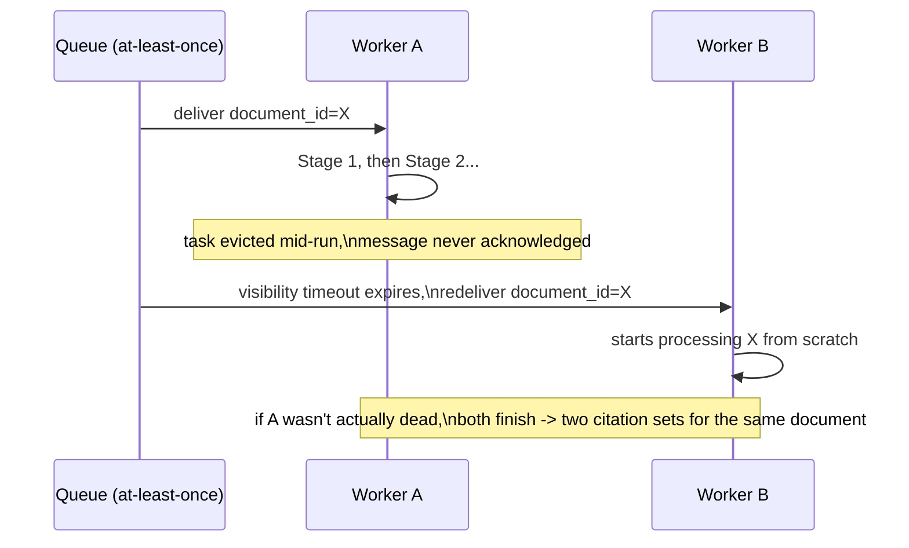

# 07 — Production Resilience and Operational Engineering

## Why this chapter exists

Chapters 01–06 describe this pipeline as an architecture: three models, chained, each with a
deliberate recall/precision responsibility. This chapter is the "what does it actually take to run
this in production" chapter — the realistic error-handling behavior per stage, the genuine
concurrency caveat a batch CV pipeline like this ships with, four bug narratives specific to an
OCR/detection/classification pipeline (not generic software bugs), the concrete threshold and
timeout values worth being able to defend, and one candidly-named hardening gap.

**The same honesty note as Chapter 06 applies here, and it's worth restating rather than assuming
it carries over silently**: there is no real source repository backing this course, unlike course 5's document-uploader rebuild. Everything in this chapter — the error-handling table, the bug
stories, the parameter values — is a plausible, technically detailed reconstruction of how a
pipeline matching this course's description would realistically behave and what would realistically
go wrong building it, not a transcript of verified internal Indegene code or incident reports. The
level of specificity here is deliberate — vague answers read as inexperience — but specificity is
not the same claim as verified fact, and that distinction should stay explicit if this material is
used in an actual interview.

## The realistic error-handling table: which failures halt vs. degrade gracefully

The single most important operational design decision in a multi-stage batch pipeline is deciding,
per failure mode, whether it should **stop the whole document** (fail closed) or **degrade
gracefully and keep going** (fail open, with the gap logged/flagged). Getting this backwards in
either direction is a real production risk: failing too hard turns one bad page into a whole
document's citations going unprocessed; failing too soft can let a silently-broken document sail
through as if nothing went wrong.

| Failure | Realistic handling | Halts document / degrades |
|---|---|---|
| OCR fails to process **one page** of a multi-page document (corrupt page image, engine timeout, unreadable scan) | Log the page as `ocr_failed`, exclude it from this run's candidate generation, continue processing the remaining pages | **Degrades gracefully** — one bad page shouldn't cost the other 40 pages of a slide deck their citation detections |
| OCR fails on **every page** of a document (wrong file format, zero-byte upload, corrupted file at the object level) | Fail the whole document job immediately with a clear error status; nothing downstream is invoked | **Halts** — there is no partial result worth producing if Stage 1 produced nothing at all |
| YOLO/Sagemaker endpoint invocation fails for a **single page's** candidates (transient network blip, throttling) | Retry with backoff (bounded, e.g. 3 attempts); if still failing, mark that page `detection_failed` and continue the rest of the document | **Degrades gracefully**, after bounded retry — an isolated failure shouldn't block the whole batch |
| YOLO/Sagemaker endpoint is **entirely unreachable** (endpoint down, model not deployed, auth failure) | Fail the batch job for this run; do not silently skip every page as if it legitimately had zero candidates | **Halts** — "zero candidates on every page" and "the detector never actually ran" must never look the same in the output |
| CNN classification fails for a **specific candidate crop** (malformed crop, Sagemaker timeout) | Treat that candidate conservatively — mark it `unclassified` rather than defaulting it to true or false — and surface it for manual review rather than silently dropping it | **Degrades gracefully**, but the candidate is flagged, not silently discarded or silently accepted |
| A document's page count or file size exceeds a configured maximum (Chapter 07's parameter table below) | Reject at ingestion, before any stage runs, with an explicit "document too large" status | **Halts**, deliberately, before any compute is spent |
| The content-hash dedup check from Chapter 06 fails to reach its index (e.g., a lookup-table outage) | **Fail open** — proceed with full reprocessing rather than blocking the document entirely; a missed dedup opportunity is a cost problem, not a correctness problem | **Degrades gracefully** — dedup is a cost optimization, not a correctness gate, so its own failure should never block real citation detection |

Two patterns worth naming explicitly, the same way course 5's chapter 06 names its own two
patterns:

- **Failures are handled asymmetrically by scope, on purpose.** A failure confined to one page or
  one candidate degrades gracefully, because per-page/per-candidate work is genuinely independent —
  losing one page's citations is a bounded, recoverable loss. A failure that means an entire stage
  never actually ran (an unreachable Sagemaker endpoint, total OCR failure) has to halt the document
  outright, because letting the pipeline continue in that state risks producing an output that
  looks complete but is silently missing an entire stage's contribution — a much worse outcome than
  a job that visibly failed.
- **"No candidates found" and "the detector never ran" must be distinguishable in the data**, not
  just in the logs. If a Sagemaker outage during Stage 2 is allowed to produce the same output shape
  as "this page genuinely had zero superscript candidates," a downstream consumer (an MLR reviewer,
  a reporting dashboard) has no way to tell "this page has no citations" from "this page's citations
  were never actually checked" — and pharma compliance content is exactly the domain where that
  distinction cannot be allowed to blur.

## The concurrency caveat: parallel batch workers without a shared idempotency check

Chapter 04 established that this pipeline runs primarily as a **batch job** — documents queued via
S3 events/EventBridge, picked up by a pool of ECS Fargate tasks that can run in parallel across
multiple worker instances, invoking Sagemaker for the model-inference stages. That's the right
default for throughput and cost (Chapter 04), but it introduces a real, specific scaling caveat worth
naming candidly rather than glossing over.

**The caveat:** if a job is retried — because a worker task was killed mid-processing (a Fargate
task eviction, a deploy, a transient Sagemaker throttling error that exhausted its retry budget) —
and the queue's delivery semantics are at-least-once (the realistic default for an SQS-backed or
EventBridge-backed pipeline), **two worker instances can end up processing the same document at the
same time**, each unaware of the other, unless something explicitly prevents it.



Concretely:

- Worker A picks up `document_id=X`, starts Stage 1, and is mid-way through Stage 2 when its task is
  evicted (a Fargate spot interruption, a deploy rolling that task out) without cleanly acknowledging
  the queue message.
- The queue's visibility timeout expires; Worker B picks up the *same* message and starts processing
  `document_id=X` from scratch.
- If Worker A's task hadn't actually died — just been slow, or momentarily lost its heartbeat — both
  workers can genuinely run to completion, each independently writing a structured citation output
  for the same document.

This is a direct instance of the reprocessing problem Chapter 06 covers, but with a different root
cause: Chapter 06 is about *the same document arriving twice, deliberately, over time* (a resubmitted
scan); this is about *the same document being processed twice, accidentally, within the same batch
window*, purely as an artifact of at-least-once queue delivery and worker-pool scaling. **The
content-hash dedup check proposed in Chapter 06 is also the natural fix here** — if every worker
checks the same shared processed-document index before running the expensive pipeline stages, a
duplicate delivery of the same message resolves to a cheap no-op rather than two independent runs.
Without that shared check in place today, the honest operational answer is: **this system is not
provably idempotent under retry**, and the realistic mitigation, if it hasn't been built yet, is
either (a) a lightweight distributed lock/claim-check per `document_id` at job pickup — the first
worker to claim a `document_id` in a shared table wins, and a second delivery of the same message is
a no-op — or (b) accepting the duplicate-processing risk as bounded and rare (most task evictions
are clean) while prioritizing the Chapter 06 dedup work, which solves this as a side effect of
solving the more common "resubmitted document" case. Naming this trade-off explicitly, rather than
asserting the batch system is idempotent without having actually verified it, is the stronger
interview answer.

## Four concrete bugs, specific to a CV/OCR pipeline

Illustrative, plausible bug narratives — the kind of thing that genuinely goes wrong building a
pipeline like this, framed the way course 5's chapter 06 frames its four real bugs: what broke, why,
and what practice would have caught it earlier.

**1. A coordinate-system mismatch between the OCR engine's box format and YOLO's expected input.**
Different OCR engines report bounding boxes differently — some as `(x1, y1, x2, y2)` absolute pixel
corners, some as `(x, y, width, height)`, some with the origin at top-left, others (less commonly,
but seen in some PDF-rendering toolchains) with a bottom-left origin inherited from PDF's coordinate
convention. If the code that crops a YOLO candidate region from an OCR-located word box assumes one
convention while the OCR engine actually returns another, the crop is **silently offset** — not
wrong in an obviously broken way (a crash, an empty crop), but shifted by a consistent pixel offset
that's easy to miss on casual visual inspection, especially at superscript scale where a few pixels
of offset can mean the crop catches the tail of the *preceding* character instead of the superscript
itself. This is an especially dangerous class of bug precisely because the pipeline keeps running
and keeps producing plausible-looking output — it doesn't error, it just quietly degrades accuracy
in a way that only shows up as an unexplained recall drop in aggregate metrics. *What would have
caught this earlier:* a unit test asserting the exact pixel coordinates of a known, hand-verified
crop against a fixture image with a manually-measured true superscript location — not just "does
the crop function return something," but "does it return the *right* region" — plus a coordinate-
convention assertion/contract test at the OCR-engine integration boundary itself, so a future OCR
engine swap (Tesseract to a different engine, or a Textract migration per Chapter 01) can't
reintroduce the same class of bug silently.

**2. A confidence-threshold default accidentally left at a debug value.** During development, it's
a common and reasonable practice to run the YOLO detector at a very low confidence threshold (e.g.,
`0.05` instead of the intended production default) so a developer can visually eyeball *every*
candidate the model considers, including weak ones, while debugging recall. If that debug threshold
is left in a shared config file or a default function argument rather than being explicitly
overridden per environment, it silently ships to production — where it floods Stage 3 (the CNN
classifier) with many times the expected candidate volume, most of them low-confidence noise the
CNN then has to spend inference budget rejecting. The user-visible symptom isn't a crash, it's a
quiet, compounding cost and latency regression (far more Sagemaker invocations per document than
expected) and, if the CNN's own precision has any weak spots, a real increase in false-positive
citations reaching MLR review. *What would have caught this earlier:* an explicit, required
per-environment configuration value (no silently-inherited default that "happens to" be a debug
value) checked into version control per environment, plus a simple production smoke-test asserting
candidate volume per page stays within an expected historical range — a sudden multi-x jump in
Stage 2 output volume is a cheap, high-signal thing to alert on before it ever reaches a human
reviewer.

**3. An off-by-one in page numbering attributing citations to the wrong page.** A very plausible,
easy-to-introduce bug: if the pipeline's internal page-processing loop is 0-indexed (`for page_idx in
range(len(pages))`) but the structured citation output's `page_number` field is meant to be the
1-indexed page number a human reviewer sees in the actual document, a missing `+ 1` (or an
inconsistent convention between where pages are split/queued and where the final output is
assembled) means every citation in the output is attributed to the page **before** the one it
actually appears on. This is a particularly bad bug for this domain specifically, because MLR
reviewers cross-reference the pipeline's citation output against the physical document page by
page — a citation reported on the wrong page doesn't just look wrong, it can send a reviewer
checking page 6 to verify a claim that's actually asserted on page 7, undermining trust in the whole
system's output even though the *detection* itself may have been entirely correct. *What would have
caught this earlier:* an end-to-end test asserting the reported `page_number` for a known synthetic
multi-page fixture matches the fixture's own ground-truth page numbers exactly (not just that
*some* page number is present) — this is exactly the class of bug that "the code runs without
error, output looks plausible" testing misses, and only an assertion against a known, specific
expected value catches.

**4. A retrained model silently deployed without updating its version tag.** When the CNN
classifier (or the YOLO detector) is retrained — new labeled data, a fixed class-imbalance issue, a
architecture tweak — and redeployed to the Sagemaker endpoint under the **same** endpoint name/alias
without incrementing a version identifier anywhere in the pipeline's output, every citation record
produced from that point forward is indistinguishable, in the data, from one produced by the old
model. If accuracy on a downstream sample audit then shifts (better or worse), there is no way to
attribute that shift to the model change versus something else (a new document source, a data drift
issue, random sampling noise) — because nothing in the recorded output says which model produced
which detection. This is the same failure mode Chapter 06 names as a distinct-but-related concern
to document reprocessing: **both a stale source document and a stale/ambiguous model version produce
"I can't tell what's actually driving this batch of results,"** and this bug is the concrete way the
model-version half of that problem shows up in practice. *What would have caught this earlier:* a
hard deployment-pipeline rule that no model artifact reaches the serving endpoint without a version
identifier bundled into the deployment (and rejected/blocked otherwise), plus making
`source_document_version`'s model-version fields (Chapter 06, Part 4) a required, non-nullable part
of the structured citation output schema from day one — so it's structurally impossible to produce
a citation record that can't be traced back to the model that made it, rather than relying on every
future deploy remembering to tag it manually.

**The common thread across all four**, worth stating as the takeaway the way course 5's chapter 06
does: three of the four are silent-degradation bugs, not crashes — the pipeline keeps running and
keeps producing output that looks structurally valid, which is precisely what makes them dangerous
in a compliance-adjacent system, and precisely why "does it run without error" was never going to be
a sufficient bar for this pipeline's testing strategy. Fixture-based tests asserting *specific,
known-correct values* (an exact crop region, an exact page number) catch this class of bug; tests
that only assert "no exception was raised" do not.

## Concrete threshold, batch-size, and timeout parameters, and why

Specific, defensible values worth having ready if asked "what would you actually set these to,"
framed with the reasoning behind each choice rather than the number alone:

| Parameter | Illustrative value | Why |
|---|---|---|
| YOLO detection confidence threshold (Stage 2) | **~0.25–0.35** | Deliberately low/recall-biased per Chapter 04's "narrowing funnel" design — Stage 2's job is to not miss true candidates, not to be precise; Stage 3 exists specifically to clean up the resulting false positives |
| NMS IOU threshold (Stage 2) | **~0.45** | High enough that two genuinely distinct, adjacent small glyphs (e.g., two citation markers close together after a compound claim) aren't incorrectly merged into one detection, low enough to reliably collapse the duplicate/jittered boxes a single-shot detector produces around one true object (Chapter 02) |
| CNN classification decision threshold (Stage 3) | **~0.5, tuned toward precision** | Unlike Stage 2, Stage 3 is where the pipeline earns back precision (Chapter 04) — this threshold is the one most worth A/B tuning against a labeled validation set, since it's the final gate before a detection reaches structured output |
| Max page count per document accepted at ingestion | **~200 pages** | A generous ceiling for realistic slide decks/reprints while still bounding the worst-case job runtime and Sagemaker invocation volume for a single document; documents above this are rejected at ingestion (the error-handling table's "halts, deliberately, before compute is spent" row) rather than silently truncated |
| Max input image dimension before OCR | **downsized to ~2000px on the long edge** | Beyond this, OCR/detection accuracy gains are marginal for this content type (slide decks and reprints, not high-DPI forensic scans) while inference latency and cost keep scaling roughly linearly with pixel count — this is a deliberate cost/accuracy trade, not an arbitrary cap |
| Per-page OCR timeout | **~30s** | Bounds a single unusually slow/corrupt page from stalling an entire document's processing; a page that exceeds this is marked `ocr_failed` (the error-handling table above) rather than left to hang a worker task indefinitely |
| Sagemaker inference call timeout (YOLO/CNN) | **~10s per batch call** | Short enough that a stalled endpoint fails fast and triggers the bounded retry described in the error-handling table, rather than a single slow call holding a worker task (and, transitively, everything queued behind it) hostage |
| Retry budget on transient Sagemaker/network failures | **3 attempts, exponential backoff** | Enough to ride out a genuinely transient blip (a brief throttling response, a momentary network error) without turning a real, persistent endpoint outage into an indefinite retry loop that never surfaces as a visible failure |
| Batch size per Sagemaker CNN inference call | **~32 candidate crops per call** | Batches multiple candidates into one forward pass rather than one-at-a-time, which matters because a single page can produce dozens of YOLO candidates (most destined to be rejected) — batching amortizes fixed per-call overhead across many small, cheap crops |

## The candid hardening gap: hardcoded model/endpoint configuration

A genuine, worth-naming-candidly gap, in the spirit of course 5's hardcoded session secret: it's
entirely plausible (and a common real-world shortcut under delivery pressure) that this pipeline's
orchestration code has the **Sagemaker endpoint name and the Stage 2/Stage 3 decision thresholds
hardcoded as literal constants**, rather than externalized as per-environment configuration (an
environment variable, a parameter store entry, a config service read at startup):

```python
# Illustrative — the kind of hardening gap that's easy to introduce under delivery pressure
YOLO_ENDPOINT_NAME = "superscript-yolo-prod-endpoint"
CNN_ENDPOINT_NAME = "superscript-cnn-prod-endpoint"
YOLO_CONFIDENCE_THRESHOLD = 0.30
CNN_DECISION_THRESHOLD = 0.50
```

This is a real, honest hardening gap worth naming rather than glossing over, for two concrete
reasons: **first**, changing a threshold (say, after discovering the false-positive-flood bug above,
or after retraining the CNN) requires a code change and redeploy rather than a config change — which
means there's no safe way to test a new threshold in staging against real traffic patterns before it
applies in production too, and no fast way to roll a bad threshold back without a full redeploy cycle.
**Second**, and more subtly, if the same literal endpoint name is hardcoded across dev/staging/prod
environments (rather than being environment-specific), it becomes possible for a
staging/testing job to accidentally invoke the production Sagemaker endpoint — burning real
production inference capacity and, worse, potentially writing test-generated citation output into
whatever downstream system consumes production results, if the output path is equally hardcoded.
The fix is the same shape as course 5's session-secret fix: move these values into environment-scoped
configuration (environment variables sourced from ECS task definitions, or **AWS Secrets
Manager**/Parameter Store per Chapter 00's stated production stack) so each environment has its own
independent, explicit endpoint reference and threshold set, with no path by which one environment's
job can silently touch another's resources.

## Tying It Back

Production-grade for a CV pipeline like this one isn't "the models are accurate" — Chapters 01–05
already cover that. It's "the failure modes are known and bounded per stage, a batch system that
scales across workers doesn't silently duplicate work under retry, real bugs specific to this kind
of pipeline (coordinate mismatches, threshold regressions, off-by-one attribution, unversioned model
swaps) get caught by fixture-based tests rather than 'it ran without error,' the operational
parameters are chosen for defensible reasons rather than left at whatever the framework defaults to,
and hardening gaps are named candidly rather than assumed away." Chapter 06 covers the
document-identity half of "can I trust this output"; this chapter covers the operational half —
together, they're the honest, specific answer to "how would this actually hold up in production,"
rather than a hand-wave toward "it's on AWS, so it's fine."
