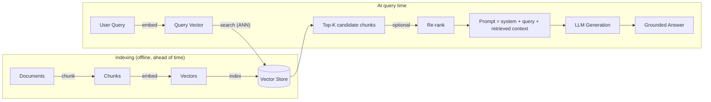

# 01 — RAG Architecture Deep Dive

## Why this chapter matters

The resume bullet says "RAG-enabled Project-based data retrieval using langchain & pinecone." RAG
(Retrieval-Augmented Generation) is the single most interview-tested GenAI concept there is, and this
project gives you two separate RAG pipelines to talk about — project data and the cost catalog — plus
a strong first-principles reason for choosing RAG at all.

Interviewers won't stop at "what is RAG." They'll push into "why not just fine-tune" and "where does
your pipeline break." This chapter builds the mental model end to end — chunking, embeddings,
retrieval, re-ranking, generation — so you can defend every stage.

## The Core Problem RAG Solves

An LLM's knowledge is **parametric** — baked into its weights at training time, frozen at a cutoff
date, and generic across every customer who calls the API.

A Virtual Liaison assistant needs to answer questions like "what's the current status of Project X
for this client." That information is:

- Private to Indegene, and to that specific client.
- Constantly changing as projects progress.
- Never part of any foundation model's training data.

No amount of clever prompting fixes that. The model simply does not have the fact. There are two ways
to give it access:

- **Fine-tuning** — bake project data into the model's weights. This is the wrong tool here. Project
  data changes daily, so a fine-tuned model is stale the moment a project status changes. It's also
  expensive to retrain on every update. And it doesn't solve **per-client isolation**: you can't
  easily guarantee a fine-tuned model won't leak Client A's project details when answering Client B,
  because the training data is blended into the weights, not cleanly separable at inference time.
- **Retrieval-Augmented Generation** — leave the model's weights untouched. Instead, **fetch** the
  relevant, current facts at query time and hand them to the model as context in the prompt. Updating
  a project's status now means writing one new record to a database, not retraining anything.
  Isolation becomes a retrieval-time filter (Chapter 2), not a training-time guarantee.

That's the interview-ready answer to "why RAG": it decouples *what the model knows how to do*
(language understanding, following instructions, generating fluent text) from *what facts it has
access to right now*. The second half can change per-request, per-client, per-second, without
touching the model at all.

## The RAG Pipeline, Stage by Stage



### 1. Chunking

Project data — status notes, revision logs, meeting summaries, cost-catalog descriptions — has to be
split into pieces. Each piece needs to be small enough to embed meaningfully and retrieve precisely,
but large enough to preserve context. Chunking strategy directly affects retrieval quality:

- **Fixed-size chunking** (e.g., 500 tokens with 50-token overlap) is the simplest baseline. The
  overlap matters: it prevents a sentence that answers the user's question from being split exactly
  at a chunk boundary and losing half its meaning.
- **Semantic / structure-aware chunking** splits on natural boundaries instead of a blind token
  count — one chunk per project status update, one chunk per cost-catalog line item, one chunk per
  revision entry. This matters a lot for project data specifically: a chunk boundary that cuts a
  status update in half is worse than a slightly larger or smaller chunk that keeps one complete
  update together, because the retrieved evidence needs to be a coherent, citable unit.
- **Recursive character/token splitting** (LangChain's `RecursiveCharacterTextSplitter`) tries a
  sequence of separators — paragraph, then sentence, then word — so it only splits mid-sentence as a
  last resort.

```python
from langchain_text_splitters import RecursiveCharacterTextSplitter

splitter = RecursiveCharacterTextSplitter(
    chunk_size=500,
    chunk_overlap=50,
    separators=["\n\n", "\n", ". ", " "],
)
chunks = splitter.split_documents(project_status_documents)
```

For a project-tracking use case, the practical rule of thumb is: **chunk at the natural unit of the
data** (one status update, one revision note, one catalog line) whenever that unit exists. Fall back
to size-based splitting only for free-text notes that don't have that structure. This is worth saying
explicitly in an interview — it shows you understand that chunking isn't a fixed hyperparameter, it's
a decision informed by the shape of the source data.

### 2. Embeddings

An embedding model turns a chunk of text into a fixed-length vector, arranged so that
semantically similar text ends up close together in vector space (measured by cosine similarity or
dot product). This is what makes retrieval *semantic* rather than pure keyword matching — a query for
"how long will the Japan localization take" can retrieve a chunk that says "JP translation ETA: 5
business days," even though no words overlap exactly.

```python
from langchain_openai import OpenAIEmbeddings

embedder = OpenAIEmbeddings(model="text-embedding-3-small")
vectors = embedder.embed_documents([c.page_content for c in chunks])
```

Two practical considerations come up often in interviews:

- **Domain fit**: a general-purpose embedding model handles most project/status language fine, but
  can struggle with highly domain-specific tokens — internal project codenames, SKU codes in the cost
  catalog, abbreviations. That's precisely the gap hybrid search (Chapter 3) is designed to close.
- **Consistency**: the same embedding model must be used at index time and query time. Swapping
  embedding models means every vector in the store is now in a different space and has to be
  re-embedded — a migration cost worth flagging when discussing "what would you change."

### 3. Retrieval (Approximate Nearest Neighbor Search)

At query time, the user's question is embedded with the same model. The vector store then returns
the **top-K** chunks whose vectors are closest to the query vector. Brute-force comparison against
millions of vectors doesn't scale, so production vector stores use approximate nearest neighbor (ANN)
algorithms instead — Chapter 2 covers this in depth with Pinecone's HNSW-based index as the concrete
example.

```python
retriever = vectorstore.as_retriever(search_kwargs={"k": 5})
retrieved_chunks = retriever.invoke("What's the status of the France localization for Project Atlas?")
```

Retrieval is also where **metadata filtering** enters. It restricts the ANN search to only the
current client's and project's namespace before similarity is even computed — a relevance improvement,
and, as covered in Chapter 2, a data-isolation requirement.

### 4. Re-ranking

Top-K vector similarity is a good first pass, but not perfect. Embedding similarity can retrieve
chunks that are topically related but not the most directly relevant to the specific question asked.
A **re-ranker** — often a smaller, more expensive cross-encoder model that scores (query, chunk) pairs
jointly rather than comparing independent embeddings — re-orders the top-K (or top-20-to-K) candidates
before they're sent to the LLM.

```python
# Retrieve a wider candidate set, then re-rank down to the final K
candidates = retriever.invoke(query, search_kwargs={"k": 20})
reranked = reranker.rank(query, candidates, top_n=5)
```

There's a trade-off worth naming in an interview: re-ranking costs extra latency and (if using a
hosted cross-encoder) money. It's worth it when precision at the top of the list matters a lot — e.g.,
a cost-catalog answer where citing the *wrong* SKU has real financial consequences — and less critical
for a low-stakes "give me a general summary" query.

### 5. Generation with Retrieved Context

The final step assembles a prompt from a system instruction, the retrieved chunks, and the user's
question. It asks the LLM to answer **using only the provided context** — a grounding instruction
that keeps the model from falling back on its parametric knowledge, or worse, fabricating a
plausible-sounding but wrong answer.

```python
from langchain_core.prompts import ChatPromptTemplate
from langchain_core.output_parsers import StrOutputParser

rag_prompt = ChatPromptTemplate.from_messages([
    ("system",
     "You are the Virtual Liaison assistant for {client_name}. Answer only using the "
     "context below. If the answer isn't in the context, say you don't have that "
     "information yet rather than guessing."),
    ("human", "Context:\n{context}\n\nQuestion: {question}"),
])

rag_chain = rag_prompt | llm | StrOutputParser()
answer = rag_chain.invoke({
    "client_name": "Acme Pharma",
    "context": "\n\n".join(c.page_content for c in reranked),
    "question": "What's the status of the France localization for Project Atlas?",
})
```

This is also where **citations** typically get attached — returning which chunk(s) backed the answer
so the client (or an internal reviewer) can verify it. That matters a great deal in a regulated
life-sciences context, where an ungrounded or wrong answer about project status or cost has real
downstream consequences.

## Why RAG Specifically Fit the Virtual Liaison Platform

Tie this back explicitly — it's the answer to "why did you choose this architecture":

- **Freshness**: project status changes daily. RAG reads from a live store, so answers are as current
  as the last write, with zero retraining.
- **Multi-tenancy**: different clients' project data must never bleed into each other's answers. RAG
  makes that a retrieval-time filter (Pinecone namespace/metadata, Chapter 2) — auditable and easy to
  reason about, versus a fine-tuned model where isolation is implicit and hard to verify. This wasn't
  hypothetical: the production platform served **Eli Lilly** and **AstraZeneca**, two competing
  pharma companies, on the same orchestration layer — exactly the scenario retrieval-time isolation
  is built for.
- **Auditability**: retrieved chunks can be logged and shown as the "evidence" behind an answer —
  important when a client questions why the assistant said what it said, especially for cost-catalog
  figures.
- **Cost**: one general-purpose LLM plus a retrieval layer over structured/unstructured project data
  is far cheaper to maintain than fine-tuning and re-serving custom model weights per client or per
  data refresh cycle.

## Tying It Back

When asked "walk me through the RAG pipeline you built," the answer is the five stages above, applied
twice: once over project status/history data (chunked per status update, embedded, stored in
Pinecone, retrieved and reranked per query), and once over the cost catalog (Chapter 3 extends this
with hybrid search, since catalog SKUs and codenames need exact-match recall that pure dense
retrieval can miss). Chapter 2 goes deep on the vector store side of this pipeline; the from-scratch
implementation in `notebooks/01_rag_from_scratch.ipynb` walks through chunking, TF-IDF retrieval (as
a transparent stand-in for embeddings), and prompt assembly on a tiny synthetic project corpus.
