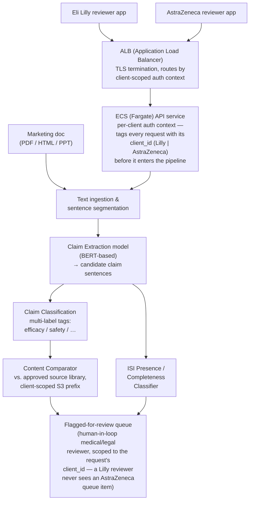
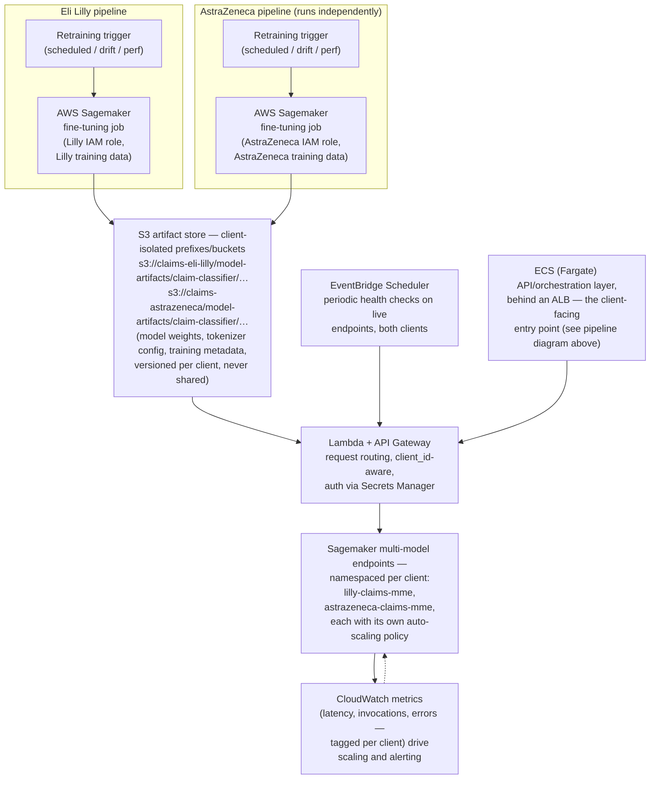

# 07 — Indegene: Claim Extraction & Tagging

**Company:** Indegene (digital-first life sciences commercialization company)
**Role:** Data Scientist · Aug 2021 – Jun 2024 · Bengaluru, India
**Resume bullet (verbatim):** "Claim Extraction and Tagging. Worked to develop modules such as
Claim Extraction & Classification, Proof Reading, ISI Classification, and Content Comparator tool.
Implemented Auto-scaling to facilitate load balancing for single/multi model endpoints. Built
automated pipelines for NLP model retraining and maintenance of associated model artifacts. Used
AWS Sagemaker to fine-tune associated models, S3 to store model artifacts, Eventbridge Scheduler to
perform health checks, Lambda, and API gateway for model deployment."

## Client & Production Deployment

This is not a demo. It is not a proof-of-concept. It's a **production, customer-facing
compliance-review system**.

It served two named pharma clients: **Eli Lilly** and **AstraZeneca**. Both are confirmed real
clients. The system processed real marketing/medical content review volume for them daily.

Both clients' data is kept strictly separate:

- Claims content, model artifacts, and retraining pipelines are isolated per client.
- Separate S3 prefixes/buckets.
- Separate or namespaced Sagemaker endpoints.
- Separate IAM roles.

A claim flagged for Eli Lilly's content must never be visible to an AstraZeneca reviewer, and
vice versa.

Why does this isolation matter so much? Because the content under review is real, regulated pharma
marketing material for two active clients. That means both failure modes carry real stakes:

- A **false negative** (the system misses a non-compliant claim) is a genuine legal and
  patient-safety risk.
- **Pipeline downtime** blocks a client's content-review workflow against a real publication
  deadline.

This isn't a hypothetical framing exercise. It shaped the threshold choices, the monitoring, and
the production architecture described below.

## 1. The business problem

Pharma marketing content — sales-rep decks, banner ads, physician-facing leave-behinds, websites —
is one of the most heavily regulated categories of content that exists.

Every factual assertion in that content is called a **claim**. For example: *"Drug X reduces
symptom Y by 42% vs. placebo."* Every claim must be traceable back to an **approved source
document** — a clinical study, an FDA-approved label, a peer-reviewed paper.

Regulatory and medical-legal review (often shortened to "med-legal review" or "MLR") exists purely
to catch problems before content goes out the door: claims that are unsupported, overstated, or
missing their required companion disclosures. A compliance failure here is not a bug. It's a legal
and patient-safety risk.

Two disclosure rules make this concrete:

- **Every claim needs a source.** If a claim can't be matched to language in an approved
  reference, it gets flagged.
- **Every promotional piece needs Important Safety Information (ISI).** ISI is the mandatory
  "risks, contraindications, side effects" section. It has to appear alongside (or very near) the
  promotional claims. A missing or truncated ISI section is an automatic compliance failure —
  regardless of how accurate the claims themselves are.

Doing this review manually doesn't scale. A human medical reviewer reading every asset
line-by-line against a library of approved source documents is slow, and pharma marketing teams
produce a lot of content.

The project on this resume bullet is about building the **NLP tooling that makes that first pass
automatic**. The goal: human reviewers spend their time adjudicating genuinely ambiguous or
flagged content, instead of re-reading content that's obviously fine.

## 2. What was built (four modules)

| Module | What it does | Core technique |
|---|---|---|
| **Claim Extraction & Classification** | Pulls candidate claim sentences out of raw content and tags each with a claim type/category (efficacy, safety, dosing, comparative, etc.) | Fine-tuned BERT-family sequence classifier, multi-label |
| **Proof Reading** | Flags grammatical/structural errors and suggests corrections in generated or authored copy | Seq2Seq sequence-correction model |
| **ISI Classification** | Detects whether the mandatory Important Safety Information block is present, complete, and correctly positioned | Binary / few-class classifier, heavily imbalanced (most docs *are* compliant) |
| **Content Comparator** | Compares new claim text against the approved-claims source library to catch near-duplicates, paraphrases, and unsupported deviations | TF-IDF cosine similarity + sentence-embedding similarity |

## 3. System architecture — content review pipeline

Every stage produces a *signal*, not a verdict. The model layer's job is to triage, not to
auto-approve.

Anything that is low-confidence, unmatched to an approved source, or missing ISI lands in a queue
for a human reviewer. This is the standard pattern for regulated-content ML: automate the "this is
obviously fine" 80%, and concentrate expert attention on the ambiguous 20%.

Both content and identity are client-scoped end to end:

- The ECS Fargate API layer stamps every request with the requesting client's `client_id` at the
  door.
- Content and approved-source-library lookups read from that client's S3 prefix only.
- The review queue filters strictly on `client_id`.

There is no code path where an Eli Lilly claim can land in an AstraZeneca reviewer's queue, or
vice versa.

## 4. MLOps architecture — retraining & deployment

The MLOps half of this bullet is really the more transferable interview material. Strip away the
AWS product names, and it's a generic pattern: "how do you keep an NLP model fresh and cheap to
serve in production." It happens to be implemented here with the AWS-native toolchain — ECS
Fargate, Sagemaker, S3, EventBridge, Lambda, API Gateway, Secrets Manager, CloudWatch.

The client-isolation details above aren't incidental — separate S3 prefixes/buckets, separate IAM
roles, namespaced Sagemaker endpoints. For a compliance platform serving two competing pharma
companies, that isolation is a hard production requirement, not an optimization.

## 4a. Two gotchas worth reading before an interview

Two chapters go a level deeper than the rest of this course, on questions an interviewer who
understands this domain is likely to ask:

- **Chapter 07** answers: "when the approved-claims library gets revised, how do you stop the
  Content Comparator from matching against a claim that's since been withdrawn?" This is the
  analog, in this project, of the document-versioning gotcha in the Capco Document Uploader
  course.
- **Chapter 08** covers the production-resilience side: a realistic error-handling table for the
  claims pipeline, a Sagemaker/Lambda model-version caching caveat, four concrete NLP-pipeline bug
  stories, and one candidly-named hardening gap.

If you have an interview coming up before you have time for the rest of the course, read these two
first.

## 5. How the chapters map to this

| Chapter | Covers |
|---|---|
| [01-text-classification-fundamentals.md](01-text-classification-fundamentals.md) | Feature representations + classical vs. neural classifiers + multi-label framing — foundation for Claim Classification |
| [02-transfer-learning-and-bert-finetuning.md](02-transfer-learning-and-bert-finetuning.md) | BERT architecture, fine-tuning mechanics, Seq2Seq for Proof Reading |
| [03-content-comparison-and-similarity.md](03-content-comparison-and-similarity.md) | Similarity/duplicate-detection techniques behind the Content Comparator |
| [04-mlops-automated-retraining-pipelines.md](04-mlops-automated-retraining-pipelines.md) | Retraining triggers, pipeline stages, artifact lineage |
| [05-aws-sagemaker-deployment-and-autoscaling.md](05-aws-sagemaker-deployment-and-autoscaling.md) | Sagemaker, S3, multi-model endpoints, auto-scaling, EventBridge, Lambda/API Gateway, Secrets Manager, CloudWatch |
| [06-classic-ml-bonus-crop-prediction-case-study.md](06-classic-ml-bonus-crop-prediction-case-study.md) | Bonus: classic tabular ML via the personal crop-prediction project |
| [07-approved-library-versioning-and-stale-comparison.md](07-approved-library-versioning-and-stale-comparison.md) | **The "revised claims" gotcha** — what happens today when the approved-claims library is revised, why matching "an approved claim" isn't the same as matching a *currently* approved one, a proposed `claim_family_id`/`claim_version`/`superseded_by_claim_id` design, and the tie into chapter 04's retraining pipeline needing a *current* library snapshot |
| [08-production-resilience-and-operational-engineering.md](08-production-resilience-and-operational-engineering.md) | Real-shaped error-handling table (block vs. flag-for-review), a Lambda/Sagemaker model-version cache staleness caveat, four concrete NLP-pipeline bug narratives, concrete threshold/timeout/batch values, one candidly-named hardening gap |
| [99-Interview-QA.md](99-Interview-QA.md) | Interview question bank |

Notebooks live in [`notebooks/`](notebooks/) and are runnable, offline, CPU-only companions to
chapters 01, 02, 03, 05, 06, 07, and 08.

## 6. STAR summary

> **Situation.** Indegene produces and reviews large volumes of pharma marketing content for
> clients. Every asset must have its claims traced to approved sources and its ISI section verified
> present — a manual, reviewer-hours-intensive process that didn't scale with content volume and
> created a bottleneck before publication.
>
> **Task.** Build an NLP system to automatically extract and classify claims, detect/verify the ISI
> section, flag near-duplicate or unsupported content against an approved source library, and proof
> the copy — then keep those models fresh and cheaply served in production as new labeled data and
> content types arrived.
>
> **Action.** I built four cooperating NLP modules (Claim Extraction & Classification, Proof
> Reading, ISI Classification, Content Comparator), fine-tuning BERT-family transformer models on
> AWS Sagemaker for the classification tasks and a Seq2Seq model for proof-reading corrections. I
> stood up an automated retraining pipeline so models could be refreshed on new labeled data without
> manual re-triggering, versioned all model artifacts in S3, and deployed behind single/multi-model
> Sagemaker endpoints with auto-scaling for load balancing, EventBridge-scheduled health checks, and
> Lambda + API Gateway as the request-routing layer.
>
> **Result (illustrative — replace with your real numbers).** Estimated to cut first-pass manual
> claims-review time by **~40%** by pre-triaging content so reviewers spent their time on
> genuinely flagged items instead of re-reading compliant content end-to-end, while the multi-model
> endpoint + auto-scaling setup reduced steady-state inference hosting cost versus one endpoint per
> model. *(Replace the 40% and any cost figures with your actual measured numbers before using this
> in an interview — this value is a placeholder to show the shape of a good answer.)*

## 7. Notes on framing

Everything in this course describes **a typical/recommended architecture for this kind of pharma
content-compliance system**. It's built from the resume bullet plus general knowledge of how such
systems are usually implemented — it is not verified internal Indegene implementation detail.

When you talk about this project in an interview, describe it as "how I approached it" / "the
design we used." Be ready to go one level deeper on any piece if asked — the Q&A bank in
`99-Interview-QA.md` is built for exactly that.

Before naming Eli Lilly or AstraZeneca by name to an interviewer, see the confidentiality note in
the root [README.md](../README.md). Check what your actual NDA/engagement letter allows, and
default to "a top-10 pharma company" if unsure.
