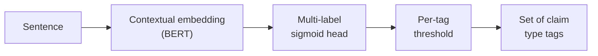

# 01 — Text Classification Fundamentals

## Why this chapter matters

The **Claim Extraction & Classification** module is, at its core, a text classification problem
wearing pharma clothing.

Given a sentence (or span) pulled from marketing content, the module decides two things:

1. Is this sentence a claim at all?
2. If so, which category or categories does it belong to — efficacy, safety, dosing,
   comparative-superiority, and so on?

Before you can talk credibly about fine-tuning BERT for this (chapter 02), you need to be fluent
in the fundamentals: how text becomes numbers, and what a classifier does with those numbers.

Interviewers frequently probe here first, because it's where people who only know "call `.fit()`"
get exposed.

## Step 1 — turning text into features

A classifier needs fixed-size numeric input. Text is variable-length and symbolic, so the first
job is always **feature representation** — turning words into numbers.

**Bag-of-Words / TF-IDF.** The simplest approach: build a vocabulary from the training corpus, and
represent each document as a vector of word counts (or presence/absence). Bag-of-words throws away
word order entirely — "drug reduces risk" and "risk reduces drug" look identical. For many
classification tasks that's fine, because the *presence* of certain words is highly predictive
even without knowing their order.

TF-IDF (Term Frequency–Inverse Document Frequency) improves on raw counts. It down-weights words
that appear in almost every document (like "the," "patient," "study" in a pharma corpus) and
up-weights words that are distinctive to a smaller subset of documents:

```
tfidf(t, d) = tf(t, d) * log(N / df(t))
```

Here, `tf(t, d)` is how often term `t` appears in document `d`, `N` is the total number of
documents, and `df(t)` is how many documents contain `t`.

For claim classification, TF-IDF is a strong, cheap baseline. Words like "reduces," "superior,"
"significant," "vs. placebo" carry a lot of signal for "this is an efficacy claim" even without
deep semantics.

**Word2Vec.** TF-IDF vectors are sparse and treat every word as an independent dimension —
"reduces" and "decreases" share no similarity in that representation, even though they mean almost
the same thing.

Word2Vec (skip-gram / CBOW) fixes this. It learns dense vectors (typically 100–300 dimensions)
such that words used in similar contexts end up close together in vector space. This buys you
generalization: a claim classifier trained on "reduces symptom severity" can partially transfer to
"decreases symptom severity," because the word vectors are close — even if "decreases" was rare in
training data.

The limitation: Word2Vec gives one fixed vector per word, regardless of context. "Trial" in
"clinical trial" and "trial period" gets the same vector either way.

**Contextual embeddings (BERT etc.).** Contextual models generate a different vector for the same
word depending on its surrounding sentence. They're pretrained on massive general-domain text
before being adapted to your task.

This is the representation used in the actual production Claim Classification model (see chapter
02). It captures negation, qualifiers, and long-range dependencies that bag-of-words and Word2Vec
both miss — for example, distinguishing *"does not increase the risk of..."* from *"increases the
risk of..."*. That's exactly the kind of distinction that matters enormously in a compliance
context.

| Representation | Captures word order? | Captures synonymy? | Captures context-dependence? | Cost |
|---|---|---|---|---|
| Bag-of-Words / TF-IDF | No | No | No | Very low |
| Word2Vec | No (per-word) | Yes | No | Low |
| Contextual (BERT) | Yes | Yes | Yes | High (needs GPU, pretraining) |

## Step 2 — classical vs. neural classifiers

Once you have features, you need a model that maps features to labels.

**Naive Bayes.** Assumes feature independence given the class — a strong, usually-wrong assumption
that works surprisingly well for text anyway. It's extremely fast to train, needs little data, and
is a reasonable sanity-check baseline. If Naive Bayes on TF-IDF gets 85% accuracy, a much fancier
model needs to clearly beat that to justify its complexity.

**Logistic Regression.** A linear model over the feature vector, trained to directly optimize
classification likelihood rather than relying on an independence assumption. On top of TF-IDF
features, logistic regression is a very strong, interpretable baseline for claim classification.
You can inspect the learned coefficients and literally see which words push a sentence toward
"efficacy claim" vs. "safety claim" — valuable when a regulatory stakeholder asks "why did the
model flag this?"

**SVM (Support Vector Machine).** Finds the maximum-margin hyperplane separating classes.
Historically the strongest classical baseline for text classification, especially with
high-dimensional sparse TF-IDF input. In practice it usually performs comparably to well-tuned
logistic regression on these tasks, while being more expensive to train at scale.

**Neural classifiers.** Feed-forward networks over embeddings, or fine-tuned transformer encoders
(BERT) with a classification head. These win when:

- (a) you have enough labeled data to justify the extra parameters,
- (b) the task needs contextual understanding (negation, qualifiers, multi-clause reasoning), or
- (c) you can leverage transfer learning from a model pretrained on huge general-domain corpora.

That third condition is precisely the situation with claim classification: labeled pharma-claim
data is comparatively scarce, but general English pretraining is abundant (see chapter 02).

**The honest framing for an interview:** you almost never jump straight to BERT. The right
sequence is TF-IDF + Logistic Regression baseline first — fast, interpretable, and it tells you the
task's difficulty floor. Only then do you justify the jump to a fine-tuned transformer, with an
actual accuracy/F1 delta to back it up. Notebook `01_text_classification_baseline.ipynb` in this
course builds exactly that baseline.

## Step 3 — multi-label vs. multi-class framing

This distinction matters a lot for claim classification specifically, because **a single claim
sentence can legitimately carry more than one tag**. Take "Drug X reduces symptom severity by 42%
with a favorable safety profile" — that's simultaneously an efficacy claim and touches on safety.

- **Multi-class**: each example gets exactly one label from a set of mutually exclusive classes
  (e.g., "spam" vs. "not spam"). Standard softmax output, cross-entropy loss.
- **Multi-label**: each example can get zero, one, or many labels from a set of non-exclusive
  classes (e.g., a claim can be tagged `efficacy`, `safety`, AND `comparative` simultaneously).
  This is implemented as *N* independent sigmoid outputs — one per label — rather than one
  softmax, trained with binary cross-entropy per label, and evaluated per-label (precision/recall/F1
  per class, usually averaged as macro-F1 or micro-F1 rather than plain accuracy).

Claim tagging is naturally a multi-label problem. If you frame it as multi-class and force one
label per claim, you have two bad options: lose information (a claim that's both efficacy and
safety gets arbitrarily bucketed into one), or invent combined classes (`efficacy+safety`) that
don't scale as the number of tag combinations grows.

The correct production framing is multi-label: one sigmoid output per tag, threshold each
independently (commonly 0.5, but tunable per label — see the class-imbalance discussion in the
Interview Q&A for why you'd lower the threshold for a rare-but-critical tag).

ISI Classification, by contrast, is a much simpler multi-class (often binary) problem: "is the ISI
section present, absent, or incomplete for this document?" One label per document, mutually
exclusive outcomes.

## Tying it back

When Indegene's Claim Classification module tags a sentence, it's running exactly this pipeline:



Understanding *why* TF-IDF/Naive Bayes/Logistic Regression aren't enough on their own — no context
sensitivity, can't see negation, treat synonyms as unrelated — is what justifies the transfer
learning investment covered in the next chapter. It's exactly the kind of "why not just do X"
question an interviewer will ask, to see if you understand the trade-offs rather than just the
tool.
