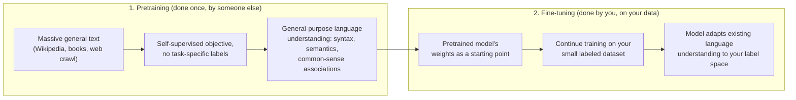
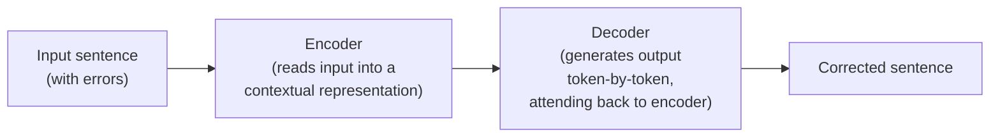

# 02 — Transfer Learning and BERT Fine-Tuning

## Why this chapter matters

Chapter 01 ended on a question: "why not just use TF-IDF + Logistic Regression for claim
classification?"

The answer is transfer learning. BERT-family models arrive already knowing a huge amount about
English — grammar, negation, world knowledge — from pretraining on massive general-domain text. So
fine-tuning them on a comparatively small labeled claims dataset gets you much further than
training anything from scratch on that same small dataset.

This is the mechanism behind the resume line "Used AWS Sagemaker to fine-tune associated models."
This chapter explains what that actually means, step by step.

## Transfer learning, conceptually

Training a deep model from scratch requires a lot of labeled data — millions of examples, ideally.
The model has to learn everything from zero: what a word is, what a sentence is, what negation
does to meaning, and *then* what makes something a "safety claim."

Pharma claim-classification datasets are nowhere near that size. A realistic internal labeled set
might be a few thousand to a few tens of thousands of sentences.

Transfer learning splits the problem in two:



1. **Pretraining** happens once, by someone else, on massive general text — Wikipedia, books, web
   crawl. The model learns general-purpose language understanding — syntax, semantics,
   common-sense associations — with no task-specific labels at all, using a self-supervised
   objective.
2. **Fine-tuning** happens on your side, on your small labeled dataset. You take the pretrained
   model's weights as a starting point and continue training on your specific task. The model only
   has to *adapt* its existing language understanding to your label space, rather than learn
   language from zero.

This is why fine-tuning a pretrained BERT on a few thousand labeled claims can outperform training
a custom architecture from scratch on the same data — the model isn't starting cold.

## BERT architecture, the parts that matter for an interview

**BERT = Bidirectional Encoder Representations from Transformers.** You don't need to derive
attention from scratch in an interview, but you do need these three ideas cold.

**1. Masked Language Modeling (MLM) pretraining.** BERT is pretrained by randomly masking ~15% of
tokens in a sentence, then training the model to predict the masked token from *both* left and
right context simultaneously — hence "bidirectional."

This is different from earlier left-to-right language models, which predict the next word given
only the words that came before it. Seeing both directions lets BERT build a much richer
representation of what a word means in its exact sentence context. That's exactly what you need to
tell "reduces the risk" apart from "does not reduce the risk" — the words on both sides of
"reduces" matter for that distinction. (BERT is also pretrained with Next Sentence Prediction,
though follow-up work like RoBERTa found MLM alone does most of the work.)

**2. The [CLS] token.** Every input sequence to BERT is prepended with a special `[CLS]` token.
After the sequence passes through all the transformer encoder layers, the final hidden state at
the `[CLS]` position is trained — during fine-tuning — to be a summary vector of the entire input.
It's the vector you attach a classification head to.

Conceptually: the encoder layers let every token attend to every other token, so by the final
layer, the `[CLS]` position has "absorbed" contextual information from the whole sentence. That
makes it a natural pooled representation for sequence-level tasks.

**3. The fine-tuning head.** Pretrained BERT outputs contextual embeddings, not class labels. To
adapt it to claim classification, you attach a small task-specific head on top of the `[CLS]`
vector — typically a dropout layer followed by a linear layer projecting to your number of classes
(or, for multi-label claim tagging, one sigmoid unit per tag).

During fine-tuning, gradients flow back through this new head *and* through BERT's existing
weights, so the whole network adjusts. The head learns from scratch, while BERT's weights shift
only slightly from their pretrained starting point.

## Worked walkthrough — fine-tuning for claim classification

Using Hugging Face `transformers` conceptually (the runnable version, on synthetic data, is in
`notebooks/02_bert_finetuning_demo.ipynb`):

```python
from transformers import AutoTokenizer, AutoModelForSequenceClassification, Trainer, TrainingArguments

model_name = "bert-base-uncased"
tokenizer = AutoTokenizer.from_pretrained(model_name)

# num_labels = number of claim-type tags; problem_type tells the model
# to treat this as multi-label (independent sigmoids + BCE loss) rather
# than single-label multi-class (softmax + cross-entropy).
model = AutoModelForSequenceClassification.from_pretrained(
    model_name,
    num_labels=len(CLAIM_TAGS),
    problem_type="multi_label_classification",
)

def tokenize(batch):
    return tokenizer(batch["text"], truncation=True, padding="max_length", max_length=128)

train_ds = raw_train_ds.map(tokenize, batched=True)

training_args = TrainingArguments(
    output_dir="./claim-classifier",
    num_train_epochs=3,
    per_device_train_batch_size=16,
    learning_rate=2e-5,       # small LR: don't wreck the pretrained weights
    weight_decay=0.01,
    evaluation_strategy="epoch",
)

trainer = Trainer(model=model, args=training_args, train_dataset=train_ds, eval_dataset=eval_ds)
trainer.train()
```

Three choices worth being able to explain if asked:

- **Small learning rate (typically 1e-5 to 5e-5).** BERT's weights already encode useful general
  language knowledge. A large learning rate would overwrite that ("catastrophic forgetting")
  rather than gently adapt it.
- **Few epochs (2–4, not 50+).** With a small fine-tuning dataset, the model overfits fast if you
  train too long — you're adjusting a huge pretrained network on a small amount of task data.
  Early stopping on a validation set is standard.
- **Full fine-tuning vs. freezing.** You can freeze BERT's encoder layers and train only the new
  head — fast, less prone to overfitting, but leaves accuracy on the table. Or you can fine-tune
  the whole network end-to-end — usually better with sufficient data, but slower and more
  overfit-prone with small datasets. A common middle ground: freeze the lower encoder layers
  (which tend to encode generic syntax) and fine-tune only the upper layers plus the head.

This fine-tuning job — training script, data, hyperparameters — is what actually runs as a
**Sagemaker training job**, covered in chapter 05. Sagemaker isn't a different framework; it's the
managed infrastructure that provisions the compute, runs this training script, and hands you back
the resulting model artifact.

## Proof Reading — where Seq2Seq comes in

The **Proof Reading** module solves a different kind of problem: given a sentence, produce a
*corrected* sentence (fix grammar, awkward phrasing, or formatting slips) — not a label. That's a
**sequence-to-sequence (Seq2Seq)** task, not classification, because the output is itself a
variable-length sequence of tokens, not a fixed set of classes.



Seq2Seq models use this encoder-decoder architecture: an encoder reads the input sentence into a
contextual representation (conceptually similar to BERT's encoder), and a decoder generates the
output sentence token-by-token, attending back to the encoder's representation at each step.

This generalizes classification — which is really "sequence in, one label out" — to "sequence in,
sequence out." The same family of architecture powers translation, summarization, and grammatical
error correction. In practice, proof-reading/grammar-correction is often framed as fine-tuning a
pretrained Seq2Seq model (e.g., a T5 or BART-style encoder-decoder) on pairs of (original sentence,
corrected sentence) — the same transfer-learning logic as BERT fine-tuning, but with a generative
decoder instead of a classification head.

## Tying it back

The reason the resume bullet says "fine-tune" rather than "train" is the whole point of this
chapter: Claim Extraction & Classification and ISI Classification are both framed as fine-tuning a
pretrained BERT-family encoder with a classification head on top, because labeled pharma-claims
data is scarce relative to what training from scratch would need.

Proof Reading is the odd one out architecturally — it needs a generative Seq2Seq model, not a
classifier — but it's built with the same transfer-learning philosophy: start from a pretrained
encoder-decoder, fine-tune on a smaller task-specific dataset of corrected sentence pairs.
