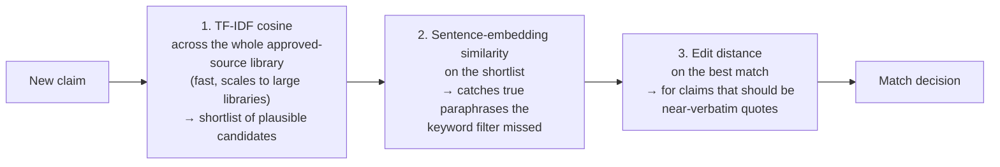

# 03 — Content Comparison and Similarity

## Why this chapter matters

The **Content Comparator tool** is a distinct module from claim classification. Instead of asking
"what type of claim is this," it asks "have we seen text like this before, and does it match what's
in our approved source library?"

This is a text-similarity / near-duplicate-detection problem, and it shows up constantly in pharma
content review. The same underlying claim gets rephrased across dozens of assets — a banner ad, a
leave-behind, a website — and reviewers need to know whether a new piece of copy is a legitimate
restatement of an approved claim, or an unsupported deviation from it.

In production this module runs against each client's own approved-source library — Eli Lilly
content is compared only against Eli Lilly's approved claims, AstraZeneca content only against
AstraZeneca's. So the similarity search space itself is client-scoped, not just the review queue
downstream of it.

## The core question: how similar are two pieces of text?

There's no single "similarity" — the right technique depends on what kind of similarity you're
trying to catch.

### 1. Edit distance (Levenshtein distance)

Edit distance measures the minimum number of single-character insertions, deletions, or
substitutions needed to turn one string into another. It's a **surface-level, character-level**
similarity measure.

It's great for catching near-identical strings with small typos or formatting differences —
"reduces risk by 42%" vs. "reduces risk by 4 2%." But it breaks down fast for paraphrases:
"reduces the risk of relapse" and "lowers the chance of relapse" mean almost the same thing, but
have a large edit distance, because edit distance has no notion of meaning, only characters.

```python
def levenshtein(a: str, b: str) -> int:
    m, n = len(a), len(b)
    dp = [[0] * (n + 1) for _ in range(m + 1)]
    for i in range(m + 1):
        dp[i][0] = i
    for j in range(n + 1):
        dp[0][j] = j
    for i in range(1, m + 1):
        for j in range(1, n + 1):
            cost = 0 if a[i - 1] == b[j - 1] else 1
            dp[i][j] = min(
                dp[i - 1][j] + 1,      # deletion
                dp[i][j - 1] + 1,      # insertion
                dp[i - 1][j - 1] + cost,  # substitution
            )
    return dp[m][n]
```

Python's standard library `difflib.SequenceMatcher` gives you a related ratio-based similarity
score without writing this by hand — useful for a quick "how close are these two strings,
character-wise" check.

**Where it's genuinely useful in the Content Comparator:** catching copy-paste artifacts, minor
punctuation/number transcription errors, and formatting drift between a source document and the
content that's supposed to quote it verbatim. Many pharma claims *are* required to be near-verbatim
quotes of approved label language, so a large edit distance from the approved source is itself a
signal worth flagging.

### 2. TF-IDF cosine similarity

Represent both pieces of text as TF-IDF vectors (chapter 01), then measure the cosine of the angle
between them:

```
cosine_similarity(A, B) = (A · B) / (||A|| * ||B||)
```

This is a **bag-of-words-level** similarity — it captures "these two texts use a lot of the same
distinctive words," regardless of word order. It's more robust than edit distance to word
reordering and sentence restructuring, but it still misses synonymy: "reduces risk" and "lowers
risk" share zero overlapping TF-IDF-weighted words for "reduces"/"lowers," so cosine similarity
between them can come out lower than intuition suggests, even though the meaning is nearly
identical.

```python
from sklearn.feature_extraction.text import TfidfVectorizer
from sklearn.metrics.pairwise import cosine_similarity

vectorizer = TfidfVectorizer()
vectors = vectorizer.fit_transform([new_claim, approved_claim])
similarity = cosine_similarity(vectors[0], vectors[1])[0][0]
```

TF-IDF cosine similarity is fast, has no training step beyond fitting the vectorizer on your
corpus, and is a strong first-pass filter: run every new claim against the whole approved-claims
library, rank by cosine similarity, and only pass the top-k candidates on to a more expensive
comparison stage. This "cheap filter first, expensive check second" pattern is standard for any
large-scale similarity search.

### 3. Sentence-embedding similarity (semantic textual similarity)

To catch paraphrases — the "reduces" vs. "lowers" case that both edit distance and TF-IDF cosine
miss — you need a representation that captures *meaning*, not just surface tokens.

Sentence embeddings (e.g., Sentence-BERT / `sentence-transformers`, or simply mean-pooling
contextual BERT token embeddings) map a whole sentence to a dense vector, such that semantically
similar sentences end up close together in vector space — even with very different word choices.

```python
from sentence_transformers import SentenceTransformer, util

model = SentenceTransformer("all-MiniLM-L6-v2")
emb_new = model.encode(new_claim, convert_to_tensor=True)
emb_approved = model.encode(approved_claim, convert_to_tensor=True)
semantic_similarity = util.cos_sim(emb_new, emb_approved).item()
```

This is the technique that actually catches the hard cases — a marketer or copywriter rephrasing
an approved claim in new language that a keyword-based check would completely miss. It's also the
most expensive of the three:

- Computationally, it needs a forward pass through a transformer encoder.
- Conceptually, its results are less directly explainable than "these two documents share these
  words" — a reviewer can't immediately see *why* two semantically-similar sentences were flagged
  together, the way they can with a shared-word overlap.

### Putting the three together

A production Content Comparator realistically layers all three, cheapest-first:



1. **TF-IDF cosine** across the whole approved-source library shortlists the most plausible
   candidate matches for a new claim — fast, and it scales to large libraries.
2. **Sentence-embedding similarity** on the shortlist catches true paraphrases the keyword filter
   missed, and scores *how* semantically close the new claim is to its best-matching approved
   source.
3. **Edit distance** on the best match is specifically for claims that are supposed to be
   near-verbatim quotes of label language. Here a *low* semantic-similarity-but-high-edit-distance
   combination, or vice versa, is itself informative — "semantically identical to an approved claim
   but a substantially reworded sentence" might be fine, whereas "should be a verbatim quote but
   isn't" is a real flag.

Anything below a similarity threshold against every entry in the approved library gets flagged as
**unsupported** — it doesn't match anything the company is cleared to say. Anything with high
similarity to two *different* approved claims that themselves say materially different things is
flagged as **ambiguous**. Both cases route to the flagged-for-review queue from the chapter 00
architecture diagram.

## A note on thresholds

Any of these similarity scores needs a threshold to turn into a yes/no "flag this" decision, and
that threshold is a business/compliance decision, not a pure ML one.

Set it too low, and reviewers drown in false positives — content flagged that's actually a fine
paraphrase. Set it too high, and genuinely unsupported claims slip through unflagged.

In practice this is tuned empirically against a labeled set of "should have been flagged" /
"should not have been flagged" examples, tracking precision and recall at different thresholds and
picking a point that matches the business's risk tolerance. In a compliance context, you typically
bias toward higher recall — better to over-flag and have a human dismiss a false alarm, than
under-flag and let a genuine compliance issue through.

## Tying it back

The Content Comparator tool sits downstream of Claim Extraction in the chapter 00 pipeline: once a
candidate claim sentence has been extracted and classified, the comparator's job is to answer "is
this claim backed by something in the approved library, or is it new/unsupported/a risky
paraphrase?"

Notebook `03_similarity_content_comparator.ipynb` implements the layered TF-IDF + edit-distance
approach end-to-end against a small synthetic "approved claims library," flagging near-duplicates
above a configurable threshold — the same shape of logic a production comparator runs, just at toy
scale.
