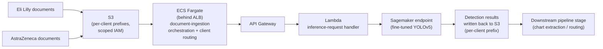
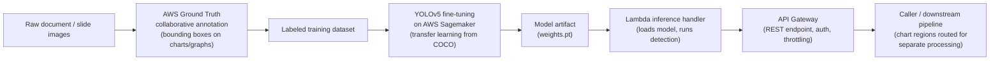

# 08 — Indegene Chart/Graph Detection

> Resume bullet (verbatim): *"Chart/Graph detection on text-embedded images. Performed collaborative
> labeling on AWS Ground Truth to annotate the target objects in images with charts and graphs to
> generate a custom training dataset. Fine-tuned Yolov5 model with our custom-labeled training
> dataset on AWS Sagemaker and deployed using lambda function & API gateway. Attained a TPR of 96%
> with an IOU threshold set at 0.85."*

## Business Context

Indegene is a digital-first life sciences commercialization company. Its clients are pharmaceutical
and biotech companies. Its core output is high-volume scientific and marketing content: slide decks
for medical congresses, leave-behinds for sales reps, clinical study reports, and regulatory
submission packages.

A huge amount of the persuasive and scientific weight in this content sits in **charts and graphs**.
Think Kaplan-Meier survival curves, bar charts comparing efficacy endpoints, forest plots, dose-response
curves. These are embedded directly as raster image regions inside slide images, PDF pages rendered to
images, and scanned documents.

That creates a document-processing problem. Any downstream pipeline that wants to extract text, run
OCR, classify claims, or pull structured data out of these documents needs to know, up front, *which
regions of the page are charts/graphs* versus body text, tables, or logos. Charts have to be routed
differently:

- You don't want an OCR/NLP pipeline trying to read the axis labels of a Kaplan-Meier curve as if they
  were a sentence.
- You don't want a "detect superscript citations" pipeline (see Course 07) scanning across a bar
  chart's data labels as if they were footnote markers.

Chart/graph detection is the **triage step** that sits near the front of a larger content pipeline. It
looks at a page image, draws a bounding box around every chart-like region, and hands those regions off
to whatever specialized downstream process actually needs to look at them — chart digitization,
image-based indexing, separate MLR/regulatory review, or simple redaction/exclusion from a text
extraction pass.

This is fundamentally an **object detection** problem, not a classification problem. The system doesn't
just need to say "this page contains a chart." It needs to localize *where* the chart is, as a bounding
box — because a page image very often mixes body text, tables, and one or more charts in the same
frame.

## Client & Production Deployment

This wasn't a benchmark exercise or an internal proof-of-concept. This chart/graph detection pipeline
ran **in production** at Indegene, serving two real pharma clients, **Eli Lilly** and **AstraZeneca**,
as a customer-facing document-processing service. It processed real client document volume daily as the
triage step feeding their downstream content pipelines.

That's exactly why the 96% TPR at IOU=0.85 bar mattered the way it did (Chapter 03 unpacks the metric
itself). A missed detection wasn't a benchmark blemish — it was a document silently moving forward
*without* the chart-extraction/routing step it needed. That's a real workflow gap surfacing in a paying
client's content pipeline, not just a number on a slide.

Production deployment ran on AWS:

- Documents land in **S3**.
- An **ECS (Fargate)** service behind an **ALB** orchestrates the broader multi-step document-ingestion
  workflow, including per-client routing.
- That service calls into the **Lambda + API Gateway** inference path described in Chapter 04 for the
  actual chart-detection request.
- Inference is backed by a **Sagemaker**-hosted, fine-tuned YOLOv5 endpoint.
- Results are written back to S3 for the downstream pipeline stage to pick up.
- **CloudWatch** covers observability across the stack.

Eli Lilly and AstraZeneca were served by the *same* fine-tuned model and pipeline code. But their
documents and detection results were kept isolated via per-client **S3 prefixes and scoped IAM
policies** — one client's environment never has read access to another's documents or outputs.

## The Pipeline

The whole project runs top to bottom like this: raw pages get labeled, the labels train a model, the
model gets deployed, and a caller gets bounding boxes back.

Each stage maps to one chapter in this course:

1. **Annotation** (Chapter 01). Before any model can be trained, humans have to draw ground-truth
   bounding boxes around chart/graph regions across a representative sample of document images. AWS
   Ground Truth is the managed service used to organize that labeling work across a team
   ("collaborative labeling"), enforce annotation quality, and export a structured manifest.
2. **Fine-tuning** (Chapter 02). Rather than training an object detector from scratch — which would
   need enormous amounts of labeled data — the pipeline fine-tunes YOLOv5. It starts from
   COCO-pretrained weights and adapts them on the custom chart/graph-labeled dataset, using AWS
   Sagemaker as the managed training environment.
3. **Evaluation** (Chapter 03). The resume bullet's headline number, "TPR of 96% at IOU threshold
   0.85," is an object-detection evaluation result. This chapter unpacks exactly what that means and
   why it's a meaningfully strong result.
4. **Deployment** (Chapter 04). The fine-tuned model is packaged and deployed behind an AWS Lambda
   function, fronted by API Gateway, so any pipeline stage or client application can call a REST
   endpoint and get back chart bounding boxes for a given image.
5. **Bonus** (Chapter 05). A personal project, SRGAN-based super-resolution, folded in here because it
   shares the generative/adversarial-network and image-processing family of concepts, and because it's
   the most natural place in this curriculum to cover GANs.

## Broader Skills Woven Into This Course

Per the candidate's skills list, this course also covers where these fit into this specific project:

- **TensorFlow Serving** (Chapter 04) — as an alternative real-time serving path to Lambda.
- **AWS Rekognition** (Chapter 04) — as a managed alternative for a subset of the detection use case.
- **GANs** (Chapter 05, bonus).
- **CNNs** and **Object Detection** (Chapters 02–03) — YOLOv5 internals.
- **Semantic Segmentation** (Chapter 02) — as a contrast to bounding-box detection.

## STAR Summary (practice this out loud, under 90 seconds)

**Situation.** Indegene's pharma clients produce huge volumes of slide decks, leave-behinds, and
scientific documents where a large fraction of the important content — efficacy curves, comparison bar
charts, forest plots — lives inside chart/graph images embedded in the page, mixed in with body text
and tables. Downstream document-processing pipelines (OCR, text extraction, claim tagging) need to know
which regions of a page are charts so they can route them differently instead of trying to read a
chart's axis as running text.

**Task.** I was asked to build a system that could automatically detect and localize chart/graph
regions within document and slide images, accurate enough to reliably feed a downstream pipeline stage
without excessive manual review.

**Action.** I ran a collaborative labeling effort on AWS Ground Truth, coordinating multiple annotators
to draw bounding boxes around chart/graph regions across our document image corpus to build a custom
training dataset — including the annotation-quality steps needed to keep labels consistent across
labelers. I then fine-tuned a YOLOv5 object detection model on AWS Sagemaker, starting from
COCO-pretrained weights and adapting it to the chart/graph detection task with our custom-labeled data.
Once validated, I deployed the trained model behind an AWS Lambda function, exposed through API
Gateway, so any part of the broader content pipeline could call a simple REST endpoint and get back
chart/graph bounding boxes for a submitted image.

**Result.** The fine-tuned model **attained a True Positive Rate (TPR / recall) of 96% at an IOU
threshold of 0.85**. In plain language: on held-out evaluation data, the model correctly detected 96%
of the actual chart/graph regions, and it did so under a strict definition of "correct" — a predicted
box had to overlap the true chart region by at least 85% (Intersection over Union) to count as a match,
not the more forgiving 50% threshold commonly used as a default in object-detection benchmarks. So the
model found nearly every chart on the page, *and* when it drew a box around one, that box was a tight,
accurate fit around the actual chart, not just a rough overlap. That combination — high recall plus a
strict localization bar — is exactly what a downstream routing pipeline needs: missed charts mean
content silently skipped, and loose/inaccurate boxes mean cropping the wrong region for the next stage.

## How This Course Is Organized

| File | Covers |
|---|---|
| `01-data-labeling-and-annotation-aws-ground-truth.md` | Bounding-box annotation fundamentals, labeler consensus/quality, active learning, AWS Ground Truth mechanics |
| `02-yolov5-architecture-and-finetuning.md` | YOLOv5 architecture (backbone/neck/head, anchors), transfer learning workflow, `data.yaml`, augmentation, hyperparameters |
| `03-object-detection-metrics-iou-map-tpr.md` | IOU computation, IOU thresholds, TPR/recall, precision-recall curves, mAP — unpacking "96% TPR at IOU 0.85" |
| `04-serverless-model-deployment-lambda-api-gateway.md` | Lambda deployment for deep learning models, container images, cold starts, API Gateway, TensorFlow Serving/Rekognition alternatives |
| `05-bonus-gans-and-super-resolution-srgan.md` | GAN fundamentals, adversarial vs. pixel-wise loss, SRGAN, single-image super-resolution applied to video |
| `06-detection-deduplication-and-model-version-drift.md` | The "revised document / retrained model" chapter: reprocessed-document dedup, model-version attribution drift, a proposed `detection_runs` design (content-hash dedup + `model_version` stamping) |
| `07-production-resilience-and-operational-engineering.md` | Error-handling table (retry vs. fail-fast vs. degrade gracefully), the shared-Lambda-concurrency cross-client caveat, four object-detection-deployment bug narratives, concrete memory/timeout/threshold values, one named hardening gap |
| `99-Interview-QA.md` | Behavioral, technical, system-design, and "rebuild it today" interview Q&A |
| `notebooks/` | Seven runnable, offline, synthetic-data notebooks — one per major concept |

Read in order — each chapter builds on the last, and the notebooks are meant to be run alongside the
chapter with the matching number.

> **Confidentiality note.** Before naming Eli Lilly or AstraZeneca by name in an actual interview, check
> what your NDA/engagement letter actually allows — see the root README's "Client & Production Context"
> note for the safer generic phrasing to fall back on.
