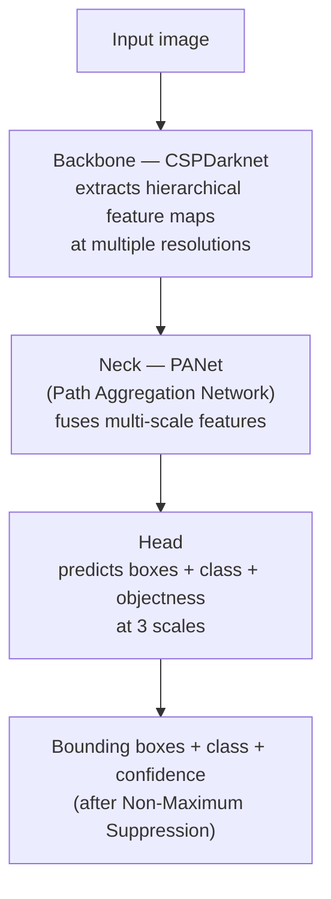

# 02 — YOLOv5 Architecture & Fine-Tuning

## Why this chapter matters

"Fine-tuned a YOLOv5 model" is a one-line resume claim that can unpack into a 20-minute interview
conversation if the interviewer wants it to. You should be able to explain, at a conceptual level:

- What's actually inside a YOLOv5 model.
- Why fine-tuning from COCO weights is the right call rather than training from scratch.
- What knobs — `data.yaml`, augmentation, image size, thresholds — you'd actually touch to adapt it to
  chart/graph detection.

This chapter builds that from the ground up. The fine-tuned model built this way is the same one that
served Eli Lilly and AstraZeneca in production (Chapter 04, `00-README.md`), so the fine-tuning choices
below weren't academic — they directly shaped what shipped to two paying clients.

## Why Object Detection, Not Classification

A classifier answers "what is in this image" with one label. Chart/graph detection needs to answer
"where, within this page image, are the chart regions" — potentially more than one per page, mixed in
with body text and tables.

That's an **object detection** problem: for every object instance, predict a bounding box (location +
extent) and a class label + confidence.

YOLO ("You Only Look Once") is the family of models that made real-time, single-pass object detection
practical. YOLOv5 — the Ultralytics PyTorch implementation — is a natural default choice for a project
like this: it's fast to train, fast at inference, has strong pretrained weights, and — critically for a
Lambda deployment (Chapter 04) — is small and CPU-inference-friendly compared to two-stage detectors
like Faster R-CNN.

It's also worth being able to contrast detection with **semantic segmentation** (part of the
candidate's broader skill list). Segmentation labels every *pixel* with a class, producing a precise
mask of the chart's exact shape, while detection only produces a rectangular box. For this project, a
bounding box is the right level of granularity — a downstream pipeline that wants to crop out "the
chart region" for separate processing just needs a rectangle to crop, not a pixel-perfect outline. A
segmentation model would be strictly more expensive to label and train for no practical benefit here.

## YOLOv5 Architecture, Conceptually

YOLOv5, like most modern one-stage detectors, is organized into three conceptual blocks:



- **Backbone (CSPDarknet).** The backbone is a convolutional network whose job is pure feature
  extraction: repeated conv/downsampling blocks that turn a raw image into a stack of feature maps at
  progressively lower spatial resolution and higher channel depth. "CSP" (Cross Stage Partial) refers to
  a design where part of the feature map skips a block and is concatenated back in later. That reduces
  redundant computation and gradient duplication compared to a plain deep stack of convolutions — a
  practical efficiency trick, not a conceptual departure from "it's a CNN that extracts features."
  Conceptually, early backbone layers pick up low-level features — edges, corners, color gradients,
  think chart gridlines and axis lines — and deeper layers assemble those into higher-level shapes: the
  overall rectangular/plot-like structure that distinguishes a chart region from a block of body text.
- **Neck (PANet).** Charts appear at very different sizes within a page — a full-slide chart vs. a small
  inset chart next to a paragraph. A single feature-map resolution can't represent both well: deep,
  low-resolution feature maps have strong semantic context but coarse localization, while shallow,
  high-resolution maps have precise localization but weak semantics. The neck's job is to fuse
  information across scales — top-down *and* bottom-up paths in PANet — so that detection at every scale
  benefits from both. This is why YOLOv5 can pick up a large full-page chart and a small inset chart in
  the same forward pass.
- **Head.** The detection head takes the fused multi-scale feature maps and, at each of three
  resolutions (typically stride 8/16/32 relative to the input), predicts a fixed number of candidate
  boxes per grid cell: box offsets, an objectness score (is there an object here at all), and a
  class-probability distribution. Predictions across all scales and grid cells are then filtered by
  confidence and de-duplicated with **Non-Maximum Suppression (NMS)** — since a chart region will
  typically trigger several overlapping candidate boxes, NMS keeps the highest-confidence box and
  suppresses others that overlap it heavily.

## Anchor Boxes

YOLO predicts box offsets *relative to* a set of predefined **anchor boxes** — a small set of reference
width/height priors at each detection scale, chosen (originally, by k-means clustering over the
training set's box shapes) to roughly match the aspect ratios of objects the model expects to see.
Instead of predicting a box's width and height from scratch, the model predicts a small adjustment
relative to the nearest anchor, which is an easier, more stable learning target.

For chart detection, the interesting practical detail is that chart bounding boxes tend to cluster
around a narrower range of aspect ratios — mostly landscape-oriented, roughly 4:3 to 16:9-ish, since
most charts are wider than they are tall — than COCO's general-object anchor set, which is tuned for
people, cars, animals, etc.

YOLOv5's training script can **auto-recompute anchors** from the custom dataset's actual box shapes at
the start of fine-tuning. Worth knowing as a concrete tuning lever, since anchors mismatched to your
object shapes measurably hurt convergence and final accuracy.

## Fine-Tuning Workflow: Transfer Learning from COCO

Training an object detector from randomly initialized weights needs a very large, diverse labeled
dataset to learn general-purpose visual features (edges, textures, shapes) before it can learn anything
task-specific — far more than a custom, single-domain chart dataset realistically has.

**Transfer learning** sidesteps this. Start from YOLOv5 weights already trained on COCO (80 general
object classes, ~200K images), which have already learned strong general visual features, and fine-tune
only on the smaller custom chart/graph dataset. The backbone's early layers change very little during
fine-tuning — edges and textures are edges and textures whether the object is a dog or a bar chart. The
head and later layers adapt more, learning to recognize chart-specific patterns from a much smaller
number of custom-labeled examples than training from scratch would require.

The practical command (Ultralytics YOLOv5 repo) looks like:

```bash
python train.py \
  --data data.yaml \
  --weights yolov5s.pt \
  --img 640 \
  --batch-size 16 \
  --epochs 100
```

### `data.yaml`

This file tells YOLOv5 where the training/validation images and labels live and what the classes are:

```yaml
train: ../datasets/charts/images/train
val: ../datasets/charts/images/val
nc: 1
names: ['chart']
```

Each image has a corresponding `.txt` label file with one line per object instance:
`<class_id> <x_center> <y_center> <width> <height>` (all normalized 0–1) — the format Chapter 01's
Ground Truth manifest gets converted into. `notebooks/02_yolov5_finetuning_walkthrough.ipynb` shows a
sample `data.yaml` and parses/validates it directly.

### Augmentation

YOLOv5's training pipeline applies data augmentation by default: mosaic augmentation (stitching 4
training images into one), random scaling, HSV color-jitter, horizontal flip, and translation.

For chart/graph detection specifically, a couple of these deserve a second thought rather than blind
defaults:

- **Horizontal flip** is generally safe — a flipped chart is still visually chart-like.
- **Aggressive color-jitter** should be tuned conservatively. Chart color coding can occasionally be
  semantically meaningful in a way a stop-sign or dog photo isn't. You don't want to distort
  distinguishing features so much that closely related chart types become harder for the model — though
  if the class taxonomy is single-class "chart," this is a smaller concern, but still worth being aware
  of.
- **Mosaic augmentation** is particularly valuable here because it exposes the model to charts at varied
  relative scales and in varied surrounding contexts within a single training image, directly addressing
  the small-inset-chart-vs-full-page-chart scale variation problem.

## Hyperparameter Considerations

- **Image size (`--img`).** YOLOv5 resizes inputs to a fixed square size (commonly 640). Charts with
  fine gridlines, small legend text, or thin axis lines can lose distinguishing detail at low
  resolution. Bumping to 960 or 1280 trades inference speed/memory for finer detail — a real
  consideration on a memory/timeout-constrained Lambda deployment (Chapter 04).
- **Batch size.** Constrained by available GPU memory during Sagemaker training. Larger batches give
  more stable gradient estimates but need more memory, and there's a batch-size/learning-rate
  interaction to be aware of if scaling up.
- **Confidence threshold (inference-time).** The minimum objectness×class-probability score for a
  predicted box to be reported at all. Lower it and you catch more true charts but also more false
  positives; raise it and precision improves at the cost of recall. This is a deployment-time business
  decision, not just a technical one — for a triage pipeline where missing a chart means silently
  skipping content, erring toward a lower confidence threshold (favoring recall) is usually the right
  call, provided the downstream stage can tolerate a few false positives.
- **IOU threshold (inference-time, for NMS).** Controls how aggressively overlapping candidate boxes
  around the same object get merged into one. This is a *different* IOU threshold from the *evaluation*
  IOU threshold discussed in Chapter 03 — don't conflate the two in an interview answer.

## Tying It Back

"Fine-tuned YOLOv5 with our custom-labeled dataset on Sagemaker" means, concretely:

- Start from COCO-pretrained weights.
- Point `train.py` at a `data.yaml` describing the chart-labeled dataset converted from the Ground Truth
  manifest.
- Let YOLOv5 auto-recompute anchors for chart-shaped boxes.
- Tune image size upward if fine chart details were being missed.
- Lean on YOLOv5's default augmentation — mosaic in particular — to handle the scale variation between
  full-page and inset charts.

Sagemaker's role here is the managed training environment: provisioning the GPU instance, running the
training job, and producing the resulting model artifact that Chapter 04 deploys. That's the level of
"why," not just "what," an interviewer is listening for when they ask you to walk through the
fine-tuning step.
