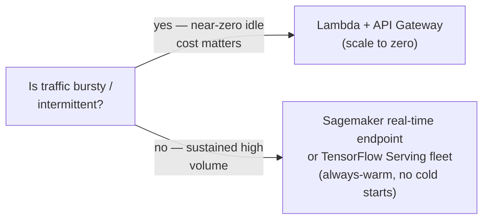
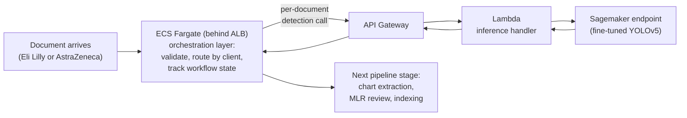

# 04 — Serverless Model Deployment: Lambda & API Gateway

## Why this chapter matters

Training a good model is only half the story. The resume bullet ends with "deployed using lambda
function & API gateway," and deployment architecture is a favorite interview area precisely because
it's where ML engineering meets systems engineering.

This chapter covers what it actually takes to put a YOLOv5 model behind a serverless HTTP endpoint, the
real constraints that shape that decision, and the alternatives worth knowing — TensorFlow Serving,
Sagemaker real-time endpoints, AWS Rekognition — so you can speak to *why* Lambda + API Gateway was a
reasonable choice, not just that it was used.

## Why Serverless for This Workload

Chart/graph detection, as a triage step near the front of a document pipeline, is a good fit for
serverless deployment specifically because of its traffic shape: it's likely invoked in **bursts** — a
batch of newly ingested slide decks or documents needs processing, then goes quiet — rather than
sustaining constant high-throughput traffic.

A fixed, always-on inference server (a Sagemaker real-time endpoint, or a standing EC2/ECS deployment)
sits idle — and costs money — between bursts. Lambda's pay-per-invocation, scale-to-zero model matches
that shape well: you pay only when a document is actually being processed, and Lambda scales out
automatically if a large batch of documents arrives at once, up to account concurrency limits.

## Packaging a Deep Learning Model for Lambda

Lambda's traditional deployment model — a `.zip` of code + dependencies, capped historically around
250MB unzipped — is a poor fit for deep learning workloads. PyTorch alone is well over that limit, and a
YOLOv5 model artifact (`weights.pt`) plus its inference dependencies (`torch`, `torchvision`,
image-decoding libraries) routinely need a gigabyte or more of packaged code and libraries.

The practical answer is **container-image-based Lambda**: instead of a zip upload, Lambda supports
deploying a function as a Docker container image (up to 10GB), pushed to Amazon ECR. This is the
realistic packaging approach for this project — a Dockerfile installing `torch`/`torchvision` (or a
CPU-optimized inference-only runtime), copying in the fine-tuned `weights.pt` artifact, and defining the
Lambda entrypoint handler function. A minimal shape:

```dockerfile
FROM public.ecr.aws/lambda/python:3.10

COPY requirements.txt .
RUN pip install -r requirements.txt --target "${LAMBDA_TASK_ROOT}"

COPY weights.pt ${LAMBDA_TASK_ROOT}
COPY app.py ${LAMBDA_TASK_ROOT}

CMD ["app.lambda_handler"]
```

`notebooks/04_lambda_inference_handler_demo.ipynb` writes and directly exercises an
`app.lambda_handler(event, context)`-shaped function — request parsing, mock model inference, and
response formatting — against a fake `event` dict, entirely offline.

## Cold Starts

A **cold start** happens when Lambda has to initialize a fresh execution environment — no warm
container available — before it can run your handler. That means: pulling/mounting the container image,
starting the Python runtime, and running any module-level initialization code. Crucially, that includes
**loading the model weights into memory**, which for a deep learning model is often the single most
expensive part of a cold start.

For a request-response API where a caller is waiting on the HTTP response, a multi-second cold start is
a real user-facing latency problem — and it's the single most important Lambda-specific concern for a CV
workload like this.

Practical mitigations, roughly matching what a production deployment of this project would lean on:

- **Load the model once, outside the handler function**, at module scope, so it's loaded during
  cold-start initialization and then reused across all subsequent warm invocations of that container
  instance — never reload the model inside the per-request handler body.
- **Provisioned Concurrency** — Lambda can keep a configured number of execution environments
  pre-initialized (model already loaded) and ready to serve, eliminating cold starts for that reserved
  capacity at a fixed extra cost. This is the direct lever for "bursty but latency-sensitive" traffic:
  keep 1–2 environments warm at all times for baseline traffic, and let Lambda's normal scale-out (which
  does pay the cold-start cost) absorb overflow bursts.
- **Smaller model / quantization / ONNX export** — reducing the artifact size and load time directly
  shrinks cold-start duration. Converting the model to ONNX Runtime (or TorchScript) can meaningfully
  reduce both cold-start load time and per-request inference latency versus loading a full PyTorch
  `nn.Module` with the training-time dependency footprint.
- **Right-sized memory allocation** — Lambda allocates CPU proportionally to configured memory, so a
  CPU-bound inference workload often gets *faster* (not just more expensive) by increasing memory
  allocation, up to a point of diminishing returns. This needs empirical tuning against actual inference
  latency, not a guess.

## Memory and Timeout Tuning

Two Lambda configuration knobs matter directly for a CV inference workload:

- **Memory** (which, as above, also scales CPU) needs to be sized to comfortably hold the loaded model
  plus the decoded input image plus PyTorch's runtime overhead — typically in the 2–3GB+ range for a
  YOLOv5-class model, found empirically by watching CloudWatch memory-utilization metrics and increasing
  until utilization plateaus with headroom.
- **Timeout** needs to cover worst-case cold-start-plus-inference latency for the largest expected input
  image, with margin. Set too tight, and legitimate slow-but-successful inferences get killed; set too
  loose, a hung invocation burns cost and delays error surfacing to the caller.

## API Gateway: Fronting the Lambda

API Gateway is the managed HTTP layer sitting in front of the Lambda function, and it earns its place in
the architecture for reasons beyond "Lambda needs an HTTP trigger":

- **Request/response mapping.** API Gateway defines the public-facing REST contract — for example, a
  `POST /detect-charts` endpoint accepting a JSON body with a base64-encoded image or an S3 object
  reference, and returning a JSON response listing detected bounding boxes, confidences, and class
  labels. This is decoupled from whatever internal shape the Lambda handler happens to use, and
  independent of the underlying model's raw output tensor format.
- **Throttling.** API Gateway lets you set request-rate limits (per API key, per client, or overall) to
  protect the downstream Lambda (and its account-level concurrency limit) from being overwhelmed by a
  traffic spike — directly relevant for a bursty-by-nature document pipeline where many pages could be
  submitted for detection simultaneously.
- **Auth.** API Gateway handles authentication/authorization before a request ever reaches Lambda — API
  keys, IAM-based auth, or a Lambda authorizer/Cognito for more complex identity — appropriate given
  this endpoint likely serves other internal Indegene pipeline components rather than the public
  internet, and given the client-confidential nature of pharma content flowing through it.

## Alternative: TensorFlow Serving / Sagemaker Real-Time Endpoints

Lambda + API Gateway is the right call for bursty, moderate-volume, latency-tolerant-within-reason
traffic. It stops being the right call as sustained throughput climbs: cold starts become a
proportionally smaller nuisance, but per-invocation overhead and Lambda's compute/memory ceiling start
to bind, and a dedicated, always-warm serving layer starts winning on cost-per-inference at high volume.

**TensorFlow Serving** (or, in the AWS-native equivalent, a **Sagemaker real-time inference endpoint**)
keeps the model loaded in memory on a persistent, auto-scaled fleet of instances, batches concurrent
requests for GPU efficiency, and eliminates cold starts entirely at the cost of paying for always-on
capacity.



The realistic decision framework worth stating in an interview: **use Lambda when traffic is
bursty/intermittent and near-zero idle cost matters; move to a real-time Sagemaker endpoint (or
TensorFlow Serving on a dedicated fleet) once sustained request volume is high enough that always-on
capacity is cheaper than paying for repeated cold starts and Lambda's per-invocation pricing.** This is
a classic serverless-vs-provisioned tradeoff that shows up in almost every applied-ML deployment
decision, not just this one.

## Where AWS Rekognition Could Substitute

**AWS Rekognition** is a fully managed computer-vision API — no training, no deployment infrastructure
to manage — that includes generic object/scene/text detection out of the box. It's worth naming as an
alternative specifically to demonstrate deployment judgment.

Rekognition's custom labels feature (Rekognition Custom Labels) *could* plausibly handle a simpler
version of "does this image region look like a chart" if the class taxonomy were simple and the
accuracy bar were looser — with zero training-infrastructure or deployment work: no Sagemaker training
job, no Lambda packaging, no cold-start tuning.

But it trades away exactly the control this project needed. Rekognition Custom Labels doesn't give you
the same fine-grained control over anchor boxes, augmentation strategy, or IOU-threshold-tuned
evaluation that hitting a strict 96%-TPR-at-IOU-0.85 bar required, and per-call pricing at high volume
can exceed a self-hosted model's cost.

The honest framing for an interview: for a quick proof-of-concept or a lower-accuracy-bar use case,
Rekognition is worth prototyping first before investing in a custom-trained pipeline. For a production
requirement with a specific, strict accuracy target, a custom-trained YOLOv5 model gives the control
needed to actually hit that target.

## Production Topology: Lambda + API Gateway Inside a Larger ECS Fargate Orchestration Layer

Everything above describes the real-time inference-request path — the part of the resume bullet that
says "deployed using lambda function & API gateway" — and in production that path is exactly what
handled the actual chart-detection call for both Eli Lilly and AstraZeneca traffic.

But it's worth being precise about where that path sits inside the *full* production system, because
"Lambda + API Gateway" alone doesn't answer the question an interviewer will actually ask if they push
on architecture: how does a document even get to that Lambda, and how does the result get back to the
right client's downstream pipeline?

In production, Lambda + API Gateway sat behind (and alongside) an **ECS Fargate** service running behind
an **ALB** — the orchestration layer for the broader document-ingestion workflow. That layer owned the
parts a pure Lambda-only design doesn't cleanly handle at production scale for two clients:

- **Stateful, multi-step orchestration.** A document arriving from Eli Lilly or AstraZeneca isn't just
  "call the detection endpoint once." It's ingest, validate, route to detection, wait for the result,
  hand off to the next pipeline stage (chart extraction, MLR review, indexing), and track that
  workflow's state end to end. Lambda functions are stateless and short-lived by design; a long-running,
  multi-step workflow with retries and state tracking is a poor fit for a single Lambda invocation, and
  is exactly what a standing ECS Fargate service (or a Step Functions state machine fronting it) is
  built for.
- **Multi-client routing and isolation.** With two paying clients sharing the same fine-tuned model and
  code path, something has to decide which S3 prefix a given document belongs to, apply the correct
  IAM-scoped credentials for that client's data, and keep Eli Lilly's documents and results from ever
  being visible in AstraZeneca's path (see `00-README.md`'s "Client & Production Deployment" section).
  That client-routing logic lives naturally in the orchestration layer, not duplicated into every Lambda
  invocation.
- **Batch and real-time both.** Some volume arrives as large end-of-day batches — a client's newly
  ingested slide deck corpus. Some arrives as smaller, more time-sensitive requests. ECS Fargate
  orchestration can fan documents out to the Lambda + API Gateway detection endpoint at a controlled
  rate for either shape, instead of a caller hammering the endpoint directly and tripping API Gateway
  throttling or Lambda's account concurrency ceiling.



The honest framing for an interview: Lambda + API Gateway is the right, deliberate choice for the
*inference request* itself — bursty, request/response-shaped, scale-to-zero-friendly, exactly as
argued above. It was never meant to be the whole system. The surrounding ECS Fargate orchestration
layer is what turned a single inference endpoint into a production, multi-client document pipeline that
Eli Lilly and AstraZeneca actually depended on daily — a distinction worth drawing explicitly, because
"we used Lambda" undersells the system-design judgment involved, and "we used ECS" alone would
misrepresent how the actual detection call was served.

## Tying It Back

"Deployed using lambda function & API gateway" means:

- Package the fine-tuned YOLOv5 model as a container-image Lambda function, because the model and its
  dependencies blow past the zip-package size limit.
- Load the model once at module scope to keep cold starts to a one-time cost per warm container.
- Size memory/timeout empirically against real inference latency.
- Front the whole thing with API Gateway for a stable REST contract, throttling, and auth — with
  Provisioned Concurrency as the lever if baseline latency needs tightening.

That architecture is a deliberate fit for a bursty, document-pipeline-triage workload, not a default.
TensorFlow Serving/Sagemaker real-time endpoints and AWS Rekognition are the alternatives worth naming
when an interviewer asks what you'd reach for at higher throughput or lower engineering budget.
