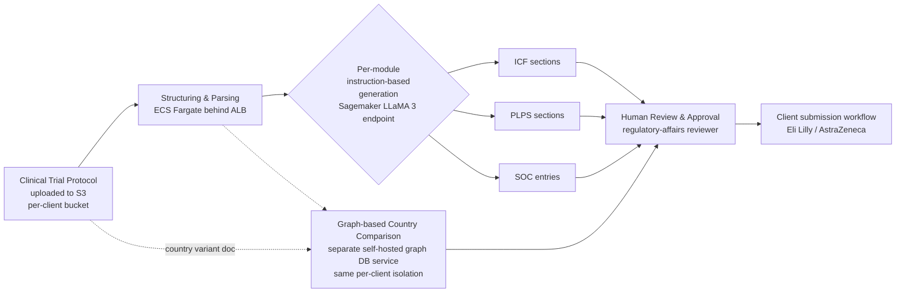

# 09 — Indegene: GenAI Regulatory Platform (ICF / PLPS / SOC)

**Company:** Indegene (digital-first life sciences commercialization company)
**Role:** Data Scientist · Aug 2021 – Jun 2024 · Bengaluru, India
**Resume bullet (verbatim):** "Generative AI-based Regulatory Platform. Developed multiple
end-to-end ML pipelines for individual sections of modules such as ICF(Informed Consent Form),
PLPS(Plain Language Protocol Synopsis), SOC (Summary of Changes) & Country Specific Protocol
Comparison. The sections included structuring and post-processing the clinical trial Protocol
documents & required Instruction-based content generation for various modules of the platform."

## 1. The business problem

A clinical trial **Protocol** is the master document for a trial. It defines:

- Who can join (eligibility criteria)
- Dosing schedules
- Endpoints (what the trial is measuring)
- Procedures
- Safety monitoring rules

Protocols are long — often 100 to 300 pages. They're dense, cross-referenced, and they get
**amended** repeatedly as a trial progresses.

From that one source document, several other documents have to be produced. Each one has a
different audience and a different regulatory purpose:

| Module | Audience | Purpose |
|---|---|---|
| **ICF** — Informed Consent Form | Trial participants (patients) | Explains the trial, its risks and benefits, and what participation involves, in language a layperson can understand *before* they legally consent to join |
| **PLPS** — Plain Language Protocol Synopsis | Patients, patient advocacy groups, lay reviewers, public registries | A simplified summary of the full Protocol, stripped of clinical jargon |
| **SOC** — Summary of Changes | Investigators, ethics committees (IRB/IEC), regulators | A structured record of exactly what changed between one Protocol version (amendment) and the previous one — see chapter 06 for how this module's core purpose ties directly into protocol-amendment/document-revision handling, the strongest analog in this whole curriculum to "how do you handle a revised version of a document" |
| **Country Specific Protocol Comparison** | Regulatory affairs, local trial sites | Shows how a country's local regulatory requirements or site-specific addenda diverge from the global Protocol |

Right now, every one of these is produced largely by hand. A medical writer reads the (possibly
amended) Protocol, works out the plain-language explanation or the change list themselves, and
formats it to the sponsor's template.

That's slow. And slow is expensive when a trial is running against a clock. But speed isn't the
main constraint here — **correctness is.** Think about what a mistake actually costs in this
domain:

- An ICF that misstates a risk can mean a patient consents to a trial without understanding a real
  danger.
- A PLPS that omits an eligibility criterion is a similarly serious gap.
- An SOC that misses a safety-relevant amendment can mean a regulator approves a submission built
  on an incomplete change record.

This is a regulated, patient-safety-critical domain. So an AI system's job here is narrow: make
the *first draft* fast and consistent — never make the *final call*. That's why every module in
this platform is built around **generate-then-human-review**, not generate-and-publish: a
qualified medical or regulatory reviewer always checks AI output against the source Protocol
before anything is used.

That framing — GenAI for speed and consistency, humans for accountability and traceability — is
the single most important thing to be able to articulate about this project in an interview.

## 2. Client & Production Deployment

This was not a proof-of-concept. The platform went to **production with a customer-facing
interface** and served two real pharma sponsors — **Eli Lilly** and **AstraZeneca** — whose
regulatory-affairs teams used it **daily** to draft and review ICF, PLPS, SOC, and Country
Specific Protocol Comparison content for actual clinical trials.

Both clients' clinical trial protocols are extremely sensitive: commercially confidential trial
designs, unpublished endpoints, and — because Eli Lilly and AstraZeneca compete directly in
several therapeutic areas — real competitive intelligence between two rivals. That made **strict
per-client isolation a hard, non-negotiable requirement**, not a nice-to-have:

- **Separate S3 buckets per client** for protocol document storage — not a shared bucket with
  per-client prefixes. A prefix/ACL misconfiguration is a far easier mistake to make than a breach
  of a genuinely separate bucket with its own bucket policy.
- **Separate IAM roles per client**, scoped so a compromised or misconfigured credential on one
  client's pipeline has no path to the other client's data.
- **Likely separate Sagemaker endpoints (or, at minimum, strict namespace/adapter isolation)** per
  client for the fine-tuned LLaMA 3 inference layer, so a shared base model never mixes one
  client's in-flight request context or fine-tuning signal with the other's.

This is the highest-stakes multi-tenancy case in the whole curriculum: a leak of one client's
protocol content into the other's environment wouldn't just be a bug — it would be a severe trust
and legal incident for Indegene, given that Eli Lilly and AstraZeneca are direct competitors.

## 3. What this platform does, end to end

At a high level, every module follows the same shape:

1. Take the Protocol (and, for SOC and Country Comparison, a second document to compare against).
2. Turn it into something a model can reason over, section by section.
3. Generate the target content with an instruction-following model, constrained to that section's
   format.
4. Route the result to a human reviewer.

In production this shape maps directly onto an AWS topology:

**S3 (per-client bucket) → ECS Fargate (structuring/orchestration, behind an ALB) → Sagemaker
(fine-tuned LLaMA 3 real-time endpoint) → generated ICF/PLPS/SOC draft → human review gate →
client**

Here's that same flow as a diagram:

Supporting AWS services used throughout: **Lambda + API Gateway** for lightweight/event-driven
endpoints, **CloudWatch** for observability across the ECS services and the Sagemaker endpoint,
and **Secrets Manager** for credentials.

## 4. Why each design choice matters (not just what, but why)

- **Structuring before generation (ch. 01).** You cannot hand a 200-page Protocol to an LLM in one
  shot — it exceeds most context windows, and even when it doesn't, section boundaries get blurred
  and the model loses track of which clause belongs to which requirement. Parsing the Protocol
  into labeled, hierarchical sections first means each generation call is scoped to exactly the
  source text it needs, which is both a cost optimization and an accuracy safeguard.
- **Instruction-tuned generation, not free-form prompting alone (ch. 02, 05).** ICF, PLPS, and SOC
  each have a fixed structure and register (patient-friendly language for ICF/PLPS, structured
  change-log format for SOC). Getting a base model to reliably produce that shape, section after
  section, benefits from instruction tuning / parameter-efficient fine-tuning on top of prompt
  engineering. It's the difference between "usually follows the format" and "reliably follows the
  format across thousands of sections."
- **LLaMA 3 as an open-weight model (ch. 03).** Clinical protocol text is highly sensitive — it can
  contain unpublished trial design details, and downstream ICF/PLPS content is patient-facing.
  Running an open-weight model you can host inside your own environment (or a controlled cloud
  tenancy) is a defensible choice for data residency and IP protection, and it's also what makes
  fine-tuning economically realistic at scale. In production this ran as a **Sagemaker real-time
  inference endpoint**, which mattered even more once the platform served two competing pharma
  clients whose protocol content could never be sent to a shared third-party API.
- **Graph representation for Country Specific Comparison (ch. 04).** A flat text diff between a
  global Protocol and a country variant tells you *that* text changed, not *what kind* of
  requirement changed or *how* requirements relate to each other (e.g., an eligibility criterion
  that references a lab test that itself has a country-specific reference range). Modeling
  sections/requirements as nodes and their relationships as edges makes "what's different for
  country X" a graph query instead of a fragile line-by-line text comparison.
- **Human review as a required stage, not an optional one (ch. 05).** This is the throughline of
  the whole project. Every generation and every comparison output is a *draft signal* for a
  qualified reviewer, never a final artifact. In production, that reviewer is a real
  regulatory-affairs professional on the Eli Lilly or AstraZeneca side, which is exactly why this
  gate was never treated as optional — the platform's ability to be customer-facing at all rests
  on it.

## 5. How the chapters map to this

| Chapter | Covers |
|---|---|
| [01-clinical-document-structuring-and-parsing.md](01-clinical-document-structuring-and-parsing.md) | Section/heading detection, table extraction, chunking long documents, post-processing/normalization |
| [02-instruction-tuning-and-llm-finetuning.md](02-instruction-tuning-and-llm-finetuning.md) | Base vs. instruction-tuned models, instruction dataset construction, LoRA/QLoRA fundamentals |
| [03-open-source-llms-llama3-deployment.md](03-open-source-llms-llama3-deployment.md) | Why LLaMA 3 over a closed API, self-hosting/quantization/serving, tradeoffs vs. Azure OpenAI/AWS Bedrock |
| [04-document-comparison-with-graphdb-and-cypher.md](04-document-comparison-with-graphdb-and-cypher.md) | Graph modeling of protocol sections, GraphDB fundamentals, Cypher query patterns |
| [05-building-instruction-based-generation-pipelines.md](05-building-instruction-based-generation-pipelines.md) | Prompt templates per section type, schema-constrained output, factual grounding, human-review gate |
| [06-protocol-amendment-versioning-and-document-revision-handling.md](06-protocol-amendment-versioning-and-document-revision-handling.md) | The "revised document" question, answered through this platform's own SOC module: what happens today when a Protocol is amended, the SOC-diffs-textually-not-graph-based gap, the SOC-accuracy-vs-dependent-staleness distinction, a `protocol_version` propagation and dependency-tracking design, rapid-amendment/version-chain handling, and why a version bump is never a review fast-path |
| [07-production-resilience-and-operational-engineering.md](07-production-resilience-and-operational-engineering.md) | Real error-handling table (what hard-blocks a document vs. what's just logged), a concurrent-amendment version-race caveat, four candid bug-found-and-fixed stories, concrete Sagemaker LLaMA 3 timeout/retry/scaling values, one named hardening gap |
| [99-Interview-QA.md](99-Interview-QA.md) | Interview question bank |

Notebooks live in [`notebooks/`](notebooks/) and are runnable, fully offline, synthetic-data
companions to chapters 01, 02, 04, 05, 06, and 07 (no API keys, GPU, or model downloads required).

## 6. STAR summary

> **Situation.** Indegene runs clinical trials for life-sciences sponsors, and every trial's
> Protocol document has to be turned into several derivative documents — patient-facing Informed
> Consent Forms (ICF), Plain Language Protocol Synopses (PLPS), Summaries of Changes (SOC) across
> Protocol amendments, and country-specific comparisons against local regulatory variants.
> Producing these by hand is slow, and every Protocol amendment forces a re-derivation across all
> of them, creating a recurring bottleneck for medical writers and regulatory affairs teams.
>
> **Task.** Build end-to-end ML pipelines that structure and post-process the Protocol document,
> then use instruction-based generation to draft each module's sections (ICF, PLPS, SOC) and
> support country-specific protocol comparison — while keeping accuracy, traceability to the
> source Protocol, and human sign-off central to the design, since inaccurate patient-facing or
> regulatory content is a compliance and patient-safety risk, not just a quality issue.
>
> **Action.** I built a document structuring/parsing stage to turn the long, semi-structured
> Protocol into hierarchical, section-labeled objects suitable for context-window-limited
> generation calls; an instruction-based generation layer (prompt templates per section type,
> backed by a fine-tuned/instruction-tuned LLaMA 3 model) that drafted ICF, PLPS, and SOC content
> per section rather than as one monolithic pass; and a graph-based representation (GraphDB +
> Cypher queries) for Country Specific Protocol Comparison, modeling protocol requirements as
> nodes and country-specific variations as edges/relationships so differences could be queried
> directly instead of diffed as flat text. Every generated section and every comparison result was
> routed to a human reviewer before use.
>
> **Result (illustrative — replace with your real numbers).** Estimated to cut first-draft
> ICF/PLPS turnaround from **~5 days to ~1 day** per Protocol version by giving medical writers an
> AI-generated, source-grounded starting draft instead of a blank page, while the graph-based
> Country Comparison surfaced country-specific deltas that a manual line-by-line read was prone to
> miss. *(Replace the 5-day/1-day figures and any other numbers with your actual measured results
> before using this in an interview — these are placeholders to show the shape of a good,
> quantified answer.)*

## 7. Notes on framing

The business context is real: this platform served **Eli Lilly** and **AstraZeneca** in
production, deployed on **AWS** (S3, ECS Fargate, Sagemaker, Lambda, API Gateway, CloudWatch,
Secrets Manager, plus a self-hosted graph database), with strict per-client isolation and a
mandatory human-review gate.

The exact pipeline internals below that top-level shape — specific prompt template wording, exact
chunking heuristics, exact instance sizes — describe **a typical/recommended architecture for a
GenAI clinical-document platform of this kind**. They're built from the resume bullet, the general
shape of ICF/PLPS/SOC documents in clinical research, and standard practice for regulated-content
generation systems — not a verified line-by-line internal implementation spec.

When you talk about this project in an interview:

- Describe the client/production facts plainly.
- Frame the implementation-level detail as "how I approached it" / "the design we used," ready to
  go one level deeper on any piece if asked (the Q&A bank in `99-Interview-QA.md` is built for
  exactly that).
- Above all, lead with the human-in-the-loop framing — it's the detail that shows an interviewer
  you understand what "responsible GenAI" means in a regulated industry, not just that you can
  call an LLM API.

See this repo's root [`README.md`](../README.md) for the confidentiality note on naming Eli Lilly
and AstraZeneca by name in an actual interview — the real names are used here so you have full
context while studying; swap in safe phrasing ("a top-10 pharma company") for the interview itself
if your engagement's NDA calls for it.
