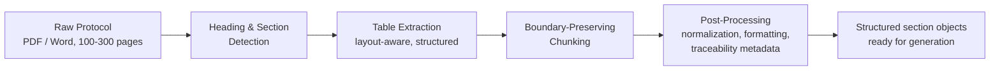
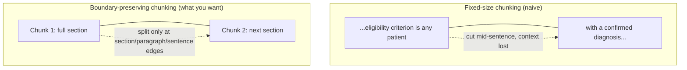

# 01 — Clinical Document Structuring & Parsing

## Why this chapter matters

Every module on this project — ICF, PLPS, SOC, Country Comparison — starts from the same raw
material: a clinical trial **Protocol**. That's typically a 100-300 page Word or PDF document,
with nested headings, numbered sections, embedded tables (dosing schedules, visit calendars,
inclusion/exclusion criteria), and cross-references between sections.

In production, that document lands in a per-client S3 bucket (Eli Lilly's or AstraZeneca's, kept
strictly separate — see `00-README.md`) before this structuring stage ever touches it.

Before you can generate a single sentence of ICF or PLPS content, you have to answer a much less
glamorous question: *what does this document actually look like, structurally, and how do I turn
it into something a model can reliably operate on?*

Interviewers ask about this stage because it's where most real-world GenAI document projects
actually live or die. The generation model gets all the attention, but the parsing/structuring
stage is what determines whether the model ever sees the right input in the first place.

## The problem: long, semi-structured documents

A clinical Protocol is "semi-structured." It has consistent conventions — numbered headings, a
table of contents, standard section names like "Eligibility Criteria," "Study Objectives,"
"Statistical Methods" — but no machine-readable schema behind it. It's still fundamentally a
formatted text/PDF document, not structured data. That gap is exactly what a structuring/parsing
stage has to close.

Three sub-problems fall out of this:

1. **Where does one section end and the next begin?** (heading/section detection)
2. **What do I do with the tables?** They carry critical structured content — dosing, visit
   schedules, criteria lists — that plain text extraction mangles.
3. **The whole document is too long for one model call.** (chunking)

Here's the shape of the pipeline that answers all three, in order:



## Section and heading detection

Most Protocol templates follow a numbered-heading convention: `1. Background`, `2. Objectives`,
`3. Eligibility Criteria`, `3.1 Inclusion Criteria`, `3.2 Exclusion Criteria`, and so on — often
with consistent font/style cues (bold, larger size, a specific heading style in the Word document)
on top of the numbering.

A practical parser combines several signals rather than trusting any single one:

- **Pattern-based detection**: regex over numbering conventions (`^\d+(\.\d+)*\s+[A-Z]`), since
  most Protocol templates are consistent about at least the numbering style even when wording
  varies sponsor-to-sponsor.
- **Style-based detection**: when parsing from the native Word/PDF format (not plain text), heading
  styles, font size jumps, and bold runs are strong independent signals. Combining them with the
  regex pattern cuts down on both false positives (a numbered list item mistaken for a heading) and
  false negatives (a heading that doesn't follow the expected numbering because of a template
  variant).
- **Known-vocabulary matching**: clinical Protocols use a fairly standard set of section names
  across sponsors (ICH E6 / ICH M11 template guidance heavily influences this). Matching against a
  known-heading vocabulary — "Eligibility Criteria," "Study Design," "Adverse Events," "Statistical
  Analysis Plan" — as a fallback or confidence booster catches headings that don't cleanly
  numbering-match.

A minimal illustration of the regex layer (the numpy-free notebook
`01_document_parsing_and_structuring.ipynb` builds this out fully on a synthetic protocol string):

```python
import re

HEADING_RE = re.compile(r"^(?P<number>\d+(?:\.\d+)*)\s+(?P<title>[A-Z][^\n]{2,80})$", re.MULTILINE)

def find_headings(text: str):
    return [
        {"number": m.group("number"), "title": m.group("title").strip(), "start": m.start()}
        for m in HEADING_RE.finditer(text)
    ]
```

The output isn't the final structure yet — it's a list of heading anchors. The actual "section
object" is built by slicing the text *between* consecutive heading anchors and attaching the
heading number/title/depth as metadata. Depth is derived from how many dot-separated numbers the
heading number has — `3.2` is depth 2, under `3`. That heading-depth signal is what lets
downstream generation code ask "give me everything under Eligibility Criteria" without caring
whether that's one paragraph or three subsections.

## Table extraction

Protocols embed a lot of their most safety-critical content in tables: dosing schedules, visit/
assessment calendars, inclusion/exclusion criteria lists, adverse-event grading tables.

Naive text extraction — just pulling all text out of a PDF top-to-bottom — causes real problems
here. It frequently interleaves table cell text with surrounding prose in a reading order that
makes no sense, or it drops row/column structure entirely, so a dosing table turns into an
unreadable wall of numbers.

The practical approach:

- **Use a layout-aware extractor, not raw text extraction, for anything table-shaped.** Tools that
  detect table bounding boxes and preserve row/column structure — instead of flattening everything
  to a single text stream — are the difference between a usable dosing table and noise.
- **Keep tables as structured objects (a list of rows/dicts), not re-flattened prose**, for as long
  as possible through the pipeline. If a table needs to feed into a generation prompt, serialize it
  explicitly (as markdown table syntax, or a labeled key-value block) rather than hoping the model
  infers row/column relationships from a jumble of extracted text.
- **Tag each table with its owning section**, the same way you tag paragraphs. A dosing table
  under section 5.2 "Dosing and Administration" needs that provenance carried forward, so later
  generation and comparison steps know exactly which requirement it belongs to.

## Chunking long documents: preserving section boundaries

Even after structuring, a single section (say, a long "Study Design and Rationale" section) can
still be too long for one generation call, once you add the instruction, few-shot examples, and
output budget. Two chunking strategies matter here, and the choice between them isn't cosmetic —
it directly affects whether generated content stays factually grounded.



- **Fixed-size chunking (naive)**: split every N tokens, regardless of content. Simple, but it
  will routinely cut a sentence — or an inclusion criterion — in half, and the second half loses
  the context that explains what it's a continuation of. This is a common beginner mistake, and
  it's worth being able to name it as one in an interview.
- **Section-boundary-preserving chunking (what you want)**: chunk *within* the structure produced
  by the heading-detection step, never across a section boundary. When a single section is still
  too long, split at the next-lowest structural boundary you have — subsection, then paragraph,
  then sentence — rather than at an arbitrary token count. This guarantees that whatever content
  ends up in a single generation call is coherent, and it means a generation prompt for "the
  Eligibility Criteria section" always gets the complete criteria, never a criteria list
  truncated mid-list.

```python
def chunk_section(section_text: str, max_tokens: int, approx_chars_per_token: int = 4):
    max_chars = max_tokens * approx_chars_per_token
    if len(section_text) <= max_chars:
        return [section_text]
    # fall back to paragraph boundaries, never mid-sentence/mid-list-item
    paragraphs = section_text.split("\n\n")
    chunks, current = [], ""
    for para in paragraphs:
        if len(current) + len(para) > max_chars and current:
            chunks.append(current.strip())
            current = ""
        current += para + "\n\n"
    if current.strip():
        chunks.append(current.strip())
    return chunks
```

For a section like Eligibility Criteria — where an omitted inclusion or exclusion criterion has
real patient-safety consequences if it silently disappears at a chunk boundary — this
boundary-aware approach isn't a nice-to-have. It's the mechanism that keeps generation traceable
back to a complete source section, rather than to an arbitrary slice of one.

## Post-processing matters as much as generation

It's tempting to think of structuring/parsing as pre-processing — something you do before the
"real" AI work of generation — and stop there. In a regulated domain, **post-processing is just as
important**, for a few reasons specific to this kind of content:

- **Terminology normalization.** Clinical documents use controlled vocabulary — drug names, dosing
  units, standardized adverse-event terms (often mapped to MedDRA-style coding in real
  pharmacovigilance systems). Generated plain-language text has to preserve the underlying clinical
  term, even while simplifying the surrounding language. So a normalization pass — checking
  generated text against the source document's terminology, not letting a model paraphrase a drug
  name or dosage unit — is a required step, not an optional one.
- **Formatting conformance.** ICF and PLPS documents follow sponsor- and regulator-mandated
  templates: required headings, required disclosure statements, specific reading-level constraints
  for patient-facing text. Post-processing enforces this shape mechanically, rather than trusting
  the model to remember the template on every call.
- **Traceability metadata.** Every generated section should retain a pointer back to the exact
  source Protocol section(s) — and, ideally, the specific sentence spans it was grounded in. This
  is what makes the human review step (Chapter 05) fast: a reviewer checking a generated ICF
  paragraph against three highlighted source sentences is a much shorter review than checking it
  against the entire 200-page Protocol from scratch.

## Tying it back

This chapter is the "structuring and post-processing" half of the resume bullet. It's also the
part of the pipeline that made the "Instruction-based content generation" half viable at all:
without reliable section/heading detection, table extraction, and boundary-preserving chunking,
you cannot consistently hand a generation model "exactly the Eligibility Criteria section" or
"exactly what changed in Section 5 between two Protocol versions." You'd be handing it noisy,
arbitrarily-sliced text and hoping.

In an interview, this is the answer to "how did you handle documents longer than the model's
context window" and "how did you make sure the generated content stayed accurate to the source" —
both trace back to decisions made at this stage, before generation ever runs.
