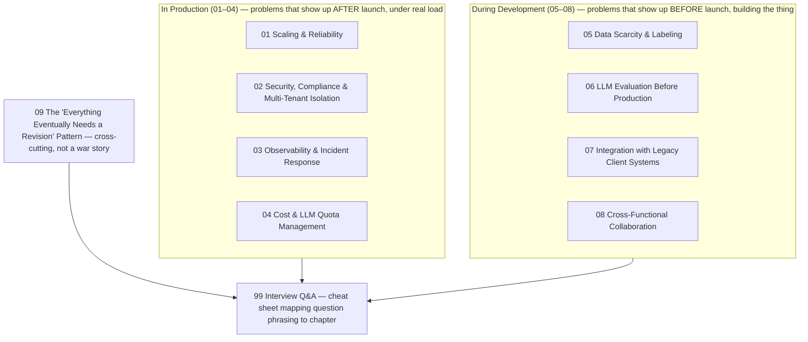

# 10 — Toughest Challenges: Production and Development

## Why this folder exists

Every one of the nine project courses in this curriculum ends with a `99-Interview-QA.md` file built
around *that specific project*. But two of the most common questions in a senior GenAI/ML engineer
interview aren't about any specific project at all:

- "Tell me about the most challenging technical problem you've faced."
- "Tell me about a difficult production incident — what happened, and what did you do?"

Interviewers ask these in almost every loop — often more than once (recruiter screen, hiring
manager, panel/bar-raiser round). A weak or generic answer here costs you more than it would on a
narrower question. This is usually the single question an interviewer uses to judge seniority,
ownership, and judgment under pressure — more than any specific technology check.

This folder is a dedicated answer bank for exactly those two questions. It's built from the real
client and production context that runs through courses 1–11: two regulated-industry consultancies
(Capco for banking, Indegene for pharma), both running customer-facing systems in production on
named cloud stacks, both carrying real compliance stakes.

## What's different about this folder

Courses 1–11 are **concept tutorials**: theory first, then "here's how it maps to what you built."

This folder works differently. It's **scenario-driven**. Each chapter is a plausible, illustrative
war story — the kind of problem a senior engineer running production GenAI/ML systems for
HSBC-, Bank of America-, Eli Lilly-, and AstraZeneca-class clients would very credibly have hit.
Each is told in STAR format (Situation, Task, Action, Result) so it drops straight into an
interview answer.

A few important notes on how to read these stories:

- Nothing here is claimed as verified fact about a specific past incident.
- Every narrative is explicitly labeled **illustrative**.
- Any invented numbers (latency figures, error rates, dollar amounts) are flagged as such.

Treat the surrounding technical detail — the real stack, the real failure modes for that stack — as
the credible backbone. Then adapt the narrative specifics to whatever you actually remember from
your own engagements.

## The 8 chapters, in two groups (plus a ninth, cross-cutting one)

### In Production (chapters 01–04) — problems that show up *after* launch, under real load

| # | Chapter | Core theme |
|---|---|---|
| 01 | [Scaling & Reliability](01-production-challenge-scaling-and-reliability.md) | Traffic spikes, autoscaling, LLM provider rate limits as the bottleneck |
| 02 | [Security, Compliance & Multi-Tenant Isolation](02-production-challenge-security-compliance-multi-tenant-isolation.md) | Bank network isolation, pharma content audit trails, cross-tenant leakage risk |
| 03 | [Observability & Incident Response](03-production-challenge-observability-incident-response.md) | LLM-specific monitoring, on-call process, rollback strategy |
| 04 | [Cost & LLM Quota Management](04-production-challenge-cost-and-llm-quota-management.md) | Token budgets, endpoint cost tradeoffs, a client blowing through quota |

### During Development (chapters 05–08) — problems that show up *before* launch, building the thing

| # | Chapter | Core theme |
|---|---|---|
| 05 | [Data Scarcity & Labeling](05-development-challenge-data-scarcity-and-labeling.md) | Scarce/expensive labels in a regulated domain, annotation consensus, active learning |
| 06 | [LLM Evaluation Before Production](06-development-challenge-llm-evaluation-before-production.md) | Golden eval sets, catching hallucination pre-launch, compliance sign-off |
| 07 | [Integration with Legacy Client Systems](07-development-challenge-integration-with-legacy-client-systems.md) | Legacy SOAP/on-prem APIs, network security review cycles, procurement gates |
| 08 | [Cross-Functional Collaboration](08-development-challenge-cross-functional-collaboration.md) | Model-risk/compliance and medical/legal/regulatory reviewers with real veto power |

### Plus a ninth, cross-cutting chapter — not a war story, a recognizable pattern

| # | Chapter | Core theme |
|---|---|---|
| 09 | [Development Challenge: The "Everything Eventually Needs a Revision" Pattern](09-development-challenge-data-lifecycle-and-versioning-gaps.md) | The generic "how are you handling a new/revised version of X" question that can be asked about almost any data pipeline. This chapter distills that question from the real, source-grounded course 5 document-versioning finding, and generalizes it into a five-step on-the-spot answer shape that transfers across all nine project courses — not just the one it was first noticed in. |

Unlike chapters 01–08, chapter 09 isn't a STAR-shaped incident story. It's the connective pattern
behind a specific, very likely follow-up question. Worth reading immediately after (or alongside)
whichever of 01–08 you pick for a given interview.

Plus [`99-Interview-QA.md`](99-Interview-QA.md) — direct "toughest problem" questions and the
probing follow-ups that come after any challenge story, with a cheat-sheet mapping question
phrasing to chapter.

## How to use this folder in an interview

1. **Read once, end to end, before the interview** — not during. The value here is pattern
   recognition: which of these eight shapes best matches what actually happened to you.
2. **Never try to tell all eight.** An interviewer asks one question and wants one tight answer, not
   a tour of the folder. Pick the **2–3 chapters** that map best to the actual question asked (see
   the cheat-sheet in `99-Interview-QA.md`) and have those STAR narratives ready to speak, not read.
3. **Match the chapter to the client context that fits the rest of your answer.** If you've been
   talking about the Capco/banking projects for the last ten minutes, pull a banking-flavored
   incident (chapters 01, 02, and 04 all have a banking angle). If you've been on the
   Indegene/pharma thread, pull the pharma angle (chapters 02, 05, 06, and 08 all have one).
   Consistency across an interview matters more than interviewers usually say out loud.
4. **Use the "illustrative" numbers as placeholders, not scripture.** Swap in real figures if you
   remember them, or round to something you're comfortable defending under a follow-up like "how do
   you know it was 30%?"
5. **Expect the follow-up.** Every one of these stories invites questions like "what would you do
   differently," "how did you personally contribute vs. your team," and "how did you explain this to
   a non-technical stakeholder." `99-Interview-QA.md` rehearses those explicitly — read it right
   before you read the chapters, so you're listening for the follow-up while you read the story.

## A note on honesty

These scenarios are constructed from the real, stated production stack:

- **Capco (banking):** Azure App Service / Front Door / VNet / Azure OpenAI
- **Indegene (pharma):** ECS Fargate / ALB / Sagemaker / Lambda

They're also built from failure modes that are well-documented as common at that combination of
scale and industry. The goal is for each story to be *true to the kind of problem* a person in this
role would face — not a transcript of an actual incident.

In an interview, tell these as your own experience only to the extent they match something you
genuinely encountered. Where they don't match, use them as a framework to organize a real story of
your own — that's what they're built for.
