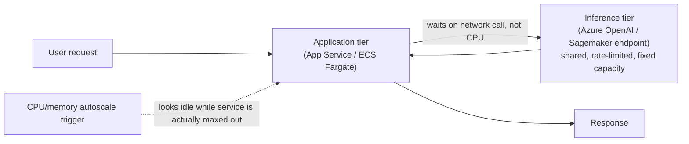
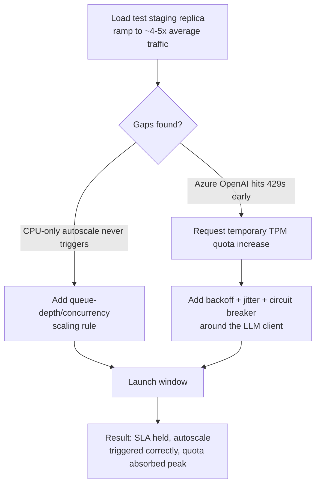

# 01 — Production Challenge: Scaling & Reliability

## Why this is one of the two "hardest problem" answers everyone should have ready

Every one of the nine production systems behind this curriculum was a **customer-facing service
serving real daily traffic** — not a demo. That's:

- Four systems for HSBC/Bank of America, on Azure App Service.
- Five systems for Eli Lilly/AstraZeneca-class pharma clients, on AWS ECS (Fargate)/Sagemaker.

Scaling and reliability problems are close to universal in that situation. They don't need a rare
bug — just enough real usage. That makes this chapter one of the safest, most broadly applicable
"toughest problem" answers in the whole folder.

## The shape of the problem

A GenAI or ML service under real production load has to satisfy a latency SLA (service-level
agreement — a promised response-time target) for every request, at whatever concurrency the
business throws at it, without the client noticing degraded quality or timeouts.

Three things make this harder for an LLM-backed service than for a typical CRUD (create/read/update/
delete) API:

1. **The compute-heavy step isn't yours to scale freely.** A normal web app scales by adding more
   application instances behind a load balancer. An LLM-backed app has two tiers: an application
   tier, and an inference tier. The inference tier is frequently a shared, rate-limited,
   third-party-managed resource (Azure OpenAI) or a fixed-capacity managed endpoint (a Sagemaker
   real-time endpoint). Neither scales as instantly or as cheaply as a stateless container.
2. **Latency is compounding, not fixed.** A chatbot or document-generation request often chains
   multiple LLM calls: retrieval, ranking, generation, post-processing/moderation. A slowdown in any
   one hop shows up as extra latency at the top of the chain. As load rises, the slowest requests
   (P95/P99 — the 95th/99th percentile) get worse faster than the typical request (P50 — the median).
3. **Traffic is bursty, not smooth.** Bank product launches, pharma content-review deadlines ahead
   of a conference or regulatory submission window, and end-of-quarter usage all create short, sharp
   traffic peaks well above the daily average. That's exactly the pattern autoscaling handles worst
   if the scale-out trigger and cooldown period aren't tuned for it.

## The two application-tier scaling models in play

| | Capco (banking) — Azure App Service | Indegene (pharma) — AWS ECS Fargate |
|---|---|---|
| Scale unit | App Service Plan instance | ECS task (Fargate) |
| Trigger | Rule-based autoscale (CPU%, memory%, HTTP queue length) or schedule-based rules for known peak windows | Application Auto Scaling with target-tracking policies on the ECS service (CPU%, ALB `RequestCountPerTarget`) |
| Front door | Azure Front Door / Application Gateway with WAF, health probes | Application Load Balancer with target-group health checks |
| Typical gotcha | Cold-start latency on scale-out if the App Service plan wasn't pre-warmed; scale-out rules keyed only on CPU miss I/O-bound LLM-call-waiting load | Fargate task startup time (pulling image, container init) lagging a sharp burst; ALB target-tracking lag versus a near-instant spike |

Both models share the same core weakness for LLM workloads: **CPU/memory-based autoscaling triggers
are a poor proxy for load** when the application container spends most of its wall-clock time
*waiting* on an external LLM call rather than burning CPU.

A service can be maxed out on concurrent in-flight requests — and therefore failing its latency SLA
— while CPU utilization looks comfortably low, because the bottleneck is network-bound, not
compute-bound. Effective autoscaling for this shape of workload also has to key off request queue
depth, concurrent-connection count, or a custom latency-based metric — not CPU alone.

## The real bottleneck is usually the LLM provider, not your service

Once the application tier is scaled reasonably, the ceiling almost always turns out to be the
inference layer:

- **Azure OpenAI** enforces **TPM (tokens-per-minute) and RPM (requests-per-minute) quotas** per
  deployment. These are provisioned per model/region/subscription. A burst of concurrent users can
  exhaust the TPM budget well before the application tier itself is under any real strain — the
  symptom is a wave of `429` ("too many requests") responses from Azure OpenAI, not from your own
  service.
- **Sagemaker real-time endpoints** have a fixed number of instances (unless using an auto-scaling
  endpoint policy) and a per-instance concurrency ceiling. If the endpoint isn't scaled ahead of a
  burst, requests queue up and latency climbs even though the ECS application tier in front of it
  still reports itself healthy.

This is why a mature production design treats **LLM-provider quota headroom as a first-class
capacity-planning input**, not an afterthought. In practice that means:

- Requesting a TPM/RPM quota increase ahead of a known peak — a bank product launch, a pharma
  submission deadline.
- Implementing exponential backoff with jitter, plus a circuit breaker, so a wave of `429`s degrades
  gracefully instead of cascading into a bigger outage.
- Where possible, routing across multiple deployments/regions to spread load.

See `notebooks/01_rate_limit_backoff_and_circuit_breaker.ipynb` in this folder for a runnable,
fully-offline implementation of exactly that backoff-plus-circuit-breaker pattern.

## Illustrative incident: a launch-day traffic spike exposes a scaling gap

> **Everything in this section is a plausible, illustrative scenario constructed from the real
> stack and known failure modes described above — not a verified account of a specific incident.**
> Treat the narrative shape as reusable; adapt the specifics to your own recollection.

**Situation.** A banking client (illustrative: HSBC-class) was launching a new product, with a
marketing push scheduled to drive a large, coordinated traffic increase to a chatbot-style assistant
built on Azure App Service and Azure OpenAI, starting at a known time. Historical daily traffic was
steady and well within the provisioned App Service Plan's autoscale ceiling. But nobody had
load-tested the service against the multiple-of-normal burst the launch was expected to generate,
and the Azure OpenAI deployment's TPM quota had been sized for the historical average, not the
projected peak.

**Task.** As the engineer responsible for the assistant's backend, I needed to:
- Make sure the service would hold its latency SLA through the launch window.
- Identify where the actual ceiling was before it got discovered in production.
- Get any necessary quota or scaling changes approved and in place ahead of the go-live time.

**Action.** I ran a load test against a staging replica sized to match production, ramping
concurrency to roughly the projected peak (illustrative: 4–5x average daily traffic, compressed into
a short window). The test surfaced two gaps:

1. The App Service autoscale rule was keyed purely on CPU%. Because most request time was spent
   waiting on the Azure OpenAI call rather than burning CPU, the rule never triggered scale-out even
   as queued requests and P95 latency climbed. I added a queue-length/concurrent-request-based
   scaling rule alongside the CPU rule to fix this.
2. The load test pushed the Azure OpenAI deployment into `429`s well before the application tier was
   saturated, confirming the TPM quota was undersized for the peak. I requested a temporary quota
   increase from the Azure OpenAI capacity team ahead of the launch, and added exponential backoff
   with jitter plus a short-lived circuit breaker around the LLM client — so any residual `429`s
   would degrade to a graceful "please retry" response instead of cascading into full request
   failures and a pile-up of retried requests.

**Result.** *(Illustrative)* Through the actual launch window, the service held its latency SLA with
headroom. Autoscale correctly added instances in response to the new queue-based trigger, and the
increased Azure OpenAI quota absorbed the peak without triggering the circuit breaker in any
sustained way. The load-testing and backoff/circuit-breaker pattern became a standard pre-launch
checklist item for subsequent product launches on the same platform.

## Talking points this chapter sets up

- Distinguishing **application-tier** scaling from **inference-tier** scaling, and why CPU-based
  autoscaling is a weak proxy for LLM-workload load.
- Treating third-party LLM quota (TPM/RPM, Sagemaker endpoint concurrency) as a capacity-planning
  input with its own lead time, not an infinite resource.
- Graceful degradation (backoff, jitter, circuit breaker) as the difference between a rate-limit
  event and a cascading outage.
- Load testing against a *projected* peak, not historical average, ahead of a known business event.
