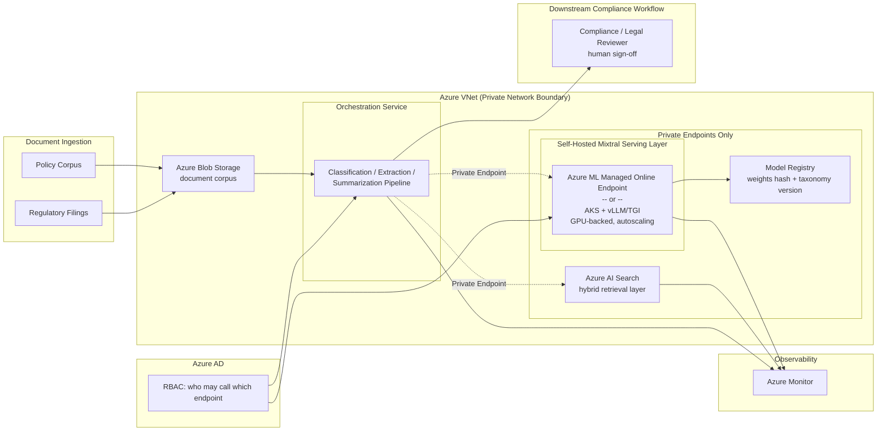

# 13 — Regulatory & Policy Document Intelligence Platform

> Framing note: unlike courses 1–12, this course is not built from a single resume bullet. It's
> constructed to extend this curriculum's existing Capco/banking narrative (courses 1–6) into a
> workload this candidate's other Capco projects don't cover — self-hosted, open-weight LLM
> infrastructure — using the same client base, the same Azure production conventions, and the same
> "illustrative but technically defensible" honesty rules as every other course here. Treat it exactly
> like the rest of the curriculum: a strong, technically grounded system-design story to tell in an
> interview, clearly labeled where it's a plausible reconstruction rather than a verified fact. The one
> exception is Mixtral's architecture itself (Chapter 1) — that part is real, published, independently
> verifiable technology, and is stated plainly rather than hedged.

## Business Context

Capco's banking clients — the same **HSBC** and **Bank of America** engagements behind courses 1–6 —
don't just run internal knowledge bases (course 1) and AML alert queues (course 2). Their compliance
and legal functions sit on top of an enormous, continuously growing stream of **regulatory filings,
internal policy documents, and legal/contractual text**: regulator publications that need to be
triaged and mapped against internal policy, internal policy documents that need to be classified
against a firm-specific taxonomy, and contracts/legal text that needs clause-level extraction for
downstream review. The volume here is qualitatively different from course 1's chatbot traffic or
course 2's AML alert volume — this is bulk document processing measured in the tens of thousands of
pages a week, not a few hundred conversational turns a day, and that volume difference is what drives
every architectural decision in this course.

At that volume, three things stop being abstract concerns and become the actual design constraints:

1. **Cost at volume.** Per-token API pricing (Azure OpenAI, or a managed model API more generally)
   scales roughly linearly with tokens processed. At the volume this platform runs, that linear cost
   curve becomes the dominant line item. A self-hosted model's cost structure is different in kind, not
   just degree — it's dominated by **fixed GPU-hour compute** rather than per-token billing, so above
   some breakeven volume, self-hosting gets cheaper per document processed while a metered API keeps
   scaling with volume indefinitely. Chapter 2 works through the shape of that tradeoff in detail.
2. **Fine-tuning control.** The client wants a model fine-tuned on their own proprietary regulatory
   taxonomy and internal policy classification scheme — not a generic notion of "financial regulation,"
   but the client's specific category structure, which evolves as regulations and internal policy
   change. That requires direct access to model weights for LoRA/QLoRA (or full) fine-tuning, not just
   whatever constrained fine-tuning surface a managed API vendor chooses to expose, if any.
3. **Model transparency and audit.** This ties directly to course 4's model-risk-monitoring themes.
   For internal audit and model-risk-governance purposes, the client's model-risk function wants to be
   able to fully inspect and validate *exactly* what model is running — down to the weights — something
   a closed-weight, API-only model can never offer, no matter how much telemetry the API vendor exposes
   around it.

These are three genuinely distinct arguments, not one vague "open is better" argument, and Chapter 2
treats each one separately, with its own reasoning and its own limits.

## The model: Mixtral 8x7B

The model chosen for this platform is **Mixtral 8x7B**, Mistral AI's sparse Mixture-of-Experts (MoE)
language model, released under the **Apache 2.0 license** — genuinely open-weight, genuinely
documented in Mistral's own published technical materials. Chapter 1 is a full, accurate technical
walkthrough of its real architecture (decoder-only Transformer, Grouped-Query Attention, Sliding
Window Attention, sparse top-2-of-8 expert routing per layer) — this is confirmed, publicly verifiable
technology, described plainly and confidently rather than hedged the way this course's specific
business narrative is hedged.

It's also worth being precise about a real, easily-confused option this course deliberately did
**not** take: **Mistral's models, including Mixtral, are also available through Azure AI Foundry's
model catalog as a managed API** — the same multi-vendor catalog course 3 covers for Claude. Choosing
Azure AI Foundry would have gotten Mixtral **as a hosted API call**, with none of the infrastructure
burden of self-hosting. This project specifically chose **self-hosting on Azure ML / AKS** instead,
precisely because reasons (2) and (3) above — fine-tuning control and full weight-level transparency —
are not satisfied by a managed API, even a multi-vendor one that happens to serve an open-weight model.
Azure AI Foundry gives you Mixtral as weights someone else runs for you; this project needed Mixtral as
weights the client's own model-risk function could hold, hash, and inspect. That's a meaningfully
different architecture choice, not a minor deployment detail, and Chapter 2 draws the line precisely.

## Client & Production Framing

Same client base, same Azure production conventions as the rest of the Capco courses in this
curriculum (see the root [README's Client & Production Context](../README.md#client--production-context-applies-to-every-course-below)):
delivered for **HSBC** and **Bank of America**, deployed on **Azure**, secured behind **VNet
integration / Private Endpoints** (no backend service reachable from the public internet), **Azure
AD** for authentication/authorization, and monitored with **Azure Monitor**. What's different here,
architecturally, from courses 1, 2, 5, and 6 is the presence of a **self-hosted GPU-backed model
serving layer** (Azure ML managed online endpoints, or AKS with vLLM/TGI — Chapter 4) sitting where
those other courses have a Private-Endpoint call out to Azure OpenAI. The security *boundary* is
identical; what's running inside a piece of it is not.

## Architecture Diagram



Plain-text version, if diagram rendering isn't available:

```
Document Ingestion (policy corpus + regulatory filings)
  -> Azure Blob Storage (document corpus, inside the VNet)
  -> Orchestration Service (classification/extraction/summarization pipeline)
       |-- Private Endpoint --> Azure AI Search (hybrid retrieval layer, reusing course 1's RAG patterns)
       |-- Private Endpoint --> Self-Hosted Mixtral Serving Layer
       |                          (Azure ML managed online endpoint, OR AKS + vLLM/TGI --
       |                           GPU-backed compute, autoscaling, behind Private Endpoints --
       |                           see Chapter 4 for the tradeoff between the two)
       |                          --> Model Registry (base-model-weights hash + taxonomy
       |                              version tag -- Chapters 6 and 7)
       |-- Azure AD / RBAC gates who may call the orchestration service and the model endpoint
       |-- Azure Monitor observes every stage (retrieval latency, inference latency, error rates)
  -> classification / extraction / summarization output
  -> downstream compliance workflow (human reviewer sign-off, same human-in-the-loop
     principle as course 2's AML copilot and course 11's regulatory platform)

No backend service is reachable from the public internet -- Blob Storage, Azure AI Search, and the
Mixtral serving layer are all reached only via Private Endpoints inside the VNet, the same security
boundary used across every Capco course in this curriculum.
```

## STAR Summary (illustrative — practice out loud, under 90 seconds)

> **Illustrative, clearly labeled as such** — the structure and reasoning are sound and defensible;
> swap in real numbers if you build or extend a version of this for an actual engagement.

**Situation.** A Capco banking client's compliance and legal teams were manually triaging a very high
volume of regulatory filings and internal policy documents against the bank's own regulatory taxonomy —
far more document volume than the bank's existing chatbot (course 1) or AML copilot (course 2)
handled, and the existing Azure OpenAI-based pattern those projects used would have been prohibitively
expensive to run at this token volume, while also not giving the client's model-risk function the
weight-level transparency it wanted for audit purposes.

**Task.** I was asked to design and build a document intelligence platform that could classify,
extract, and summarize regulatory and policy text at this volume, fine-tuned to the client's
proprietary taxonomy, running inside the bank's existing Azure security boundary, with a self-hosted
model the model-risk function could fully inspect and validate — rather than defaulting to another
Azure OpenAI deployment.

**Action.** I evaluated the cost, fine-tuning-control, and transparency tradeoffs between a managed API
(including Azure AI Foundry's own Mistral/Mixtral offering) and a self-hosted open-weight model, and
selected **Mixtral 8x7B** — a sparse Mixture-of-Experts model with a fully published architecture —
self-hosted on **Azure ML managed online endpoints** (with AKS + vLLM/TGI evaluated as the
higher-control alternative), GPU-backed and autoscaling, behind the same VNet/Private Endpoint/Azure AD
boundary as the rest of the client's Azure estate. I built a hybrid retrieval layer over the policy
corpus in Azure AI Search, fine-tuned Mixtral via LoRA/QLoRA on the client's taxonomy, and designed a
model registry that tracked both the base-model weights hash (for provenance/supply-chain integrity)
and the taxonomy version each fine-tuned checkpoint was trained against (so the two could never drift
silently against each other).

**Result.** *(Illustrative)* Modeling the cost curve suggested self-hosting became cheaper than
continued per-token API billing well within the platform's expected first-year volume, while giving
the model-risk function a fully inspectable, hash-verified model artifact it could run its own
controlled evaluations against — something the client's model-risk team explicitly could not get from
an API-only deployment.

## How This Course Is Organized

| File | Covers |
|---|---|
| `01-mixtral-architecture-deep-dive.md` | Mixtral's real, published architecture: decoder-only Transformer, GQA, Sliding Window Attention, sparse top-2-of-8 MoE routing, active-vs-total parameter counts |
| `02-why-self-hosted-open-weight-vs-managed-api.md` | The three-part rationale in depth: cost at volume, fine-tuning control, weight-level transparency/audit — including the Azure AI Foundry-managed-API vs. self-hosted distinction |
| `03-comparison-to-gpt4-and-claude-architecture.md` | How Mixtral's confirmed, published architecture differs from GPT-4's and Claude's undisclosed architectures — cross-referencing course 3's Claude/GPT-4 architecture-comparison chapter |
| `04-deployment-architecture-azure-ml-aks.md` | Azure ML managed online endpoints vs. AKS + vLLM/TGI, GPU instance sizing, autoscaling, quantization as a cost/latency lever |
| `05-fine-tuning-and-domain-adaptation.md` | LoRA/QLoRA fine-tuning on the client's regulatory taxonomy (building on course 11), a domain evaluation set, the MLOps retraining loop |
| `06-data-compliance-and-model-governance.md` | Standard data residency/RBAC content (cross-referencing course 5), plus this course's own concern: model weights supply-chain/provenance verification |
| `07-model-and-taxonomy-staleness.md` | The staleness/versioning analog for this course: base-model version drift vs. taxonomy drift as two independent axes, and a proposed drift-detection design |
| `08-production-resilience-and-operational-engineering.md` | A self-hosted-GPU-serving error-handling table, a hard-capacity-ceiling scaling caveat, bug-found-and-fixed narratives, one named hardening gap |
| `99-Interview-QA.md` | Behavioral, technical, system-design, and "what would you change" interview Q&A |
| `notebooks/` | Five runnable Jupyter notebooks, fully offline, numpy-only — MoE routing, active-vs-total parameter cost, quantization tradeoffs, taxonomy drift detection, model provenance verification |

Read in order — `00-README.md` -> chapters `01`-`08` -> notebooks (run alongside the chapter with the
matching concept) -> `99-Interview-QA.md` last, once the concepts are fresh.

---

Note: check your NDA before naming HSBC or Bank of America by name in an actual interview — see the
root README's confidentiality note. As with every course in this curriculum, the specific business
narrative, quantified metrics, and bug stories here are a plausible, technically detailed, clearly
labeled illustrative reconstruction — the exception is Chapter 1's description of Mixtral's actual
published architecture, which is real, confirmed technical fact.
