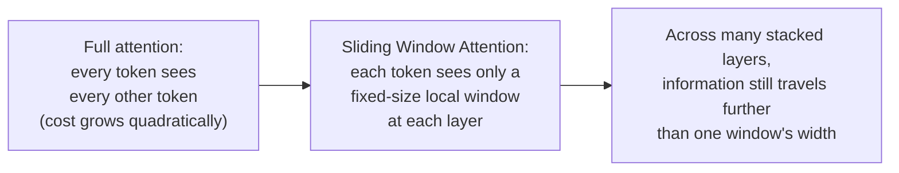
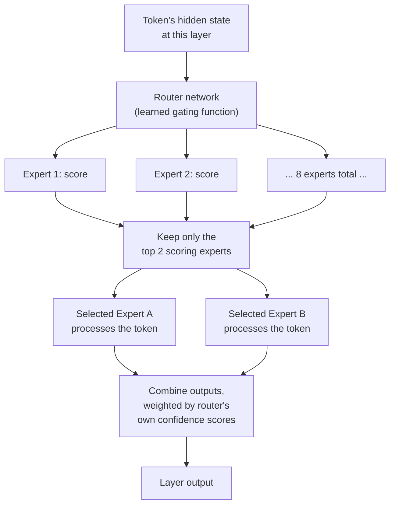

# 01 — Mixtral Architecture Deep Dive

## Why this chapter is different from the rest of this course

Every other chapter in this course carries the curriculum's usual hedge: "illustrative, plausible
reconstruction, not a verified description of a real system." This chapter doesn't need that hedge for
its core technical content, and it's worth saying so plainly rather than reflexively softening it:

**Mixtral 8x7B's architecture is real, published technology.** Mistral AI released it under the
Apache 2.0 license and documented its architecture in a public technical report and model card. Every
architectural claim in this chapter — the attention mechanism, the expert routing, the parameter
counts — can be independently verified against Mistral's own published materials.

That confirmability is a meaningful fact about this project, not just a technical curiosity. Chapter 3
returns to it directly when contrasting Mixtral against GPT-4 and Claude.

## A decoder-only Transformer, with two efficiency tweaks

At its core, Mixtral is a **decoder-only Transformer** — the same family as GPT-style and LLaMA-style
models. It's a stack of Transformer blocks, each combining a self-attention sub-layer and a
feed-forward sub-layer, trained to predict the next token.

What makes Mixtral's attention layer different from a "vanilla" multi-head attention implementation is
two specific, published modifications. Both are aimed at making inference faster and cheaper, not at
raw capability.

**Grouped-Query Attention (GQA).**

- Standard multi-head attention gives every attention head its own full set of query, key, and value
  projections.
- That means the key/value cache — the memory a decoder has to keep around during generation so it
  doesn't recompute attention over the whole sequence at every step — grows with the *full* number of
  heads.
- GQA shrinks that cost by sharing one set of key/value projections across a *group* of query heads,
  instead of giving every query head its own private key/value pair.
- Each query head still attends independently. Several query heads just read from the same shared keys
  and values.

The practical effect: a much smaller KV cache and faster inference, at a small, well-understood cost
in expressiveness compared to full multi-head attention. It's a deliberate trade Mistral made in favor
of serving speed.

**Sliding Window Attention (SWA).**

- Full self-attention is quadratic in sequence length — every token attends to every other token, so
  cost and memory grow as the square of the input length.
- Sliding Window Attention bounds that cost: each token only attends to a fixed-size local window of
  recent tokens (Mistral's published models use a window on the order of a few thousand tokens),
  instead of the entire sequence.
- Because this windowed attention happens at *every* layer, and each layer's output already carries
  information gathered from its own local window, information can still travel across a longer
  effective span as it moves through the stack of layers. A token many layers deep effectively has an
  indirect view further back than any single layer's window alone would suggest.

The result: a way to handle longer sequences efficiently, without paying full quadratic attention cost
at every layer.

Neither GQA nor SWA is unique to Mixtral — they're published, general Transformer efficiency
techniques Mistral adopted for their model family. But they matter concretely for this project: a
document-intelligence platform processing long regulatory filings and policy documents benefits
directly from cheaper, faster attention over long inputs.

## Mixtral 8x7B: sparse Mixture-of-Experts

The "8x7B" in the name is the detail that actually defines Mixtral as a *sparse Mixture-of-Experts
(SMoE)* model. It's worth being precise about what that does and doesn't mean.

In a standard (dense) Transformer, every token passes through the *same* single feed-forward block at
every layer. Mixtral replaces that single feed-forward block, at each layer, with **8 separate
feed-forward "expert" blocks**. Architecturally, each expert looks structurally similar to the dense
feed-forward block it replaces — it's just one of eight parallel copies.

Critically, **not every token uses every expert.** For each token, at each layer, a small **router
network** (a learned gating function) decides which experts get to process that token:

1. The router looks at the token's hidden state at that layer and produces a raw score (a "logit") for
   each of the 8 experts — essentially, "how relevant is this expert to this token, right now."
2. Those 8 scores go through a softmax (or a top-k-restricted softmax) to turn into a probability-like
   weighting.
3. Only the **top 2** experts by score are actually selected to process that token. The other 6 sit
   idle for that token, at that layer.
4. The two selected experts each process the token independently. Their outputs are then combined,
   weighted by the router's own scores for those two experts — so the more-confident expert
   contributes more to the combined result.

This is the "top-2 of 8" routing that gives Mixtral its name and its efficiency story. Worth noting:
the routing decision is made **independently at every layer**. A given token might route through
experts 3 and 7 at layer 5, and an entirely different pair at layer 6. There's no single "assigned
expert" for a token across the whole model — routing is local and per-layer.

## Why this matters: active parameters vs. total parameters

This is the efficiency argument the entire MoE design exists to deliver, and it's the number worth
having memorized cold:

- Mixtral 8x7B has roughly **47 billion total parameters**.
- But because only 2 of the 8 experts fire per token per layer, only roughly **13 billion parameters
  are actually active** for any given token's forward pass.

(A quick note on the name: "8x7B" is a useful mnemonic, not a literal parameter count. The attention
layers, embeddings, and router are shared across all "experts," so total parameters are meaningfully
less than a naive 8×7B=56B. Mistral's own published figure is the ~47B total / ~13B active split.)

That 47B/13B split is the whole efficiency case for MoE, stated precisely: you get access to the
*capacity* of a much larger dense model — more total learned parameters, more room for the model to
have specialized different sub-networks for different kinds of input — while paying the *inference
compute cost* of a much smaller model, because most of that capacity sits idle on any single forward
pass.

- Compared to a dense model with ~13B active parameters, Mixtral gets meaningfully more total learned
  capacity essentially "for free" from an inference-compute perspective.
- Compared to a dense model with ~47B parameters (all of them active on every token), Mixtral gets
  similar total capacity at a fraction of the inference compute.

Notebook `02_active_vs_total_parameter_cost_demo.ipynb` makes this concrete numerically — it computes
the FLOPs implication of the 47B/13B split against an equivalently-sized dense model, rather than just
asserting the efficiency claim in prose. Notebook `01_moe_expert_routing_demo.ipynb` implements the
router-and-top-2-selection mechanism itself, in pure numpy, so the routing logic is something you can
point to and trace through, not just describe.

## What the router is actually learning

It's worth being able to say something concrete about what the router mechanism is doing, beyond "it
picks experts."

During training, the router's gating weights are learned jointly with the rest of the model, via
standard gradient-based optimization. There's no separate labeling step that tells the router "this
kind of token should go to this expert."

Empirically, published analysis of Mixtral's routing behavior shows the router doesn't cleanly
specialize by high-level topic the way an intuitive mental model might expect — there isn't a clean
"math expert" and "legal-language expert," for instance. Routing patterns are often more syntactic or
positional than topical.

The honest, defensible framing for an interview: the router learns *some* structured, non-random
pattern of specialization useful for minimizing the training loss. But "cleanly interpretable,
human-nameable experts" is not a claim Mistral's own published analysis supports. It's better to say
that plainly than to oversell a tidy story about what each expert "knows."

## Tying It Back

This chapter's job is to give a confident, technically accurate answer to "what is Mixtral,
architecturally":

- A decoder-only Transformer with GQA and Sliding Window Attention for inference efficiency.
- A sparse Mixture-of-Experts design: 8 feed-forward experts per layer, a learned router selecting the
  top 2 per token, and roughly 47B total / 13B active parameters as the resulting efficiency profile.

The meta-point worth carrying into every later chapter of this course, and into Chapter 3's comparison
specifically: everything in this chapter is checkable against Mistral's own published technical
materials. That's not true of GPT-4 or Claude, and that difference — not raw capability — is a large
part of why this project chose Mixtral in the first place (Chapter 2).
