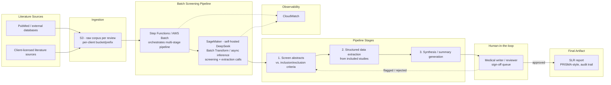

# 14 — Systematic Literature Review Copilot

> **Course note**: unlike courses 1–12, this is not a rebuild of a resume bullet — it's a new,
> self-contained project built to round out the curriculum's coverage of self-hosted open-weight
> model deployment on AWS, using a real, well-documented open-weight architecture (DeepSeek) this
> curriculum hadn't covered yet. It's grounded in the same Indegene/pharma client context, AWS
> production conventions, and human-in-the-loop seriousness as courses 7–11 — see "Client &
> Production Framing" below for exactly what's illustrative versus what's established curriculum
> fact.

## Business Context

Pharma medical-affairs and regulatory-affairs teams routinely have to answer a version of the same
question with rigor a simple web search can't provide: *"what does the published scientific
evidence say about this drug, this indication, this safety signal, across every relevant study ever
published?"* The formal process for answering that is a **systematic literature review (SLR)** — a
structured, heavily-documented methodology (PRISMA-style, in the terms most medical-affairs teams
would recognize) for finding every potentially relevant paper on a topic, screening each one against
explicit **inclusion/exclusion criteria**, extracting structured data from the studies that pass
screening, and synthesizing the extracted findings into a defensible written conclusion.

SLRs feed some of the highest-stakes documents in pharma: regulatory submissions that cite the body
of published evidence for a drug's safety or efficacy, safety-signal detection work that has to show
a company searched the literature thoroughly before concluding a signal is or isn't real, and
evidence-based-medicine summaries medical affairs teams use to answer unsolicited physician
questions. None of that works if the review process itself can't withstand scrutiny — a regulator or
an internal quality auditor can, in principle, ask exactly how a given paper was screened, extracted,
and why.

**Why this is so labor-intensive.** A single systematic review can start from a search that returns
anywhere from several thousand to tens of thousands of abstracts, every one of which a human (or a
pair of humans, for the double-screening pattern many SLR protocols require) has to read and judge
against the inclusion/exclusion criteria — trial phase, population, endpoint, publication type,
language, date range, and dozens of other criteria that get refined as the review proceeds. Only a
small fraction typically survive screening to the full-text stage, and an even smaller fraction make
it into the final extraction-and-synthesis set — but every one of the thousands of excluded abstracts
still has to be screened and its exclusion reason recorded, because PRISMA-style reporting requires
accounting for the full funnel, not just the papers that made it through. Multiply that by the
therapeutic areas a large pharma client tracks and the frequency reviews need to be refreshed as new
literature publishes, and the volume becomes a genuine operational bottleneck — exactly the kind of
problem a GenAI copilot is well suited to help with, provided it's built with the review process's
own rigor in mind rather than treated as a shortcut around it.

## Why Self-Host an Open-Weight Model Here — Three Distinct Reasons

This project's central architectural decision — a self-hosted, open-weight model on AWS SageMaker
rather than Azure OpenAI or Amazon Bedrock's managed model catalog — rests on three genuinely
separate arguments. They get blurred together casually in a lot of "why not just use the API"
answers; keeping them distinct is what makes this a strong interview answer rather than a vibe.
Chapter 2 develops each one in full; the shape of each is:

1. **Cost at extreme volume.** Screening tens of thousands of abstracts per review, across many
   concurrent reviews running for many therapeutic areas, is a workload with a very different cost
   shape than an interactive chatbot's. Per-token managed-API pricing scales linearly with that
   volume; self-hosted compute has a largely fixed cost that amortizes better the more sustained and
   predictable the throughput is. This is a volume-driven economics argument, not a "self-hosting is
   always cheaper" claim.
2. **Fine-tuning for domain reasoning.** Reliable screening decisions depend on the model actually
   understanding a client's specific therapeutic-area vocabulary and the particular shape of their
   inclusion/exclusion criteria — adapting a model to that pattern at the level that actually moves
   screening precision and recall requires weight-level fine-tuning access (LoRA/QLoRA, Chapter 5),
   which a closed API doesn't expose in the same way.
3. **Auditability for regulatory submissions.** An SLR feeding a regulatory submission needs to be
   able to say, for any given screening decision, precisely what model, what version, and what
   configuration produced it — a fixed, versioned, fully characterizable model artifact a regulator
   could in principle ask about. A third-party API that can be silently updated by its provider
   undermines that guarantee in a way a pinned, self-hosted model artifact does not.

These three reasons point in the same direction but are not the same argument — cost is about
volume economics, fine-tuning is about domain-adaptation control, and auditability is about
regulatory defensibility of a fixed artifact. Chapter 2 is built to keep them separate under
follow-up questioning.

## The Model: DeepSeek

This project's self-hosted model is **DeepSeek** (a DeepSeek-V2/V3-class architecture) — a genuinely
open-weight model family released under a permissive license, with its architecture documented in
DeepSeek's own published technical reports. Chapter 1 covers the real, verifiable architectural
details: **Multi-head Latent Attention (MLA)**, a technique that compresses the KV cache into a
lower-dimensional latent representation to cut inference memory footprint, and a **fine-grained
Mixture-of-Experts (MoE)** design with a documented **auxiliary-loss-free load-balancing** strategy
for expert routing. Unlike most of this curriculum's other technical claims about a specific vendor's
internals, this one is confidently stated as verified fact, not a reconstruction — you can check
every claim in Chapter 1 against DeepSeek's own published papers. Chapter 3 draws the explicit
contrast with GPT-4 and Claude (cross-referencing course 3's chapter 08), whose architectures are
undisclosed.

**A self-hosted, open-weight model is not the same thing as "an open model available through a
managed API."** DeepSeek and other open-weight models sometimes also appear in Amazon Bedrock's model
catalog as a managed option — worth naming as an alternative that was considered — but this project
specifically chose to **self-host on SageMaker**, taking on the operational responsibility of running
the weights directly, for the fine-tuning-control and full-weight-audit reasons above. "Managed API
access to an open model" and "you control the weights" are architecturally different postures, even
when the underlying model happens to be the same one — Chapter 2 and Chapter 4 both return to this
distinction explicitly, because it's an easy one to blur in a rushed interview answer.

## Client & Production Framing

This course follows the same Indegene/pharma client framing established across courses 7–11: the
illustrative client base is the same top-tier pharma sponsors named in the root README's Client &
Production Context (**Eli Lilly**, **AstraZeneca**), and the same AWS security conventions apply —
VPC/private-endpoint isolation, per-client data segregation, IAM-scoped roles, Secrets Manager for
credentials, CloudWatch for observability. As with courses 7, 9, 10, and 11, treat the client names,
specific numbers, and pipeline internals below as a **plausible, technically detailed, clearly
labeled illustrative reconstruction** — this course was not built from a real Indegene source
repository — while the general Indegene/AWS/pharma production pattern and DeepSeek's published
architecture (Chapter 1) are the two things stated as settled fact rather than reconstruction. Check
your NDA before naming a real client in an actual interview — see the root README's confidentiality
note.

## Architecture



Plain-text version, if diagram rendering isn't available:

```
Literature corpus (PubMed / external databases, or client-licensed sources)
  -> S3 (raw corpus, ingested per review, per-client bucket/prefix isolation)
  -> Step Functions / AWS Batch orchestrates the multi-stage batch screening pipeline:
       1. SCREEN   - each abstract sent to the self-hosted DeepSeek SageMaker endpoint
                      (primarily Batch Transform / async inference - see Chapter 04),
                      applying the review's current inclusion/exclusion criteria,
                      tagged with model-version + criteria-version (Chapter 07)
       2. EXTRACT  - for abstracts/full-texts that pass screening, structured data
                      extraction (population, intervention, comparator, outcomes, etc.)
       3. SYNTHESIZE - draft narrative/tabular synthesis across the included studies
  -> Human medical-writer / reviewer sign-off queue (nothing skips this gate)
       |-- approve -> final SLR report artifact (PRISMA-style, full audit trail)
       |-- flag / reject -> back to screening or extraction for correction
  -> Final SLR report artifact, feeding the regulatory submission / safety-signal /
     evidence-based-medicine workflow that requested the review
CloudWatch observes every stage (Step Functions executions, SageMaker endpoint/batch
job metrics). All of this sits behind the same VPC/Private-Endpoint security boundary
as the rest of this curriculum's Indegene courses - see Chapter 04 and Chapter 06.
```

The human-in-the-loop gate is not a bolt-on — it's the same non-negotiable pattern courses 2 and 11
establish for regulated content: the model's job is to make screening and extraction fast and
consistent, never to make the final inclusion/exclusion call unsupervised on a document that will
ultimately support a regulatory submission.

## STAR Summary (illustrative)

> **Illustrative — this is a plausible, technically grounded project built to teach the underlying
> concepts, not a rebuild of a verified resume bullet or a real Indegene engagement record. Treat the
> structure and reasoning as sound; the specific numbers below are placeholders for the shape of a
> good, quantified answer.**

**Situation.** Indegene's pharma medical-affairs and regulatory-affairs clients each run multiple
systematic literature reviews per year, some refreshed periodically as new literature publishes.
Screening thousands to tens of thousands of abstracts per review against detailed inclusion/exclusion
criteria, then extracting structured data from every included study, was consuming enormous amounts
of skilled reviewer time — time that scales roughly linearly with corpus size and doesn't get
cheaper as review volume grows.

**Task.** Build a copilot that could screen and structure literature at that volume and cadence,
reliably enough to meaningfully cut reviewer burden, while producing a fully auditable trail suitable
for a document that might ultimately support a regulatory submission — which meant the platform
needed a model choice defensible on cost, on domain-adaptation control, and on long-term auditability,
not just on raw capability.

**Action.** I designed a batch screening pipeline — Step Functions/AWS Batch orchestrating calls to a
self-hosted DeepSeek model on a SageMaker endpoint — that screened abstracts against a review's
current inclusion/exclusion criteria, extracted structured data from included studies, and drafted a
synthesis, with every screening decision tagged with the model version and criteria version it was
made against (Chapter 7). I chose to self-host DeepSeek rather than call a managed API specifically
for the volume economics, the LoRA fine-tuning path onto therapeutic-area vocabulary (Chapter 5), and
the fixed, versioned model artifact a regulatory submission's audit trail could point to (Chapter 6).
Every synthesis and every screening/extraction output routed to a human medical-writer sign-off queue
before anything became part of the final SLR report.

**Result (illustrative).** Estimated to cut abstract-screening time per review from **weeks to days**
for the initial pass, while the model-version/criteria-version tagging design meant a mid-review
criteria refinement no longer risked silently mixing screening decisions made under two different
standards into one review — a real methodological risk in manual SLR practice that this design makes
visible and reconcilable instead of invisible. *(Replace with real measured numbers before using this
in an interview.)*

## Course Structure

| File | Covers |
|---|---|
| [`01-deepseek-architecture-deep-dive.md`](01-deepseek-architecture-deep-dive.md) | DeepSeek's real, published architecture — Multi-head Latent Attention (MLA), fine-grained MoE, auxiliary-loss-free load balancing — and why it's independently verifiable |
| [`02-why-self-hosted-open-weight-vs-managed-apis.md`](02-why-self-hosted-open-weight-vs-managed-apis.md) | The three-part self-hosting rationale in interview-ready depth: cost at extreme volume, fine-tuning control, regulatory auditability |
| [`03-comparison-to-gpt4-and-claude-architecture.md`](03-comparison-to-gpt4-and-claude-architecture.md) | DeepSeek's documented architecture vs. GPT-4/Claude's undisclosed internals, cross-referencing course 3's chapter 08 |
| [`04-deployment-architecture-aws-sagemaker.md`](04-deployment-architecture-aws-sagemaker.md) | SageMaker real-time endpoints vs. Batch Transform/async inference, GPU sizing, autoscaling, Step Functions/Batch orchestration |
| [`05-fine-tuning-and-domain-adaptation.md`](05-fine-tuning-and-domain-adaptation.md) | LoRA/QLoRA adaptation to therapeutic-area vocabulary, screening precision/recall against a gold-standard set, the retraining loop |
| [`06-data-compliance-and-model-governance.md`](06-data-compliance-and-model-governance.md) | Licensed-literature and patient-level data handling, plus model supply-chain/provenance verification for self-hosted weights |
| [`07-model-and-criteria-staleness.md`](07-model-and-criteria-staleness.md) | Model-version drift vs. criteria-version drift as two independently tracked axes, and the reconciliation design |
| [`08-production-resilience-and-operational-engineering.md`](08-production-resilience-and-operational-engineering.md) | Error-handling table, bursty-batch capacity tradeoffs, four candid bug stories, one named hardening gap |
| [`99-Interview-QA.md`](99-Interview-QA.md) | Behavioral, technical, system-design, and retrospective interview Q&A |
| [`notebooks/`](notebooks/) | Five runnable, offline notebooks: MLA memory savings, MoE load balancing, the batch screening pipeline, criteria-version reconciliation, and model-provenance verification |

Read in order — `00-README.md` -> chapters `01`-`08` -> notebooks alongside their matching chapter
-> `99-Interview-QA.md` last.

---

Note: check your NDA before naming a real pharma client by name in an actual interview — see the
root README's confidentiality note.
