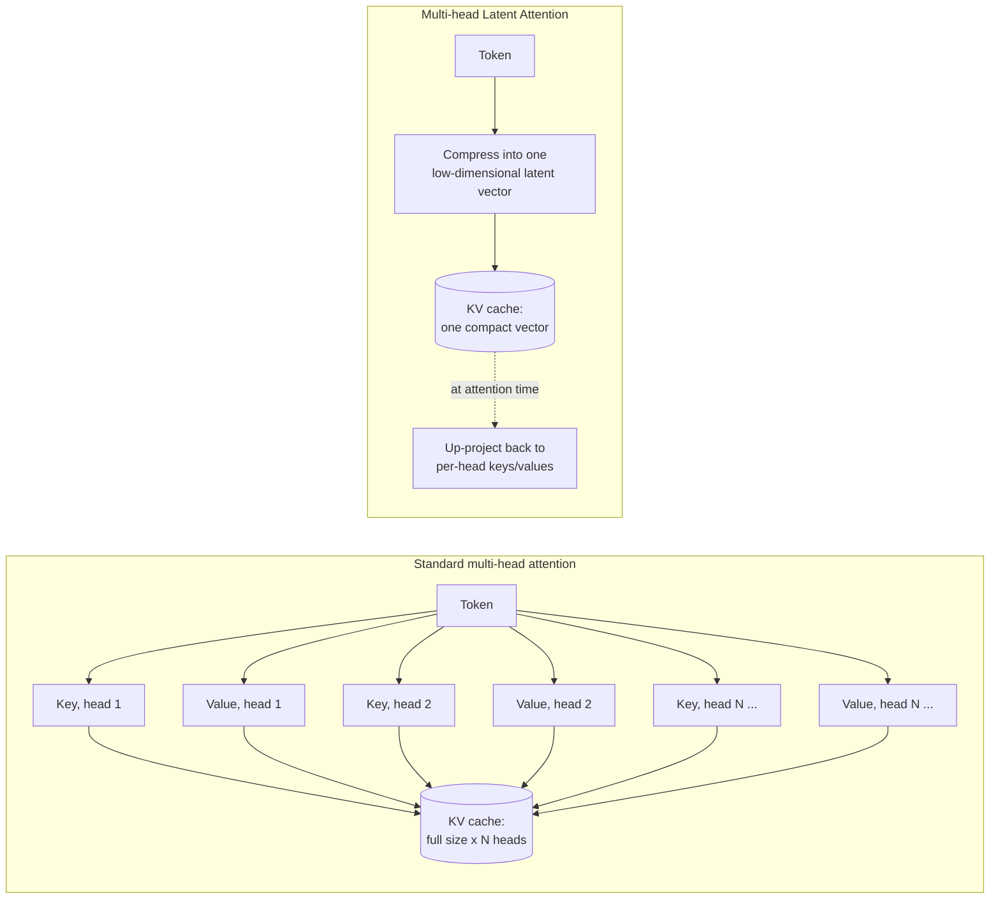
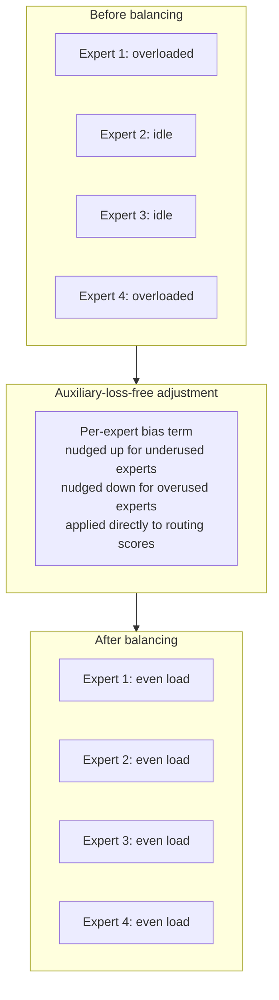

# 01 — DeepSeek Architecture Deep Dive

## Read this chapter's framing before its content

Course 3's chapter 08 makes a point of stating plainly what's *not* known about Claude's and GPT-4's
internals. It names DeepSeek as one of the genuinely open-weight models where that same comparison is
simply available.

This chapter is the other side of that coin. DeepSeek (the DeepSeek-V2/V3-class model family this
project self-hosts) has its architecture published in DeepSeek's own technical reports. That includes
the two techniques covered below: Multi-head Latent Attention, and its Mixture-of-Experts
routing/load-balancing design.

That publication is what lets this chapter state its claims with a confidence level this curriculum
otherwise reserves for settled fact, not reconstruction: **every architectural claim below is
something you can go verify against a public paper**. That is categorically not true for GPT-4 or
Claude — Chapter 3 draws that contrast out explicitly.

## Why attention mechanism efficiency matters at all

A standard (multi-head) Transformer decoder generates text one token at a time. To avoid recomputing
the same values over and over, it caches the key and value vectors for every previous token, at every
attention head and every layer. This is called the **KV cache**.

The KV cache is what makes autoregressive generation tractable at all. But it's also a real, growing
memory cost. It scales with:

- Sequence length
- Number of layers
- Number of attention heads
- The per-head key/value dimension

Why this matters for this project specifically: an SLR review call routinely needs to reason over an
abstract plus criteria — and, at the extraction stage, substantial full-text context too. That's a long
document. And it needs to happen at high concurrency, since many abstracts are screening in parallel
across a batch job.

For a model serving that kind of workload, the KV cache can become the dominant consumer of GPU memory
during inference — often larger than the memory the model's weights themselves occupy at scale. That
memory pressure directly caps how many requests a single GPU instance can serve concurrently (Chapter
4's batch-throughput discussion depends on this fact). So an architectural technique that shrinks the
KV cache isn't a minor implementation detail. It's a first-order lever on inference cost and
throughput.

## Multi-head Latent Attention (MLA)

DeepSeek-V2 introduced **Multi-head Latent Attention (MLA)** as its answer to the KV-cache problem.
DeepSeek-V3 continues to use it.

Standard multi-head attention caches a full-size key vector and a full-size value vector *per
attention head*, for every token. That means the cache grows linearly with the number of heads.

MLA does something different: it **compresses the keys and values into a shared, much
lower-dimensional latent vector before caching them**. The full per-head keys and values are only
reconstructed (up-projected) from that compressed latent representation at attention-computation time.

Concretely:

- Instead of caching `num_heads` separate full-size key/value pairs per token, MLA caches **one
  compact latent vector per token** — plus a small amount of positional/rotary-embedding-related
  information kept separately (compressing that away costs more than it saves).
- The head-specific keys and values used in the actual attention computation are derived from that
  latent vector on the fly, via learned projection matrices.

The efficiency win is specific and mechanical — not a vague "it's optimized" claim. The size of what's
stored per token in the KV cache drops from something proportional to `num_heads x head_dim` down to
the (much smaller) latent dimension. The up-projection back to full per-head keys/values at attention
time is cheap, relative to the memory saved by not caching those full-size vectors for every past
token.

DeepSeek's published reporting frames this as substantially reducing the KV cache's memory footprint,
relative to standard multi-head attention. That's exactly the lever that matters for serving
long-context requests at high concurrency: more of a GPU's memory budget stays available for more
concurrent in-flight sequences, instead of being consumed by cached keys/values. A batch screening
pipeline (Chapter 4) that wants to keep many abstracts in flight per GPU instance benefits directly.

The notebook `notebooks/01_multi_head_latent_attention_demo.ipynb` builds a simplified, from-scratch
numpy version of exactly this idea. It:

1. Compresses a synthetic set of per-head key/value vectors down to a shared lower-dimensional latent
   representation.
2. "Caches" the compressed version instead of the full per-head version.
3. Reconstructs what's needed for an attention computation from the compressed cache.
4. Directly counts the number of stored elements in the compressed cache versus a standard full
   multi-head cache, for the same sequence length.

That last step makes the memory-savings argument numerically, not just narratively.

## Fine-grained Mixture-of-Experts (MoE)

DeepSeek-V3, building on the DeepSeekMoE design DeepSeek published earlier, uses a
**Mixture-of-Experts** architecture for its feed-forward layers — but with a specific, documented
design choice that's worth naming precisely, rather than describing generically as "it's an MoE
model."

An earlier generation of MoE designs used a relatively small number of large experts, and typically
activated one or two of them per token. DeepSeek's design is **fine-grained**: it splits expert
capacity into a much larger number of smaller experts, and activates only a small subset of them per
token. It also adds a set of "shared" experts that are always active for every token, capturing common
knowledge — so the routed/specialized experts can focus on more differentiated patterns.

The practical effect of going fine-grained: a larger, more combinatorially flexible space of expert
combinations a token can be routed through. The published results attribute this to better
specialization than a coarse, few-large-experts design achieves at a comparable activated-parameter
budget.

The headline efficiency property of any MoE design carries over here too: the model has a very large
*total* parameter count (most of which lives across all the experts), but only a small fraction of
those parameters is actually activated to process any given token. So inference compute cost tracks
the much smaller activated-parameter count, not the full total.

## Auxiliary-loss-free load balancing

Routing tokens to experts creates a well-known training problem. Left unconstrained, a router tends to
converge on favoring a small subset of experts, leaving others rarely used. That's wasted capacity —
and a training-time inefficiency, since the neglected experts get little gradient signal.

The traditional fix is an **auxiliary load-balancing loss** — an extra term added to the training
objective that penalizes uneven expert utilization, pushing the router toward a more even distribution
of tokens across experts. The problem with that fix: it's a genuine tradeoff, not a free lunch. An
auxiliary loss term strong enough to meaningfully balance load also pulls the router's decisions away
from whatever a purely quality-driven routing choice would have been — which can measurably hurt model
quality if the balancing pressure is too strong.

DeepSeek-V3's published approach is **auxiliary-loss-free load balancing**. Instead of adding a
loss-based penalty, it maintains a per-expert bias term that adjusts routing scores directly:

- The bias for an expert is nudged **up** when that expert has recently been underutilized (making it
  more likely to be selected).
- The bias is nudged **down** when the expert has been overutilized (making it less likely).

This bias is applied directly to the routing decision, not threaded through the training loss as a
gradient-based penalty.

That decouples the load-balancing mechanism from the training objective itself. The model's main loss
stays focused purely on next-token prediction quality, while a separate, directly-adjusted control loop
handles keeping expert utilization even. DeepSeek's published results report this recovering quality
that a traditional auxiliary-loss approach would trade away for the same degree of balance.

The notebook `notebooks/02_moe_load_balancing_demo.ipynb` simulates exactly this problem, and this
class of fix, at a conceptual level:

1. Routes a batch of synthetic tokens through a small router across several experts with no balancing
   at all — printing a lopsided utilization distribution (some experts overloaded, some idle).
2. Applies a simple bias-style adjustment to the routing scores, based on recent utilization, and
   re-routes.
3. Shows the utilization distribution become visibly more even.

It's the same directional idea as DeepSeek's published mechanism, simplified enough to run and reason
about from scratch.

## Open licensing and what it enables

DeepSeek's models are released under permissive open-weight licenses. That's what makes both
self-hosting and fine-tuning (Chapter 5) viable options for this project in the first place — the
weights themselves are downloadable and usable in a self-managed deployment, not gated behind a
managed-API-only access model.

That licensing posture is a separate fact from the architecture details above. But it's the fact that
makes this whole course's central architectural choice possible at all — self-hosting on SageMaker
(Chapter 2 and Chapter 4). You cannot self-host and fine-tune weights you were never given access to.

## Tying It Back

Two published, verifiable techniques do the real work in this chapter:

- **MLA**, which compresses the KV cache into a shared lower-dimensional latent representation to cut
  the memory cost of long-context, high-concurrency serving — directly relevant to a batch pipeline
  screening many abstracts per GPU instance (Chapter 4).
- **Fine-grained MoE with auxiliary-loss-free load balancing**, which lets the model carry a large
  total parameter count while keeping per-token inference compute proportional to a much smaller
  activated-parameter count, balanced across experts without trading away training quality for a
  balancing loss term.

The meta-point worth leading with in an interview: DeepSeek published this architecture in technical
reports you can independently verify every claim above against. That's a categorically different
epistemic position than GPT-4's or Claude's undisclosed internals (Chapter 3, cross-referencing course
3's chapter 08).

That's not a claim that DeepSeek is a better model than either of them on every benchmark — Chapter 3
is explicit that it isn't guaranteed to be. It's a claim about what you can actually know and verify
about how it works — which matters a great deal in a domain (Chapter 6) where being able to
characterize exactly what model produced a regulatory-submission-supporting judgment is part of the
point.
